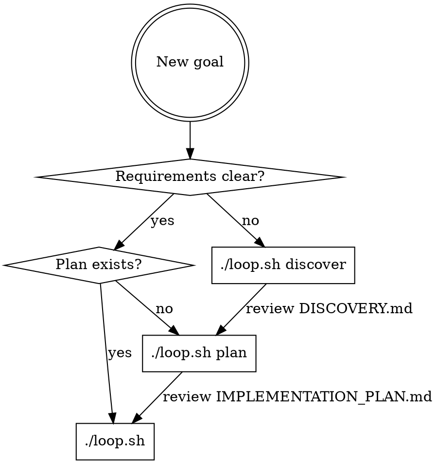

# Ralph Loop: Auditoría de Calidad

**Fecha:** 2026-01-26
**Estándar aplicado:** writing-skills (TDD para documentación de procesos)
**Veredicto general:** ❌ NO CUMPLE estándares mínimos

---

## Resumen Ejecutivo

| Categoría | Veredicto | Impacto |
|-----------|-----------|---------|
| Description field | ❌ FALLA | Claude no encontrará esta skill correctamente |
| Discovery mode design | ❌ FALLA | Documentación miente sobre capacidades |
| Testing evidence | ❌ FALLA | Viola el Iron Law de TDD |
| Examples | ❌ FALLA | No hay ejemplos completos |
| CSO keywords | ❌ FALLA | Búsqueda ineficiente |
| Structure | ⚠️ PARCIAL | Faltan secciones requeridas |

---

## Violaciones Críticas

### 1. Description Field Incorrecto

**Estándar (writing-skills):**
> - Description starts with "Use when..." and includes specific triggers/symptoms
> - Description = When to Use, NOT What the Skill Does
> - NEVER summarize the skill's process or workflow

**Valor actual:**
```yaml
description: Autonomous multi-iteration development with fresh context rotation and persistent state management
```

**Problemas identificados:**
- ❌ NO empieza con "Use when..."
- ❌ Describe QUÉ hace el skill, no CUÁNDO usarlo
- ❌ Resume el workflow interno (context rotation, state management)

**Consecuencia:** Cuando Claude busca skills para un problema, lee la descripción para decidir si cargar el skill completo. Una descripción que dice "qué hace" en lugar de "cuándo usarlo" causa:
1. False negatives: Claude no carga el skill cuando debería
2. False positives: Claude carga el skill cuando no aplica
3. Shortcutting: Claude sigue la descripción en lugar de leer el contenido completo

**Corrección requerida:**
```yaml
description: Use when executing large implementation plans autonomously, when context exhaustion is a concern, or when fresh context per task improves quality
```

---

### 2. Discovery Mode: Diseño Inconsistente con Documentación

**El problema del usuario:**
> "si funciona dentro de un loop, como puede responder a mis preguntas?"

**Análisis técnico:**

`loop.sh` líneas 380-384 ejecuta Claude así:
```bash
CLAUDE_OUTPUT=$(cat "$PROMPT_FILE" | claude -p \
    --dangerously-skip-permissions \
    --output-format=stream-json \
    --model opus \
    --verbose 2>&1)
```

El flag `-p` (pipe mode) significa **ejecución no-interactiva**. Claude:
- ❌ NO puede hacer preguntas al usuario
- ❌ NO puede esperar respuestas
- ❌ NO tiene stdin interactivo

**PERO `PROMPT_discover.md` línea 191-192 dice:**
```markdown
### 9999999. Assumptions
**Document assumptions explicitly.**
If you're making an assumption about constraints or requirements, write it down.
```

Y línea 192 del guardrail 999999:
```markdown
Empty sections indicate incomplete discovery. Ask clarifying questions if needed.
```

**Esto es técnicamente imposible.** El loop no permite interacción.

**Qué hace Discovery realmente:**
1. Lee PROMPT_discover.md
2. Lee archivos existentes (specs/, AGENTS.md, memories.md)
3. **INFIERE** todo lo que puede basándose en el contexto disponible
4. Escribe DISCOVERY.md con sus inferencias
5. Termina (default: 1 iteración)

**Correcciones requeridas:**

1. Eliminar de PROMPT_discover.md:
   - "Ask clarifying questions if needed"
   - Cualquier referencia a interacción

2. Agregar a SKILL.md sección sobre Discovery:
   ```markdown
   ### Discovery Mode Limitations

   Discovery runs in batch mode (non-interactive). It CANNOT:
   - Ask clarifying questions
   - Wait for user input
   - Have a conversation

   Discovery INFERS from available context:
   - specs/*.md files
   - AGENTS.md patterns
   - memories.md learnings
   - Codebase structure

   For interactive brainstorming, use a regular Claude Code session instead.
   ```

---

### 3. Sin Testing Evidence (Violación del Iron Law)

**Estándar (writing-skills):**
> NO SKILL WITHOUT A FAILING TEST FIRST
>
> This applies to NEW skills AND EDITS to existing skills.
>
> Write skill before testing? Delete it. Start over.

**ralph-loop carece de:**
- ❌ Escenarios de presión documentados
- ❌ Comportamiento baseline capturado
- ❌ Tabla de racionalizaciones
- ❌ Evidencia de ciclo RED-GREEN-REFACTOR
- ❌ Test con subagentes

**Por qué importa:** Sin testing, no sabemos:
- Si los agentes siguen las instrucciones correctamente
- Qué racionalizaciones usan para violar las reglas
- Si los guardrails son efectivos
- Si la documentación tiene gaps

**Trabajo requerido:**
1. Crear escenarios de presión (ej: "el usuario pide implementar algo directamente")
2. Ejecutar con subagente SIN el skill → documentar baseline
3. Ejecutar con subagente CON el skill → verificar compliance
4. Iterar hasta cerrar todos los loopholes

---

### 4. Ejemplos Inexistentes

**Estándar (writing-skills):**
> One excellent example beats many mediocre ones
> - Complete and runnable
> - Well-commented explaining WHY
> - From real scenario
> - Shows pattern clearly

**ralph-loop tiene:**
- Fragmentos de código sueltos (bash snippets)
- NO tiene una sección "Examples" dedicada
- NO muestra un workflow completo de principio a fin
- NO explica el WHY detrás de cada paso

**Ejemplo que debería existir:**

```markdown
## Example: Building a REST API

### Setup
```bash
cd ~/projects/my-api
git init
/path/to/ralph-loop/scripts/install.sh
```

### Discovery (optional)
```bash
./loop.sh discover
# Output: DISCOVERY.md with constraints and risks
cat DISCOVERY.md
```

### Planning
```bash
./loop.sh plan
# Output: IMPLEMENTATION_PLAN.md with prioritized tasks
cat IMPLEMENTATION_PLAN.md
```

### Building
```bash
./loop.sh
# Workers iterate until all tasks complete
# Each iteration: select task → TDD → gates → commit
```

### Monitoring (from another terminal)
```bash
./status.sh
# Shows: iteration count, success rate, current task
```

### Recovery (if something goes wrong)
```bash
Ctrl+C
git log --oneline -5  # See what was committed
git reset --hard HEAD~2  # Revert 2 commits
./loop.sh plan  # Regenerate plan
./loop.sh  # Resume
```
```

---

### 5. CSO (Claude Search Optimization) Deficiente

**Estándar (writing-skills):**
> Use words Claude would search for:
> - Error messages: "Hook timed out", "ENOTEMPTY", "race condition"
> - Symptoms: "flaky", "hanging", "zombie", "pollution"
> - Synonyms: "timeout/hang/freeze", "cleanup/teardown/afterEach"
> - Tools: Actual commands, library names, file types

**ralph-loop carece de keywords para:**

| Categoría | Keywords faltantes |
|-----------|-------------------|
| Error messages | "circuit breaker tripped", "context exhausted", "task abandoned", "loop thrashing detected" |
| Síntomas | "stuck in loop", "same task repeating", "agent not progressing", "context too large" |
| Sinónimos | "autonomous development", "batch mode", "unattended execution", "headless Claude" |
| Casos de uso | "overnight builds", "large refactoring", "multi-file changes", "context window limits" |

**Impacto:** Claude buscando solución a "mi agente se queda en loop infinito" no encontrará ralph-loop porque ese síntoma no está en la documentación.

---

## Violaciones Menores

### 6. Sin Flowchart de Decisión de Modos

**Estándar:**
> Use flowcharts ONLY for:
> - Non-obvious decision points
> - "When to use A vs B" decisions

**Problema:** La decisión discover vs plan vs build NO es obvia. Debería existir:



---

### 7. Sin Sección "When NOT to Use"

**Falta documentar cuándo ralph-loop es la herramienta incorrecta:**

- ❌ Tareas simples (<3 pasos) → overhead innecesario
- ❌ Exploración/research → necesita interactividad
- ❌ Debugging → necesita contexto de conversación
- ❌ Code review → no es iterativo
- ❌ Proyectos sin tests → gates no funcionan

---

### 8. Sin Sección "Common Mistakes"

**Errores típicos no documentados:**

| Mistake | Consequence |
|---------|-------------|
| No tener tests antes de empezar | Gates fallan, loop no progresa |
| Plan demasiado granular | Workers confundidos sobre scope |
| Plan demasiado vago | Workers implementan mal |
| Editar archivos durante el loop | Conflictos con workers |
| No revisar IMPLEMENTATION_PLAN.md | Workers ejecutan plan malo |

---

### 9. Sin Red Flags List

**Estándar:**
> Make it easy for agents to self-check when rationalizing

**Debería existir:**

```markdown
## Red Flags - STOP

These thoughts mean the orchestrator is about to violate role:

- "Let me just fix this one thing quickly"
- "I can implement this faster than starting the loop"
- "This is too simple for ralph-loop"
- "I'll edit the code and then start the loop"
- "The worker made a mistake, let me correct it"

**All of these mean: Start the loop. Let workers work.**
```

---

### 10. Sin Rationalization Table

**Estándar:**
> Capture rationalizations from baseline testing. Every excuse agents make goes in the table.

**Debería existir:**

| Excuse | Reality |
|--------|---------|
| "This is a quick fix" | Quick fixes accumulate debt. Workers have gates. |
| "I already know what to do" | Knowing ≠ implementing correctly. TDD catches errors. |
| "The loop is overkill" | Loop cost: ~$0.05/task. Manual cost: ~$0.50/task + lower quality. |
| "I can monitor and implement simultaneously" | Context pollution. Pick one role. |
| "The user asked me directly" | User instruction doesn't override role. Start loop. |

---

## Checklist de Correcciones

### Prioridad Alta (blocking)
- [ ] Reescribir description con "Use when..."
- [ ] Eliminar claims de interactividad en PROMPT_discover.md
- [ ] Documentar limitaciones reales de Discovery mode
- [ ] Agregar sección Examples con workflow completo

### Prioridad Media (quality)
- [ ] Agregar flowchart de decisión de modos
- [ ] Agregar sección "When NOT to Use"
- [ ] Agregar sección "Common Mistakes"
- [ ] Agregar keywords CSO en todo el documento

### Prioridad Baja (hardening)
- [ ] Agregar Red Flags list
- [ ] Agregar Rationalization table
- [ ] Ejecutar testing con subagentes
- [ ] Documentar baseline behavior

---

## Referencias

- **Estándar aplicado:** `skills/writing-skills/SKILL.md`
- **Skill auditado:** `skills/ralph-loop/SKILL.md`
- **Archivos relacionados:**
  - `skills/ralph-loop/scripts/loop.sh`
  - `skills/ralph-loop/scripts/PROMPT_discover.md`
  - `skills/ralph-loop/scripts/PROMPT_plan.md`
  - `skills/ralph-loop/scripts/PROMPT_build.md`
