# AI Framework Architecture

> Internal documentation for maintainers. User docs → [README.md](../README.md)

---

## High-Level Architecture


**Core Insight**: Hooks **enforce** governance automatically. Commands, Agents, and Skills **extend** capabilities.

---

## Component Overview

```mermaid
graph LR
    subgraph Hooks["🔧 Hooks (Auto-Execute)"]
        H1[SessionStart]
        H2[PreToolUse]
        H3[UserPromptSubmit]
    end

    subgraph Commands["⚡ Commands (User-Invoked)"]
        C1["/speckit.*"]
        C2["/git-*"]
        C3["/prp-*"]
    end

    subgraph Agents["🤖 Agents (Task Tool)"]
        A1[code-reviewer]
        A2[security-reviewer]
        A3[backend-architect]
    end

    subgraph Skills["📚 Skills (Context-Activated)"]
        S1[test-driven-development]
        S2[systematic-debugging]
        S3[brainstorming]
    end
```



| Component | Trigger | Purpose |
|-----------|---------|---------|
| **Hooks** | Claude events | Auto-enforce governance, security gates |
| **Commands** | User `/slash` | Execute workflows (SDD, Git, PRP) |
| **Agents** | Task tool | Specialized domain expertise |
| **Skills** | Context detection | Process knowledge + workflows |

---

## Session Lifecycle


---

## Directory Structure

```
ai-framework/
├── hooks/                 # Auto-executing scripts
│   ├── hooks.json         # Hook registration
│   ├── session-start.py   # Installation + setup
│   ├── security_guard.py  # Block vulnerabilities
│   ├── anti_drift.py      # Context reminders
│   └── ...
│
├── commands/              # Slash commands
│   ├── speckit.*.md       # SDD cycle
│   ├── git-*.md           # Git workflows
│   ├── prp-*.md           # PRP cycle
│   └── ...
│
├── agents/                # Specialized sub-agents
│   ├── code-reviewer.md
│   ├── security-reviewer.md
│   └── ...
│
├── skills/                # Process knowledge
│   ├── test-driven-development/
│   ├── systematic-debugging/
│   └── ...
│
├── template/              # Files copied on install
│   ├── CLAUDE.md.template
│   └── gitignore.template
│
└── docs/                  # Internal documentation
```

---

## Hook Details


| Hook | Event | Blocks? | Purpose |
|------|-------|---------|---------|
| `session-start.py` | SessionStart | No | Install framework on first run |
| `superpowers-loader.sh` | SessionStart | No | Load skills into context |
| `episodic-memory-sync.py` | SessionEnd | No | Sync conversations (if episodic-memory installed) |
| `security_guard.py` | PreToolUse | **Yes** | Block security vulnerabilities |
| `anti_drift.py` | UserPromptSubmit | No | Remind to check CLAUDE.md |
| `ccnotify.py` | Multiple | No | macOS desktop notifications |

---

## Command Categories


**Full command list**: See `commands/` directory or [Commands Guide](../human-handbook/docs/commands-guide.md)

---

## Extension Guide

### New Hook

```python
# hooks/my-hook.py
#!/usr/bin/env python3
import json
import sys

def main():
    # Your logic here
    result = {"status": "success"}
    print(json.dumps(result))
    sys.exit(0)  # Always exit 0 (never block Claude)

if __name__ == "__main__":
    main()
```

Then register in `hooks/hooks.json`:
```json
{
  "EventName": [{ "hooks": [{ "type": "command", "command": "..." }] }]
}
```

### New Command

Create `commands/my-command.md`:
```markdown
---
description: What this command does
---

Your command instructions here...
```

### New Agent

Create `agents/my-agent.md`:
```markdown
---
name: my-agent
description: What this agent specializes in
---

Your agent instructions here...
```

### New Skill

Create `skills/my-skill/SKILL.md`:
```markdown
---
name: my-skill
description: When to use this skill
---

Your skill instructions here...
```

---

## Troubleshooting

| Symptom | Likely Cause | Fix |
|---------|--------------|-----|
| Hooks not running | Python not in PATH | Install Python 3.8+ |
| Commands not showing | Stale cache | Restart Claude Code |
| Agent not in Task list | Invalid frontmatter | Check `name:` field |
| Skills not activating | Not loaded | Check `superpowers-loader.sh` |
| Security guard blocking | Real vulnerability | Fix the security issue |

---

## Design Decisions

| Decision | Rationale |
|----------|-----------|
| **Python for hooks** | Cross-platform, rich stdlib, Claude Code native |
| **Markdown for commands/agents/skills** | Human-readable, Claude-native, easy version control |
| **Separate hooks** | Single responsibility, better performance |
| **Skills as directories** | Bundled resources (scripts, references, assets) |
| **No hardcoded counts** | Impossible to maintain accurately |

---

*Last updated: 2025-12-06*
