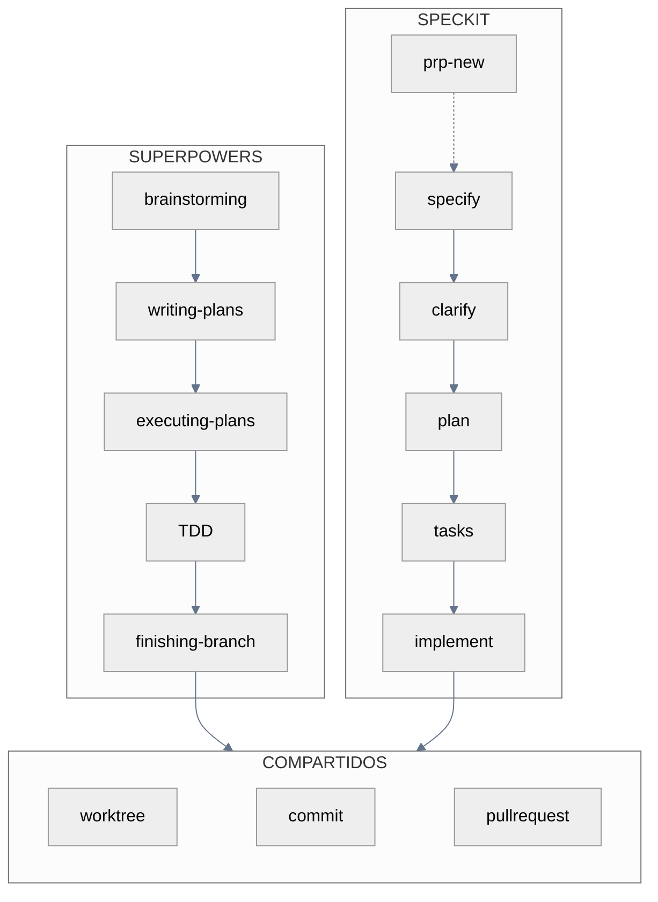
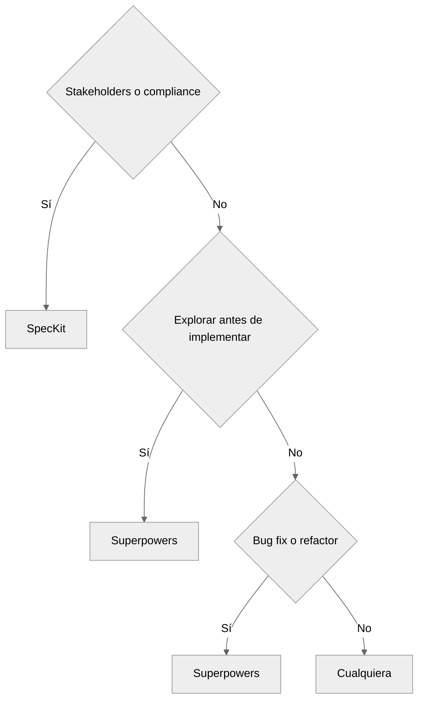
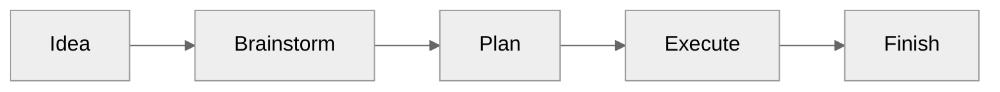
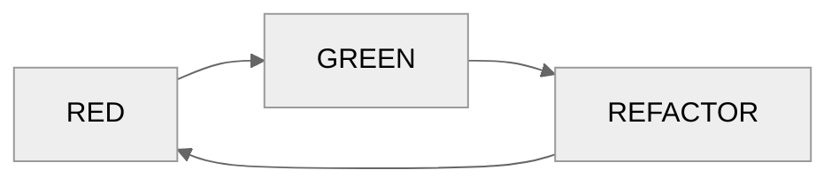
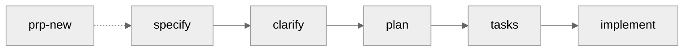
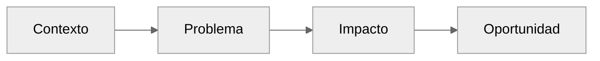
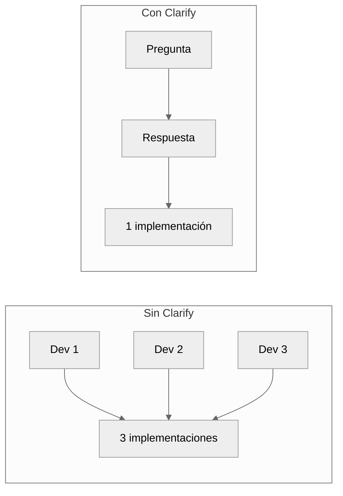
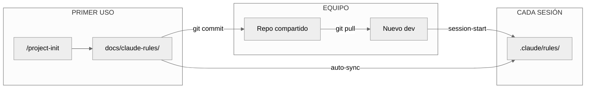
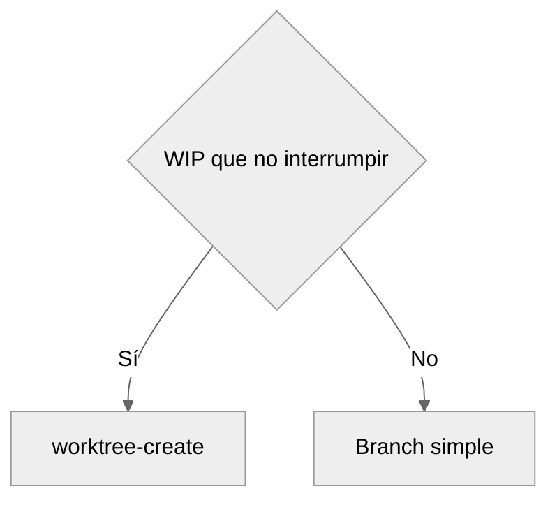

# AI-First Workflow

Dos caminos complementarios. Elige según contexto.

---

## Arquitectura



**Superpowers**: Flujo conversacional. Skills se activan por contexto.
**SpecKit**: Flujo estructurado. Comandos slash generan artefactos trazables.

---

## Decisión



| Contexto | Camino | Razón |
|----------|--------|-------|
| Requisitos difusos | Superpowers | Brainstorming refina iterativamente |
| Equipo pequeño | Superpowers | Menor overhead documental |
| Bug fix / refactor | Superpowers | No requiere spec formal |
| Stakeholders externos | SpecKit | Artefactos documentan decisiones |
| Compliance / regulación | SpecKit | Trazabilidad completa |
| Handoff a otros devs | SpecKit | Tasks.md como guía |

::: info Regla
**Velocidad → Superpowers. Certeza → SpecKit.**
:::

---

## Superpowers

Skills activados por contexto. Sin comandos explícitos.



### brainstorming

Trigger: describir una idea sin plan definido.

- Una pregunta por mensaje
- 2-3 enfoques con trade-offs
- Diseño en secciones de 200-300 palabras
- Validación incremental

Output: `docs/plans/YYYY-MM-DD-<topic>-design.md`

### writing-plans

Trigger: "listo para implementar" o diseño aprobado.

- Tasks de 2-5 minutos
- Paths exactos
- Código completo
- Comandos con output esperado

Output: `docs/plans/YYYY-MM-DD-<feature>.md`

### executing-plans

::: code-group
```text [Subagent-Driven]
Misma sesión
Review entre tasks
Fresh subagent por task
```
```text [Parallel Session]
Nueva sesión en worktree
Batches de 3 tasks
Checkpoint entre batches
```
:::

### TDD



::: danger Obligatorio
Código sin test fallando primero → borrar y reiniciar.
:::

### finishing-branch

1. Verificar tests
2. Elegir: merge local | PR | mantener | descartar
3. Ejecutar
4. Cleanup worktree

---

## SpecKit

Comandos slash con artefactos trazables.



### /prp-new <Badge type="tip" text="opcional" />

Discovery para problemas no definidos.



Output: `prps/<name>/discovery.md`

### /speckit.specify

```bash
/speckit.specify "OAuth authentication"
```

- Crea branch + directorio
- Spec sin implementación
- Máx 3 clarificaciones
- Validación automática

Output: `specs/NNN-feature/spec.md`

### /speckit.clarify

```bash
/speckit.clarify
```



::: warning
2 min clarify = 4+ horas refactor evitado.
:::

### /speckit.plan

```bash
/speckit.plan
```

| Artefacto | Contenido |
|-----------|-----------|
| research.md | Decisiones técnicas |
| data-model.md | Entidades |
| contracts/ | API specs |
| quickstart.md | Integración |

### /speckit.tasks

```bash
/speckit.tasks
```

- Dependency ordering
- Marcador `[P]` para paralelas
- Paths exactos
- TDD compliance

Output: `specs/NNN-feature/tasks.md`

### /speckit.analyze + /speckit.checklist <Badge type="tip" text="opcional" />

```bash
/speckit.analyze    # Consistencia cross-artifact
/speckit.checklist  # Quality gate
```

### /speckit.implement

```bash
/speckit.implement
```

1. Gate: checklists + TDD
2. Setup: ignore files, deps
3. Ejecución por fases
4. Checkpoints
5. Progress tracking

---

## Compartidos

### Project Rules (Team-Shared Context)



**Arquitectura:**
```
docs/claude-rules/   ← TRACKED (source of truth, reviewable en PRs)
       ↓ session-start hook
.claude/rules/       ← IGNORED (working copy local)
```

| Escenario | Acción |
|-----------|--------|
| Proyecto nuevo | `/project-init` → commit `docs/claude-rules/` |
| Nuevo miembro | `git pull` → session-start sincroniza automáticamente |
| Actualizar rules | Editar `docs/claude-rules/` → PR → merge |

::: tip Zero Config para Equipo
Una vez que `docs/claude-rules/` está en el repo, nuevos miembros obtienen contexto automáticamente sin ejecutar nada.
:::

---

### Worktrees

```bash
/worktree-create "feature" main
```



Post-setup: nueva ventana → terminal → `claude`

### Git

```bash
/git-commit "feat: email validation"   # Auto-agrupa
/git-pullrequest main                  # Review + security
```

### Cleanup

```bash
/changelog          # PRs merged
/git-cleanup        # Branch + sync
/worktree-cleanup   # Worktrees obsoletos
```

---

## Patterns

### Size S (≤80 LOC)

::: code-group
```bash [Superpowers]
"Implementa validación de email"
```
```bash [SpecKit]
/speckit.specify "email validation"
/speckit.clarify
/speckit.plan
/speckit.tasks
/speckit.implement
```
:::

Skip: analyze, checklist

### Size M (≤250 LOC)

::: code-group
```bash [Superpowers]
/worktree-create "feature" main
# brainstorming → writing-plans → executing-plans
```
```bash [SpecKit]
/worktree-create "feature" main
/speckit.specify "OAuth"
/speckit.clarify
/speckit.plan
/speckit.tasks
/speckit.analyze
/speckit.implement
/git-pullrequest main
```
:::

### Hotfix

```bash
/worktree-create "hotfix" main
/understand "bug checkout"
/speckit.specify "fix race condition"
/speckit.clarify
/speckit.plan
/speckit.tasks
/speckit.implement
/git-commit "fix: race condition"
/git-pullrequest main
/worktree-cleanup
```

---

## Reference

::: details Skills (Superpowers)
| Skill | Trigger |
|-------|---------|
| using-superpowers | Inicio sesión |
| brainstorming | Idea sin plan |
| writing-plans | Diseño listo |
| executing-plans | Plan existe |
| test-driven-development | Implementación |
| verification-before-completion | Pre-entrega |
| finishing-a-development-branch | Tasks completos |
| using-git-worktrees | Aislamiento |
:::

::: details Comandos (SpecKit)
| Comando | Función |
|---------|---------|
| /prp-new | Discovery problema |
| /speckit.specify | Descripción → spec |
| /speckit.clarify | Resolver ambigüedad |
| /speckit.plan | Spec → artefactos |
| /speckit.tasks | Plan → breakdown |
| /speckit.analyze | Validar consistencia |
| /speckit.checklist | Quality gate |
| /speckit.implement | Ejecutar con TDD |
:::

::: details Comandos Compartidos
| Comando | Función |
|---------|---------|
| /project-init | Generar rules team-shared |
| /worktree-create | Workspace aislado |
| /worktree-cleanup | Limpiar obsoletos |
| /git-commit | Commit inteligente |
| /git-pullrequest | PR + review |
| /git-cleanup | Post-merge |
| /changelog | Generar changelog |
| /understand | Análisis codebase |
:::

---

## Prácticas

| Práctica | Razón |
|----------|-------|
| Clarify siempre | 2 min → 4h saved |
| Worktree para paralelo | WIP intacto |
| TDD obligatorio | Prueba vs esperanza |
| Review pre-PR | Security incluido |
| Commits granulares | Auto-agrupación |

---

**Relacionados**: [Commands](./commands-guide.md) · [Skills](./skills-guide.md) · [Agents](./agents-guide.md) · [Pro Tips](./claude-code-pro-tips.md)

::: info Última Actualización
**Fecha**: 2025-12-11 | **Versión**: 4.2.1
:::
