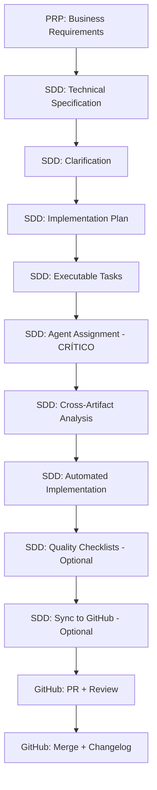

# Workflow AI-First

_Guía del ecosistema PRP → SDD → GitHub_

---

## 🎯 Arquitectura del Ecosistema

El ecosistema opera en 3 capas integradas:

```
📋 PRP-cycle (Business Layer)
   ↓ Define WHAT to build
🏗️ SDD-cycle (Engineering Layer)
   ↓ Define HOW to build
🔄 git-github (Delivery Layer)
   ↓ Tracks and delivers
```

### Flujo Completo



---

## 📦 Setup de Desarrollo

### Branch vs Worktree: ¿Cuál usar?

**Branch (MISMO directorio)** - Más simple, desarrollo secuencial:

```bash
/ai-framework:SDD-cycle:speckit.specify "implement OAuth authentication"
# → Crea branch: 001-implement-oauth
# → Crea spec: specs/001-implement-oauth/spec.md
# → Hace checkout de la branch (MISMO directorio)
```

**Worktree (directorio AISLADO)** - Más seguro, trabajo paralelo:

```bash
/ai-framework:git-github:worktree:create "implement OAuth authentication" main
# → Crea worktree: ../worktree-implement-oauth/
# → Crea branch: worktree-implement-oauth
# → Abre IDE en nueva ventana
# ⚠️ CRÍTICO: En nueva ventana del IDE:
#    1. Abrir terminal integrado (Cmd+`)
#    2. Verificar: pwd → debe mostrar ../worktree-XXX/
#    3. Iniciar nueva sesión Claude: claude
```

**Cuándo usar cada uno**:

| Escenario                        | Recomendación              | Razón                                          |
| -------------------------------- | -------------------------- | ---------------------------------------------- |
| Feature única, desarrollo lineal | `speckit.specify` (branch) | Más simple, sin overhead de worktrees          |
| Múltiples features en paralelo   | `worktree:create`          | Aislamiento completo, sesiones independientes  |
| Bug fix urgente                  | `worktree:create`          | No interrumpe trabajo en progreso              |
| Experimentación/POC              | `worktree:create`          | Fácil descarte sin afectar workspace principal |

**Verificación obligatoria** (solo worktrees):

```bash
pwd          # DEBE mostrar: ../worktree-XXX/
git branch   # DEBE mostrar: rama de feature (NO main/develop)
```

---

## 🔄 Workflows

### Con PRP (features de negocio)

```bash
# === PRP (Business) ===
/ai-framework:PRP-cycle:prp-new <feature_name>
# → Brainstorming interactivo, genera PRP minimalista (50-100 líneas)
# → Archivo: .claude/prps/<feature_name>/prp.md

/ai-framework:PRP-cycle:prp-sync <feature_name>
# → Crea parent issue en GitHub
# → Actualiza frontmatter con github_synced
# → Opción: --milestone <number> para asignar a milestone existente

# === SDD (Engineering - SECUENCIAL OBLIGATORIO) ===
/ai-framework:SDD-cycle:speckit.specify --from-issue <issue_number>
# → Crea spec.md técnica desde GitHub issue
# → Crea branch en MISMO directorio (NO worktree)
# → Valida spec con checklist
#
# Si prefieres worktree aislado (RECOMENDADO para trabajo paralelo):
# 1. Crear worktree primero: /ai-framework:git-github:worktree:create "feature name" main
# 2. En nueva ventana IDE: /ai-framework:SDD-cycle:speckit.specify --from-issue <issue_number>

/ai-framework:SDD-cycle:speckit.clarify
# OBLIGATORIO - Detecta ambigüedades (max 5 preguntas)
# → Actualiza spec.md con clarifications
# → Resuelve [NEEDS CLARIFICATION] markers

/ai-framework:SDD-cycle:speckit.plan
# → Genera research.md (decisiones técnicas)
# → Genera data-model.md (entidades y relaciones)
# → Genera contracts/ (API/GraphQL schemas)
# → Genera quickstart.md (escenarios de integración)
# → Actualiza contexto del agente

/ai-framework:SDD-cycle:speckit.tasks
# → Genera tasks.md con dependency ordering
# → Organiza por user stories (P1, P2, P3...)
# → Marca tasks paralelizables [P]
# → Incluye tests solo si especificado en spec

# === PASO CRÍTICO: Agent Assignment ===
/ai-framework:Task agent-assignment-analyzer "Analyze tasks.md and assign specialized agents for parallel execution"
# → Analiza task types (API, frontend, DB, tests)
# → Asigna agents especializados (backend-architect, frontend-developer, etc.)
# → Detecta file dependencies (mismo archivo = secuencial)
# → Genera parallel execution plan
# → Output: Tabla de streams paralelos con agents
# → Speedup potencial: 3-10x
# ⚠️ RECOMENDADO para features con 5+ tasks

/ai-framework:SDD-cycle:speckit.analyze
# → Valida consistencia cross-artifact
# → Detecta duplicaciones, ambigüedades, gaps
# → Verifica compliance con constitution
# → Genera reporte de findings (CRITICAL/HIGH/MEDIUM/LOW)

/ai-framework:SDD-cycle:speckit.implement
# → Ejecuta tasks.md con agents asignados (TDD + parallelization)
# → Marca tasks completadas [X]
# → Actualiza progress tracking

/ai-framework:SDD-cycle:speckit.sync <parent_issue_number>
# → Sincroniza spec.md + plan.md + tasks.md a GitHub
# → Crea child issue vinculado a parent PRP
# → RECOMENDADO: Después de implementación completa
# → Documenta lo que fue construido (no lo planeado)

# === Delivery ===
/ai-framework:git-github:commit "all changes"
/ai-framework:git-github:pr develop
# → Security review automático (BLOCKING)
```

### Sin PRP (desarrollo directo)

#### Opción 1: Branch simple (MISMO directorio)

```bash
# === SDD (Engineering - SECUENCIAL OBLIGATORIO) ===
/ai-framework:utils:understand    # Mapea arquitectura existente
/ai-framework:SDD-cycle:speckit.specify "Implement OAuth authentication"
# → Crea branch 001-implement-oauth en MISMO directorio
/ai-framework:SDD-cycle:speckit.clarify   # OBLIGATORIO
/ai-framework:SDD-cycle:speckit.plan      # Genera research.md, data-model.md, contracts/, quickstart.md
/ai-framework:SDD-cycle:speckit.tasks     # Genera tasks.md
/ai-framework:Task agent-assignment-analyzer "Analyze tasks.md and assign specialized agents for parallel execution"  # CASI MANDATORIO
/ai-framework:SDD-cycle:speckit.analyze   # Valida consistencia (opcional)
/ai-framework:SDD-cycle:speckit.implement # Ejecuta tasks.md con agents asignados

# === Delivery ===
/ai-framework:git-github:commit "all changes"
/ai-framework:git-github:pr develop
```

#### Opción 2: Worktree aislado (RECOMENDADO)

```bash
# === Setup Worktree ===
/ai-framework:git-github:worktree:create "implement OAuth authentication" main
# → Abre IDE en nueva ventana
# ⚠️ En nueva ventana: abrir terminal (Cmd+`) y continuar aquí

# === SDD (Engineering - SECUENCIAL OBLIGATORIO) ===
/ai-framework:utils:understand    # Mapea arquitectura existente
/ai-framework:SDD-cycle:speckit.specify "Implement OAuth authentication"
/ai-framework:SDD-cycle:speckit.clarify   # OBLIGATORIO
/ai-framework:SDD-cycle:speckit.plan      # Genera research.md, data-model.md, contracts/, quickstart.md
/ai-framework:SDD-cycle:speckit.tasks     # Genera tasks.md
/ai-framework:Task agent-assignment-analyzer "Analyze tasks.md and assign specialized agents for parallel execution"  # CASI MANDATORIO
/ai-framework:SDD-cycle:speckit.analyze   # Valida consistencia (opcional)
/ai-framework:SDD-cycle:speckit.implement # Ejecuta tasks.md con agents asignados

# === Delivery ===
/ai-framework:git-github:commit "all changes"
/ai-framework:git-github:pr develop
```

### Bug Fix Urgente

#### Con Worktree (RECOMENDADO - no interrumpe trabajo actual)

```bash
# === Setup Worktree ===
/ai-framework:git-github:worktree:create "fix payment bug" main
# → Abre IDE en nueva ventana
# ⚠️ Verificar en nueva ventana: pwd debe mostrar ../worktree-fix-payment-bug/

# === Implementation ===
/ai-framework:utils:understand "specific problem"
/ai-framework:SDD-cycle:speckit.specify "fix bug description"
/ai-framework:SDD-cycle:speckit.clarify   # OBLIGATORIO
/ai-framework:SDD-cycle:speckit.plan
/ai-framework:SDD-cycle:speckit.tasks
/ai-framework:Task agent-assignment-analyzer "Analyze tasks.md and assign specialized agents for parallel execution"  # CASI MANDATORIO
/ai-framework:SDD-cycle:speckit.analyze   # Opcional
/ai-framework:SDD-cycle:speckit.implement

# === Delivery ===
/ai-framework:git-github:commit "fix: description"
/ai-framework:git-github:pr main
```

#### Sin Worktree (si no hay trabajo en progreso)

```bash
# === Setup Branch ===
/ai-framework:SDD-cycle:speckit.specify "fix payment bug"
# → Crea branch en MISMO directorio

# === Implementation ===
/ai-framework:utils:understand "specific problem"
/ai-framework:SDD-cycle:speckit.clarify   # OBLIGATORIO
/ai-framework:SDD-cycle:speckit.plan
/ai-framework:SDD-cycle:speckit.tasks
/ai-framework:Task agent-assignment-analyzer "Analyze tasks.md and assign specialized agents for parallel execution"  # CASI MANDATORIO
/ai-framework:SDD-cycle:speckit.analyze   # Opcional
/ai-framework:SDD-cycle:speckit.implement

# === Delivery ===
/ai-framework:git-github:commit "fix: description"
/ai-framework:git-github:pr main
```

---

## 🔍 Checklists & Quality Gates

### Generación de Checklists (POST-Implementation)

```bash
# DESPUÉS de /ai-framework:SDD-cycle:speckit.implement (validación post-implementación)
/ai-framework:SDD-cycle:speckit.checklist "UX requirements quality review"
# → Genera: checklists/ux.md
# → "Unit tests for English" - valida calidad de implementación

/ai-framework:SDD-cycle:speckit.checklist "API contract completeness"
# → Genera: checklists/api.md
```

**Tipos comunes**:

- `ux.md` - UI/UX implementation quality
- `api.md` - API contracts completeness
- `security.md` - Security implementation coverage
- `performance.md` - Performance criteria compliance

**⚠️ CAMBIO IMPORTANTE**: `checklist` se ejecuta DESPUÉS de `implement` para validar calidad de la implementación, NO antes.

---

## 🔍 Findings & Agentes

### Después del PR

Security review automático genera findings por severidad:

- **CRITICAL**: Security vulnerabilities, architectural violations
- **HIGH**: Technical debt, missing error handling
- **MEDIUM**: Code quality, optimization opportunities

### Resolución

```bash
# 1. Analizar
/ai-framework:git-github:issue-manager <pr_number>

# 2. Resolver (manual o delegar a agente especialista)
/agent:security-reviewer        # Security audit
/agent:performance-engineer     # Performance optimization

# 3. Actualizar
/ai-framework:git-github:commit "fix: resolve findings"
git push
```

### Top Agentes

| Agente                  | Uso                                    |
| ----------------------- | -------------------------------------- |
| `security-reviewer`     | Security vulnerabilities, compliance   |
| `performance-engineer`  | Bottlenecks, resource optimization     |
| `code-quality-reviewer` | Technical debt prevention              |
| `backend-architect`     | API design, service architecture       |
| `frontend-developer`    | React/Vue components, state management |
| `database-optimizer`    | Query optimization, schema design      |

📖 Referencia completa: @agents-guide.md (45 agentes)

---

## 🔄 Post-Merge

```bash
# 1. Changelog
/ai-framework:utils:changelog <pr_number>

# 2. Cleanup worktree
/ai-framework:git-github:worktree:cleanup <worktree_name>
# → Triple cleanup (worktree/local/remote)
# → Regresa automáticamente a main

# 3. Docs (si necesario)
/ai-framework:utils:docs
```

---

## 💡 Tips

### DO

- ✅ Usar `/ai-framework:SDD-cycle:speckit.clarify` SIEMPRE
- ✅ Generar checklists para features complejas
- ✅ Security review antes de PR (automático con `/ai-framework:git-github:pr`)
- ✅ Un PR por worktree
- ✅ Commits semánticos: `fix: Closes #77`
- ✅ Cleanup worktrees post-merge
- ✅ Sync spec DESPUÉS de implementación completa

### DON'T

- ❌ Saltarse `/ai-framework:SDD-cycle:speckit.clarify`
- ❌ Múltiples PRs para una feature
- ❌ Desarrollar en main/develop directamente
- ❌ Mergear sin security review aprobado
- ❌ Cambiar de rama dentro de worktree (crear nuevo worktree)
- ❌ Sync spec antes de completar implementación

### Selección de Workflow

**PRP-cycle**: Features con stakeholders de negocio, aprobación de producto
**SDD-cycle directo**: Bug fixes, refactorings, features técnicas

### Selección de Aislamiento

**Branch simple** (`speckit.specify`): Desarrollo lineal, una feature a la vez, sin interrupciones
**Worktree aislado** (`worktree:create`): Trabajo paralelo, múltiples features, bug fixes urgentes, experimentación

---

## 📚 Referencia Rápida

### PRP-cycle (Business Layer)

| Comando                            | Propósito                               |
| ---------------------------------- | --------------------------------------- |
| `/ai-framework:PRP-cycle:prp-new`  | Crear PRP minimalista (50-100 líneas)   |
| `/ai-framework:PRP-cycle:prp-sync` | Sincronizar PRP a GitHub Issue (parent) |

### SDD-cycle (Engineering Layer - SECUENCIAL OBLIGATORIO)

| Orden | Comando                                        | Propósito                                                     |
| ----- | ---------------------------------------------- | ------------------------------------------------------------- |
| 1     | `/ai-framework:SDD-cycle:speckit.specify`      | Crear especificación técnica                                  |
| 2     | `/ai-framework:SDD-cycle:speckit.clarify`      | Clarificar ambigüedades (OBLIGATORIO)                         |
| 3     | `/ai-framework:SDD-cycle:speckit.plan`         | Generar research.md, data-model.md, contracts/, quickstart.md |
| 4     | `/ai-framework:SDD-cycle:speckit.tasks`        | Generar tasks.md con dependency ordering                      |
| 5     | **Agent Assignment** (via Task tool)           | Asignar agents especializados (CASI MANDATORIO)               |
| 6     | `/ai-framework:SDD-cycle:speckit.analyze`      | Validación cross-artifact (opcional)                          |
| 7     | `/ai-framework:SDD-cycle:speckit.implement`    | Ejecutar tasks.md con TDD + agents paralelos                  |
| 8     | `/ai-framework:SDD-cycle:speckit.checklist`    | Generar checklist de calidad (POST-implementation, opcional)  |
| 9     | `/ai-framework:SDD-cycle:speckit.sync`         | Sincronizar spec a GitHub (opcional, DESPUÉS de implement)    |
| -     | `/ai-framework:SDD-cycle:speckit.constitution` | Actualizar constitución (requiere autorización)               |

### git-github (Delivery Layer)

| Comando                                     | Propósito                              |
| ------------------------------------------- | -------------------------------------- |
| `/ai-framework:git-github:worktree:create`  | Crear worktree aislado                 |
| `/ai-framework:git-github:worktree:cleanup` | Cleanup triple (worktree/local/remote) |
| `/ai-framework:git-github:commit`           | Commits semánticos agrupados           |
| `/ai-framework:git-github:pr`               | Crear PR con security review           |
| `/ai-framework:git-github:cleanup`          | Post-merge cleanup workflow            |

### utils (Utilidades)

| Comando                             | Propósito                                 |
| ----------------------------------- | ----------------------------------------- |
| `/ai-framework:utils:understand`    | Mapeo de arquitectura existente           |
| `/ai-framework:utils:changelog`     | Actualizar CHANGELOG.md                   |
| `/ai-framework:utils:docs`          | Análisis y actualización de documentación |
| `/ai-framework:utils:deep-research` | Investigación profesional sistemática     |

---

## 🎯 Orden de Ejecución SDD-cycle (CRÍTICO)

**Secuencia obligatoria** para evitar inconsistencias:

```
1. specify                    → Crea spec.md técnica
2. clarify                    → Resuelve ambigüedades (NUNCA saltarse)
3. plan                       → Genera design artifacts
4. tasks                      → Genera implementation tasks
5. agent-assignment-analyzer  → Asigna agents especializados para ejecución paralela (CRÍTICO)
6. analyze                    → Valida consistency cross-artifact (opcional pero recomendado)
7. implement                  → Ejecuta tasks con TDD y agents asignados
8. checklist                  → (Opcional) Genera quality checklists POST-implementación
9. sync                       → (Opcional) Sincroniza a GitHub DESPUÉS de implementar
```

**⚠️ NUNCA cambiar el orden** - cada paso depende de los anteriores.

**PASO CRÍTICO FALTANTE**: `agent-assignment-analyzer` (paso 5)

- **Propósito**: Analiza tasks.md y asigna sub-agents especializados para ejecución paralela óptima
- **Por qué es crítico**: Speedup 3-10x, aprovecha contexto individual de cada agent, minimiza conflictos
- **Cuándo usar**: Features con 5+ tasks o tasks que tocan múltiples dominios (backend + frontend + DB)

---

_Última actualización: 2025-10-14 | Ecosistema PRP-SDD-GitHub | 24 comandos_
