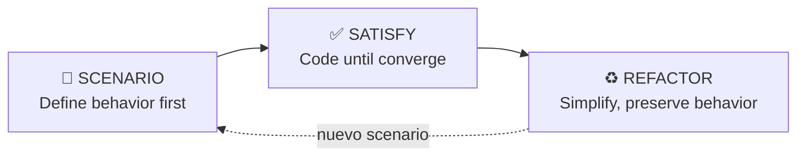

# Workflow AI-first

Este es el pipeline completo de desarrollo con AI Framework: de idea a código en producción en 5 fases, cada una con skills dedicados y quality gates automáticos.

> **Antes de empezar**: lee [Inicio rápido](./quickstart.md) para instalar el framework.

---

## El Pipeline

<details class="details custom-block">
<summary>💡 1. IDEA — brainstorming → design doc</summary>
<p>Convierte ideas vagas en diseños completos. Claude activa <code>brainstorming</code> automáticamente: pregunta una cosa a la vez, propone 2-3 enfoques con trade-offs, y genera un design doc en <code>docs/plans/</code>. <a href="#idea">Ver detalle →</a></p>
</details>

<details class="details custom-block">
<summary>📋 2. PLAN — ralph-orchestrator · discovery → planning → tasks</summary>
<p>Entry point único para desarrollo autónomo. Ralph ejecuta 8 pasos (0-7): elige modo (Interactive/Autonomous), discovery, planning, genera <code>.code-task.md</code> files, configura gates, y presenta plan completo en plan mode para tu aprobación antes de ejecutar. <a href="#plan">Ver detalle →</a></p>
</details>

<details class="details custom-block">
<summary>⚙️ 3. IMPLEMENT — SCENARIO → SATISFY → REFACTOR</summary>
<p>La metodología central. Cada feature se define primero como escenario observable, se implementa hasta que el behavior converge (satisfaction, no boolean), y se refactoriza preservando behavior. <a href="#implement">Ver detalle →</a></p>
</details>

<details class="details custom-block">
<summary>🔍 4. QUALITY — 6 agents automáticos + verification gate</summary>
<p>Seis agentes se activan solos según contexto: code-reviewer, security-reviewer, edge-case-detector, code-simplifier, performance-engineer, systematic-debugger. Verification gate de 6 pasos antes de declarar cualquier tarea completa. <a href="#quality">Ver detalle →</a></p>
</details>

<details class="details custom-block">
<summary>🚀 5. DELIVER — commit → pull-request → branch-cleanup</summary>
<p>Commits semánticos con agrupación automática por tipo de archivo. Pull request con quality gate integrado (code review + security review en paralelo). Post-merge cleanup automático. <a href="#deliver">Ver detalle →</a></p>
</details>

Cada fase tiene un skill dedicado. Claude los activa automáticamente o puedes invocarlos tú.

---

## Fase 1: Idea {#idea}

Convierte ideas vagas en diseños completos mediante diálogo.

```
"Necesito sistema de notificaciones push"
```

Claude activa `brainstorming` automáticamente:

1. Examina el proyecto, pregunta **una cosa a la vez**
2. Propone 2-3 enfoques con trade-offs
3. Diseña en secciones de 200-300 palabras, valida cada una
4. Genera `docs/plans/YYYY-MM-DD-<topic>-design.md`

::: tip Después del design doc
Según el tamaño de la tarea, continúa con:
- **Tarea pequeña** → Implementa directamente (ver [Patrones por tamaño](#patterns))
- **Tarea mediana/grande** → `ralph-orchestrator` para planificación + ejecución autónoma
:::

---

## Fase 2: Plan {#plan}

### Ralph Orchestrator <Badge type="tip" text="recomendado" />

Entry point único para desarrollo autónomo. Una invocación orquesta todo el pipeline.

```
"Implementa el sistema de notificaciones del design doc"
```

Ralph ejecuta 8 pasos (0-7) en secuencia:

| Paso | Qué hace | Output |
|:----:|----------|--------|
| 0 | Elige modo: **Interactive** o **Autonomous** | — |
| 1 | Valida prerrequisitos | — |
| 2 | **Discovery** (nuevo) o **Reverse** (existente) | `discovery.md` |
| 3 | **Planning** — diseño detallado | `detailed-design.md` |
| 4 | **Task generation** — todas las tareas upfront | `.code-task.md` files |
| 5 | Genera `AGENTS.md` para workers | `AGENTS.md` |
| 6 | Configura ejecución (quality gates) | `.ralph/config.sh` |
| 7 | Plan mode + aprobación + ejecución autónoma | Agent Teams |

::: warning Aprobación obligatoria (Paso 7)
Ralph **nunca** ejecuta código sin tu aprobación. Antes de lanzar Agent Teams, presenta un plan completo en plan mode con resumen de planificación, estrategia de ejecución y configuración. Nada se ejecuta sin tu OK.
:::

::: details ¿Qué son los modos?
**Interactive** — Ralph pregunta y espera confirmación en cada decisión. Para cuando quieres control granular.

**Autonomous** — Ralph toma decisiones solo, documenta assumptions y continúa sin bloquear. Para desarrollo overnight/AFK.

En ambos modos, la aprobación en plan mode (paso 7) es **obligatoria**.
:::

### SOP Pipeline <Badge type="info" text="manual" />

Si prefieres control paso a paso en lugar de Ralph, puedes invocar cada skill del pipeline individualmente:

::: code-group
```bash [1. Discovery]
"Explora constraints y riesgos del sistema de notificaciones"
# → sop-discovery → discovery.md
```

```bash [2. Planning]
"Diseña la solución basándote en el discovery"
# → sop-planning → detailed-design.md + plan.md
```

```bash [3. Tasks]
"Genera las tareas del plan"
# → sop-task-generator → .code-task.md files
```

```bash [4. Implement]
"Implementa la primera tarea"
# → sop-code-assist → código + tests + commit
```
:::

::: details ¿Cuándo usar pipeline manual vs Ralph?
**Ralph** — Features completas, desarrollo overnight, cuando quieres que el framework maneje todo.

**Pipeline manual** — Cuando quieres iterar en una fase específica (ej: refinar el planning sin regenerar discovery), o para tareas donde solo necesitas una parte del pipeline.
:::

---

## Fase 3: Implement {#implement}

### Scenario-Driven Development <Badge type="danger" text="metodología central" />

Todo código se escribe para satisfacer escenarios, nunca al revés.



::: danger Ley de hierro
**NO se escribe código de producción sin un escenario definido primero.** Los escenarios definen el comportamiento esperado; el código existe para satisfacerlos.
:::

**El ciclo:**

**1. SCENARIO** — Definir qué debe pasar (user story con valores concretos)

```gherkin
Dado un usuario con plan "free"
Cuando intenta enviar más de 10 notificaciones/día
Entonces recibe error "Límite diario alcanzado" y el contador no incrementa // [!code highlight]
```

**2. SATISFY** — Escribir código hasta que el escenario converge

```js
// ❌ Esto NO es convergencia
test('should limit notifications', () => { expect(true).toBe(true) }) // [!code error]

// ✅ Esto SÍ es convergencia
// Ejecuté sendNotification() 11 veces → observé "Límite diario alcanzado" // [!code highlight]
// y counter.value === 10 (no incrementó)                                  // [!code highlight]
```

- Ejecutar → observar output → ajustar → repetir
- "Converge" = el behavior observable satisface al usuario, no solo "pasa un test"

**3. REFACTOR** — Simplificar sin romper behavior

```js
// Antes
if (count >= limit) {                     // [!code --]
  if (plan === 'free') {                  // [!code --]
    throw new Error('Límite alcanzado')   // [!code --]
  }                                       // [!code --]
}                                         // [!code --]

// Después
const planLimits = { free: 10, pro: 100 } // [!code ++]
if (count >= planLimits[plan]) {          // [!code ++]
  throw new LimitExceededError(plan)      // [!code ++]
}                                         // [!code ++]
```

- Validar ANTES y DESPUÉS de cada cambio
- Un cambio pequeño a la vez
- Si algo rompe → undo inmediatamente

### Enforcement automático <Badge type="warning" text="invisible" />

Dos hooks operan en background durante toda implementación — no requieren configuración ni invocación manual:

| Hook | Trigger | Qué hace |
|------|---------|----------|
| `sdd-test-guard` | **PreToolUse** (Edit\|Write) | Si los tests están fallando Y un edit reduce el número de assertions → **deniega el edit**. Previene que Claude debilite tests para que pasen en vez de arreglar el código. |
| `sdd-auto-test` | **PostToolUse** (Edit\|Write) | Después de cada edit a código fuente, lanza tests en background (~10ms de bloqueo). Los resultados se reportan en el siguiente edit — loop continuo de feedback. |

**`sdd-test-guard`** implementa la ley de hierro: "Not M/M → fix code, never weaken scenarios." Su matriz de decisión:

| Tests | Edit | Resultado |
|-------|------|-----------|
| Passing + cualquier cambio | → ALLOW | Refactoring legítimo |
| Failing + assertions ≥ | → ALLOW | Fix o test nuevo |
| Failing + assertions < | → **DENY** | Reward hacking detectado |
| Sin estado + cualquier cambio | → ALLOW | Sin datos = sin bloqueo |

**`sdd-auto-test`** cierra el loop de SDD: cada cambio al código fuente dispara tests automáticamente. No necesitas recordar correr tests — el hook lo hace por ti y reporta resultados en el contexto del siguiente edit.

Ambos hooks comparten estado via archivos temporales y son invisibles en operación normal. Solo se manifiestan cuando detectan reward hacking (guard) o cuando reportan resultados (auto-test).

::: details SDD vs TDD
| | Scenario (SDD) | Test (TDD) |
|---|---|---|
| **Vive** | Spec externa al código | Código del codebase |
| **Evalúa** | "¿Satisface al usuario?" | "¿Pasa?" (boolean) |
| **Vulnerable a** | Nada (holdout externo) | Reward hacking |
| **Escrito como** | User story observable | Assertion técnica |

SDD no reemplaza tests — los complementa. Los escenarios definen **qué** debe pasar; los tests verifican **que siga pasando**.
:::

---

## Fase 4: Quality {#quality}

Seis agentes especializados se activan automáticamente según contexto. No necesitas invocarlos — Claude los delega cuando corresponde.

| Agent | Qué revisa | Cuándo se activa |
|-------|------------|------------------|
| `code-reviewer` | SDD compliance, behavioral satisfaction, reward hacking | Después de implementar un step |
| `code-simplifier` | Complejidad, redundancia, nombres | Después de escribir código |
| `security-reviewer` | Injection, auth bypass, secrets | Antes de PR, cambios en auth/data |
| `edge-case-detector` | Boundary, concurrency, resource leaks | Código crítico (money, state) |
| `performance-engineer` | Queries, algorithmic complexity, I/O | Problemas de rendimiento |
| `systematic-debugger` | Root cause 4 fases | Bug o test failure |

Ver descripción detallada de cada agente en [Agentes](./agents-guide.md).

### Verification Gate <Badge type="danger" text="obligatorio" />

Antes de declarar cualquier tarea completa, `verification-before-completion` ejecuta un gate de 6 pasos:

1. **IDENTIFY** — Listar cada claim que se está haciendo
2. **RUN** — Ejecutar la verificación ahora, no después
3. **READ** — Leer cada línea del output, completo
4. **VERIFY** — ¿El output coincide con el claim?
5. **SATISFY** — ¿Los escenarios convergen hacia satisfacción?
6. **CLAIM** — Afirmar con evidencia: `npm test` → 47/47 ✓

::: danger Sin evidencia no hay completion
```
"Debería funcionar"                                  // [!code error]
"Ejecuté `npm test` y observé 47/47 passing"         // [!code highlight]
```
:::

---

## Fase 5: Deliver {#deliver}

### Commit

```bash
/commit "feat: add push notification system"
```

Agrupa cambios automáticamente por tipo de archivo. Si modificaste código + config + docs, crea commits separados.

::: code-group
```bash [Convencional]
/commit "feat(notifications): add daily limit"
```

```bash [Corporativo]
/commit "TRV-345 implementar límite diario"
# → feat|TRV-345|20260208|implementar límite diario
```
:::

### Pull Request

```bash
/pull-request main
```

Quality gate integrado que ejecuta en paralelo:
- Code review (lógica, arquitectura, bugs)
- Security review (injection, secrets, XSS)
- Observaciones (tests, API, breaking changes)

Tres opciones: **Create PR** · **Auto fix** · **Cancel**

### Post-merge

```bash
/branch-cleanup
```

Elimina feature branch local, sincroniza con remote.

---

## Patrones por tamaño {#patterns}

### Small <Badge type="info" text="≤80 LOC" /> — Directo

```bash
# Describe y Claude implementa con SDD
"Agrega validación de email en el formulario de registro" # [!code focus]

# Commit y PR
/commit "feat: add email validation"
/pull-request main
```

Sin pipeline. Claude aplica SDD automáticamente (define scenario → satisface → refactoriza).

### Medium <Badge type="tip" text="80-250 LOC" /> — Brainstorming + SDD

```bash
# 1. Explorar diseño
"Necesito rate limiting en la API"     # [!code focus]
# → brainstorming → design doc

# 2. Implementar con SDD
"Implementa el diseño"                 # [!code focus]
# → SDD cycle por cada componente

# 3. Entregar
/commit "feat: add API rate limiting"
/pull-request main
```

### Large/XL <Badge type="warning" text=">250 LOC" /> — Ralph Orchestrator

```bash
# 1. Brainstorming (si no hay design doc)
"Necesito autenticación OAuth completa"
# → design doc

# 2. Ralph se encarga de todo
"Implementa con ralph-orchestrator"              # [!code focus]
# → discovery → planning → tasks → checkpoint
# → ejecución autónoma con commits incrementales

# 3. PR final
/pull-request main
```

::: tip ¿Cuándo usar Ralph?
- Features de más de 250 LOC
- Desarrollo overnight o AFK
- Cuando quieres fresh context en cada iteración (evita context rot)
- Cuando el feature tiene múltiples componentes interdependientes
:::

### Hotfix <Badge type="danger" text="urgente" /> — Worktree aislado

```bash
/worktree-create "hotfix-race-condition" main     # [!code focus]

# En la nueva ventana:
"Fix: race condition en checkout"
/commit "fix: race condition in checkout process"
/pull-request main

/worktree-cleanup hotfix-race-condition           # [!code focus]
```

---

## Herramientas de soporte {#tools}

Además del pipeline principal, el framework incluye herramientas para tareas específicas: `/project-init` para configurar reglas de proyecto, `/deep-research` para investigación multi-fuente, `agent-browser` para interacción web, y `/worktree-create` para trabajo paralelo.

Ver detalles completos en [Skills](./skills-guide.md).

---

## Plugins complementarios {#plugins}

El framework se integra con plugins externos como Superpowers (skills para SDD, debugging, code review) y Episodic Memory (búsqueda semántica de conversaciones pasadas).

Ver instalación y detalles en [Integraciones](./integrations.md).

---

## Referencia rápida {#reference}

| Quiero... | Comando / Acción |
|-----------|-----------------|
| Explorar una idea | `"Necesito X"` → brainstorming activa |
| Desarrollo autónomo | `"Implementa con ralph-orchestrator"` |
| Investigar sistema existente | `"Investiga el módulo de auth"` → sop-reverse |
| Debug metódico | `"Bug: el checkout falla"` → systematic-debugging |
| Commit | `/commit "tipo: descripción"` |
| Pull request | `/pull-request main` |
| Limpiar branch | `/branch-cleanup` |
| Worktree paralelo | `/worktree-create "nombre" base` |
| Inicializar proyecto | `/project-init` |
| Investigación profunda | `/deep-research "tema"` |
| Interacción web | `agent-browser open URL` |

---

**Siguiente paso**: [Pro tips](./claude-code-pro-tips.md)

**Relacionados**: [Skills](./skills-guide.md) · [Agents](./agents-guide.md) · [Integrations](./integrations.md) · [Quickstart](./quickstart.md)

---

::: info Última actualización
**Fecha**: 2026-02-08
:::
