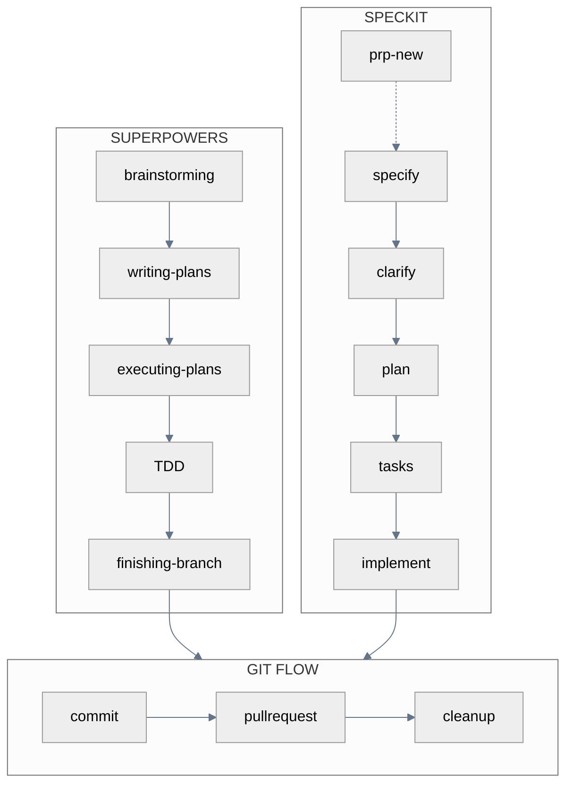
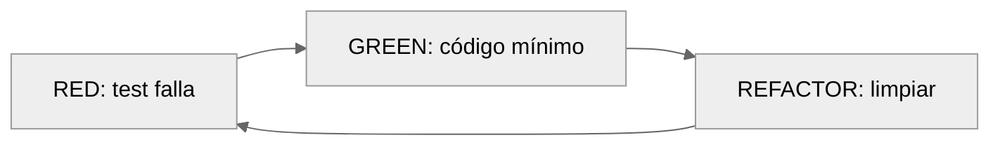

# AI-First Workflow

Excelencia por diseño. Dos caminos.

**Superpowers** te guía con skills que se activan por contexto. Conversacional.
**SpecKit** genera artefactos trazables con comandos slash. Estructurado.

Ambos convergen en el mismo workflow de Git al final.

---

## Vista General



---

## ¿Cuál Elegir?

| Situación | Superpowers | SpecKit |
|-----------|:-----------:|:-------:|
| Idea sin forma clara | ✓ | |
| Equipo pequeño / solo | ✓ | |
| Bug fix o refactor | ✓ | |
| Stakeholders externos | | ✓ |
| Compliance / regulación | | ✓ |
| Handoff a otros devs | | ✓ |

::: tip Regla simple
**Velocidad → Superpowers. Certeza → SpecKit.**
:::

---

## Superpowers

Skills que se activan automáticamente según lo que describes.

### El Flujo

1. **Describe tu idea** → activa `brainstorming`
2. **Aprueba diseño** → activa `writing-plans`
3. **Plan listo** → activa `executing-plans`
4. **Implementa** → activa `TDD` (red-green-refactor)
5. **Completo** → activa `finishing-branch`

### brainstorming

**Trigger**: Describes una idea sin plan definido.

Claude hace una pregunta a la vez. Presenta 2-3 enfoques con trade-offs. Valida incrementalmente. El resultado es un diseño en `docs/plans/YYYY-MM-DD-<topic>-design.md`.

### writing-plans

**Trigger**: Dices "listo para implementar" o apruebas un diseño.

Claude genera tasks de 2-5 minutos con paths exactos, código completo y comandos con output esperado. El resultado va a `docs/plans/YYYY-MM-DD-<feature>.md`.

### executing-plans

Dos modos de ejecución:

| Subagent-Driven | Parallel Session |
|-----------------|------------------|
| Misma sesión | Nueva sesión en worktree |
| Review entre tasks | Batches de 3 tasks |
| Fresh subagent por task | Checkpoint entre batches |

### TDD



::: danger Regla inquebrantable
Código sin test fallando primero → borrar y reiniciar.
:::

### finishing-branch

1. Verificar que tests pasen
2. Elegir: merge local, PR, mantener, o descartar
3. Ejecutar la opción elegida
4. Limpiar worktree si aplica

---

## SpecKit

Comandos slash que generan artefactos trazables.

### El Flujo

1. `/prp-new` <Badge type="tip" text="opcional" /> — Discovery del problema
2. `/speckit.specify` — Descripción → spec técnica
3. `/speckit.clarify` — Resolver ambigüedades
4. `/speckit.plan` — Spec → artefactos de diseño
5. `/speckit.tasks` — Plan → tasks ejecutables
6. `/speckit.implement` — Ejecuta con TDD

### /prp-new <Badge type="tip" text="opcional" />

Discovery para problemas no definidos. Cuatro fases: Contexto → Problema → Impacto → Oportunidad.

```bash
/prp-new "descripción del problema"
```

Output: `prps/<name>/discovery.md`

### /speckit.specify

Convierte descripción natural en especificación técnica.

```bash
/speckit.specify "OAuth authentication with Google"
```

Crea branch `NNN-feature`, genera `spec.md` sin implementación, valida automáticamente.

### /speckit.clarify

Detecta ambigüedades y pregunta hasta resolverlas.

```bash
/speckit.clarify
```

::: warning ROI comprobado
2 minutos de clarificación evitan 4+ horas de refactor.
:::

### /speckit.plan

Genera artefactos de diseño técnico.

```bash
/speckit.plan
```

| Artefacto | Contenido |
|-----------|-----------|
| research.md | Decisiones técnicas con rationale |
| data-model.md | Entidades y relaciones |
| contracts/ | Specs de API |
| quickstart.md | Guía de integración |

### /speckit.tasks

Genera breakdown ejecutable con dependencias.

```bash
/speckit.tasks
```

Tasks marcadas `[P]` pueden ejecutarse en paralelo. Output: `tasks.md`.

### /speckit.analyze y /speckit.checklist <Badge type="tip" text="opcional" />

```bash
/speckit.analyze    # Valida consistencia entre artefactos
/speckit.checklist  # Genera quality gate antes de implementar
```

### /speckit.implement

Ejecuta tasks con TDD enforcement.

```bash
/speckit.implement
```

Valida checklists → Setup inicial → Ejecuta por fases → Marca progreso.

---

## Git Flow

Ambos caminos convergen aquí. Tres pasos: commit, PR, cleanup.

### Commit

```bash
/git-commit "feat: add email validation"
```

Agrupa cambios automáticamente por tipo. Soporta formato corporativo `tipo|TASK-ID|YYYYMMDD|desc`.

### Pull Request

```bash
/git-pullrequest main
```

Ejecuta code review + security review en paralelo. Presenta findings. Tú decides: crear PR, auto-fix, o cancelar.

### Cleanup

```bash
/git-cleanup
```

Elimina branch local, sincroniza con remote. Ejecutar después de merge.

---

## Worktrees

::: tip ¿Cuándo usar worktrees?
**Tienes WIP que no quieres perder** → `/worktree-create`
**No tienes WIP** → Branch simple con `git checkout -b`
:::

### Crear worktree

```bash
/worktree-create "feature-name" main
```

Crea directorio sibling `../worktree-feature-name/` con branch nueva.

::: warning Paso crítico post-creación
El IDE abre automáticamente, pero debes:
1. Abrir terminal en la nueva ventana
2. Verificar directorio con `pwd`
3. Iniciar Claude Code con `claude`

Sin esto, Claude sigue trabajando en el directorio anterior.
:::

### Limpiar worktrees

```bash
/worktree-cleanup              # Lista disponibles
/worktree-cleanup feature-name # Elimina específico
```

---

## Project Rules

Reglas de proyecto que se comparten con el equipo via Git.

### Arquitectura

```
docs/claude-rules/        ← TRACKED (source of truth)
├── stack.md
├── patterns.md
├── architecture.md
└── testing.md
        ↓ session-start hook (auto-sync)
.claude/rules/            ← IGNORED (copia local)
```

Similar a `.env.example` → `.env`: las reglas canónicas viven en Git, cada dev tiene copia local sincronizada automáticamente.

### Setup inicial

```bash
/project-init
```

Analiza el proyecto y genera reglas en `docs/claude-rules/`. Commit y push para compartir con el equipo.

### Para nuevos miembros

Nada que hacer. El hook de session-start sincroniza automáticamente `docs/claude-rules/` a `.claude/rules/`.

### Actualizar reglas

Edita archivos en `docs/claude-rules/`, crea PR, merge. Todos obtienen cambios en su próxima sesión.

---

## Patrones por Tamaño

### Size S (≤80 LOC)

::: code-group
```bash [Superpowers]
"Implementa validación de email en el formulario de registro"
# Claude activa TDD automáticamente
```
```bash [SpecKit]
/speckit.specify "email validation"
/speckit.clarify
/speckit.plan
/speckit.tasks
/speckit.implement
```
:::

Skip: analyze, checklist.

### Size M (≤250 LOC)

::: code-group
```bash [Superpowers]
/worktree-create "oauth" main
# Describe la feature → brainstorming → plans → execute
/git-pullrequest main
```
```bash [SpecKit]
/worktree-create "oauth" main
/speckit.specify "OAuth with Google"
/speckit.clarify
/speckit.plan
/speckit.tasks
/speckit.analyze
/speckit.implement
/git-pullrequest main
```
:::

### Hotfix urgente

```bash
/worktree-create "hotfix-race" main
/understand "área del bug"
# Fix directo o via SpecKit según complejidad
/git-commit "fix: race condition in checkout"
/git-pullrequest main
/worktree-cleanup hotfix-race
```

---

## Referencia Rápida

::: details Skills (Superpowers)
| Skill | Se activa cuando... |
|-------|---------------------|
| using-superpowers | Inicio de sesión |
| brainstorming | Describes idea sin plan |
| writing-plans | Diseño aprobado |
| executing-plans | Plan existe |
| test-driven-development | Implementas código |
| verification-before-completion | Antes de entregar |
| finishing-a-development-branch | Tasks completos |
| using-git-worktrees | Necesitas aislamiento |
:::

::: details Comandos SpecKit
| Comando | Qué hace |
|---------|----------|
| /prp-new | Discovery de problema |
| /speckit.specify | Descripción → spec |
| /speckit.clarify | Resuelve ambigüedades |
| /speckit.plan | Spec → artefactos técnicos |
| /speckit.tasks | Plan → breakdown ejecutable |
| /speckit.analyze | Valida consistencia |
| /speckit.checklist | Quality gate |
| /speckit.implement | Ejecuta con TDD |
:::

::: details Comandos Git y Utilidades
| Comando | Qué hace |
|---------|----------|
| /git-commit | Commit semántico |
| /git-pullrequest | PR con review |
| /git-cleanup | Post-merge cleanup |
| /worktree-create | Workspace aislado |
| /worktree-cleanup | Elimina worktrees |
| /project-init | Genera rules de equipo |
| /understand | Analiza codebase |
| /changelog | Actualiza CHANGELOG |
:::

---

## Prácticas Esenciales

| Práctica | Por qué |
|----------|---------|
| Siempre `/clarify` | 2 min clarificación = 4h refactor evitado |
| Worktree para paralelo | Tu WIP queda intacto |
| TDD sin excepciones | Prueba > esperanza |
| Review antes de PR | Security incluido gratis |
| Commits granulares | Auto-agrupación inteligente |

---

**Relacionados**: [Comandos](./commands-guide.md) · [Skills](./skills-guide.md) · [Agentes](./agents-guide.md) · [Pro Tips](./claude-code-pro-tips.md)

::: info Última Actualización
**Fecha**: 2025-12-12 | **Versión**: 4.3.0
:::
