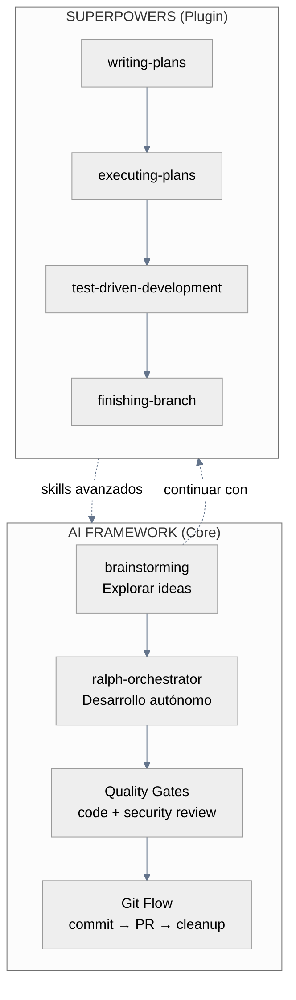

# AI-First Workflow

Desarrollo autónomo con quality gates. Ralph Loop como motor, Superpowers como acelerador.

---

## Arquitectura



---

## Ralph Loop: El Corazón

Ralph Loop es desarrollo autónomo multi-iteración con fresh context en cada ciclo.

### Principios (The Ralph Tenets)

| Principio | Significado |
|-----------|-------------|
| **Fresh Context Is Reliability** | Cada iteración limpia contexto. Sin context rot. |
| **Backpressure Over Prescription** | Gates que rechazan mal trabajo, no scripts que prescriben cómo. |
| **The Plan Is Disposable** | Regenerar plan cuesta un loop. Barato. |
| **Disk Is State, Git Is Memory** | Archivos son handoff. Git es memoria persistente. |
| **Steer With Signals** | Cuando falla, agrega Sign para próxima iteración. |
| **Let Ralph Ralph** | Sit ON the loop, not IN it. |

### Quick Start

```bash
# Prerequisitos: git repo existente + comandos de validación (tests, lint, build)

# 1. Instalar desde skill
RALPH_SKILL="path/to/skills/ralph-orchestrator"
cp "$RALPH_SKILL/scripts/loop.sh" .
cp "$RALPH_SKILL/scripts/PROMPT_build.md" .
cp "$RALPH_SKILL/scripts/PROMPT_plan.md" .
chmod +x loop.sh

# 2. Planificar
./loop.sh plan      # Genera IMPLEMENTATION_PLAN.md (corre hasta completar)

# 3. Ejecutar
./loop.sh           # Ejecuta plan (corre hasta ALL tasks done)
```

### Modos

| Comando | Modo | Comportamiento |
|---------|------|----------------|
| `./loop.sh plan` | Planning | Gap analysis → genera plan |
| `./loop.sh` | Building | Selecciona task → implementa → commit |
| `./loop.sh 20` | Building limitado | Máximo 20 iteraciones |
| `./loop.sh plan 5` | Planning limitado | Máximo 5 iteraciones |

### Safety Features

- **Double Completion**: Requiere 2 señales `COMPLETE` consecutivas
- **Fresh Context**: Cada iteración comienza con contexto limpio (INPUT-based control)
- **Task Abandonment**: Exit si mismo task falla 3+ veces
- **Loop Thrashing**: Detecta patrones oscilantes (A→B→A→B)
- **Circuit Breaker**: 3 fallos Claude consecutivos → exit

### Exit Codes

| Code | Significado |
|------|-------------|
| 0 | SUCCESS - Objetivo completo |
| 1 | ERROR - Validación fallida |
| 2 | CIRCUIT_BREAKER - 3 fallos consecutivos |
| 3 | MAX_ITERATIONS - Límite alcanzado |
| 6 | LOOP_THRASHING - Patrón oscilante |
| 7 | TASKS_ABANDONED - 3+ fallos mismo task |
| 130 | INTERRUPTED - Ctrl+C |

---

## Superpowers: Skills Avanzados

Plugin externo con workflows de desarrollo estructurados.

### Instalación

```bash
/plugin marketplace add obra/superpowers-marketplace
/plugin install superpowers@superpowers-marketplace
```

### Skills Incluidos

| Skill | Cuándo usar |
|-------|-------------|
| `writing-plans` | Diseño aprobado, necesitas plan ejecutable |
| `executing-plans` | Plan existe, ejecución en batches con review |
| `test-driven-development` | Implementar cualquier código (RED→GREEN→REFACTOR) |
| `systematic-debugging` | Bug o comportamiento inesperado |
| `verification-before-completion` | Antes de declarar "done" |
| `finishing-a-development-branch` | Tasks completos, decidir integración |
| `using-git-worktrees` | Necesitas aislamiento sin perder WIP |

### Workflow Típico con Superpowers

```bash
# 1. Brainstorming (skill del framework)
"Necesito sistema de notificaciones"
# → brainstorming: preguntas iterativas → design doc

# 2. Planning (Superpowers)
"Listo para implementar"
# → writing-plans: tasks detallados con código exacto

# 3. Execution (Superpowers)
"Ejecuta el plan"
# → executing-plans: batches con review entre cada uno

# 4. Integration (Superpowers)
"Feature completa"
# → finishing-branch: tests → opciones → PR/merge/cleanup
```

---

## Git Flow

Comandos nativos del framework para gestión de código.

### Commit

```bash
/git-commit "feat: add email validation"
```

Agrupa cambios automáticamente por tipo. Soporta formato corporativo `tipo|TASK-ID|YYYYMMDD|desc`.

### Pull Request

```bash
/pull-request main
```

Quality gate integrado:
- Code review (lógica, arquitectura, bugs)
- Security review (SQL injection, secrets, XSS)
- Observaciones (tests, API, breaking changes)

Opciones: **Create PR** | **Auto fix** | **Cancel**

### Cleanup

```bash
/git-cleanup
```

Post-merge: elimina branch local, sincroniza con remote.

---

## Worktrees

::: tip ¿Cuándo usar worktrees?
**Tienes WIP que no quieres perder** → `/worktree-create`
**No tienes WIP** → Branch simple con `git checkout -b`
:::

### Crear

```bash
/worktree-create "feature-name" main
```

Crea `../worktree-feature-name/` con branch nueva.

::: warning Post-creación
1. Abrir terminal en nueva ventana
2. Verificar directorio: `pwd`
3. Iniciar Claude: `claude`

Sin esto, Claude sigue en directorio anterior.
:::

### Limpiar

```bash
/worktree-cleanup              # Lista disponibles
/worktree-cleanup feature-name # Elimina específico
```

---

## Project Rules

Reglas compartidas via Git para consistencia de equipo.

### Arquitectura

```
docs/claude-rules/        ← TRACKED (source of truth)
├── stack.md
├── patterns.md
├── architecture.md
└── testing.md
        ↓ session-start hook (auto-sync)
.claude/rules/            ← IGNORED (copia local)
```

### Setup

```bash
/project-init
```

Analiza proyecto → genera `docs/claude-rules/` → commit y push.

### Actualizar

Edita `docs/claude-rules/` → PR → merge. Todos obtienen cambios en próxima sesión.

---

## Patrones por Tamaño

### Size S (≤80 LOC)

```bash
"Implementa validación de email en el formulario"
# Claude implementa directamente con tests
/git-commit "feat: add email validation"
/pull-request main
```

### Size M (≤250 LOC)

**Con Superpowers:**
```bash
"Necesito autenticación OAuth"
# → brainstorming → writing-plans → executing-plans
/pull-request main
```

**Con Ralph Loop:**
```bash
./loop.sh plan    # Genera plan
./loop.sh         # Ejecuta hasta completar
/pull-request main
```

### Size L/XL (>250 LOC)

```bash
# Ralph Loop es ideal para features grandes
./loop.sh plan              # Plan detallado
./loop.sh                   # Ejecución autónoma con fresh context
# Ralph hace commits incrementales
/pull-request main       # PR final con todo el trabajo
```

### Hotfix

```bash
/worktree-create "hotfix-race" main
/understand "área del bug"
# Fix directo
/git-commit "fix: race condition in checkout"
/pull-request main
/worktree-cleanup hotfix-race
```

---

## Referencia Rápida

::: details Comandos del Framework
| Comando | Qué hace |
|---------|----------|
| `/git-commit` | Commit semántico con agrupación |
| `/pull-request` | PR con quality gate (code + security) |
| `/git-cleanup` | Post-merge cleanup |
| `/worktree-create` | Workspace aislado |
| `/worktree-cleanup` | Elimina worktrees |
| `/project-init` | Genera rules de equipo |
| `/understand` | Analiza codebase |
:::

::: details Skills del Framework
| Skill | Uso |
|-------|-----|
| `brainstorming` | Explorar ideas antes de implementar |
| `ralph-orchestrator` | Desarrollo autónomo multi-iteración |
| `pull-request` | PR con quality gate integrado |
| `webapp-testing` | E2E testing con Playwright |
| `mobile-testing` | E2E mobile con mobile-mcp + Maestro |
| `claude-code-expert` | Crear componentes Claude Code |
| `frontend-design` | Interfaces distintivas (anti-AI slop) |
| `humanizer` | Eliminar patrones de texto IA |
:::

::: details Skills de Superpowers (Plugin)
| Skill | Uso |
|-------|-----|
| `writing-plans` | Plan ejecutable detallado |
| `executing-plans` | Ejecución en batches con review |
| `test-driven-development` | RED → GREEN → REFACTOR |
| `systematic-debugging` | 4 fases: root cause primero |
| `verification-before-completion` | Evidencia antes de claims |
| `finishing-a-development-branch` | Tests → opciones → integración |
| `using-git-worktrees` | Aislamiento con smart directory |
:::

---

## Cuándo Usar Qué

| Situación | Herramienta |
|-----------|-------------|
| Feature grande (L/XL) | Ralph Loop |
| Feature mediana con diseño | Superpowers (brainstorming → plans) |
| Fix rápido | Directo + `/git-commit` |
| Desarrollo overnight/AFK | Ralph Loop |
| Pair programming con Claude | Superpowers skills |
| CI/CD automation | Ralph Loop |

---

## Prácticas Esenciales

| Práctica | Por qué |
|----------|---------|
| Ralph para L/XL | Fresh context evita degradación |
| Superpowers para M | Workflow estructurado con checkpoints |
| Quality gate siempre | Security review gratis |
| Commits granulares | Auto-agrupación inteligente |

---

**Relacionados**: [Comandos](./commands-guide.md) · [Skills](./skills-guide.md) · [Agentes](./agents-guide.md) · [Integrations](./integrations.md)

::: info Última Actualización
**Fecha**: 2026-01-25 | **Versión**: 5.2.0
:::
