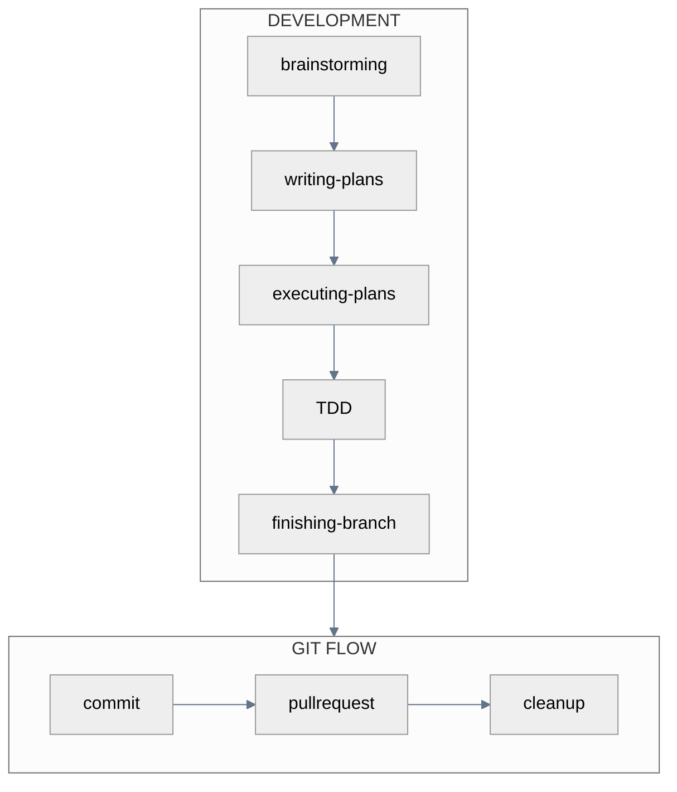
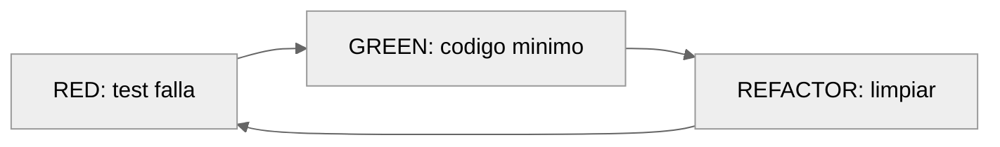

# AI-First Workflow

Excelencia por diseño. Workflows estructurados para desarrollo guiado por IA.

---

## Vista General



---

## Skills del Workflow

Skills que se activan automaticamente segun lo que describes.

### El Flujo

1. **Describe tu idea** → activa `brainstorming`
2. **Aprueba diseno** → activa `writing-plans`
3. **Plan listo** → activa `executing-plans`
4. **Implementa** → activa `TDD` (red-green-refactor)
5. **Completo** → activa `finishing-branch`

### brainstorming

**Trigger**: Describes una idea sin plan definido.

Claude hace una pregunta a la vez. Presenta 2-3 enfoques con trade-offs. Valida incrementalmente. El resultado es un diseno en `docs/plans/YYYY-MM-DD-<topic>-design.md`.

### writing-plans

**Trigger**: Dices "listo para implementar" o apruebas un diseno.

Claude genera tasks de 2-5 minutos con paths exactos, codigo completo y comandos con output esperado. El resultado va a `docs/plans/YYYY-MM-DD-<feature>.md`.

### executing-plans

Dos modos de ejecucion:

| Subagent-Driven | Parallel Session |
|-----------------|------------------|
| Misma sesion | Nueva sesion en worktree |
| Review entre tasks | Batches de 3 tasks |
| Fresh subagent por task | Checkpoint entre batches |

### TDD



::: danger Regla inquebrantable
Codigo sin test fallando primero → borrar y reiniciar.
:::

### finishing-branch

1. Verificar que tests pasen
2. Elegir: merge local, PR, mantener, o descartar
3. Ejecutar la opcion elegida
4. Limpiar worktree si aplica

---

## Git Flow

Ambos caminos convergen aquí. Tres pasos: commit, PR, cleanup.

### Commit

```bash
/git-commit "feat: add email validation"
```

Agrupa cambios automáticamente por tipo. Soporta formato corporativo `tipo|TASK-ID|YYYYMMDD|desc`.

### Pull Request

```bash
/git-pullrequest main
```

Ejecuta code review + security review en paralelo. Presenta findings. Tú decides: crear PR, auto-fix, o cancelar.

### Cleanup

```bash
/git-cleanup
```

Elimina branch local, sincroniza con remote. Ejecutar después de merge.

---

## Worktrees

::: tip ¿Cuándo usar worktrees?
**Tienes WIP que no quieres perder** → `/worktree-create`
**No tienes WIP** → Branch simple con `git checkout -b`
:::

### Crear worktree

```bash
/worktree-create "feature-name" main
```

Crea directorio sibling `../worktree-feature-name/` con branch nueva.

::: warning Paso crítico post-creación
El IDE abre automáticamente, pero debes:
1. Abrir terminal en la nueva ventana
2. Verificar directorio con `pwd`
3. Iniciar Claude Code con `claude`

Sin esto, Claude sigue trabajando en el directorio anterior.
:::

### Limpiar worktrees

```bash
/worktree-cleanup              # Lista disponibles
/worktree-cleanup feature-name # Elimina específico
```

---

## Project Rules

Reglas de proyecto que se comparten con el equipo via Git.

### Arquitectura

```
docs/claude-rules/        ← TRACKED (source of truth)
├── stack.md
├── patterns.md
├── architecture.md
└── testing.md
        ↓ session-start hook (auto-sync)
.claude/rules/            ← IGNORED (copia local)
```

Similar a `.env.example` → `.env`: las reglas canónicas viven en Git, cada dev tiene copia local sincronizada automáticamente.

### Setup inicial

```bash
/project-init
```

Analiza el proyecto y genera reglas en `docs/claude-rules/`. Commit y push para compartir con el equipo.

### Para nuevos miembros

Nada que hacer. El hook de session-start sincroniza automáticamente `docs/claude-rules/` a `.claude/rules/`.

### Actualizar reglas

Edita archivos en `docs/claude-rules/`, crea PR, merge. Todos obtienen cambios en su próxima sesión.

---

## Patrones por Tamano

### Size S (≤80 LOC)

```bash
"Implementa validacion de email en el formulario de registro"
# Claude activa TDD automaticamente
```

### Size M (≤250 LOC)

```bash
/worktree-create "oauth" main
# Describe la feature → brainstorming → plans → execute
/git-pullrequest main
```

### Hotfix urgente

```bash
/worktree-create "hotfix-race" main
/understand "area del bug"
# Fix directo segun complejidad
/git-commit "fix: race condition in checkout"
/git-pullrequest main
/worktree-cleanup hotfix-race
```

---

## Referencia Rapida

::: details Skills
| Skill | Se activa cuando... |
|-------|---------------------|
| brainstorming | Describes idea sin plan |
| writing-plans | Diseno aprobado |
| executing-plans | Plan existe |
| test-driven-development | Implementas codigo |
| verification-before-completion | Antes de entregar |
| finishing-a-development-branch | Tasks completos |
| using-git-worktrees | Necesitas aislamiento |
:::

::: details Comandos Git y Utilidades
| Comando | Qué hace |
|---------|----------|
| /git-commit | Commit semántico |
| /git-pullrequest | PR con review |
| /git-cleanup | Post-merge cleanup |
| /worktree-create | Workspace aislado |
| /worktree-cleanup | Elimina worktrees |
| /project-init | Genera rules de equipo |
| /understand | Analiza codebase |
| /changelog | Actualiza CHANGELOG |
:::

---

## Practicas Esenciales

| Practica | Por que |
|----------|---------|
| Worktree para paralelo | Tu WIP queda intacto |
| TDD sin excepciones | Prueba > esperanza |
| Review antes de PR | Security incluido gratis |
| Commits granulares | Auto-agrupacion inteligente |

---

**Relacionados**: [Comandos](./commands-guide.md) · [Skills](./skills-guide.md) · [Agentes](./agents-guide.md) · [Pro Tips](./claude-code-pro-tips.md)

::: info Última Actualización
**Fecha**: 2025-12-12 | **Versión**: 4.3.0
:::
