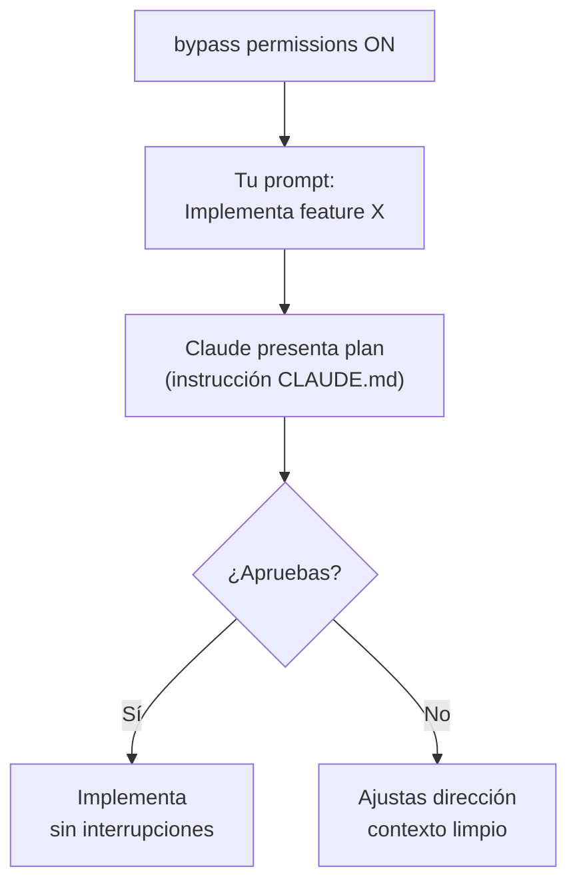

# Pro tips

> **Patrones y técnicas para multiplicar tu efectividad con Claude Code.**

Cada tip es un patrón que un usuario experimentado no descubriría solo leyendo la [documentación oficial](https://code.claude.com/docs/en/). Si algo está en la docs, enlazamos ahí — no lo repetimos.

**Prerequisito**: lee [Workflow AI-first](./ai-first-workflow.md) para entender el pipeline de desarrollo.

---

## 1. Contexto fresco — el recurso más valioso <Badge type="danger" text="core" />

Claude razona mejor con contexto limpio. Cada corrección, cada intento fallido, cada output largo contamina la ventana de 200K tokens. Estas tres técnicas explotan ese principio.

### Tip 1: Plan mode sin plan mode

El tip más poderoso de este documento. No necesitas activar plan mode con `Shift+Tab` — puedes **instruir a Claude vía CLAUDE.md** para que planifique primero, incluso con `bypassPermissions` activo.

::: tip PRO TIP
Agrega esta línea a tu `CLAUDE.md`:

```markdown
ALWAYS plan before building: crystallize decisions + scenarios
in plan file. No implementation without user approval.
```

Claude respeta la instrucción y planifica antes de ejecutar — sin importar el modo de permisos.
:::

**¿Por qué es más poderoso que `Shift+Tab`?**



1. **Contexto inicial 100% para planificar** — La ventana de 200K está fresca. Claude dedica toda su capacidad a explorar el codebase y diseñar el plan sin ruido de ejecuciones previas.
2. **Ejecución con contexto dedicado** — La implementación puede arrancar con agentes delegados vía Task tool, cada uno con su propia ventana limpia.
3. **Sin pasos manuales** — No necesitas ciclar `Shift+Tab` entre plan y bypass. El flujo es natural.

::: warning Consistencia
Las instrucciones en `CLAUDE.md` no son deterministas al 100%. Para máxima consistencia, combina la regla en `CLAUDE.md` con un refuerzo explícito en el prompt: `"Planifica primero, no implementes hasta que apruebe"`.
:::

---

### Tip 2: Summarize from here — compresión quirúrgica

A diferencia de `/compact` que comprime **toda** la conversación, "Summarize from here" preserva el contexto inicial intacto y solo comprime lo que elijas.

**Cómo usarlo:**

1. `ESC ESC` → abre menú de rewind
2. Selecciona el punto desde donde quieres comprimir
3. Elige **"Summarize from here"**
4. Opcionalmente, da instrucciones para guiar el foco del resumen

**Cuándo usar:**

| Escenario | Acción |
|---|---|
| Después de debugging largo | Summarize → implementar con contexto limpio |
| Exploración que generó mucho output | Summarize → conservar solo hallazgos |
| Antes de una fase nueva | Summarize fase anterior → contexto fresco |

::: tip PRO TIP
La diferencia clave con `/compact`: Summarize preserva tus instrucciones iniciales y el contexto del principio de la conversación. `/compact` lo resume todo, incluyendo lo que quizás querías mantener verbatim.
:::

---

### Tip 3: La regla de las 3 correcciones

Después de 3 intentos fallidos de corregir a Claude: **fresh start**, no más correcciones.

```
Intento 1: Incorrecto → Corregir
Intento 2: Incorrecto → Corregir con más contexto
Intento 3: Incorrecto → STOP
```

**En intento 3:**

1. `ESC ESC` si el error fue reciente
2. Inicia nueva conversación con este template:

```
Contexto:
- [información relevante]
- [restricciones conocidas]

Intentos previos fallaron porque:
- [razón específica]

Enfoque esperado:
- [dirección clara]
```

::: warning Anti-pattern: expresar frustración
"No, eso está mal" / "Te dije que no hicieras eso" — la frustración en mensajes solo añade tokens que contaminan el contexto. Un fresh start elimina el ruido acumulado.
:::

---

## 2. Velocidad — menos latencia, más iteraciones

### Tip 4: Effort level — máximo razonamiento por defecto

`/model` → flechas `←` `→` para ajustar entre **low**, **medium** y **high**.

Mantén **high** como tu default. Más razonamiento = mejores decisiones, menos correcciones, menos ciclos desperdiciados. Solo baja cuando la velocidad importa más que la profundidad:

| Effort | Cuándo bajar |
|---|---|
| Medium | Iteraciones rápidas sobre algo que ya está claro |
| Low | Tareas mecánicas: renombrar, formatear, fixes obvios |

::: tip PRO TIP
Bajar effort level no "ahorra" — reduce la calidad del razonamiento. La ganancia real es velocidad en tareas donde pensar profundo no aporta: pruebas exploratorias, cambios cosméticos, operaciones repetitivas.
:::

---

### Tip 5: `!` prefix — bash sin tokens

Ejecución directa de comandos shell sin que Claude los procese:

```bash
! git status     # ~0 tokens vs ~50+ tokens conversacional
! npm test       # Output directo, sin interpretación
! ls -la src/    # Rápido y eficiente
```

`Tab` autocompleta desde historial de comandos `!` del proyecto actual.

---

### Tip 6: Prompt suggestions — Tab para aceptar

Claude muestra sugerencias grayed-out basadas en tu historial git y conversación.

- `Tab` → acepta la sugerencia
- `Enter` → acepta y envía directamente

Desactivar: `CLAUDE_CODE_ENABLE_PROMPT_SUGGESTION=false`

---

## 3. Recuperación — cuando las cosas salen mal

### Tip 7: `ESC ESC` — tu red de seguridad completa

Claude Code **auto-checkpoints** antes de cada edición. No necesitas commits manuales ni `git reset --hard`. Si algo sale mal: `ESC ESC` y elige qué restaurar.

| Opción | Qué hace |
|---|---|
| **Restore code and conversation** | Reset completo a ese checkpoint |
| **Restore conversation** | Retrocede mensaje, mantiene código |
| **Restore code** | Revierte archivos, mantiene conversación |
| **Summarize from here** | Comprime conversación desde ese punto |
| **Never mind** | Cancelar |

**Patrón: explorar alternativas**

```
[implementación A] → ESC ESC → Restore code → [implementación B]
```

**Patrón: debugging → implementación limpia**

```
[debugging largo] → ESC ESC → Summarize from here → [implementar con contexto limpio]
```

::: warning ¿Cuándo sí necesitas git?
Los checkpoints solo trackean ediciones hechas por Claude. Si usaste comandos Bash que modifican archivos (`rm`, `mv`, `cp`), esos cambios **no se pueden revertir** con `ESC ESC`. En ese caso, un commit previo sí te protege.
:::

::: tip Checkpoints persisten entre sesiones
Puedes cerrar la terminal, volver a abrir Claude Code, y tus checkpoints siguen disponibles vía `ESC ESC` o `/rewind`.
:::

---

## 4. Modelos — el modelo correcto para cada fase

### Tip 8: `Option+P` — cambiar modelo sin perder prompt

`Option+P` / `Alt+P` abre el model picker directamente **sin borrar lo que estabas escribiendo**.

Vs `/model` que requiere limpiar el input, escribir el comando, y luego reescribir tu prompt.

::: details Otros shortcuts útiles de modelo
- `Option+T` / `Alt+T` → Toggle extended thinking on/off
- `/model` → Picker completo + slider de effort level
:::

---

### Tip 9: Haiku para experimentar, Opus para producir

```bash
/model haiku     # Prototipar, experimentar, iterar rápido
/model opus      # Producción real (máxima calidad)
```

**Regla simple:** Haiku prueba, Opus produce. Haiku es ideal para explorar APIs, probar formatos de prompt, o iterar rápido sobre ideas antes de comprometer tokens de calidad en Opus.

---

## 5. Paralelización — hacer más en menos tiempo

### Tip 10: Background → seguir trabajando

`Ctrl+B` envía la tarea en ejecución al background. Tu terminal queda libre.

```bash
npm run test     # Enter para ejecutar
                 # Ctrl+B para enviar a background
/tasks           # Ver estado de tareas en background
```

Ideal para: dev servers, test suites, builds largos.

::: details Nota para usuarios de tmux
`Ctrl+B` es el prefix de tmux. Presiona `Ctrl+B` **dos veces** para que Claude Code lo capture.
:::

---

### Tip 11: `&` prefix — tareas en la nube

Prefija con `&` para ejecutar en infraestructura cloud de Anthropic:

```bash
& Refactoriza todos los tests de integración siguiendo el nuevo patrón
& Implementa feature X completa con tests
```

- Tu terminal queda libre para otra cosa
- Monitoreable desde [claude.ai/code](https://claude.ai/code) o Claude iOS
- Notificación cuando termina

---

### Tip 12: `/ralph-orchestrator` — ejecución autónoma en paralelo

En lugar de coordinar Agent Teams manualmente, usa `/ralph-orchestrator`. Una sola invocación orquesta todo: discovery → planning → task generation → ejecución con teammates, cada uno con su propia ventana de 200K tokens limpia.

**Mejor para:**

- Features multi-paso que tocan varios archivos
- Desarrollo overnight (planifica interactivamente, ejecuta autónomo)
- Cualquier tarea donde teammates paralelos con contexto fresco mejoran calidad

```bash
/ralph-orchestrator    # Una invocación, todo el pipeline
```

::: details Documentación completa
[Ralph Orchestrator](./ralph-orchestrator.md) — guía completa con modos, configuración y flujo
:::

---

## Referencias

**Framework:**

- [AI-First Workflow](./ai-first-workflow.md) — Pipeline de desarrollo completo
- [Skills](./skills-guide.md) — Workflows especializados
- [Agents](./agents-guide.md) — Agentes por dominio

**Docs oficial:**

- [Claude Code](https://code.claude.com/docs/en/)
- [Interactive mode](https://code.claude.com/docs/en/interactive-mode)
- [Keybindings](https://code.claude.com/docs/en/keybindings)
- [Model configuration](https://code.claude.com/docs/en/model-config)
- [Agent Teams](https://code.claude.com/docs/en/agent-teams)

**Siguiente paso**: [Skills](./skills-guide.md)

---

::: info Última actualización
**Fecha**: 2026-02-17
:::
