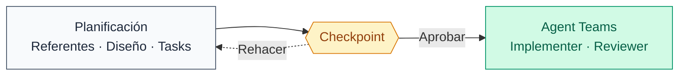
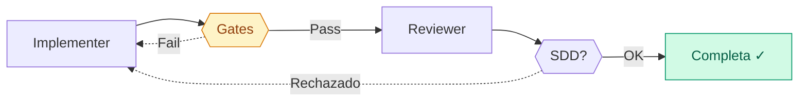

# Ralph Orchestrator

Desarrollo autónomo sin degradación.

Ralph orquesta agentes autónomos que planifican, implementan, y revisan tu feature task por task — con la misma precisión en la primera y en la última.

---

## El problema

::: danger El contexto se pudre
Estás en la task 4 de 7. Claude acaba de sugerirte la misma solución que falló en la task 2. No la recuerda — el context window se llenó hace rato con archivos, diffs, outputs y decisiones previas. Ya no cabe todo. Y cuando no cabe, la calidad cae. No es un bug. Es aritmética: el contexto es finito.
:::

::: warning Coordinar a mano no escala
Definir scenarios, correr tests, hacer reviews, manejar dependencias entre tasks: factible para 2-3 cambios. Para una feature de 7 tasks con interdependencias, pasas más tiempo coordinando que construyendo.
:::

Ralph resuelve ambos. Cada teammate arranca con contexto limpio para una sola task. La coordinación entre ellos es automática.

---

## Cómo funciona

### Dos fases



### Fase 1: Planificación

De idea vaga a tasks concretas. Ralph invoca SOP skills en secuencia — puedes guiarlo o dejarlo decidir solo.

| Step | Acción | Output |
|------|--------|--------|
| 0 | Elegir modo: Interactive o Autonomous | `PLANNING_MODE` |
| 1 | Detectar estado previo, validar prerrequisitos | Resume o new |
| 2 | Buscar referentes probados con `sop-reverse` | `referents/catalog.md` |
| 3 | Diseñar solución con `sop-planning` | `design/detailed-design.md` |
| 4 | Generar task files con `sop-task-generator` | `*.code-task.md` |
| 5 | Generar contexto para teammates | `.ralph/agents.md` |

::: details Modos de planificación
| Modo | Qué pasa |
|------|----------|
| **Interactive** (default) | Te pregunta sobre requisitos, espera respuestas, itera contigo |
| **Autonomous** | Decide solo, documenta el rationale, no bloquea |

Autonomous no significa sin supervisión: significa que la *planificación* no te necesita. La *ejecución* siempre requiere tu OK.
:::

### Fase 2: Ejecución

Tu sesión coordina. Teammates efímeros implementan.

**Lead (tu sesión)** lee summaries de 8 palabras y decide qué sigue. No toca código.

**Teammates** reciben contexto limpio, un solo `.code-task.md`, y `AGENTS.md`. Implementan. Pasan gates. Se destruyen al terminar.

#### Ciclo implementer → reviewer



Dos filtros por task. Los quality gates (test, lint, typecheck, build) corren automáticamente — si fallan, el implementer vuelve a intentar. Si pasan, un reviewer valida que los scenarios se definieron antes del código y que nadie reescribió tests para que pasen.

---

## Por qué funciona

**Contexto limpio por task.** La diferencia entre el teammate 1 y el teammate 7 es cero. Ambos arrancan con contexto vacío para una sola task. No hay degradación progresiva — la task 7 se resuelve con la misma calidad que la task 1.

**Gates que no perdonan.** Test, lint, typecheck, build corren via TaskCompleted hook — no via el teammate. No puede skipearlos, mentir sobre ellos, ni commitear sin que pasen.

**Review cruzado.** Si el implementer reescribió un test para que pase en vez de arreglar el código, el reviewer lo detecta y rechaza. No hay atajos.

**Memoria compartida.** `guardrails.md` guarda lecciones de cada task. El teammate que implementa la task 5 ya sabe qué falló en las tasks 1-4. Los errores no se repiten porque quedan documentados.

**Scenarios primero.** Definir qué debe pasar antes de escribir cómo. El reviewer valida que se respetó ese orden. Código sin scenario definido = código rechazado.

---

## Paso a paso

### Prerrequisitos

| Requisito | Verificación |
|-----------|-------------|
| Git repo | `git status` |
| Tests/lint/build configurando | Tus comandos habituales funcionan |
| Bash 4+ | `bash --version` |
| `CLAUDE_CODE_EXPERIMENTAL_AGENT_TEAMS=1` | Variable de entorno seteada |
| AI Framework instalado | Plugin visible en Claude Code |

### Invocación

```bash
/ralph-orchestrator goal="Implementar autenticación OAuth2"
```

O describe qué quieres construir. Ralph pregunta lo que necesite.

### El flujo

**Step 0** — Elegir planning mode. Interactive si vas a estar presente. Autonomous si prefieres que Ralph decida solo y revisas al final.

**Step 1** — Detectar estado. Si hay artifacts de una ejecución anterior en `.ralph/specs/`, ofrece continuar donde quedó.

**Step 2** — Referentes. `sop-reverse` busca implementaciones probadas del concepto, extrae patrones y constraints. No inventa — se basa en lo que ya funciona.

**Step 3** — Diseño. `sop-planning` genera la solución usando los referentes como input. Requirements, architecture, plan de implementación.

**Step 4** — Tasks. `sop-task-generator` convierte el plan en `.code-task.md` files con acceptance criteria concretos (Given-When-Then).

**Step 5** — Contexto. Genera `AGENTS.md` con todo lo que cada teammate necesita: stack, diseño, constraints, patrones.

**Step 6** — Checkpoint.

::: warning Aprobación obligatoria
Da igual qué planning mode elegiste. Ralph presenta el plan completo y espera tu OK. Nada se ejecuta sin aprobación. Puedes aprobar, revisar artifacts, o rehacer la planificación desde cero.
:::

**Step 7** — Configuración. Ralph deriva quality gates del stack y pregunta cuántos teammates en paralelo.

**Step 8** — Ejecución. Agent Teams arranca. Ciclo implementer→reviewer hasta completar todas las tasks.

---

## Safety nets

| Mecanismo | Protección |
|-----------|-----------|
| **Circuit breaker** | 3 fallos consecutivos → teammate se detiene |
| **Quality gates** | Test, lint, typecheck, build via hook — imposibles de saltar |
| **Coverage** | Cobertura mínima configurable (default 90%) |
| **Checkpoint** | Aprobación humana antes de ejecutar |
| **Ctrl+C** | Abort manual en cualquier momento (exit 130) |
| **Reviewer** | SDD compliance + detección de reward hacking |

---

## Configuración

### Gates por stack

Ralph auto-deriva los gates del Technology Stack de tu proyecto. Gate vacío = se salta.

| Stack | Test | Typecheck | Lint | Build |
|-------|------|-----------|------|-------|
| Node.js | `npm test` | `npm run typecheck` | `npm run lint` | `npm run build` |
| Python | `pytest` | `mypy src/` | `ruff check .` | — |
| Go | `go test ./...` | — | `golangci-lint run` | `go build ./...` |
| Rust | `cargo test` | — | `cargo clippy` | `cargo build` |

### Paralelismo

Máximo 3 teammates concurrentes (hard cap). Ralph calcula el óptimo según dependencias entre tasks. Más de 3 degrada coordinación.

### Modelo

Default: `opus`. Configurable en `.ralph/config.sh`.

::: details config.sh completo
```bash
# Agent Teams
MODEL="opus"
MAX_TEAMMATES=2

# Quality Gates (auto-derived from stack)
GATE_TEST="npm test"
GATE_TYPECHECK="npm run typecheck"
GATE_LINT="npm run lint"
GATE_BUILD="npm run build"

# Safety
MAX_CONSECUTIVE_FAILURES=3

# Coverage
MIN_TEST_COVERAGE=90
GATE_COVERAGE=""  # e.g. "npx vitest run --coverage"

# Memories
MEMORIES_ENABLED=true
```
:::

---

## Estado y reanudación

Ralph detecta artifacts en `.ralph/specs/` y ofrece continuar donde quedó.

| Artifact | Fase detectada |
|----------|---------------|
| Nada | NEW — empieza desde Step 2 |
| `referents/catalog.md` | Referentes completos — Step 3 |
| `design/detailed-design.md` | Diseño completo — Step 4 |
| `plan.md` sin task files | Task generation — Step 4 |
| `.code-task.md` con `PENDING` | Ejecución — Step 8 |
| `.code-task.md` con `IN_REVIEW` | Ejecución — Step 8 |
| Todos `COMPLETED` | COMPLETE |

Disk es estado, git es memoria. Si un teammate crashea, su task file persiste para el siguiente.

::: details Exit codes
| Código | Significado |
|--------|-------------|
| 0 | Completo |
| 1 | Prerrequisitos faltantes |
| 2 | Circuit breaker (3 fallos) |
| 3 | Max iterations |
| 130 | Ctrl+C |
:::

---

## Costos

Para una feature de ~7 tasks (complejidad media):

| Fase | Costo |
|------|-------|
| Planificación (Steps 0-5) | ~$0.50 – $1.50 |
| Por task (implementer + reviewer) | ~$0.30 – $0.80 |
| **Total típico** | **~$2.95** |

Tasks que fallan review cuestan un ciclo adicional.

---

## Troubleshooting

::: details Agent Teams no inicia
**Verificar:**
1. `CLAUDE_CODE_EXPERIMENTAL_AGENT_TEAMS=1` en el environment
2. `.ralph/config.sh` existe con syntax válida
3. `.ralph/agents.md` fue generado (Step 5)

Re-ejecutar `/ralph-orchestrator` detecta la fase y ofrece resume.
:::

::: details Quality gates fallan en loop
**Verificar:**
1. Los comandos `GATE_*` funcionan si los corres manualmente
2. El stack del design document coincide con los gates configurados
3. No hay tests flaky

Ajustar en `.ralph/config.sh` y re-ejecutar.
:::

::: details Circuit breaker se activa
**Causas comunes:**
1. Gate commands incorrectos para el stack
2. Task demasiado vaga — el teammate no converge
3. Dependencia faltante (task bloqueada debería ir primero)

Revisar `.ralph/failures.json` para detalle.
:::

---

[Skills](./skills-guide.md) · [Agentes](./agents-guide.md) · [Workflow AI-first](./ai-first-workflow.md)

---

::: info Última actualización
**Fecha**: 2026-02-15
:::
