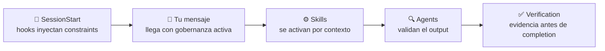

# Por qué AI Framework

Claude Code es capaz. El problema es que sus capacidades se degradan de formas predecibles cuando trabajas sin estructura, y la mayoría de esas degradaciones son invisibles hasta que ya es tarde.

> **Este documento explica el problema, la solución, y la evidencia.** Si ya estás convencido, ve directo al [Inicio rápido](./quickstart.md).

---

## Qué sale mal sin estructura {#problems}

Esto no es teórico. Son patrones que se repiten en sesiones reales:

::: danger El modelo deja de usar las herramientas que tiene
Vercel midió esto en 2026: en el **56% de los casos**, Claude no invocó skills disponibles aunque tenía acceso a ellos. El modelo tenía la documentación correcta a un tool call de distancia, pero decidió que no la necesitaba. El resultado fue código basado en APIs deprecadas que compilaba pero fallaba en runtime.

No es un bug. Es una limitación medida de cómo los modelos deciden cuándo usar herramientas.
:::

::: warning El contexto se degrada en sesiones largas
Cada token en el context window compite por atención con todos los demás (escalamiento n² en la arquitectura de atención). En la práctica: las instrucciones que diste en el turno 3 se pierden para el turno 40. El modelo empieza a repetir búsquedas, olvida decisiones arquitectónicas, y la calidad cae sin que nadie lo note.
:::

::: warning "Funciona" no significa que funcione
Le pides que implemente algo, te dice "listo", y el código se ve razonable. Pero no lo ejecutó. No verificó edge cases. No revisó que los scenarios previos sigan pasando. *"It should work"* es la frase más cara en ingeniería de software, y los modelos la usan todo el tiempo si no les exiges evidencia.
:::

---

## Qué hace el framework {#solution}

AI Framework es un plugin de Claude Code que inyecta gobernanza en cada sesión. No son sugerencias que el modelo puede ignorar — son constraints embebidos a nivel de system prompt que el modelo recibe antes de leer tu primer mensaje.



### Gobernanza constitucional <Badge type="danger" text="core" />

Al iniciar cada sesión, un hook de SessionStart lee un conjunto de constraints y los inyecta como contexto de sistema. El modelo recibe reglas como *"nunca hagas push sin autorización"* o *"nunca empieces trabajo multi-step sin un task plan"* como parte de su contexto base, no como una instrucción que puede decidir ignorar.

Esto se complementa con un mecanismo de enforcement que invierte la carga de prueba para usar skills: en vez de *"¿debería invocar este skill?"*, el modelo opera con *"solo salta el skill si estás seguro de que no aplica."* Esto reduce el 56% de no-invocación que Vercel midió.

### Scenario-Driven Development <Badge type="tip" text="metodología central" />

El framework exige que definas qué debería pasar antes de escribir código. No tests — scenarios. La diferencia importa:

| | Test (TDD) | Scenario (SDD) |
|---|---|---|
| **Ejemplo** | `assert split(100, 20, 4) == 30.0` | *"4 amigos dividen $100 con 20% de propina, cada uno paga $30"* |
| **Vive** | Dentro del código | Fuera del código (spec externa) |
| **Vulnerable a** | Reward hacking (reescribir assertions) | Nada (holdout externo) |
| **Evalúa** | "¿Pasa?" (boolean) | "¿Satisface al usuario?" |

El code-reviewer agent verifica que los scenarios se definieron antes de la implementación y detecta reward hacking — cuando el modelo reescribe validaciones para que coincidan con su output.

::: details ¿Qué es reward hacking?
Cuando un modelo modifica los criterios de éxito para que coincidan con su output en vez de corregir su output para que cumpla los criterios. En TDD: reescribir el test para que pase. En SDD esto no es posible porque el scenario vive fuera del código.
:::

### Sub-agents con contexto limpio

Cuando una tarea es compleja, el framework la delega a sub-agents que arrancan con un context window limpio de 200k tokens. El agente principal recibe un resumen de 1-2k tokens. Esto previene la degradación de contexto que ocurre cuando una sola sesión acumula 50k+ tokens de historial.

### Agents especializados <Badge type="info" text="6 agents" />

Seis agents se activan automáticamente según el contexto:

| Agent | Qué hace | Cuándo se activa |
|-------|----------|------------------|
| `code-reviewer` | Verifica SDD compliance, detecta reward hacking | Después de cada implementación |
| `systematic-debugger` | Diagnóstico en 4 fases antes de cualquier fix | Bug o comportamiento inesperado |
| `security-reviewer` | Busca vulnerabilidades explotables en el diff | Cambios en auth, data, APIs |
| `edge-case-detector` | Boundary violations, race conditions, resource leaks | Código crítico (money, state) |
| `performance-engineer` | Bottlenecks, algorithmic complexity, I/O | Problemas de rendimiento |
| `code-simplifier` | Reduce complejidad preservando funcionalidad | Después de escribir código |

### Skills como workflows <Badge type="info" text="24 skills" />

24 skills cubren el ciclo completo: desde brainstorming y discovery hasta implementación con SDD, commits inteligentes, y pull requests. Cada skill es un workflow estructurado que se carga cuando el contexto lo requiere — no un template estático.

::: tip Ralph Orchestrator
Ralph puede ejecutar proyectos multi-step de forma autónoma: planifica, genera tareas, ejecuta con verificación doble, y tiene circuit breakers que detienen la ejecución si detecta loops o thrashing.
:::

---

## Qué cambia en la práctica {#impact}

::: code-group
```txt [Sin framework]
Tú le dices qué hacer
  → Claude lo hace
    → Tú revisas
      → Repites

Micro-gestión constante.
Si te descuidas, el modelo toma atajos
que no notas hasta producción.
```

```txt [Con framework]
Tú defines qué quieres lograr
  → Scenarios se definen antes del código
    → Reviews pasan automáticamente
      → Evidencia se exige antes de completion

El framework se asegura de que
el proceso sea riguroso.
```
:::

No es que Claude no pueda hacer buen trabajo sin esto. Es que la probabilidad de que lo haga consistentemente, sesión tras sesión, proyecto tras proyecto, sin estructura que lo gobierne, es baja. El framework sube esa probabilidad.

---

## Fundamentos técnicos {#foundations}

El framework se apoya en investigación verificable:

::: details Context engineering (Anthropic, 2025)
Optimización de context windows. Contexto pasivo supera a retrieval activo. Un index comprimido de **8KB** rinde igual que **40KB** de documentación completa.
:::

::: details Scenario-Driven Development (StrongDM Software Factory)
Scenarios como holdouts externos que el modelo no puede manipular, a diferencia de tests que viven dentro del código.
:::

::: details Passive context superiority (Vercel, 2026)
AGENTS.md estáticos alcanzan **100% pass rate** donde skills invocables logran **53%**. La lección: embeber contexto funciona mejor que depender de que el modelo decida buscarlo.
:::

---

## Siguiente paso

[Inicio rápido →](./quickstart.md)

---

::: info Última actualización
**Fecha**: 2026-02-10
:::
