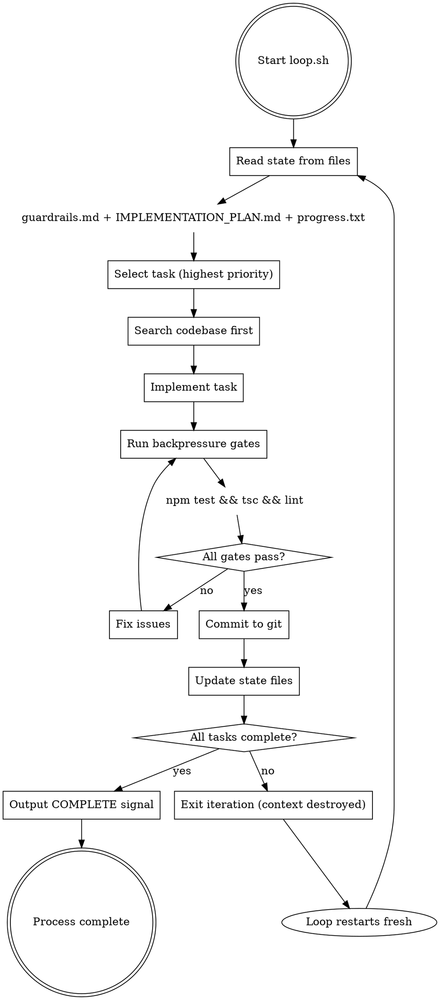
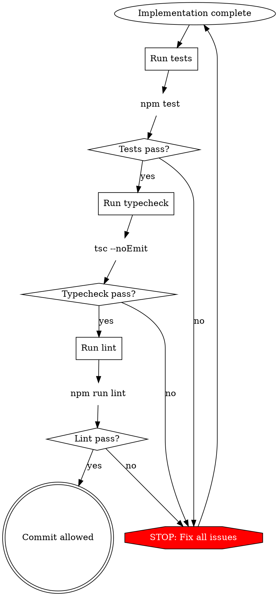

# Ralph Loop

## Overview

Autonomous infinite loop where each iteration operates with fresh context while state persists in files and git. Prevents context pollution through deliberate context rotation.

**Core principle:** Estado vive en archivos y git, no en memoria del LLM. Cada iteración = contexto limpio.

## When to Use

**Use this skill when:**
- Task requires multiple hours of autonomous work (AFK coding)
- Previous attempts suffered from context rot (degrading quality over time)
- Same errors repeat across sessions (need Signs system)
- Working on PRD with 10+ independent items
- Need to ship code overnight without supervision

**Don't use when:**
- Single task fits in one session (<80% context)
- High human involvement required (use HITL instead)
- Subjective design decisions needed
- Debugging production issues (requires human judgment)

---

## Quick Reference

### Two Modes

| Mode | Prompt | Purpose | Implementation |
|------|--------|---------|----------------|
| PLANNING | PROMPT_plan.md | Gap analysis specs→code, generate plan | ❌ NO code |
| BUILDING | PROMPT_build.md | Select task, implement, validate, commit | ✅ Code |

### State Files

| File | Purpose | Writer | Reader |
|------|---------|--------|--------|
| `IMPLEMENTATION_PLAN.md` | Prioritized tasks | Planning mode | Building mode |
| `progress.txt` | Session learnings (append-only) | Building mode | Building mode |
| `guardrails.md` | Signs (error lessons) | Building mode | Building mode |
| `AGENTS.md` | Project operational guide (~60 lines) | Human | Both modes |
| `specs/*.md` | Requirements per topic | Human | Planning mode |
| Git history | Completed work | Building mode | Both modes |

### Token Thresholds

| Zone | Usage | Action |
|------|-------|--------|
| 🟢 Green | <60% | Operate freely |
| 🟡 Yellow | 60-80% | Wrap up current task |
| 🔴 Red | >80% | Force rotation to fresh context |

---

## The Loop Mechanism



---

## The Signs System (Learning Mechanism)

When errors occur, document as a Sign in `guardrails.md`:

```markdown
### Sign: Dependencia circular entre módulos
- **Trigger**: Cuando module A importa B que importa A
- **Instruction**: Crear interface abstracta en módulo compartido primero
- **Added after**: Iteración 7
```

**Every iteration reads guardrails.md FIRST** → Compounding intelligence without context cost.

---

## Backpressure Gates

**Iron Law**: NO commit until ALL gates pass.



---

## Task Sizing

**Rule**: One task = one context window.

### Right-Sized Examples

| ✅ Correct | ❌ Too Large |
|------------|--------------|
| Add database column + migration | Build entire auth system |
| Add UI component to existing page | Implement complete dashboard |
| Update server action with validation | Refactor entire API layer |
| Add filter to existing query | Create reporting module |
| Fix bug in login flow | Rewrite authentication |

**Test**: If task requires:
- Reading >2000 lines to understand
- Touching >5 files
- Multiple architectural decisions

→ Split into smaller tasks.

---

## Setup & Usage

See `scripts/loop.sh` for the orchestrator and `examples/workflow.md` for a complete workflow example.

---

## Common Mistakes

| Mistake | Why Bad | Fix |
|---------|---------|-----|
| Skipping guardrails.md read | Repeats known errors | ALWAYS read FIRST every iteration |
| Commit with red tests | Backpressure violation | NO commit until ALL gates pass |
| Implementing in plan mode | Mode violation | Planning only analyzes, never implements |
| Keeping progress.txt forever | Bloats over sprints | Delete after sprint completes |
| Assuming gaps without search | Duplicates existing code | ALWAYS search before implementing |
| Tasks too large | Context overflow | Max 2000 lines to understand, 5 files max |
| Same error 3x without Sign | No learning | Add Sign on 2nd occurrence |

---

## Red Flags - STOP and Fix

These thoughts mean STOP:

| Thought | Reality |
|---------|---------|
| "I have context from earlier" | Context pollution. Rotate. |
| "Just one more try" | Gutter detected. Add Sign. |
| "Test is flaky, commit anyway" | Backpressure violation. Fix test. |
| "Too simple to search first" | Assumption. Always search. |
| "Guardrails don't apply here" | They apply. Read them. |
| "Plan is wrong, I know better" | Regenerate plan, don't improvise. |

**All of these mean: Follow the process. No exceptions.**

---

## Integration with Other Skills

### Required Background

**MUST understand before using:**
- **superpowers:test-driven-development** - Used within each iteration
- **superpowers:verification-before-completion** - Before each commit

### Required Sub-Skills

**Called automatically by this skill:**
- **superpowers:finishing-a-development-branch** - After all tasks complete

### Optional Sub-Skills

**Use when needed:**
- **superpowers:systematic-debugging** - Error persists 3+ iterations
- **superpowers:requesting-code-review** - After large batches

---

## Supporting Files

This skill includes:

**scripts/**
- `loop.sh` - Bash orchestrator (executable)
- `PROMPT_plan.md` - Planning mode instructions
- `PROMPT_build.md` - Building mode instructions

**templates/**
- `AGENTS.md.template` - Project operational guide template
- `guardrails.md.template` - Signs system template

**examples/**
- `workflow.md` - Complete 16-iteration workflow example

---

## Real-World Impact

- Geoff Huntley: $50k contract for $297 API cost
- Y Combinator hackathon: 6 repositories generated
- Matt Pocock: "Ralph + Opus 4.5 is really, really good"
- Ships code overnight while you sleep

**The breakthrough**: Not faster coding. Unattended coding.
