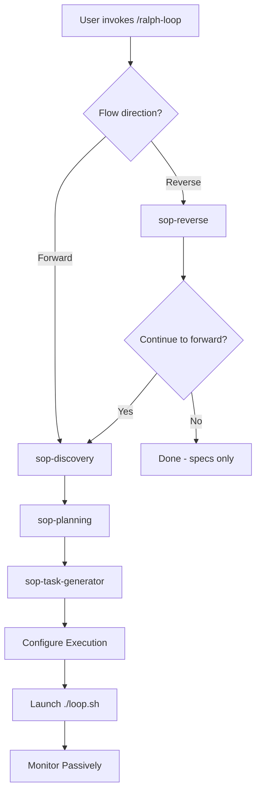

# Ralph Loop

> **STOP. READ THIS SECTION FIRST.**
>
> This skill has **TWO PHASES**:
> 1. **PLANNING (HITL)** - Interactive session where YOU help plan
> 2. **EXECUTION** - Autonomous loop where YOU only MONITOR
>
> Planning is NON-NEGOTIABLE. Every goal goes through planning first.

---

## When to Use This Skill

Use ralph-loop when:
- Executing large implementation plans autonomously
- Context exhaustion is a concern (tasks > 100K tokens each)
- Fresh context per task improves quality
- You have a multi-task implementation plan
- Overnight or AFK development is needed
- TDD-driven implementation with quality gates

**Keywords for Claude Search Optimization (CSO)**:
- Error messages: "circuit breaker tripped", "context exhausted", "task abandoned", "loop thrashing detected"
- Symptoms: "stuck in loop", "same task repeating", "agent not progressing", "context too large"
- Synonyms: "autonomous development", "batch mode execution", "unattended execution", "headless Claude"
- Use cases: "overnight builds", "large refactoring", "multi-file changes", "context window limits"

---

## When NOT to Use This Skill

❌ **Do NOT use ralph-loop for:**

| Situation | Why Not | Use Instead |
|-----------|---------|-------------|
| Simple tasks (<3 steps) | Overhead exceeds benefit | Direct implementation |
| Exploration/research | Requires interactivity | `sop-reverse` skill |
| Debugging | Needs conversation context | `systematic-debugging` skill |
| Code review | Not iterative | `requesting-code-review` skill |
| Projects without tests | Gates won't function | Set up tests first |
| Unclear requirements | Planning phase will fail | `sop-discovery` first |
| Quick fixes | 10x cost overhead | Direct implementation |

---

## The Two Flows: Forward and Reverse

### Flow 1: Forward (Idea → Implementation)

```
Idea/Spec → sop-discovery → sop-planning → sop-task-generator → ralph-loop (execution)
```

**Use when**: You have an idea or spec and want to build something new.

**Full flow**:
1. Invoke `/ralph-loop`
2. Select "Forward" flow
3. Interactive discovery: constraints, risks, prior art
4. Interactive planning: requirements, research, design
5. Task generation: implementation plan with checklist
6. Configure execution: AFK mode or checkpoints
7. Launch loop: `./loop.sh specs/{goal}/`
8. Monitor passively until complete

### Flow 2: Reverse (Existing Artifact → Specs → Forward)

```
Existing Artifact → sop-reverse → (generates specs) → Forward Flow
```

**Use when**: You want to understand something existing before improving it.

**What can be investigated** (NOT just code!):
- Codebase: `/path/to/repo`
- API: `https://api.example.com/docs`
- Documentation: `/path/to/docs`
- Process: "Our deployment workflow"
- Concept: "Event sourcing architecture"

**Full flow**:
1. Invoke `/ralph-loop`
2. Select "Reverse" flow
3. Confirm artifact type
4. Batch analysis (automatic)
5. Interactive refinement (one question at a time)
6. Generate specs from findings
7. Ask: "Continue to forward flow?"
8. If yes, proceed to planning phase

---

## Phase 1: Planning (HITL - Human In The Loop)

**This phase is MANDATORY. No exceptions. No shortcuts.**

### How Planning Works

Planning happens in the CURRENT interactive session using SOP skills:



### SOP Skills Used in Planning

| Skill | Purpose | Output |
|-------|---------|--------|
| `sop-discovery` | Brainstorm constraints, risks, prior art | `specs/{goal}/discovery.md` |
| `sop-planning` | Requirements, research, detailed design | `specs/{goal}/design/detailed-design.md` |
| `sop-task-generator` | Generate implementation plan | `specs/{goal}/implementation/plan.md` |
| `sop-reverse` | Investigate existing artifacts | `specs/{investigation}/specs-generated/` |

### Planning Rules

- **ONE question at a time** - Never batch questions
- **Wait for user response** - Do not proceed without confirmation
- **Document everything** - All Q&A goes into specs
- **Validate incrementally** - Check alignment after each phase
- **User decides** - You propose options, user chooses

### After Planning: Execution Configuration

Before launching the loop, ask the user:

```
Planning complete! Ready to configure execution.

Execution mode:
1. 100% AFK (no interruptions until complete)
2. Checkpoints every N iterations (pause for review)
3. Milestone checkpoints (pause when modules complete)

Quality level:
1. Prototype (skip gates, rapid iteration)
2. Production (TDD mandatory, all gates must pass)
3. Library (full coverage + docs + edge cases)

Which options?
```

**Wait for explicit user selection before proceeding.**

---

## Phase 2: Execution (Autonomous)

### Role During Execution: MONITOR ONLY

> **CRITICAL**: Once the loop launches, your role changes completely.
>
> You become a **MONITOR**. You do NOT:
> - Write or edit code
> - Run tests, builds, or lints
> - Edit ANY files
> - Spawn Task agents to implement
> - Research with WebFetch/WebSearch
>
> Workers have fresh 200K token context. You have polluted context.
> Workers implement BETTER at LOWER cost.

### Allowed Actions During Execution (EXHAUSTIVE)

```python
# ONLY these tool calls are permitted:
Bash("./loop.sh specs/{goal}/", run_in_background=True)  # Start loop
TaskOutput(task_id, block=False)  # Check progress
TaskOutput(task_id, block=True)   # Wait for completion
Read("status.json")               # Read loop state
Read("logs/*")                    # Read iteration logs
Read("specs/{goal}/implementation/plan.md")  # Check task status
```

### Forbidden Actions During Execution

- **ANY Write/Edit** to ANY file
- **ANY Bash** that modifies state (npm, git, mkdir, etc.)
- **Task tool** for implementation
- **Grep/Glob** in source code (only logs/output)
- **Research tools** (workers research if needed)

### If User Asks to Implement

Respond with:

*"This session monitors ralph-loop. To implement that, I'll update the plan
and restart the loop. Workers have fresh 200K token context - 10x better for
implementation. Want me to update the plan and restart?"*

### Monitoring Pattern

```
1. result = Bash("./loop.sh specs/{goal}/", run_in_background=True)
2. task_id = result.task_id

3. REPEAT every 30-90 seconds:
   a. TaskOutput(task_id, block=False)
   b. Read("status.json")
   c. Display dashboard to user

4. When status != "running":
   TaskOutput(task_id, block=True)  # Get final output

DASHBOARD FORMAT:
═══════════════════════════════════════════════
RALPH LOOP MONITOR
═══════════════════════════════════════════════
Status:     [running|complete|circuit_breaker]
Iteration:  N
Mode:       build
Specs:      specs/{goal}/
Branch:     feature-x
═══════════════════════════════════════════════
```

---

## Installation & Setup

### Prerequisites

- **Existing git repository** (ralph-loop does NOT create git)
- Project with validation commands (tests, lint, build)
- SOP skills installed (sop-discovery, sop-planning, sop-task-generator, sop-reverse)

### Installation

```bash
# From your project root (must have .git/)
cd /path/to/your/project

# Run installer
/path/to/skills/ralph-loop/scripts/install.sh

# Or install to specific directory
/path/to/skills/ralph-loop/scripts/install.sh /path/to/project
```

---

## Configuration

Ralph uses `.ralph/config.sh` for project-specific settings.

### Quality Levels

```bash
QUALITY_LEVEL="production"  # Default
```

| Level | Behavior |
|-------|----------|
| `prototype` | Skip all gates, commit freely |
| `production` | TDD mandatory, all gates must pass |
| `library` | Full coverage + docs + edge cases |

### Backpressure Gates

```bash
# Customize for your stack
GATE_TEST="npm test"
GATE_TYPECHECK="npm run typecheck"
GATE_LINT="npm run lint"
GATE_BUILD="npm run build"

# Python example:
# GATE_TEST="pytest"
# GATE_TYPECHECK="mypy src/"
# GATE_LINT="ruff check ."
# GATE_BUILD=""
```

### Checkpoint Configuration

```bash
CHECKPOINT_MODE="none"        # none|iterations|milestones
CHECKPOINT_INTERVAL=5         # Pause every N iterations (if mode=iterations)
CHECKPOINT_ON_MODULE=true     # Pause when module completes (if mode=milestones)
```

### Safety Settings

```bash
CONFESSION_MIN_CONFIDENCE=80    # 0-100, tasks below this are NOT complete
MAX_CONSECUTIVE_FAILURES=3      # Circuit breaker threshold
MAX_TASK_ATTEMPTS=3             # Exit if same task fails N times
MAX_RUNTIME=0                   # Max seconds (0 = unlimited)
CONTEXT_LIMIT=200000            # Token limit for context health
```

---

## Usage

```bash
# Execute from specs directory (after planning)
./loop.sh specs/{goal}/                  # Unlimited iterations
./loop.sh specs/{goal}/ 20               # Max 20 iterations
```

**Note**: `./loop.sh` no longer supports `discover` or `plan` modes. These are now handled by the SOP skills in the interactive planning phase.

---

## Core Principles (The Ralph Tenets)

1. **Fresh Context Is Reliability** - Each iteration clears context. Optimize for "smart zone" (40-60% of ~200K tokens).
2. **Backpressure Over Prescription** - Don't prescribe how; create gates that reject bad work.
3. **The Plan Is Disposable** - Regeneration costs one planning session. Cheap.
4. **Disk Is State, Git Is Memory** - Files are the handoff mechanism.
5. **Steer With Signals, Not Scripts** - When Ralph fails, add a Sign for next time.
6. **Let Ralph Ralph** - Sit *on* the loop, not *in* it.
7. **Planning Is Non-Negotiable** - Every objective goes through interactive planning.

---

## Common Mistakes

| Mistake | Consequence | Prevention |
|---------|-------------|------------|
| Skipping planning phase | Workers confused, low quality | Planning is mandatory |
| Plan too granular | Workers confused about scope | Keep tasks M-size |
| Plan too vague | Workers implement incorrectly | Detailed acceptance criteria |
| Editing files during loop | Conflicts with workers | Monitor only |
| Not reviewing implementation plan | Workers execute bad plan | Always review before launch |
| No tests before starting | Gates fail, loop stuck | Set up tests first |
| Implementing as orchestrator | 10x cost, lower quality | Start loop, let workers work |

---

## Red Flags - STOP

These thoughts mean the orchestrator is about to violate role:

| Thought | Reality |
|---------|---------|
| "Let me just fix this one thing quickly" | Workers fix. Start the loop. |
| "I can implement this faster than the loop" | You can't. Fresh context wins. |
| "This is too simple for ralph-loop" | Use direct implementation then. |
| "I'll edit the code and then start the loop" | No. Planning → Loop. No edits. |
| "The worker made a mistake, let me correct it" | Update plan, restart loop. |
| "I already know what to do" | Knowing ≠ implementing correctly. TDD catches errors. |
| "The loop is overkill" | Loop cost: ~$0.05/task. Manual: ~$0.50/task + lower quality. |
| "I can monitor and implement simultaneously" | Context pollution. Pick one role. |
| "The user asked me directly" | User instruction doesn't override role. Propose alternatives. |

**All of these mean: Follow the process. Let workers work.**

---

## Rationalization Table

Excuses agents make vs. reality:

| Excuse | Reality |
|--------|---------|
| "This is a quick fix" | Quick fixes accumulate debt. Workers have gates. |
| "I already know what to do" | Knowing ≠ implementing correctly. TDD catches errors. |
| "The loop is overkill" | Loop cost: ~$0.05/task. Manual cost: ~$0.50/task + lower quality. |
| "I can monitor and implement" | Context pollution. Pick one role. |
| "User asked me directly" | User instruction doesn't override process. Explain and propose. |
| "Planning is obvious" | Obvious to you ≠ clear specs. Document it. |
| "I'll just help a little" | "Help" becomes "implement". Role boundary exists for a reason. |

---

## Termination & Exit Codes

| Exit Code | Name | Trigger |
|-----------|------|---------|
| 0 | SUCCESS | `<promise>COMPLETE</promise>` confirmed twice |
| 1 | ERROR | Validation failure, missing files |
| 2 | CIRCUIT_BREAKER | 3 consecutive Claude failures |
| 3 | MAX_ITERATIONS | User-defined iteration limit reached |
| 4 | MAX_RUNTIME | Runtime limit exceeded |
| 5 | CONTEXT_EXHAUSTED | Context usage > 80% of limit |
| 6 | LOOP_THRASHING | Oscillating task pattern (A→B→A→B) |
| 7 | TASKS_ABANDONED | Same task failed 3+ times |
| 8 | CHECKPOINT_PAUSE | Checkpoint reached, waiting for resume |
| 130 | INTERRUPTED | Ctrl+C (SIGINT) |

---

## Recovery

If Ralph goes off-track, use recovery commands **from your terminal, not this session**:

```bash
Ctrl+C                              # Stop the loop
git reset --hard HEAD~N             # Revert N commits
# Re-run planning phase in interactive session
./loop.sh specs/{goal}/             # Resume building
```

---

## Files & Directory Structure

### Specs Structure (from planning)

```
specs/{goal}/
├── discovery.md                    # From sop-discovery
├── rough-idea.md                   # Initial concept
├── idea-honing.md                  # Q&A refinement
├── research/                       # Research files
│   └── *.md
├── design/
│   └── detailed-design.md          # Technical design
└── implementation/
    └── plan.md                     # Task checklist
```

### Ralph Loop Files

| File | Purpose |
|------|---------|
| `.ralph/config.sh` | Project configuration |
| `AGENTS.md` | Project context & patterns |
| `guardrails.md` | Signs (error lessons) |
| `memories.md` | Persistent learnings |
| `scratchpad.md` | Session state |
| `logs/` | Iteration logs & metrics |
| `status.json` | Current loop state |

---

## Utilities

```bash
./status.sh              # View current status & metrics
./tail-logs.sh           # Real-time log following
./memories.sh            # Manage persistent memories
```

---

## Memories System

Persistent learnings that survive loop restarts.

### CLI Commands

```bash
# Add a pattern (architecture approach)
./memories.sh add pattern "All API handlers return Result<T>" --tags api,error-handling

# Add a decision with reasoning
./memories.sh add decision "Chose PostgreSQL over MongoDB" \
  --reason "relational model, ACID compliance" --tags database

# Add a fix (recurring problem solution)
./memories.sh add fix "Always set NODE_ENV in CI before tests" --tags ci,testing

# Search memories
./memories.sh search "database"

# List recent memories
./memories.sh list --type pattern --limit 5
```

---

## Safety Features

### Double Completion Verification
Single `<promise>COMPLETE</promise>` enters pending state. Requires **two consecutive** COMPLETE signals to confirm.

### Context Health Monitoring
Tracks `input_tokens` from Claude responses. Zones:
- **Green** (<60%): Healthy
- **Yellow** (60-80%): Warning displayed
- **Red** (>80%): EXIT_CONTEXT_EXHAUSTED

### Task Abandonment Detection
If same task appears 3+ consecutive times, exits with TASKS_ABANDONED.

### Loop Thrashing Detection
Tracks last 6 tasks. Detects oscillating patterns (A→B→A→B). Exits with LOOP_THRASHING.

---

## Complete Example: Forward Flow

```bash
# User invokes ralph-loop in Claude Code
/ralph-loop

# Claude: "What flow direction?"
# User: "Forward - I have an idea"

# Claude invokes sop-discovery
# (Interactive Q&A about constraints, risks, prior art)
# Output: specs/my-feature/discovery.md

# Claude invokes sop-planning
# (Interactive requirements, research, design)
# Output: specs/my-feature/design/detailed-design.md

# Claude invokes sop-task-generator
# (Generates implementation plan)
# Output: specs/my-feature/implementation/plan.md

# Claude asks about execution mode
# User: "100% AFK, production quality"

# Claude launches loop
# Bash("./loop.sh specs/my-feature/", run_in_background=True)

# Claude monitors
# Dashboard updates every 30-90 seconds
# User can check ./status.sh anytime

# Loop completes
# Claude reports final status
```

---

## Complete Example: Reverse Flow

```bash
# User invokes ralph-loop
/ralph-loop

# Claude: "What flow direction?"
# User: "Reverse - investigate existing code"

# Claude invokes sop-reverse
# Claude: "What to investigate?"
# User: "/path/to/legacy-api"

# (Batch analysis - automatic)
# (Interactive refinement - one question at a time)
# Output: specs/legacy-api-investigation/specs-generated/

# Claude: "Continue to forward flow?"
# User: "Yes, improve the authentication"

# Claude invokes sop-planning with existing specs
# (Planning continues with existing knowledge)
# ...
```

---

## References

Extended documentation in `references/`:

| File | Content |
|------|---------|
| [state-files.md](references/state-files.md) | Signs, Memories, Scratchpad, Confession |
| [supervision-modes.md](references/supervision-modes.md) | HITL vs AFK, Docker sandbox |
| [alternative-loops.md](references/alternative-loops.md) | Coverage, Lint, Entropy loops |
| [observability.md](references/observability.md) | Logs, metrics, monitoring pattern |
| [backpressure.md](references/backpressure.md) | Gates, quality levels, task sizing |

---

## Related Skills

| Skill | Purpose |
|-------|---------|
| `sop-discovery` | Brainstorm constraints before planning |
| `sop-planning` | Create detailed requirements and design |
| `sop-task-generator` | Generate implementation tasks |
| `sop-reverse` | Investigate existing artifacts |
| `systematic-debugging` | Debug issues (not for ralph-loop use) |
| `requesting-code-review` | Review code (not for ralph-loop use) |

---

## Security

Run with `--dangerously-skip-permissions` in sandbox only. Isolated environment recommended for AFK mode.

---

## Language Patterns

| Pattern | Purpose |
|---------|---------|
| "study" (not "read") | Deep comprehension |
| "don't assume not implemented" | Force search first |
| "using parallel subagents" | Maximize parallelism |
| "capture the why" | Document rationale |

---

*This skill is part of the SOP framework: sop-reverse → sop-discovery → sop-planning → sop-task-generator → ralph-loop (execution)*
