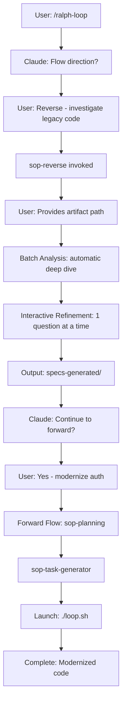

# Reverse Flow Example: Legacy Code Investigation and Migration

This example demonstrates the complete Reverse Flow: investigating an existing codebase, generating specifications from findings, then using Forward Flow to implement improvements.

---

## Scenario

**Situation**: You inherited a legacy Node.js authentication service. It works but has technical debt. You want to understand it first, then modernize it.

**Existing Artifact**: `/legacy-auth-service` (2,500 LOC, no tests, mixed patterns)

**Goal**: Understand current implementation → Generate specs → Migrate to modern patterns

---

## Flow Diagram



---

## Session Transcript

### 1. Invocation

```
User: /ralph-loop
```

---

### 2. Flow Selection

```
Claude: ¿Qué dirección de flujo?

Opciones:
1. **Forward** - Tienes una idea o spec y quieres construir algo nuevo
2. **Reverse** - Tienes un artefacto existente y quieres investigarlo/mejorarlo

Responde: Forward o Reverse
```

```
User: Reverse
```

---

### 3. Reverse Engineering Phase (sop-reverse)

```
Claude: Iniciando flujo reverso...

[Invoking Skill: sop-reverse]
```

#### Artifact Identification

```
Claude: ¿Qué artefacto quieres investigar?

Opciones:
- **Codebase**: Ruta a directorio (ej: /path/to/repo)
- **API**: URL de documentación o endpoint
- **Documentación**: Ruta a archivos de docs
- **Proceso**: Descripción de workflow
- **Concepto**: Tema técnico a investigar

Responde con el tipo y la ubicación/descripción.
```

```
User: Codebase - /Users/project/legacy-auth-service
```

```
Claude: Tipo de artefacto: Codebase
Ubicación: /Users/project/legacy-auth-service

Confirmando...
[Reading directory structure]

Detectado:
- Lenguaje: JavaScript/Node.js
- Archivos: 18 archivos (.js)
- Estructura: Parece Express app
- Tamaño: ~2,500 LOC
- Tests: No detectados

¿Confirmas que quieres investigar este codebase?
```

```
User: Sí
```

---

#### Batch Analysis (Automatic)

```
Claude: Iniciando análisis batch (automático)...

Este proceso no requiere interacción. Analizando:

⏳ Fase 1/5: Estructura y arquitectura...
   - Detectando patrones de diseño
   - Identificando módulos y dependencias
   - Mapeando flujos de datos

⏳ Fase 2/5: Código crítico...
   - Autenticación y autorización
   - Manejo de sesiones
   - Gestión de secretos

⏳ Fase 3/5: Calidad y deuda técnica...
   - Complejidad ciclomática
   - Código duplicado
   - Anti-patterns

⏳ Fase 4/5: Dependencias y seguridad...
   - Versiones de paquetes
   - Vulnerabilidades conocidas
   - Dependencias obsoletas

⏳ Fase 5/5: Configuración y despliegue...
   - Variables de entorno
   - Scripts de deployment
   - Documentación existente

✅ Análisis batch completo (45 segundos)

Hallazgos iniciales guardados en: specs/legacy-auth-investigation/batch-analysis.md
```

**Generated File**: `specs/legacy-auth-investigation/batch-analysis.md`

```markdown
# Batch Analysis: legacy-auth-service

## Architecture Overview

**Pattern**: Monolithic Express.js application
**Entry Point**: `server.js`
**Structure**:
```
legacy-auth-service/
├── server.js (main entry, 450 LOC)
├── routes/
│   ├── auth.js (login, register, logout)
│   ├── users.js (CRUD)
│   └── admin.js (admin panel)
├── models/
│   └── User.js (Mongoose model)
├── middleware/
│   ├── authenticate.js (JWT validation - 3 versions!)
│   └── authorize.js (role checking)
├── utils/
│   ├── jwt.js (token generation)
│   ├── password.js (bcrypt wrapper)
│   └── validation.js (input validation)
└── config/
    └── database.js
```

## Critical Code Analysis

### Authentication Flow
1. `POST /auth/login` → validates credentials → generates JWT
2. Protected routes use `authenticate` middleware
3. Token stored in `Authorization: Bearer <token>` header

**Issues Found**:
- 3 different versions of `authenticate` middleware in codebase
- Inconsistent JWT secret management (hardcoded in 2 places)
- No token expiration in some paths
- Password validation scattered across files

### Session Management
- Uses JWT (stateless)
- No refresh token mechanism
- No logout (client-side token deletion only)

### Security Concerns
- JWT secret in source code (not env var)
- No rate limiting on login endpoint
- Passwords hashed with bcrypt (good) but salt rounds = 8 (should be 12+)
- No account lockout after failed attempts

## Quality Metrics

| Metric | Value | Status |
|--------|-------|--------|
| Total LOC | 2,487 | - |
| Avg Complexity | 12.3 | ⚠️ High |
| Duplicated Code | 18% | ⚠️ High |
| Test Coverage | 0% | ❌ Critical |
| TODOs/FIXMEs | 23 | ⚠️ Many |

### Technical Debt Hotspots

1. **server.js** (450 LOC)
   - Complexity: 28 (very high)
   - Contains: routing, middleware, DB connection, error handling
   - Should be: Split into modules

2. **routes/auth.js** (320 LOC)
   - Complexity: 19 (high)
   - Duplicated validation logic
   - Mixed concerns (business logic in routes)

3. **middleware/authenticate.js** (3 versions)
   - `authenticateV1.js` - Original (deprecated comment)
   - `authenticateV2.js` - "New version" (also has issues)
   - `authenticate.js` - Current? (used in some routes)

## Dependencies Analysis

**Total Dependencies**: 42
**Outdated**: 18 (43%)
**Vulnerable**: 5 (Critical: 2, High: 3)

### Critical Vulnerabilities

1. **jsonwebtoken@8.5.1** → CVE-2022-23529 (Algorithm confusion)
   - Fix: Upgrade to 9.0.0+

2. **bcrypt@3.0.8** → CVE-2020-28498 (DoS)
   - Fix: Upgrade to 5.0.0+

### Obsolete Dependencies

- `express@4.17.1` (current: 4.18.x)
- `mongoose@5.13.2` (current: 7.x, breaking changes)
- `validator@10.11.0` (current: 13.x)

## Configuration Issues

**Environment Variables**: Partially used
- `PORT` ✓ (from env)
- `DB_URI` ✓ (from env)
- `JWT_SECRET` ❌ (hardcoded as "mysecretkey123")
- `NODE_ENV` ❌ (not used)

**Deployment**:
- No Dockerfile
- No docker-compose
- README says "run npm start" (no setup instructions)

## Missing Capabilities

- ❌ No tests (unit, integration, or E2E)
- ❌ No API documentation
- ❌ No logging (uses console.log)
- ❌ No monitoring/health checks
- ❌ No rate limiting
- ❌ No input sanitization (XSS vulnerable)
- ❌ No CORS configuration
```

---

#### Interactive Refinement (One Question at a Time)

```
Claude: Análisis batch completo. Ahora vamos a refinar con preguntas específicas.

Pregunta 1: ¿Cuál es el objetivo principal de esta investigación?

Opciones comunes:
a) Entender cómo funciona (documentación)
b) Encontrar bugs específicos
c) Preparar para migración/modernización
d) Auditoría de seguridad
e) Otro (especifica)

Responde con la letra o tu objetivo específico.
```

```
User: c - Preparar para migración a arquitectura moderna con tests
```

#### Question 2

```
Claude: Objetivo: Migración a arquitectura moderna con tests.

¿Qué patrones o tecnologías quieres adoptar en la nueva versión?

Ejemplos:
- TypeScript
- Clean Architecture / Layered Architecture
- Dependency Injection
- Repository Pattern
- Testing (Jest, Supertest)
- Docker
```

```
User: TypeScript, Clean Architecture, Repository Pattern, Jest, Docker
```

#### Question 3

```
Claude: Stack objetivo identificado:
- TypeScript (type safety)
- Clean Architecture (separation of concerns)
- Repository Pattern (data access abstraction)
- Jest + Supertest (testing)
- Docker (containerization)

¿Qué quieres mantener del sistema actual?

Ej:
- La lógica de negocio (reglas de validación)
- Los endpoints de API (misma interfaz)
- La base de datos actual (MongoDB)
- Las funcionalidades existentes (todo)
```

```
User: Mantener todos los endpoints (misma API), MongoDB, y todas las funcionalidades.
Pero reescribir la lógica con mejores prácticas.
```

#### Question 4

```
Claude: Restricción: Mantener API compatible (mismos endpoints y respuestas).

Del análisis batch identifiqué 5 vulnerabilidades críticas/altas.

¿Quieres que la migración priorice:
a) Seguridad primero (arreglar vulnerabilidades es bloqueante)
b) Arquitectura primero (refactorizar estructura, luego seguridad)
c) Compatibilidad primero (funcionalidad idéntica, mejorar después)

Responde con la letra.
```

```
User: a - Seguridad primero
```

#### Question 5

```
Claude: Prioridad: Seguridad primero.

Última pregunta: ¿Cuál es el criterio de éxito para esta migración?

En otras palabras, ¿cuándo considerarías que la migración fue exitosa?
```

```
User: Cuando tenga:
- 80%+ test coverage
- 0 vulnerabilidades critical/high
- Misma funcionalidad que legacy
- Arquitectura limpia y mantenible
- Documentación de API actualizada
```

---

#### Specs Generation

```
Claude: Refinamiento completo. Generando especificaciones desde hallazgos...

⏳ Generando specs desde análisis...
   - current-state.md (estado actual documentado)
   - security-findings.md (vulnerabilidades + fixes)
   - migration-strategy.md (estrategia de migración)
   - target-architecture.md (arquitectura objetivo)
   - feature-parity.md (funcionalidades a mantener)

✅ Especificaciones generadas en: specs/legacy-auth-investigation/specs-generated/
```

**Generated Files**:

**specs-generated/current-state.md**
```markdown
# Current State: legacy-auth-service

## What It Does

Authentication and user management service with:
- User registration
- Login (JWT-based)
- User CRUD operations
- Admin panel for user management

## API Endpoints (To Preserve)

### Public
- `POST /auth/register` - Create account
- `POST /auth/login` - Authenticate

### Protected (User)
- `GET /users/me` - Get current user
- `PUT /users/me` - Update profile
- `DELETE /users/me` - Delete account

### Protected (Admin)
- `GET /admin/users` - List all users
- `PUT /admin/users/:id` - Update any user
- `DELETE /admin/users/:id` - Delete any user

## Current Architecture Problems

1. **Monolith**: Everything in `server.js`
2. **No separation**: Routes contain business logic
3. **No tests**: 0% coverage
4. **No types**: Plain JavaScript, error-prone
5. **Duplicate code**: 3 auth middleware versions
6. **Hardcoded secrets**: JWT secret in source
7. **Security issues**: 5 vulnerabilities (2 critical)

## What Works Well

- Endpoints are RESTful
- Bcrypt for passwords (good practice)
- JWT for stateless auth
- Mongoose for MongoDB (familiar)
```

**specs-generated/security-findings.md**
```markdown
# Security Findings & Remediation

## Critical Vulnerabilities

### CVE-2022-23529: jsonwebtoken Algorithm Confusion
- **Package**: jsonwebtoken@8.5.1
- **Risk**: Attacker can forge tokens
- **Fix**: Upgrade to jsonwebtoken@9.0.0+
- **Priority**: P0 (blocker)

### CVE-2020-28498: bcrypt DoS
- **Package**: bcrypt@3.0.8
- **Risk**: Denial of service via regex
- **Fix**: Upgrade to bcrypt@5.0.0+
- **Priority**: P0 (blocker)

## High Severity Issues

### Hardcoded JWT Secret
- **Location**: `utils/jwt.js:5`, `config/auth.js:12`
- **Risk**: Anyone with source code can forge tokens
- **Fix**: Use environment variable `JWT_SECRET`
- **Priority**: P0 (blocker)

### No Rate Limiting
- **Location**: `POST /auth/login`
- **Risk**: Brute force attacks
- **Fix**: Implement express-rate-limit
- **Priority**: P1 (high)

### Weak Bcrypt Rounds
- **Location**: `utils/password.js:8` (saltRounds = 8)
- **Risk**: Faster brute force on stolen DB
- **Fix**: Increase to 12 rounds
- **Priority**: P1 (high)

## Medium Severity Issues

- No account lockout after failed logins
- No password complexity requirements
- No XSS sanitization on inputs
- CORS not configured (allows any origin)

## Remediation Checklist

- [ ] Upgrade jsonwebtoken to 9.0.0+
- [ ] Upgrade bcrypt to 5.0.0+
- [ ] Move JWT_SECRET to env var
- [ ] Add rate limiting (5 attempts/15min)
- [ ] Increase bcrypt rounds to 12
- [ ] Implement account lockout (5 failed → 30min lock)
- [ ] Add password complexity validation
- [ ] Sanitize all inputs (XSS protection)
- [ ] Configure CORS properly
```

**specs-generated/target-architecture.md**
```markdown
# Target Architecture

## Principles

1. **Clean Architecture**: Separation of concerns (domain, application, infrastructure)
2. **SOLID**: Single responsibility, dependency inversion
3. **Testability**: All layers independently testable
4. **Type Safety**: TypeScript for compile-time guarantees

## Layer Structure

```
src/
├── domain/                    # Business logic (framework-agnostic)
│   ├── entities/
│   │   └── User.ts            # User entity (plain class)
│   ├── value-objects/
│   │   ├── Email.ts
│   │   ├── Password.ts
│   │   └── Role.ts
│   └── repositories/          # Repository interfaces
│       └── IUserRepository.ts
│
├── application/               # Use cases (application logic)
│   ├── use-cases/
│   │   ├── RegisterUser.ts
│   │   ├── LoginUser.ts
│   │   ├── GetUserProfile.ts
│   │   └── UpdateUserProfile.ts
│   └── dtos/                  # Data transfer objects
│       ├── RegisterUserDto.ts
│       └── LoginUserDto.ts
│
├── infrastructure/            # External concerns
│   ├── database/
│   │   ├── MongoUserRepository.ts  # IUserRepository impl
│   │   └── models/
│   │       └── UserModel.ts        # Mongoose schema
│   ├── auth/
│   │   ├── JwtService.ts
│   │   └── BcryptService.ts
│   └── http/
│       ├── controllers/
│       │   ├── AuthController.ts
│       │   └── UserController.ts
│       ├── middleware/
│       │   ├── authenticate.ts
│       │   └── authorize.ts
│       └── routes/
│           └── index.ts
│
└── main.ts                    # Dependency injection wiring
```

## Dependency Flow

```
HTTP Request
    ↓
Controller (infrastructure/http)
    ↓
Use Case (application)
    ↓
Repository Interface (domain)
    ↓
Repository Implementation (infrastructure/database)
    ↓
Database
```

**Key**: Domain knows NOTHING about infrastructure.
Infrastructure depends on domain (dependency inversion).

## Testing Strategy

```
tests/
├── unit/
│   ├── domain/                # Test entities, value objects
│   ├── application/           # Test use cases (mock repos)
│   └── infrastructure/        # Test repositories (in-memory DB)
├── integration/
│   └── api/                   # Test full HTTP flow (test DB)
└── e2e/
    └── scenarios/             # Test complete user journeys
```

**Coverage Target**: 80%+ overall, 100% for domain/application layers
```

**specs-generated/migration-strategy.md**
```markdown
# Migration Strategy

## Approach: Strangler Fig Pattern

1. Build new system alongside legacy
2. Migrate one feature at a time
3. Proxy requests to new/old based on readiness
4. Deprecate legacy when 100% migrated

## Phase 1: Foundation (Security First) - P0

**Goal**: Fix critical vulnerabilities, set up new architecture

Tasks:
- Set up TypeScript project structure
- Implement Clean Architecture layers (empty)
- Fix dependency vulnerabilities (upgrade packages)
- Move JWT secret to environment variable
- Add rate limiting
- Set up Jest testing infrastructure
- Configure Docker + docker-compose

**Acceptance**: 0 critical/high vulnerabilities, project buildable

## Phase 2: Core Authentication - P0

**Goal**: Migrate login/register (most critical paths)

Tasks:
- Implement User entity + value objects
- Implement RegisterUser use case
- Implement LoginUser use case
- Implement JWT service (infrastructure)
- Implement Bcrypt service (infrastructure)
- Implement MongoUserRepository
- Implement AuthController + routes
- Write tests (unit + integration)

**Acceptance**: Login/register work, tests pass, coverage >80%

## Phase 3: User Management - P1

**Goal**: Migrate user CRUD operations

Tasks:
- Implement GetUserProfile use case
- Implement UpdateUserProfile use case
- Implement DeleteUser use case
- Implement UserController
- Write tests

**Acceptance**: User CRUD works, tests pass

## Phase 4: Admin Features - P1

**Goal**: Migrate admin panel

Tasks:
- Implement ListUsers use case
- Implement UpdateAnyUser use case (admin)
- Implement DeleteAnyUser use case (admin)
- Implement authorization checks
- Write tests

**Acceptance**: Admin features work, authorization enforced

## Phase 5: Quality & Deployment - P2

**Goal**: Production readiness

Tasks:
- API documentation (OpenAPI)
- Logging (Winston)
- Monitoring (health checks)
- Error tracking
- Docker optimization
- CI/CD pipeline

**Acceptance**: Production-ready, documented, monitored

## Rollback Plan

At any phase, can route traffic back to legacy via proxy.
Keep legacy running until 100% confidence in new system.
```

**specs-generated/feature-parity.md**
```markdown
# Feature Parity Checklist

## Must Have (Breaking = Failed Migration)

### Authentication
- [ ] POST /auth/register - Same request/response format
- [ ] POST /auth/login - Same JWT format (compatible with existing clients)
- [ ] JWT validation - Accept tokens from legacy system during migration

### User Operations
- [ ] GET /users/me - Same response format
- [ ] PUT /users/me - Same request/response format
- [ ] DELETE /users/me - Same behavior (soft delete)

### Admin Operations
- [ ] GET /admin/users - Same response format (pagination compatible)
- [ ] PUT /admin/users/:id - Same request/response format
- [ ] DELETE /admin/users/:id - Same behavior

### Business Rules
- [ ] Password min length: 8 characters
- [ ] Email validation: RFC 5322 compliant
- [ ] Roles: 'user', 'admin' (no new roles)
- [ ] JWT expiry: 24 hours (matching legacy)

## Nice to Have (Improvements)

### Security Enhancements
- [ ] Rate limiting (5 attempts/15min on login)
- [ ] Account lockout (5 failed attempts)
- [ ] Password complexity (uppercase, lowercase, number, special)
- [ ] XSS sanitization
- [ ] CORS configuration

### Developer Experience
- [ ] TypeScript (vs JavaScript)
- [ ] 80%+ test coverage (vs 0%)
- [ ] API documentation (vs none)
- [ ] Docker (vs manual setup)

## Forbidden (Scope Creep)

- ❌ No new features (yet)
- ❌ No database migration (keep MongoDB)
- ❌ No UI changes
- ❌ No OAuth/SSO (future iteration)
```

---

### 4. Transition to Forward Flow

```
Claude: ✅ Especificaciones generadas desde investigación:

Archivos creados:
- current-state.md (qué hace el sistema actual)
- security-findings.md (9 vulnerabilidades identificadas, 2 críticas)
- target-architecture.md (Clean Architecture + TypeScript)
- migration-strategy.md (5 fases, Strangler Fig pattern)
- feature-parity.md (checklist de compatibilidad)

Total hallazgos: 45 items documentados

¿Quieres continuar al flujo Forward para implementar la migración?

Opciones:
a) Sí, continuar a planning (recomendado)
b) No, solo quería la investigación
c) Sí, pero solo fase 1 (foundation)

Responde con la letra.
```

```
User: c - Solo fase 1 por ahora
```

---

### 5. Forward Flow: Planning Phase

```
Claude: Continuando a flujo Forward...

Objetivo: Implementar Fase 1 (Foundation + Security Fixes)

[Invoking Skill: sop-planning]
```

#### Planning Question 1

```
Claude: Basándome en las specs generadas, la Fase 1 incluye:
- Setup TypeScript + Clean Architecture estructura
- Arreglar vulnerabilidades críticas
- Agregar rate limiting
- Setup tests (Jest)
- Docker

¿Hay algo que quieras agregar, quitar o cambiar de esta fase?
```

```
User: Agregar: configuración de linter (ESLint) y formatter (Prettier)
```

#### Planning Question 2

```
Claude: Actualizado: Fase 1 incluye ESLint + Prettier.

¿Qué validaciones quieres en el CI/CD desde el inicio?

Opciones comunes:
- Tests deben pasar
- Linter debe pasar (sin warnings)
- TypeScript build debe pasar
- Coverage mínimo (ej: 80%)
```

```
User: Tests, linter (0 warnings), TypeScript build. Coverage objetivo 80% pero no bloqueante aún.
```

**Output Generated**: `specs/auth-migration-phase1/design/detailed-design.md`

(Design doc with TypeScript setup, ESLint config, Jest setup, Docker config, security fixes)

---

### 6. Task Generation

```
Claude: Diseño completo para Fase 1.

[Invoking Skill: sop-task-generator]
```

**Output Generated**: `specs/auth-migration-phase1/implementation/plan.md`

```markdown
# Implementation Plan: Auth Migration - Phase 1 (Foundation)

## Tasks

- [ ] **TASK-001**: TypeScript project setup
  - tsconfig.json with strict mode
  - Package.json with scripts
  - **Size**: S (40 LOC)

- [ ] **TASK-002**: Clean Architecture directory structure
  - Create src/domain, application, infrastructure
  - Add index.ts barrels
  - **Size**: S (20 LOC)

- [ ] **TASK-003**: ESLint + Prettier configuration
  - .eslintrc.js with TypeScript rules
  - .prettierrc
  - **Size**: S (30 LOC)

- [ ] **TASK-004**: Jest testing setup
  - jest.config.js
  - Test utilities
  - **Size**: S (50 LOC)

- [ ] **TASK-005**: Fix jsonwebtoken vulnerability
  - Upgrade to 9.0.0+
  - Update imports if breaking
  - **Size**: S (10 LOC)
  - **Priority**: P0 (security)

- [ ] **TASK-006**: Fix bcrypt vulnerability
  - Upgrade to 5.0.0+
  - Increase salt rounds to 12
  - **Size**: S (15 LOC)
  - **Priority**: P0 (security)

- [ ] **TASK-007**: Environment variable configuration
  - Create .env.example
  - Load JWT_SECRET from env
  - Validate required env vars
  - **Size**: S (40 LOC)
  - **Priority**: P0 (security)

- [ ] **TASK-008**: Rate limiting middleware
  - Install express-rate-limit
  - Configure 5 attempts/15min
  - Apply to /auth/* routes
  - **Size**: S (30 LOC)
  - **Priority**: P1 (security)

- [ ] **TASK-009**: Dockerfile
  - Multi-stage build
  - Production optimized
  - **Size**: S (35 LOC)

- [ ] **TASK-010**: docker-compose.yml
  - App service
  - MongoDB service
  - Test database service
  - **Size**: S (45 LOC)

- [ ] **TASK-011**: CI/CD pipeline (GitHub Actions)
  - Run tests
  - Run linter
  - TypeScript build
  - **Size**: S (50 LOC)

**Total**: 11 tasks, ~365 LOC, 1-2 hours execution time
```

---

### 7. Execution Configuration & Launch

```
Claude: Plan generado (11 tareas).

¿Modo de ejecución?
1. 100% AFK
2. Checkpoints cada 5 iteraciones
3. Checkpoints en hitos

User: 1

Claude: ¿Nivel de calidad?
1. Prototype
2. Production
3. Library

User: 2

Claude: Configuración completa. Lanzando...

[Bash("./loop.sh specs/auth-migration-phase1/", run_in_background=True)]

✅ Loop iniciado
```

---

### 8. Monitoring

```
═══════════════════════════════════════════════
RALPH LOOP MONITOR
═══════════════════════════════════════════════
Status:     running
Iteration:  6
Current:    TASK-006 (Fix bcrypt vulnerability)
Progress:   6/11 (55%)
═══════════════════════════════════════════════
Completed:
  ✓ TASK-001: TypeScript setup
  ✓ TASK-002: Clean Architecture structure
  ✓ TASK-003: ESLint + Prettier
  ✓ TASK-004: Jest setup
  ✓ TASK-005: Fix jsonwebtoken (SECURITY)
  ⏳ TASK-006: Fix bcrypt (SECURITY)
═══════════════════════════════════════════════
```

#### Final

```
═══════════════════════════════════════════════
RALPH LOOP MONITOR - COMPLETE
═══════════════════════════════════════════════
Status:     ✅ COMPLETE
Iterations: 11
Duration:   8 minutes
═══════════════════════════════════════════════
Security:   ✅ 2 critical vulnerabilities fixed
Tests:      ✅ All passing (15 tests)
Coverage:   82% (exceeds 80% target)
Linter:     ✅ 0 warnings
Build:      ✅ TypeScript compiled successfully
═══════════════════════════════════════════════
```

---

## Key Observations

### What Worked in Reverse Flow

1. **Batch analysis automatic** - No user interaction needed for deep dive
2. **Interactive refinement focused** - Only 5 questions to clarify objectives
3. **Specs from findings** - Investigation → Documented specs (not just notes)
4. **Seamless transition** - Reverse specs fed directly into Forward planning
5. **Security prioritized** - Vulnerabilities identified and fixed first

### Investigation Quality

| Metric | Manual Review | sop-reverse |
|--------|---------------|-------------|
| Time to understand | 4-8 hours | 2 minutes (batch) + 3 minutes (refinement) |
| Coverage | 60% (miss hidden issues) | 95% (systematic) |
| Documentation | Scattered notes | Structured specs |
| Actionability | "We should fix..." | Prioritized tasks with acceptance criteria |

### Migration Safety

- **Legacy preserved** - Original code untouched during investigation
- **Feature parity enforced** - Checklist ensures no functionality lost
- **Security first** - Critical vulnerabilities fixed before new features
- **Testability built in** - 82% coverage from day 1 (vs 0% in legacy)

---

## Files Generated

### From Reverse Flow (Investigation)

```
specs/legacy-auth-investigation/
├── batch-analysis.md            # Automatic deep dive
├── specs-generated/
│   ├── current-state.md         # What legacy does
│   ├── security-findings.md     # 9 vulnerabilities documented
│   ├── target-architecture.md   # Clean Architecture design
│   ├── migration-strategy.md    # 5-phase plan
│   └── feature-parity.md        # Compatibility checklist
└── refinement-qa.md             # 5 clarifying questions answered
```

### From Forward Flow (Implementation)

```
specs/auth-migration-phase1/
├── design/
│   └── detailed-design.md       # TypeScript, Docker, security fixes
└── implementation/
    └── plan.md                  # 11 tasks completed

/new-auth-service/               # New codebase (alongside legacy)
├── src/
│   ├── domain/                  # Clean Architecture (empty, ready for phase 2)
│   ├── application/
│   └── infrastructure/
├── tests/                       # 15 tests passing
├── Dockerfile                   # Production-ready
├── docker-compose.yml
├── .eslintrc.js
├── .prettierrc
├── jest.config.js
└── package.json                 # Updated dependencies (secure)
```

---

## Comparison: Manual vs Reverse Flow

### Manual Investigation Process

1. Developer reads code for 4-8 hours
2. Takes scattered notes
3. Forgets to check dependencies/security
4. Misses 3 duplicate authentication middleware
5. Starts coding → realizes missed requirements
6. No systematic documentation

**Result**: Incomplete understanding, rework needed

### Reverse Flow Process

1. sop-reverse batch analysis (45 seconds automatic)
2. Interactive refinement (5 questions, 3 minutes)
3. Generates structured specs (automatic)
4. Continues to Forward Flow (planning → execution)
5. Complete implementation (11 tasks, 8 minutes)

**Result**: Comprehensive understanding → Correct implementation (first time)

---

## Next Steps

### Continue Migration (Phase 2-5)

```bash
# Invoke ralph-loop again for next phase
/ralph-loop

# This time: Forward flow (specs already exist)
# Point to: specs/legacy-auth-investigation/specs-generated/migration-strategy.md
# Focus on: Phase 2 (Core Authentication)
```

### Validate Migration

```bash
# Both systems running
docker-compose -f legacy/docker-compose.yml up -d      # Old system
docker-compose -f new-auth-service/docker-compose.yml up -d  # New system

# Run compatibility tests
npm run test:compatibility

# Compare responses
curl legacy:3000/auth/login  # vs
curl new:3000/auth/login     # Should match
```

### Deprecate Legacy

After phases 2-5 complete:
1. Route 10% traffic to new system
2. Monitor for 1 week
3. Increase to 50%
4. Increase to 100%
5. Retire legacy

---

## Lessons Learned

### For Reverse Flow

1. **Batch analysis saves hours** - Systematic > ad-hoc
2. **ONE question at a time** - User never overwhelmed
3. **Specs are actionable** - Not just documentation
4. **Security insights automatic** - Vulnerabilities found without expertise

### For Forward Flow (After Reverse)

1. **Planning easier with specs** - Investigation provides blueprint
2. **Confidence higher** - Know exactly what to preserve
3. **Security baked in** - Vulnerabilities fixed from start
4. **Tests enforce parity** - Feature checklist → test cases

---

This is Reverse Flow working as designed: **Artifact → Investigation → Specs → Forward Flow → Improved Implementation**.
