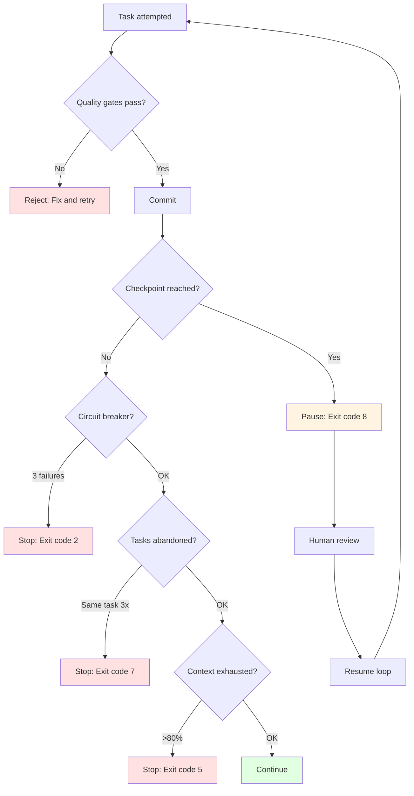

# Backpressure Reference

Quality gates that reject incomplete work.

## Standard Gates

```bash
npm test          # Tests must pass
npm run typecheck # Types must check
npm run lint      # Lint must pass
npm run build     # Build must succeed
```

**All gates must pass before commit. No exceptions.**

---

## Checkpoint-Based Backpressure

Checkpoints provide execution-level backpressure by pausing for human review.

### Configuration

In `.ralph/config.sh`:

```bash
# Mode: none, iterations, milestones
CHECKPOINT_MODE="iterations"

# For iterations mode: pause every N iterations
CHECKPOINT_INTERVAL=5

# For milestones mode: pause when module completes
CHECKPOINT_ON_MODULE=true
```

### Checkpoint Modes

#### 1. None (Pure AFK)

```bash
CHECKPOINT_MODE="none"
```

**Behavior:**
- No interruptions
- Runs until complete or circuit breaker trips
- Trust quality gates completely
- Review results at end

**Use when:**
- High confidence in gates
- Low-risk tasks
- Well-tested patterns
- Overnight execution

#### 2. Iterations (Regular Intervals)

```bash
CHECKPOINT_MODE="iterations"
CHECKPOINT_INTERVAL=5  # Every 5 iterations
```

**Behavior:**
- Pauses after N iterations
- Exit code: `8` (CHECKPOINT_PAUSE)
- Resume with same command: `./loop.sh specs/{goal}/`
- Review progress between checkpoints

**Use when:**
- Learning Ralph patterns
- Medium-risk tasks
- Want frequent review points
- Testing new quality gates

**Example:**
```bash
# Configure checkpoint
echo 'CHECKPOINT_MODE="iterations"' >> .ralph/config.sh
echo 'CHECKPOINT_INTERVAL=5' >> .ralph/config.sh

# Run loop
./loop.sh specs/my-feature/

# After 5 iterations, exits with code 8
# Review commits, logs, test results

# Resume from where it left off
./loop.sh specs/my-feature/

# Repeat until complete
```

#### 3. Milestones (Module Boundaries)

```bash
CHECKPOINT_MODE="milestones"
CHECKPOINT_ON_MODULE=true
```

**Behavior:**
- Pauses when module/component completes
- Detected via plan.md section markers
- Natural breakpoints in implementation
- Allows architectural review

**Use when:**
- Multi-module features
- Architectural decisions at boundaries
- Want to review module integration
- Incremental delivery

**Example plan.md structure:**
```markdown
## Module: Authentication

- [x] Setup routes
- [x] Implement JWT generation
- [x] Add validation middleware

## Module: User Profile

- [ ] Create profile schema
- [ ] Implement CRUD operations
- [ ] Add profile validation
```

Loop pauses after "Authentication" module completes.

---

## Backpressure Stack

Ralph implements backpressure at multiple levels:



### Backpressure Levels

| Level | Mechanism | Trigger | Action |
|-------|-----------|---------|--------|
| **Task** | Quality gates | Gate fails | Reject iteration |
| **Checkpoint** | Iteration/Milestone | N iterations OR module done | Pause for review |
| **Circuit breaker** | Consecutive failures | 3 failures | Stop loop |
| **Abandonment** | Task repetition | Same task 3x | Stop loop |
| **Context** | Token usage | >80% context | Stop loop |

---

## Quality Levels

Define expectations in AGENTS.md:

| Level | Shortcuts OK | Tests Required | Polish Required |
|-------|--------------|----------------|-----------------|
| **Prototype** | Yes | No | No |
| **Production** | No | Yes | Some |
| **Library** | No | Yes | Yes |

### Behavior by Level

- **Prototype** - Fast iteration, skip backpressure gates
- **Production** - TDD mandatory, all gates must pass
- **Library** - Full coverage, documentation, edge cases

**Set in:** `AGENTS.md` -> Quality Level section

---

## Task Sizing

One task = one context window.

### Right-sized

- Add database column + migration
- Add UI component to existing page
- Fix bug in login flow

### Too Large

- Build entire auth system
- Implement complete dashboard

**Test:** If >2000 lines to understand or >5 files -> split.

---

## Context Thresholds

| Zone | Usage | Action |
|------|-------|--------|
| Green | <40% | Operate freely |
| Yellow | 40-60% | Wrap up current task |
| Red | >60% | Force rotation |

---

## Gutter Detection

**You're stuck if:**
- Same command fails 3 times
- Same file modified 5+ times
- No progress in 30 minutes

**Recovery:** Add Sign -> Exit -> Fresh approach next iteration.

---

## Circuit Breaker

After 3 consecutive failures, loop.sh stops:

1. Check errors.log for details
2. Review last Claude output
3. Fix manually or adjust specs
4. Run ./loop.sh again

---

## Plan Format

**The plan is disposable.** Regeneration costs one planning loop.

### Constraints

| Element | Limit |
|---------|-------|
| Entire plan | <100 lines |
| Each task | 3-5 lines |
| Implementation details | None |

### Task Format

```markdown
- [ ] Task title | Size: S/M | Files: N
  Acceptance: [single sentence]
```

### Anti-patterns

- 400-line plans
- Research summaries in plan (move to specs/)
- Step-by-step implementation notes
- Keeping completed tasks forever

**Recovery:** If plan exceeds 100 lines -> `./loop.sh plan 1`
