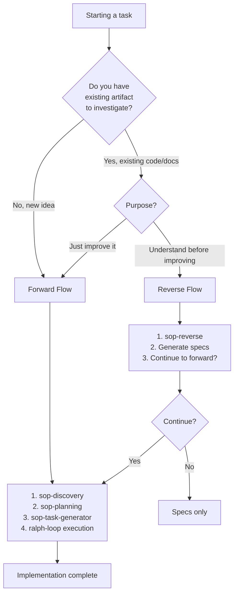
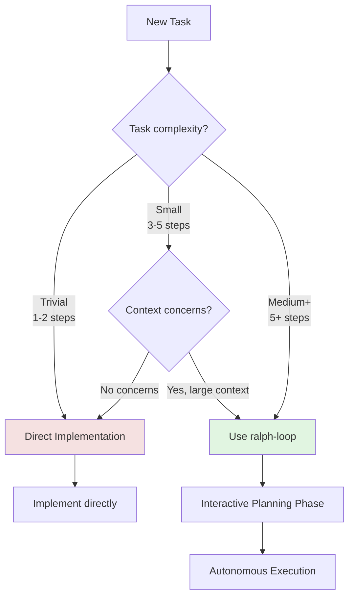
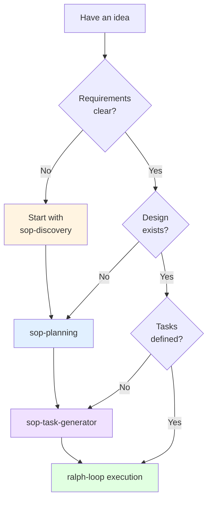
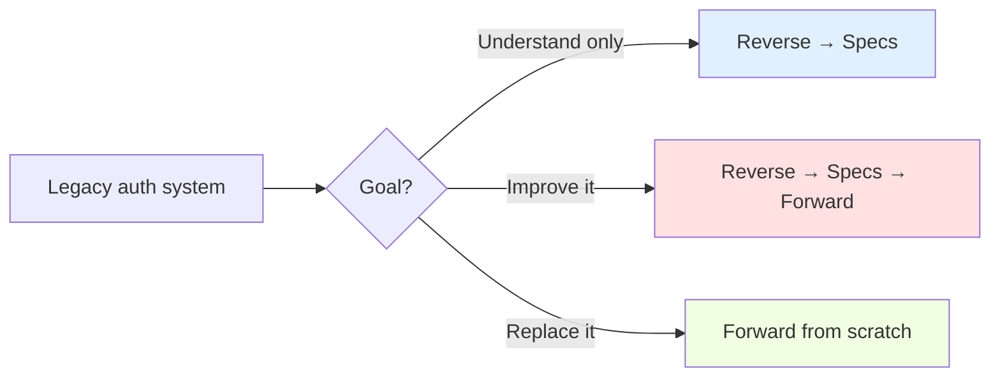
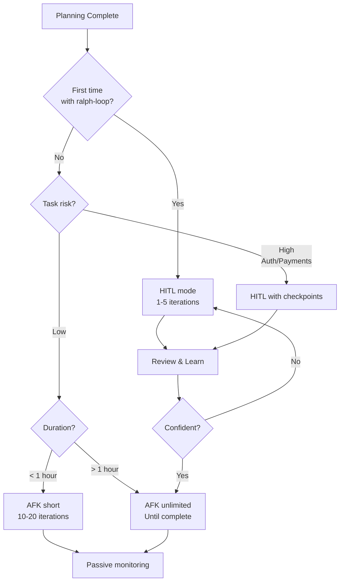

# Mode Selection Reference

Decision flowcharts for choosing the right workflow approach.

## Flow Selection: Forward vs Reverse



---

## When to Use Ralph-Loop vs Direct Implementation



### Decision Criteria Table

| Factor | Direct | Ralph-Loop |
|--------|--------|------------|
| **Steps** | ≤ 3 | ≥ 3 |
| **Files** | ≤ 2 | ≥ 3 |
| **Duration** | < 30 min | > 1 hour |
| **Context** | < 50K tokens | > 100K tokens |
| **Tests** | None or simple | TDD required |
| **Overnight** | No | Possible |
| **Quality gates** | Not needed | Critical |

---

## Forward Flow Decision Points



---

## Reverse Flow Use Cases

**Use Reverse Flow when investigating:**

### Code Artifacts
- Legacy codebase to understand before refactoring
- Third-party library integration patterns
- Existing API implementation
- Authentication/authorization flows

### Documentation
- API specifications to implement
- Architecture decision records
- Requirements documents
- Technical design documents

### Processes
- Deployment workflows
- CI/CD pipelines
- Development workflows
- Testing strategies

### Concepts
- Design patterns in use
- Architectural patterns (event sourcing, CQRS, etc.)
- Technical approaches
- Integration patterns

### Example Decision Flow



---

## Task Sizing for Ralph-Loop

Not all tasks are suitable for ralph-loop. Use this guide:

### Perfect for Ralph-Loop (M-L size)

```
✓ Add authentication system with JWT
  - Multiple files (controllers, middleware, tests)
  - TDD approach required
  - Clear acceptance criteria
  - 3-8 hours estimated

✓ Implement caching layer with Redis
  - Database abstraction
  - Cache invalidation strategy
  - Performance tests
  - 4-6 hours estimated
```

### Too Small for Ralph-Loop (S size)

```
✗ Fix typo in error message
  - Single file change
  - No tests needed
  - 5 minutes

✗ Update dependency version
  - Edit package.json
  - Run npm install
  - 10 minutes
```

### Too Large (XL size) - Needs Decomposition

```
✗ Build entire e-commerce platform
  - Too many unknowns
  - Unclear boundaries
  - Weeks of work
  → Split into: Auth, Products, Cart, Checkout, etc.

✗ Complete microservices migration
  - Architectural change
  - Multiple systems
  - Risk assessment needed
  → Split by service: User Service, Order Service, etc.
```

---

## Execution Mode Selection

After planning, choose execution approach:



---

## Common Scenarios

### Scenario 1: New Feature from Scratch

```
Situation: Build user profile page
Complexity: Medium (4-6 files, tests, styling)
Experience: Familiar with stack

Decision: Forward Flow → AFK mode
Steps:
1. /ralph-loop → Forward
2. sop-discovery (15 min)
3. sop-planning (30 min)
4. sop-task-generator (10 min)
5. Configure: AFK, production quality
6. Launch and monitor
```

### Scenario 2: Understanding Legacy Code

```
Situation: Old payment processing module
Complexity: High (unfamiliar code)
Goal: Understand before migrating

Decision: Reverse Flow → Specs only
Steps:
1. /ralph-loop → Reverse
2. sop-reverse → /path/to/payment-module
3. Generate specs (automatic)
4. Review findings
5. Stop (no implementation yet)
```

### Scenario 3: Quick Bug Fix

```
Situation: Button click not working
Complexity: Trivial (1 file, 1 function)
Duration: 5-10 minutes

Decision: Direct Implementation
Reason: Ralph-loop overhead > task complexity
```

### Scenario 4: Large Refactoring

```
Situation: Extract shared utilities into library
Complexity: Large (15+ files)
Risk: Breaking changes

Decision: Forward Flow → HITL with checkpoints
Steps:
1. /ralph-loop → Forward
2. Planning phase (interactive)
3. Configure: Checkpoints every 5 iterations
4. Review after each checkpoint
5. Adjust plan if needed
```

---

## Anti-Patterns to Avoid

### ❌ Using Ralph-Loop for Everything

```
Problem: "I'll use ralph-loop for this 1-line fix"
Reality: 10x overhead for trivial task
Solution: Direct implementation for tasks < 3 steps
```

### ❌ Skipping Planning Phase

```
Problem: "I'll just start the loop, I know what I want"
Reality: Workers confused, poor quality output
Solution: Always complete planning first
```

### ❌ Wrong Flow Direction

```
Problem: "Forward flow to improve legacy code without understanding it"
Reality: Changes break existing assumptions
Solution: Reverse → understand → Forward → improve
```

### ❌ Task Too Large

```
Problem: "Build entire CRM system with ralph-loop"
Reality: Loop runs forever, unclear progress
Solution: Decompose into features, run multiple loops
```

---

## Quick Reference

| If you... | Then use... |
|-----------|-------------|
| Have a new idea | Forward Flow |
| Need to understand existing code | Reverse Flow |
| Want to improve after understanding | Reverse → Forward |
| Task is trivial (< 3 steps) | Direct implementation |
| Task is complex (> 5 steps) | Ralph-loop |
| First time using ralph-loop | HITL mode first |
| High-risk task (auth, payments) | HITL with checkpoints |
| Overnight development needed | AFK unlimited |
| Learning codebase patterns | Start HITL, graduate to AFK |
