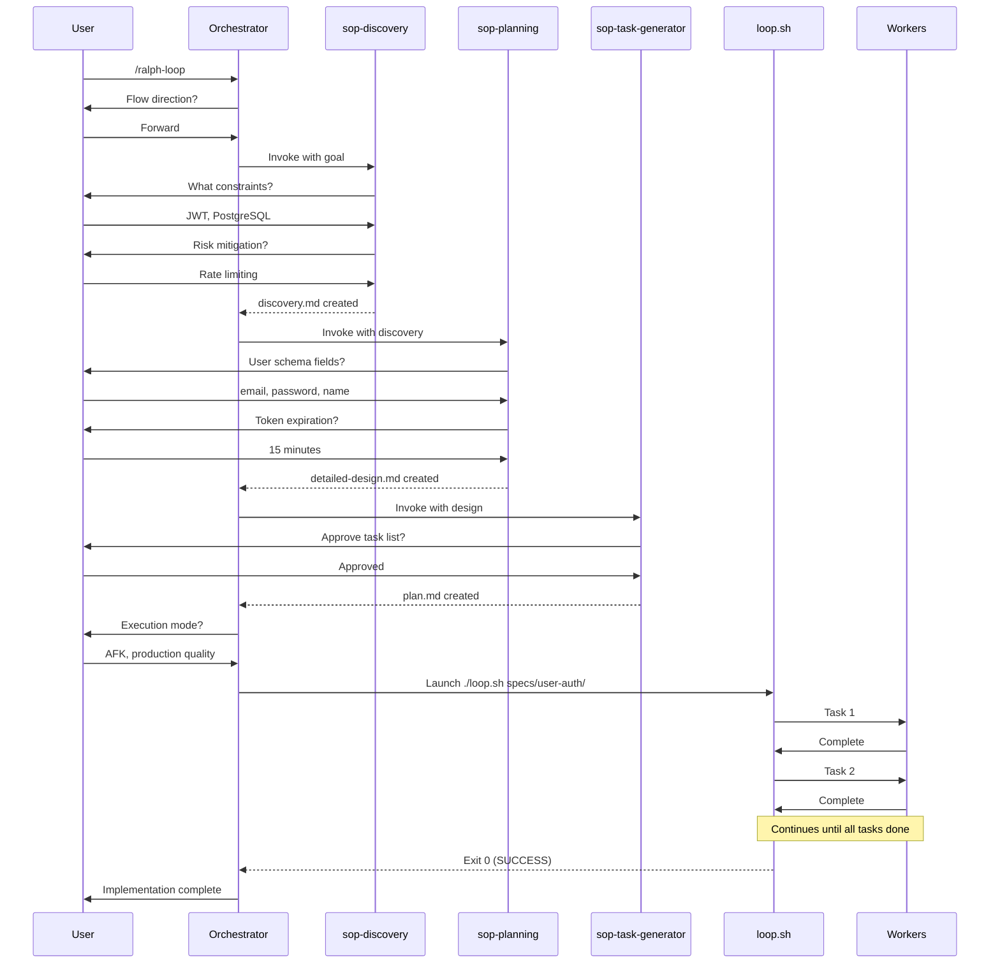

# SOP Integration Reference

How ralph-loop integrates with the SOP (Standard Operating Procedure) skills framework.

---

## Overview

Ralph-loop orchestrates SOP skills to transform ideas into implementations through a two-phase workflow:

1. **Planning Phase (HITL)**: Interactive session using SOP skills
2. **Execution Phase**: Autonomous loop executing the plan

```mermaid
graph TD
    subgraph "Planning Phase - Interactive"
        A[/ralph-loop invoked] --> B{Flow?}
        B -->|Forward| C[sop-discovery]
        B -->|Reverse| D[sop-reverse]

        D --> E[Generate specs]
        E --> F{Continue?}
        F -->|No| G[Done - Specs only]
        F -->|Yes| C

        C --> H[sop-planning]
        H --> I[sop-task-generator]
        I --> J[Configure execution]
    end

    subgraph "Execution Phase - Autonomous"
        J --> K[Launch ./loop.sh]
        K --> L[Worker iterations]
        L --> M{Complete?}
        M -->|No| L
        M -->|Yes| N[Done]
    end

    style A fill:#e1f0ff
    style C fill:#fff4e1
    style D fill:#ffe1f0
    style H fill:#f0e1ff
    style I fill:#e1ffe1
    style K fill:#ffe1e1
```

---

## SOP Skills in the Workflow

### 1. sop-discovery

**Purpose**: Brainstorm constraints, risks, and prior art before planning

**When invoked**: First step of Forward flow

**Input**: Rough idea or goal description

**Output**: `specs/{goal}/discovery.md`

**What it contains**:
- Problem statement
- Constraints (technical, resource, time)
- Risks and mitigation strategies
- Prior art and existing patterns
- Success criteria
- Open questions resolved

**Duration**: 10-20 minutes

**Interaction style**: Q&A, one question at a time

**Example**:
```bash
User: "Build user authentication system"

sop-discovery asks:
- What authentication methods? (OAuth, JWT, session-based?)
- What user data needs protection?
- Integration with existing user table?
- Password policy requirements?
- Multi-factor authentication needed?
- Session management approach?

Output: specs/user-auth/discovery.md
```

---

### 2. sop-reverse (Alternative Entry Point)

**Purpose**: Investigate existing artifacts before improving them

**When invoked**: First step of Reverse flow

**Input**: Path to artifact, URL, or description

**Artifacts supported**:
- Codebase: `/path/to/repo`
- API documentation: `https://api.example.com/docs`
- Design documents: `/path/to/docs/`
- Processes: "Our deployment workflow"
- Concepts: "Event sourcing pattern"

**Output**: `specs/{investigation}/specs-generated/`

**What it contains**:
- Artifact analysis
- Architecture patterns found
- Dependencies discovered
- Issues and improvements identified
- Generated specifications

**Duration**: 20-40 minutes (varies by artifact size)

**Interaction style**:
- Batch analysis (automatic)
- Interactive refinement (one question at a time)

**Example**:
```bash
User: "Investigate legacy payment processing module"

sop-reverse:
1. Analyzes /src/payments/ (automatic)
2. Discovers: Stripe integration, manual retry logic, no tests
3. Asks refinement questions:
   - Focus on error handling or integration?
   - Migrating to new payment provider?
   - Adding new payment methods?

Output: specs/payment-investigation/specs-generated/
├── architecture.md
├── integration-patterns.md
├── issues-found.md
└── improvement-opportunities.md

User: "Continue to forward flow to add PayPal support"
→ Proceeds to sop-planning with existing context
```

---

### 3. sop-planning

**Purpose**: Create detailed requirements, research, and design

**When invoked**: After discovery (or after reverse if continuing)

**Input**:
- `specs/{goal}/discovery.md` (from sop-discovery)
- OR `specs/{investigation}/specs-generated/` (from sop-reverse)
- OR rough idea description

**Output**:
- `specs/{goal}/rough-idea.md`
- `specs/{goal}/idea-honing.md` (Q&A log)
- `specs/{goal}/research/*.md`
- `specs/{goal}/design/detailed-design.md`

**What it contains**:

**rough-idea.md**:
- Initial concept
- High-level goals
- Success criteria

**idea-honing.md**:
- Clarification questions asked
- User responses
- Decisions made
- Scope refinements

**research/**.md:
- Technical research findings
- Library comparisons
- Pattern investigations
- Best practices

**design/detailed-design.md**:
- System architecture
- Component design
- Data models
- API contracts
- Security considerations
- Performance requirements
- Testing strategy

**Duration**: 20-40 minutes

**Interaction style**: Interactive loops
- Clarification questions (requirements)
- Research questions (investigation)
- Design validation (review)

**Example**:
```bash
Input: specs/user-auth/discovery.md

sop-planning phases:

1. Clarification (requirements):
   - User schema fields needed?
   - Token expiration policy?
   - Password reset flow?

2. Research:
   - JWT libraries: jsonwebtoken vs jose
   - Bcrypt vs Argon2 for hashing
   - Rate limiting approaches

3. Design:
   - Routes: POST /auth/login, POST /auth/refresh
   - Middleware: authenticateToken
   - Database: users table with hashed passwords
   - Security: bcrypt rounds=10, JWT expiry=15m

Output: specs/user-auth/design/detailed-design.md
```

---

### 4. sop-task-generator

**Purpose**: Generate structured implementation tasks from design

**When invoked**: After planning completes

**Input**: `specs/{goal}/design/detailed-design.md`

**Output**: `specs/{goal}/implementation/plan.md`

**What it contains**:
- Checklist of implementation tasks
- Each task with:
  - Clear description
  - File list
  - Size estimate (S/M/L)
  - Acceptance criteria
  - Dependencies (if any)

**Task format**:
```markdown
- [ ] Implement JWT token generation | Size: M | Files: 2
  Create utils/jwt.ts with sign() and verify() functions.
  Tests must validate token structure and expiration.
```

**Duration**: 5-15 minutes

**Interaction style**: Mostly automatic with approval checkpoints

**Example**:
```bash
Input: specs/user-auth/design/detailed-design.md

sop-task-generator creates:

## Implementation Plan

### Setup
- [ ] Install dependencies: jsonwebtoken, bcrypt | Size: S
- [ ] Create database migration for users table | Size: S

### Authentication
- [ ] Implement password hashing utilities | Size: M
- [ ] Create login endpoint with JWT generation | Size: M
- [ ] Add token validation middleware | Size: M
- [ ] Implement token refresh endpoint | Size: S

### Testing
- [ ] Unit tests for JWT utilities | Size: M
- [ ] Integration tests for auth endpoints | Size: L
- [ ] Security tests for token validation | Size: M

Output: specs/user-auth/implementation/plan.md
```

---

## The Complete Forward Flow



---

## The Complete Reverse Flow

```mermaid
sequenceDiagram
    participant U as User
    participant O as Orchestrator
    participant R as sop-reverse
    participant P as sop-planning
    participant T as sop-task-generator
    participant L as loop.sh

    U->>O: /ralph-loop
    O->>U: Flow direction?
    U->>O: Reverse

    O->>R: Invoke
    R->>U: What to investigate?
    U->>R: /src/payments/

    Note over R: Batch analysis (automatic)

    R->>U: Focus on integration or error handling?
    U->>R: Error handling
    R->>U: Migrating providers?
    U->>R: No, improving existing

    R-->>O: specs-generated/ created

    O->>U: Continue to forward flow?

    alt User says Yes
        U->>O: Yes, add retry mechanism
        O->>P: Invoke with specs-generated
        Note over P,T,L: Same as forward flow
    else User says No
        U->>O: No, just needed analysis
        O->>U: Specs available for review
    end
```

---

## Directory Structure After Full Flow

```
project-root/
├── specs/
│   └── user-auth/                    # Goal name
│       ├── discovery.md              # From sop-discovery
│       ├── rough-idea.md             # From sop-planning
│       ├── idea-honing.md            # From sop-planning
│       ├── research/                 # From sop-planning
│       │   ├── jwt-libraries.md
│       │   └── password-hashing.md
│       ├── design/                   # From sop-planning
│       │   └── detailed-design.md
│       └── implementation/           # From sop-task-generator
│           └── plan.md
│
├── .ralph/                           # Created by install.sh
│   ├── config.sh
│   └── templates/
│
├── AGENTS.md                         # Project context
├── guardrails.md                     # Signs (error lessons)
├── memories.md                       # Persistent learnings
├── scratchpad.md                     # Session state
│
├── logs/                             # Created during execution
│   ├── iteration.log
│   └── metrics.json
│
├── status.json                       # Real-time loop state
│
└── src/                              # Implementation output
    ├── routes/
    │   └── auth.ts
    ├── middleware/
    │   └── authenticate.ts
    └── utils/
        └── jwt.ts
```

---

## Handoff Between Skills

### Discovery → Planning

**Handoff mechanism**: File path

```javascript
// sop-discovery outputs:
specs/user-auth/discovery.md

// Orchestrator invokes sop-planning with:
{
  discovery_path: "specs/user-auth/discovery.md"
}

// sop-planning reads discovery context and proceeds
```

### Reverse → Planning (if continuing)

**Handoff mechanism**: Directory path + context

```javascript
// sop-reverse outputs:
specs/payment-investigation/specs-generated/

// Orchestrator invokes sop-planning with:
{
  rough_idea: "Add retry mechanism to payment processing",
  project_dir: "specs/payment-retry",
  prior_investigation: "specs/payment-investigation/specs-generated/"
}

// sop-planning incorporates investigation findings
```

### Planning → Task Generation

**Handoff mechanism**: Design document

```javascript
// sop-planning outputs:
specs/user-auth/design/detailed-design.md

// Orchestrator invokes sop-task-generator with:
{
  input: "specs/user-auth/design/detailed-design.md",
  output_dir: "specs/user-auth/implementation"
}

// sop-task-generator reads design and generates tasks
```

### Task Generation → Execution

**Handoff mechanism**: Specs directory path

```bash
# sop-task-generator outputs:
specs/user-auth/implementation/plan.md

# Orchestrator launches execution with:
./loop.sh specs/user-auth/

# loop.sh reads:
# - specs/user-auth/implementation/plan.md (tasks)
# - specs/user-auth/design/detailed-design.md (context)
# - specs/user-auth/discovery.md (background)
```

---

## Error Handling Across Skills

### Discovery Incomplete

**Symptom**: User skips questions or provides vague answers

**Detection**: sop-discovery validation

**Action**: Ask follow-up questions, refuse to proceed without clarity

**Example**:
```
User: "Authentication, you know"
Discovery: "I need specifics. OAuth, JWT, session-based, or other?"
```

### Planning Without Sufficient Research

**Symptom**: Design decisions made without investigation

**Detection**: sop-planning validation

**Action**: Trigger research loop before design

**Example**:
```
Planning: "Need to choose JWT library. Researching options..."
→ Creates research/jwt-libraries.md
→ Returns to design phase with findings
```

### Task Plan Too Vague

**Symptom**: Tasks without clear acceptance criteria

**Detection**: sop-task-generator validation

**Action**: Reject plan, ask for clarification

**Example**:
```
Bad task: "- [ ] Add authentication"

Rejection: "Too vague. What specific auth component?"

Good task: "- [ ] Implement JWT token generation | Size: M
  Create utils/jwt.ts with sign() and verify() functions"
```

### Execution Failure

**Symptom**: Worker cannot complete task

**Detection**: Quality gates fail repeatedly

**Action**: Circuit breaker stops loop, update plan, restart

**Example**:
```
Iteration 5: Tests fail (authentication logic incomplete)
Iteration 6: Tests fail (same issue)
Iteration 7: Tests fail (same issue)
→ Circuit breaker triggers (EXIT_CIRCUIT_BREAKER)

Human reviews logs, updates plan.md with clarification:
"- [ ] Implement JWT generation - use RS256 algorithm, not HS256"

Resume: ./loop.sh specs/user-auth/
```

---

## Quality Gates Across Phases

Each phase has validation:

| Phase | Validation | Rejection Criteria |
|-------|------------|-------------------|
| **Discovery** | Completeness check | Missing constraints, risks not addressed |
| **Planning** | Design review | Vague requirements, insufficient research |
| **Task Generation** | Task structure | Missing acceptance criteria, size unclear |
| **Execution** | Backpressure gates | Tests fail, types fail, lint fails, build fails |

---

## Cost Model

Typical cost breakdown for medium-sized feature:

| Phase | Duration | Tokens | Cost |
|-------|----------|--------|------|
| sop-discovery | 15 min | ~20K | $0.10 |
| sop-planning | 30 min | ~40K | $0.20 |
| sop-task-generator | 10 min | ~15K | $0.08 |
| Configuration | 5 min | ~5K | $0.02 |
| **Planning Total** | **60 min** | **~80K** | **$0.40** |
| | | | |
| Execution (10 tasks) | 3 hours | ~500K | $2.50 |
| **Total** | **~4 hours** | **~580K** | **~$2.90** |

**ROI Comparison**:
- Manual implementation: ~8 hours developer time
- Ralph-loop: ~1 hour human time + ~3 hours autonomous
- Cost: $2.90 vs $400+ developer cost
- Quality: TDD enforced, all gates passed

---

## Advanced Patterns

### Pattern 1: Multi-Goal Projects

```bash
# Goal 1: Authentication
/ralph-loop → Forward → specs/user-auth/
./loop.sh specs/user-auth/

# Goal 2: User Profile (depends on auth)
/ralph-loop → Forward → specs/user-profile/
# In planning, reference specs/user-auth/ for context
./loop.sh specs/user-profile/
```

### Pattern 2: Iterative Improvement

```bash
# Round 1: Basic auth
/ralph-loop → Forward → specs/auth-v1/
./loop.sh specs/auth-v1/

# Round 2: Add MFA
/ralph-loop → Reverse → specs/auth-v1-investigation/
→ Continue to Forward → specs/auth-mfa/
./loop.sh specs/auth-mfa/
```

### Pattern 3: Research Then Build

```bash
# Research phase
/ralph-loop → Reverse → "Best practices for rate limiting"
→ Creates specs/rate-limiting-research/

# Stop at specs (no implementation)

# Later, use findings
/ralph-loop → Forward → specs/api-rate-limiter/
# In planning, reference specs/rate-limiting-research/
./loop.sh specs/api-rate-limiter/
```

---

## Troubleshooting SOP Integration

### Problem: Discovery takes too long

**Cause**: Too many questions, scope creep

**Solution**: Time-box discovery to 20 minutes, capture remaining questions in "Future Considerations"

### Problem: Planning generates too much research

**Cause**: Research loop not converging

**Solution**: Limit research files to 3-5, prioritize implementation-critical topics

### Problem: Task list too granular

**Cause**: Over-planning in task generation

**Solution**: Combine related micro-tasks, aim for M-size tasks (~40-60% context)

### Problem: Workers can't find context in specs

**Cause**: Specs too scattered or poorly organized

**Solution**: Ensure detailed-design.md has all implementation details, reference from plan.md

---

## Related Documentation

- [mode-selection.md](mode-selection.md) - Choosing Forward vs Reverse
- [supervision-modes.md](supervision-modes.md) - HITL vs AFK execution
- [observability.md](observability.md) - Monitoring during execution
- [backpressure.md](backpressure.md) - Quality gates and checkpoints
