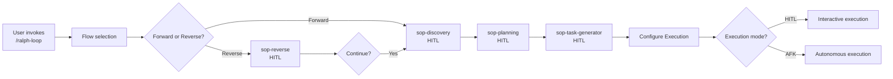

# Supervision Modes Reference

Two approaches based on human involvement level.

---

## Planning Phase: ALWAYS HITL

**CRITICAL: Planning is ALWAYS interactive. No exceptions.**

The planning phase uses SOP skills and requires human involvement:



### Planning Characteristics

- **Interactive Q&A**: One question at a time
- **User decisions**: You propose, user chooses
- **Incremental validation**: Confirm alignment after each phase
- **Document everything**: All Q&A captured in specs
- **Non-negotiable**: Cannot skip or automate

### Planning Duration

| Phase | Typical Duration | User Involvement |
|-------|-----------------|------------------|
| sop-discovery | 10-20 min | High - answering questions |
| sop-planning | 20-40 min | Medium - reviewing options |
| sop-task-generator | 5-15 min | Low - approving task list |
| Configuration | 2-5 min | High - choosing execution mode |

**Total planning time:** 40-80 minutes for typical projects

---

## Execution Phase: HITL or AFK

After planning completes, choose execution supervision mode.

## HITL (Human-in-the-Loop) Execution

### Use For

- Learning how Ralph handles your codebase
- Risky tasks (auth, payments, migrations)
- Architectural decisions that need approval
- First-time setup of a new project

### When to Use HITL Execution

- Learning how Ralph handles your codebase
- Risky tasks (auth, payments, migrations)
- Architectural decisions that need approval
- First-time setup of a new project
- Testing new quality gates

### Configuration Methods

#### 1. Iteration Limits

```bash
./loop.sh specs/my-feature/ 1     # Single iteration, review after
./loop.sh specs/my-feature/ 5     # Few iterations, frequent review
```

#### 2. Checkpoint Mode (Preferred)

In `.ralph/config.sh`:

```bash
CHECKPOINT_MODE="iterations"
CHECKPOINT_INTERVAL=5           # Pause every 5 iterations
```

Or milestone-based:

```bash
CHECKPOINT_MODE="milestones"
CHECKPOINT_ON_MODULE=true       # Pause when module completes
```

### Behavior

- Short runs or checkpoints
- Human reviews after each batch
- Adjust Signs and specs between runs
- Incremental confidence building
- Safe experimentation

---

## AFK (Away-From-Keyboard) Execution

### When to Use AFK Execution

- Bulk implementation work
- Low-risk, well-defined tasks
- Overnight batch processing
- Tasks with strong test coverage
- Confident in quality gates
- Well-understood codebase

### Configuration

```bash
./loop.sh specs/my-feature/ 20    # Medium batch
./loop.sh specs/my-feature/ 50    # Long overnight run
./loop.sh specs/my-feature/       # Unlimited (until complete)
```

Or in `.ralph/config.sh`:

```bash
CHECKPOINT_MODE="none"            # No interruptions
MAX_RUNTIME=0                     # Unlimited time (default)
```

### Behavior

- Long runs (10-50+ iterations)
- Circuit breaker handles failures
- Review aggregated results at end
- Trust backpressure gates
- Workers operate autonomously
- Passive monitoring only

### Safety Features

- **Circuit breaker**: Stops after 3 consecutive failures
- **Context monitoring**: Exits when >80% context used
- **Task abandonment detection**: Exits if same task fails 3+ times
- **Loop thrashing detection**: Detects oscillating patterns
- **Quality gates**: All gates must pass before commit

---

## The Two-Phase Structure

Ralph-loop has a strict separation between planning and execution:

| Phase | Supervision | Duration | Purpose |
|-------|-------------|----------|---------|
| **Planning** | HITL (mandatory) | 40-80 min | Define what to build |
| **Execution** | HITL or AFK (choice) | 1-8 hours | Build it with quality |

### Why This Separation?

- **Planning requires human judgment**: Architectural decisions, trade-offs, scope
- **Execution benefits from fresh context**: Each worker gets clean 200K token window
- **Planning is one-time cost**: Pay once, execute multiple times if needed
- **Execution is parallelizable**: Multiple workers can execute simultaneously

---

## Progression Path for Execution

```
First project       -> HITL (1-5 iterations)  -> Learn patterns
Stable codebase     -> HITL (checkpoints)     -> Supervised autonomy
High test coverage  -> AFK (20-50)            -> Bulk work
Full confidence     -> AFK (unlimited)        -> Overnight runs
```

**Recommendation:**
1. Always HITL planning (non-negotiable)
2. Start with HITL execution (1-5 iterations)
3. Graduate to checkpoint-based HITL
4. Move to AFK when confident

---

## Security Considerations

**Use protection:**
- Run with `--dangerously-skip-permissions` in sandbox only
- "It's not if it gets popped, it's when"
- Isolated environment (Docker/VM) recommended for AFK

### Docker Sandbox Setup (Optional)

```bash
# Create isolated container
docker run -it --rm \
  -v $(pwd):/workspace \
  -w /workspace \
  node:20 bash

# Inside container
npm install
./loop.sh
```

This prevents any filesystem damage outside the mounted volume.
