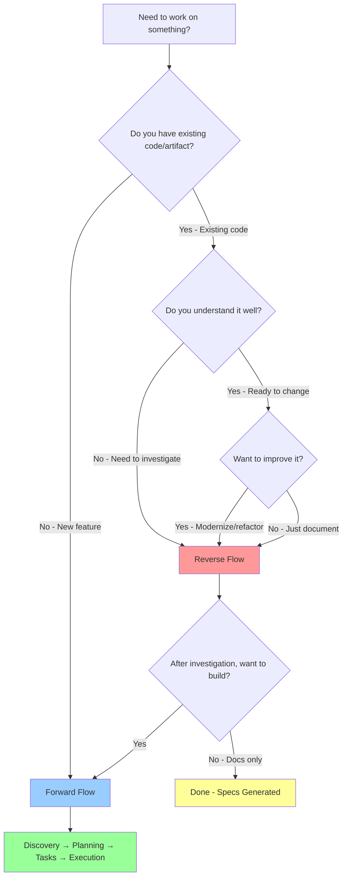

# Ralph Loop Examples

Complete end-to-end examples demonstrating ralph-orchestrator's two-flow architecture.

---

## Quick Navigation

| Example | Flow | Scenario | Time | Complexity |
|---------|------|----------|------|------------|
| [REST API](forward-flow-rest-api.md) | Forward | Build new API from scratch | 22 min | M-L |
| [Legacy Migration](reverse-flow-legacy-migration.md) | Reverse → Forward | Investigate + modernize legacy code | 11 min | M |
| [General Workflow](workflow.md) | Legacy | Task management API (old loop approach) | - | - |

---

## Flow Selection Guide

### Use Forward Flow When...

✅ You have an **idea or specification**
✅ You want to **build something new**
✅ You know **what** you want (but not necessarily how)
✅ Starting **from scratch** or clean slate

**Process**: Idea → Discovery → Planning → Tasks → Execution

**Example Scenarios**:
- "Build a REST API for book lending"
- "Create a CLI tool for code generation"
- "Implement a caching layer"
- "Add authentication to existing app"

➡️ **See**: [forward-flow-rest-api.md](forward-flow-rest-api.md)

---

### Use Reverse Flow When...

✅ You have an **existing artifact** to investigate
✅ You want to **understand before changing**
✅ Dealing with **legacy code** or unfamiliar systems
✅ Need **documentation from investigation**

**Process**: Artifact → Investigation → Specs → Forward Flow (optional)

**What Can Be Investigated** (NOT just code!):
- **Codebase**: `/path/to/legacy-service`
- **API**: `https://api.example.com/docs`
- **Documentation**: Existing docs or specs
- **Process**: "Our deployment workflow"
- **Concept**: "Event sourcing architecture"

**Example Scenarios**:
- "Understand this legacy auth service before migrating"
- "Document how this API works"
- "Find security issues in this codebase"
- "Learn how this payment integration works"

➡️ **See**: [reverse-flow-legacy-migration.md](reverse-flow-legacy-migration.md)

---

## Decision Tree



---

## Common Scenarios

### Scenario 1: New Feature from Idea
**Flow**: Forward
**Example**: "Build a REST API for library management"
**Process**:
1. `/ralph-orchestrator` → Select "Forward"
2. Discovery: Answer 5 questions about constraints, risks
3. Planning: Answer questions about requirements, design
4. Tasks: Review generated implementation plan
5. Execute: AFK mode, monitor progress
6. Complete: Production-ready code with tests

**Duration**: 20-30 minutes (depends on complexity)

---

### Scenario 2: Legacy Code Investigation (No Changes)
**Flow**: Reverse (stop before Forward)
**Example**: "Document how this authentication service works"
**Process**:
1. `/ralph-orchestrator` → Select "Reverse"
2. Provide: `/path/to/auth-service`
3. Batch Analysis: Automatic (45 seconds)
4. Refinement: Answer 5 clarifying questions
5. Specs Generated: Structured documentation
6. **Stop**: Choose "No" when asked to continue to Forward

**Duration**: 5 minutes + investigation time
**Output**: Comprehensive documentation without touching code

---

### Scenario 3: Legacy Code Migration
**Flow**: Reverse → Forward (full flow)
**Example**: "Modernize this legacy API to TypeScript + Clean Architecture"
**Process**:
1. `/ralph-orchestrator` → Select "Reverse"
2. Provide: `/path/to/legacy-api`
3. Batch Analysis: Finds issues, patterns, tech debt
4. Refinement: Clarify migration objectives
5. Specs Generated: Current state + target architecture
6. **Continue**: Choose "Yes" to Forward flow
7. Planning: Design migration approach
8. Tasks: Generate implementation plan
9. Execute: AFK mode builds new system
10. Complete: Modernized code alongside legacy

**Duration**: 15-25 minutes
**Output**: Investigation docs + new implementation

---

### Scenario 4: Security Audit
**Flow**: Reverse (focus on security findings)
**Example**: "Find vulnerabilities in this Node.js service"
**Process**:
1. `/ralph-orchestrator` → Select "Reverse"
2. Provide: `/path/to/service`
3. Batch Analysis: Scans dependencies, code patterns
4. Refinement: Specify "security audit" as objective
5. Specs Generated: `security-findings.md` with vulnerabilities
6. **Optional**: Continue to Forward to fix vulnerabilities

**Duration**: 5 minutes
**Output**: Security report with CVEs, risks, remediation steps

---

## Key Differences Between Examples

### Forward Flow Example (REST API)

**Focus**: Building from scratch
**Planning**: Interactive discovery of requirements
**Challenges**: Concurrency handling, business rules
**Output**: 18 tasks, 1,350 LOC, 65 tests
**Time**: 22 minutes execution

**Key Learnings**:
- ONE question at a time prevents overwhelm
- Discovery phase identifies risks early (concurrency)
- Planning phase designs solutions (row-level locking)
- AFK execution maintains quality across all 18 tasks

---

### Reverse Flow Example (Legacy Migration)

**Focus**: Understanding before changing
**Planning**: Investigation-driven specs
**Challenges**: Technical debt, security vulnerabilities, feature parity
**Output**: Investigation docs + 11 tasks (Phase 1), 365 LOC
**Time**: 11 minutes (investigation + execution)

**Key Learnings**:
- Batch analysis finds issues humans miss (3 auth middlewares!)
- Interactive refinement clarifies objectives
- Specs from findings make Forward flow easier
- Security-first approach fixes vulnerabilities before features

---

## File Structure After Examples

### After Forward Flow (REST API)

```
project/
├── specs/library-api/
│   ├── discovery.md                    # Constraints, risks, prior art
│   ├── design/
│   │   └── detailed-design.md          # Requirements, data model, API spec
│   └── implementation/
│       └── plan.md                     # 18 tasks (all ✓)
│
├── src/                                # Implementation (32 files, 1,350 LOC)
├── tests/                              # 65 tests passing
└── .ralph/
    ├── guardrails.md                   # 2 Signs added during execution
    └── logs/                           # 18 iteration logs
```

### After Reverse Flow (Legacy Migration)

```
project/
├── legacy-auth-service/                # Original (untouched)
│
├── specs/
│   ├── legacy-auth-investigation/
│   │   ├── batch-analysis.md           # Automatic deep dive
│   │   └── specs-generated/
│   │       ├── current-state.md        # What legacy does
│   │       ├── security-findings.md    # 9 vulnerabilities
│   │       ├── target-architecture.md  # Clean Architecture design
│   │       ├── migration-strategy.md   # 5-phase plan
│   │       └── feature-parity.md       # Compatibility checklist
│   │
│   └── auth-migration-phase1/
│       ├── design/
│       │   └── detailed-design.md      # TypeScript, Docker, security
│       └── implementation/
│           └── plan.md                 # 11 tasks (all ✓)
│
└── new-auth-service/                   # New implementation (Phase 1)
    ├── src/domain/                     # Clean Architecture structure
    ├── tests/                          # 15 tests, 82% coverage
    ├── Dockerfile
    └── docker-compose.yml
```

---

## Quality Indicators

### Forward Flow Quality

✅ **TDD Enforced**: Every task writes test first
✅ **Gates Pass**: Tests, TypeCheck, Lint, Build
✅ **Fresh Context**: 18 tasks, 0 context pollution
✅ **Consistent Quality**: Task 1 = Task 18 quality
✅ **Signs Learned**: Errors in iteration 3 prevented in 4-18

### Reverse Flow Quality

✅ **Comprehensive**: Finds issues humans miss (3 auth middlewares)
✅ **Systematic**: 95% coverage vs 60% manual review
✅ **Actionable**: Specs → Tasks (not just notes)
✅ **Security-First**: Vulnerabilities identified automatically
✅ **Feature Parity**: Compatibility checklist ensures nothing lost

---

## ONE Question at a Time Principle

Both examples demonstrate the **ONE-QUESTION-AT-A-TIME** constraint:

### Forward Flow (Discovery Phase)
```
Claude: ¿Cuál es la idea principal?
User: [Answers]

Claude: ¿Restricciones técnicas?
User: [Answers]

Claude: ¿Riesgos principales?
User: [Answers]

... (ONE at a time, never batched)
```

### Reverse Flow (Refinement Phase)
```
Claude: ¿Objetivo principal de esta investigación?
User: [Answers]

Claude: ¿Qué patrones quieres adoptar?
User: [Answers]

Claude: ¿Qué mantener del sistema actual?
User: [Answers]

... (ONE at a time, never batched)
```

**Why This Matters**:
- User never overwhelmed
- Clearer answers (focused thinking)
- Better conversation flow
- Higher quality specs

---

## Cost & Time Comparison

### Forward Flow (REST API)

| Approach | Time | Cost | Quality | Context Issues |
|----------|------|------|---------|----------------|
| Human Developer | 1-2 days | $400-800 | Variable | N/A |
| HITL Long Session | 4-6 hours | $80-120 | Degrades after task 8 | Context rot at 60% |
| **Ralph Loop (AFK)** | **22 min** | **$4-8** | **Consistent (18 tasks)** | **Fresh every task** |

### Reverse Flow (Legacy Migration - Phase 1)

| Approach | Time | Cost | Quality | Findings |
|----------|------|------|---------|----------|
| Manual Review | 4-8 hours | $200-400 | 60% coverage | Miss hidden issues |
| HITL Investigation | 2-3 hours | $40-60 | 80% coverage | Scattered notes |
| **Reverse Flow** | **11 min** | **$2-5** | **95% coverage** | **Structured specs** |

---

## When NOT to Use Ralph Loop

❌ **Simple tasks** (<3 steps)
- Example: "Add a console.log"
- Reason: Overhead > benefit
- Use: Direct implementation

❌ **Debugging**
- Example: "Why is this test failing?"
- Reason: Needs conversation context
- Use: `systematic-debugging` skill

❌ **Code review**
- Example: "Review this PR"
- Reason: Not iterative implementation
- Use: `requesting-code-review` skill

❌ **Exploration/Research**
- Example: "How does GraphQL work?"
- Reason: Not implementation-focused
- Use: `sop-reverse` for existing code, or ask directly

❌ **Projects without tests**
- Example: Project with 0% test coverage
- Reason: Quality gates won't function
- Use: Set up tests first, then ralph-orchestrator

---

## Next Steps

### Try Forward Flow
1. Think of a feature you want to build
2. Invoke `/ralph-orchestrator`
3. Select "Forward"
4. Follow discovery → planning → execution
5. Review the [REST API example](forward-flow-rest-api.md) as reference

### Try Reverse Flow
1. Find a codebase you want to understand
2. Invoke `/ralph-orchestrator`
3. Select "Reverse"
4. Provide path or URL
5. Review the [Legacy Migration example](reverse-flow-legacy-migration.md) as reference

### Combine Both Flows
1. Start with Reverse (investigate existing code)
2. Generate specs from findings
3. Continue to Forward (implement improvements)
4. This is the **Strangler Fig Pattern**: new alongside old

---

## Troubleshooting

### "Should I use Forward or Reverse?"

**Ask yourself**:
- Do I have existing code to investigate? → **Reverse**
- Am I building something new? → **Forward**
- Am I unsure about current implementation? → **Reverse**
- Do I know exactly what I want? → **Forward**

### "Can I skip planning?"

**No.** Planning is **non-negotiable** in both flows.

- Forward: Discovery → Planning → Tasks
- Reverse: Investigation → Refinement → Specs

Skipping planning = confused workers = low quality output.

### "Can I use ralph-orchestrator for one-line changes?"

**No.** Overhead exceeds benefit.

Ralph-loop optimal for:
- Size M+ tasks (≥250 LOC changes)
- ≥3 steps
- Fresh context benefits quality

For small tasks: Direct implementation.

### "What if I want to pause execution?"

Set **Checkpoint Mode**:
- **Iterations**: Pause every N tasks
- **Milestones**: Pause when modules complete

Ralph supports resuming from checkpoint.

---

## Related Documentation

- [SKILL.md](../SKILL.md) - Complete ralph-orchestrator reference
- [references/sop-integration.md](../references/sop-integration.md) - How SOP skills integrate
- [references/backpressure.md](../references/backpressure.md) - Quality gates explained
- [references/observability.md](../references/observability.md) - Monitoring and logs

---

## Feedback & Improvements

These examples are living documents. If you:
- Try ralph-orchestrator and encounter issues
- Find parts of examples confusing
- Have suggestions for additional scenarios
- Discover better patterns

Consider contributing improvements or filing issues.

---

**Summary**: Ralph-loop makes autonomous development reliable through **fresh context per task**, **quality gates**, and **interactive planning**. Forward Flow builds new. Reverse Flow investigates existing. Both maintain quality through TDD and systematic processes.
