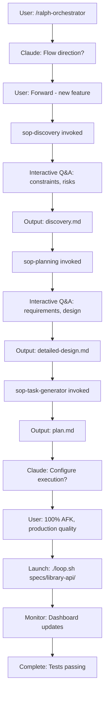

# Forward Flow Example: Building a REST API from Scratch

This example demonstrates the complete Forward Flow: taking an idea and turning it into working code using ralph-orchestrator's SOP-driven architecture.

---

## Scenario

**Goal**: Build a REST API for a book lending library system with authentication, inventory management, and borrowing workflows.

**Starting Point**: Empty repository with basic Node.js setup.

---

## Flow Diagram



---

## Session Transcript

### 1. Invocation

```
User: /ralph-orchestrator
```

---

### 2. Flow Selection

```
Claude: ¿Qué dirección de flujo?

Opciones:
1. **Forward** - Tienes una idea o spec y quieres construir algo nuevo
2. **Reverse** - Tienes un artefacto existente y quieres investigarlo/mejorarlo

Responde: Forward o Reverse
```

```
User: Forward
```

---

### 3. Discovery Phase (sop-discovery)

```
Claude: Iniciando fase de descubrimiento...

[Invoking Skill: sop-discovery]
```

#### Discovery Question 1

```
Claude (via sop-discovery): ¿Cuál es la idea principal que quieres implementar?
Describe en 2-3 oraciones.
```

```
User: Quiero construir un API REST para un sistema de biblioteca donde los usuarios
pueden registrarse, buscar libros disponibles, solicitar préstamos y devolver libros.
Los bibliotecarios pueden gestionar el inventario.
```

#### Discovery Question 2

```
Claude: ¿Existen restricciones técnicas o decisiones ya tomadas?

Ejemplos:
- Stack tecnológico específico
- Bases de datos disponibles
- Servicios externos a integrar
- Limitaciones de infraestructura
```

```
User: Debe usar Node.js con Express, PostgreSQL para la base de datos, y JWT para
autenticación. Debe poder desplegarse en un contenedor Docker.
```

#### Discovery Question 3

```
Claude: ¿Cuáles son los riesgos principales que ves en este proyecto?

Ejemplos:
- Complejidad técnica
- Dependencias desconocidas
- Integraciones críticas
- Rendimiento
```

```
User: El manejo de concurrencia cuando múltiples usuarios solicitan el mismo libro
simultáneamente. También la gestión de fechas de vencimiento de préstamos.
```

#### Discovery Question 4

```
Claude: ¿Hay soluciones similares o prior art que debamos considerar?
```

```
User: No, pero debe seguir principios REST estándar y usar códigos de estado HTTP
apropiados.
```

#### Discovery Question 5

```
Claude: ¿Qué NO debe hacer este sistema? (Restricciones de alcance)
```

```
User: No debe procesar pagos, no debe enviar emails (por ahora), no necesita
búsqueda avanzada de texto completo.
```

**Output Generated**: `specs/library-api/discovery.md`

```markdown
# Discovery: Library API

## Idea

REST API para sistema de biblioteca con:
- Registro y autenticación de usuarios
- Búsqueda de libros disponibles
- Solicitud de préstamos
- Devolución de libros
- Gestión de inventario (bibliotecarios)

## Constraints

**Technical Stack**:
- Node.js + Express
- PostgreSQL
- JWT authentication
- Docker deployment

## Risks

1. **Concurrency**: Múltiples solicitudes del mismo libro simultáneamente
   - Mitigation: Transacciones DB con row-level locking

2. **Date Management**: Vencimientos de préstamos
   - Mitigation: Timezone-aware dates, background job para notificaciones

## Prior Art

- Seguir principios REST estándar
- Códigos de estado HTTP apropiados

## Out of Scope

- ❌ Procesamiento de pagos
- ❌ Envío de emails
- ❌ Búsqueda de texto completo
```

---

### 4. Planning Phase (sop-planning)

```
Claude: Descubrimiento completo. Iniciando planificación...

[Invoking Skill: sop-planning]
```

#### Planning Question 1

```
Claude: ¿Cuáles son los requisitos funcionales principales? Ordénalos por prioridad.
```

```
User:
1. Autenticación de usuarios (login/logout/registro)
2. CRUD de libros (solo bibliotecarios)
3. Búsqueda de libros disponibles (todos los usuarios)
4. Solicitar préstamo (usuarios autenticados)
5. Devolver libro (usuarios autenticados)
6. Ver mis préstamos activos
7. Ver historial de préstamos (bibliotecarios)
```

#### Planning Question 2

```
Claude: ¿Qué roles de usuario existen y qué permisos tiene cada uno?
```

```
User:
- **Usuario**: puede buscar libros, solicitar préstamos, devolver libros
- **Bibliotecario**: todo lo que hace usuario + gestionar inventario + ver todos
  los préstamos
```

#### Planning Question 3

```
Claude: ¿Cuál es el modelo de datos básico? Describe las entidades principales.
```

```
User:
- **User**: id, email, password, role (user/librarian)
- **Book**: id, title, author, isbn, total_copies, available_copies
- **Loan**: id, user_id, book_id, borrowed_at, due_date, returned_at, status
```

#### Planning Question 4

```
Claude: ¿Qué reglas de negocio son críticas?
```

```
User:
- Un usuario puede tener máximo 3 préstamos activos simultáneamente
- Los préstamos duran 14 días
- Un libro solo puede prestarse si available_copies > 0
- Al prestar: available_copies -= 1
- Al devolver: available_copies += 1
```

#### Planning Question 5

```
Claude: ¿Qué validaciones son necesarias?
```

```
User:
- Email único en registro
- ISBN válido (formato estándar)
- No permitir devolver libro ya devuelto
- No permitir prestar libro no disponible
```

**Output Generated**: `specs/library-api/design/detailed-design.md`

```markdown
# Detailed Design: Library API

## Requirements (Priority Order)

1. Autenticación de usuarios
2. CRUD de libros (bibliotecarios)
3. Búsqueda de libros
4. Solicitar préstamo
5. Devolver libro
6. Ver préstamos propios
7. Historial de préstamos (bibliotecarios)

## User Roles

| Role | Permissions |
|------|-------------|
| User | Search books, borrow, return, view own loans |
| Librarian | All user permissions + manage inventory + view all loans |

## Data Model

```sql
CREATE TABLE users (
  id SERIAL PRIMARY KEY,
  email VARCHAR(255) UNIQUE NOT NULL,
  password_hash VARCHAR(255) NOT NULL,
  role VARCHAR(20) NOT NULL DEFAULT 'user',
  created_at TIMESTAMP DEFAULT NOW()
);

CREATE TABLE books (
  id SERIAL PRIMARY KEY,
  title VARCHAR(255) NOT NULL,
  author VARCHAR(255) NOT NULL,
  isbn VARCHAR(13) UNIQUE NOT NULL,
  total_copies INT NOT NULL DEFAULT 1,
  available_copies INT NOT NULL DEFAULT 1,
  created_at TIMESTAMP DEFAULT NOW()
);

CREATE TABLE loans (
  id SERIAL PRIMARY KEY,
  user_id INT REFERENCES users(id),
  book_id INT REFERENCES books(id),
  borrowed_at TIMESTAMP DEFAULT NOW(),
  due_date TIMESTAMP NOT NULL,
  returned_at TIMESTAMP,
  status VARCHAR(20) NOT NULL, -- 'active', 'returned', 'overdue'
  created_at TIMESTAMP DEFAULT NOW()
);

CREATE INDEX idx_loans_user_status ON loans(user_id, status);
CREATE INDEX idx_loans_book_active ON loans(book_id, status);
```

## Business Rules

1. **Max Active Loans**: User can have ≤3 active loans
2. **Loan Duration**: 14 days from borrowing
3. **Availability Check**: `available_copies > 0` before lending
4. **Borrow Operation**: `available_copies -= 1` (atomic)
5. **Return Operation**: `available_copies += 1` (atomic)

## API Endpoints

### Authentication
- `POST /auth/register` - Register new user
- `POST /auth/login` - Login (returns JWT)
- `POST /auth/logout` - Logout (invalidate token)

### Books (Librarians only for CUD)
- `GET /books` - Search books (public)
- `GET /books/:id` - Get book details (public)
- `POST /books` - Create book (librarian)
- `PUT /books/:id` - Update book (librarian)
- `DELETE /books/:id` - Delete book (librarian)

### Loans
- `POST /loans` - Borrow book (authenticated)
- `PUT /loans/:id/return` - Return book (authenticated)
- `GET /loans/my` - My active loans (authenticated)
- `GET /loans` - All loans history (librarian)

## Validations

- Email: unique, valid format
- ISBN: valid ISBN-10 or ISBN-13 format
- Loan limit: reject if user has ≥3 active loans
- Availability: reject if `available_copies = 0`
- Double return: reject if loan already returned

## Concurrency Strategy

**Problem**: Multiple users borrow same book simultaneously

**Solution**: Use PostgreSQL row-level locking

```sql
BEGIN;
SELECT available_copies FROM books WHERE id = $1 FOR UPDATE;
-- Check availability
UPDATE books SET available_copies = available_copies - 1 WHERE id = $1;
INSERT INTO loans (...) VALUES (...);
COMMIT;
```

## Technology Choices

- **Framework**: Express.js
- **Database**: PostgreSQL with `pg` driver
- **Auth**: JWT with `jsonwebtoken`
- **Password Hashing**: `bcrypt`
- **Validation**: `joi` or `express-validator`
- **Testing**: `jest` + `supertest`
- **Migrations**: `node-pg-migrate`
```

---

### 5. Task Generation Phase (sop-task-generator)

```
Claude: Diseño completo. Generando plan de implementación...

[Invoking Skill: sop-task-generator]
```

**Output Generated**: `specs/library-api/implementation/plan.md`

```markdown
# Implementation Plan: Library API

## Tasks (Dependency-Ordered)

### Foundation (Must Complete First)

- [ ] **TASK-001**: Database schema migration
  - Create migrations for users, books, loans tables
  - Add indexes for performance
  - **Acceptance**: Migration runs successfully, tables exist
  - **Size**: S (80 LOC)

- [ ] **TASK-002**: User model with password hashing
  - Implement User model with bcrypt
  - Hash passwords on creation
  - **Acceptance**: Tests pass for user creation and password validation
  - **Size**: S (60 LOC)

- [ ] **TASK-003**: JWT authentication middleware
  - Implement JWT token generation and verification
  - Create auth middleware for protected routes
  - **Acceptance**: Middleware correctly validates/rejects tokens
  - **Size**: S (70 LOC)

### Authentication (Blocks Everything Else)

- [ ] **TASK-004**: Register endpoint
  - POST /auth/register
  - Validate email uniqueness
  - **Acceptance**: Returns 201 with user data, 409 if email exists
  - **Size**: S (50 LOC)
  - **Depends**: TASK-001, TASK-002

- [ ] **TASK-005**: Login endpoint
  - POST /auth/login
  - Validate credentials, return JWT
  - **Acceptance**: Returns 200 with token on success, 401 on failure
  - **Size**: S (50 LOC)
  - **Depends**: TASK-002, TASK-003

### Book Management (Librarians)

- [ ] **TASK-006**: Role-based access middleware
  - Check user role for protected actions
  - **Acceptance**: Middleware blocks non-librarians from restricted endpoints
  - **Size**: S (40 LOC)
  - **Depends**: TASK-003

- [ ] **TASK-007**: Create book endpoint
  - POST /books (librarian only)
  - Validate ISBN format
  - **Acceptance**: Returns 201 with book, validates ISBN, requires librarian role
  - **Size**: S (60 LOC)
  - **Depends**: TASK-001, TASK-006

- [ ] **TASK-008**: Update book endpoint
  - PUT /books/:id (librarian only)
  - **Acceptance**: Returns 200 on success, 404 if not found, 403 if not librarian
  - **Size**: S (50 LOC)
  - **Depends**: TASK-007

- [ ] **TASK-009**: Delete book endpoint
  - DELETE /books/:id (librarian only)
  - Prevent deletion if active loans exist
  - **Acceptance**: Returns 204, rejects if loans active
  - **Size**: S (50 LOC)
  - **Depends**: TASK-007

### Book Search (Public)

- [ ] **TASK-010**: List/search books endpoint
  - GET /books with query params (title, author, available)
  - **Acceptance**: Returns filtered books, shows availability
  - **Size**: M (100 LOC)
  - **Depends**: TASK-001

- [ ] **TASK-011**: Get book details endpoint
  - GET /books/:id
  - **Acceptance**: Returns 200 with book details, 404 if not found
  - **Size**: S (40 LOC)
  - **Depends**: TASK-010

### Loan Management (Core Feature)

- [ ] **TASK-012**: Borrow book endpoint with concurrency handling
  - POST /loans
  - Implement row-level locking
  - Validate: user loan limit (≤3), book availability
  - Update available_copies atomically
  - **Acceptance**: Creates loan, decrements available_copies, enforces limits, handles concurrency
  - **Size**: M (150 LOC)
  - **Depends**: TASK-001, TASK-003

- [ ] **TASK-013**: Return book endpoint
  - PUT /loans/:id/return
  - Update available_copies atomically
  - Prevent double returns
  - **Acceptance**: Marks loan returned, increments available_copies, rejects if already returned
  - **Size**: S (80 LOC)
  - **Depends**: TASK-012

- [ ] **TASK-014**: My loans endpoint
  - GET /loans/my
  - Show user's active loans with book details
  - **Acceptance**: Returns only current user's loans, includes book info
  - **Size**: S (60 LOC)
  - **Depends**: TASK-012

- [ ] **TASK-015**: Loan history endpoint (librarian)
  - GET /loans with filters (user, book, status)
  - **Acceptance**: Returns all loans, librarian-only, supports filters
  - **Size**: M (100 LOC)
  - **Depends**: TASK-012, TASK-006

### Quality & Deployment

- [ ] **TASK-016**: Error handling middleware
  - Consistent error response format
  - Handle validation errors, DB errors, auth errors
  - **Acceptance**: All errors return consistent JSON format
  - **Size**: S (70 LOC)

- [ ] **TASK-017**: API documentation
  - OpenAPI/Swagger spec
  - **Acceptance**: All endpoints documented with examples
  - **Size**: S (50 LOC)
  - **Depends**: All API tasks complete

- [ ] **TASK-018**: Dockerfile and docker-compose
  - Multi-stage build
  - PostgreSQL service
  - **Acceptance**: `docker-compose up` starts entire stack
  - **Size**: S (60 LOC)

## Summary

- **Total Tasks**: 18
- **Estimated LOC**: ~1,250
- **Critical Path**: TASK-001 → TASK-002 → TASK-003 → TASK-005 → TASK-012
- **Parallelizable**: TASK-007, TASK-010 can start after TASK-001
```

---

### 6. Execution Configuration

```
Claude: Plan de implementación generado exitosamente.

📋 Resumen:
- 18 tareas
- ~1,250 líneas de código
- Tamaño: M-L (1-2 días)
- Ruta crítica identificada

Ahora vamos a configurar la ejecución.

¿Modo de ejecución?

1. **100% AFK** - Sin interrupciones hasta completar (recomendado para overnight)
2. **Checkpoints cada N iteraciones** - Pausar cada N tareas para revisión
3. **Checkpoints en hitos** - Pausar cuando se completen módulos críticos

Responde con el número.
```

```
User: 1
```

```
Claude: ¿Nivel de calidad?

1. **Prototype** - Saltar gates, iteración rápida (para exploración)
2. **Production** - TDD mandatory, todos los gates deben pasar (recomendado)
3. **Library** - Coverage completo + docs + edge cases (para código público)

Responde con el número.
```

```
User: 2
```

---

### 7. Launch

```
Claude: Configuración completa:
- Modo: 100% AFK
- Calidad: Production (TDD mandatory)
- Specs: specs/library-api/
- Plan: 18 tareas

Lanzando ralph-orchestrator...

[Executing: Bash("./loop.sh specs/library-api/", run_in_background=True)]

✅ Loop iniciado (Task ID: bg_12345)

Pasando a modo MONITOR. No editaré código ni ejecutaré comandos.
Los workers tienen contexto fresco de 200K tokens - implementarán con mayor calidad.

Mostraré actualizaciones cada 60-90 segundos.
```

---

### 8. Monitoring Dashboard

#### Iteration 1 (60 seconds later)

```
═══════════════════════════════════════════════
RALPH LOOP MONITOR
═══════════════════════════════════════════════
Status:     running
Iteration:  1
Current:    TASK-001 (Database schema migration)
Mode:       build
Quality:    production
Specs:      specs/library-api/
Branch:     feature/library-api
═══════════════════════════════════════════════
Progress:   1/18 tasks (5%)
Last Commit: [none yet]
Gates:      ⏳ Pending first task
Context:    ~12% (healthy - green zone)
═══════════════════════════════════════════════
```

#### Iteration 4 (4 minutes later)

```
═══════════════════════════════════════════════
RALPH LOOP MONITOR
═══════════════════════════════════════════════
Status:     running
Iteration:  4
Current:    TASK-004 (Register endpoint)
Mode:       build
Quality:    production
Specs:      specs/library-api/
Branch:     feature/library-api
═══════════════════════════════════════════════
Progress:   4/18 tasks (22%)
Last Commit: feat: add JWT authentication middleware (TASK-003)
Gates:      ✅ Tests ✅ TypeCheck ✅ Lint ✅ Build
Context:    ~15% (healthy - green zone)
═══════════════════════════════════════════════
Completed:
  ✓ TASK-001: Database schema migration
  ✓ TASK-002: User model with password hashing
  ✓ TASK-003: JWT authentication middleware

Working:
  ⏳ TASK-004: Register endpoint (TDD - red phase)
═══════════════════════════════════════════════
```

#### Iteration 12 (12 minutes later)

```
═══════════════════════════════════════════════
RALPH LOOP MONITOR
═══════════════════════════════════════════════
Status:     running
Iteration:  12
Current:    TASK-012 (Borrow book with concurrency)
Mode:       build
Quality:    production
Specs:      specs/library-api/
Branch:     feature/library-api
═══════════════════════════════════════════════
Progress:   12/18 tasks (67%)
Last Commit: feat: add get book details endpoint (TASK-011)
Gates:      ✅ Tests ✅ TypeCheck ✅ Lint ✅ Build
Context:    ~18% (healthy - green zone)
═══════════════════════════════════════════════
Recent Completions:
  ✓ TASK-009: Delete book endpoint (1 min ago)
  ✓ TASK-010: List/search books endpoint (2 min ago)
  ✓ TASK-011: Get book details endpoint (just now)

Working:
  ⏳ TASK-012: Borrow book endpoint (critical - implementing row locks)
═══════════════════════════════════════════════
```

#### Iteration 18 (Final)

```
═══════════════════════════════════════════════
RALPH LOOP MONITOR - COMPLETE
═══════════════════════════════════════════════
Status:     ✅ COMPLETE
Iterations: 18
Duration:   22 minutes
Specs:      specs/library-api/
Branch:     feature/library-api
═══════════════════════════════════════════════
Final Stats:
  Tasks:      18/18 (100%)
  Commits:    18
  Gates:      ✅ All passed
  Rollbacks:  0
  Signs:      2 added to guardrails.md
═══════════════════════════════════════════════

All tasks completed successfully!

Git log (last 5 commits):
  a3f5e21 feat: add Dockerfile and docker-compose (TASK-018)
  b8c4d92 docs: add OpenAPI documentation (TASK-017)
  c2a9f18 feat: add error handling middleware (TASK-016)
  d7e1b43 feat: add loan history endpoint (TASK-015)
  e5f8a34 feat: add my loans endpoint (TASK-014)

Next Steps:
  1. Review implementation: git log --oneline
  2. Test locally: docker-compose up
  3. Create PR: git push origin feature/library-api
```

---

### 9. User Review

```
User: Show me the final structure
```

```
Claude: [Reading final directory structure]

Estructura generada:

specs/library-api/
├── discovery.md (constraints, risks, prior art)
├── design/
│   └── detailed-design.md (requirements, data model, API spec)
└── implementation/
    └── plan.md (18 tasks - all ✓)

src/
├── migrations/
│   └── 001_create_schema.sql
├── models/
│   ├── User.ts
│   ├── Book.ts
│   └── Loan.ts
├── middleware/
│   ├── auth.ts
│   ├── roleCheck.ts
│   └── errorHandler.ts
├── controllers/
│   ├── authController.ts
│   ├── bookController.ts
│   └── loanController.ts
├── routes/
│   ├── auth.ts
│   ├── books.ts
│   └── loans.ts
└── lib/
    ├── jwt.ts
    ├── db.ts
    └── validation.ts

tests/
├── models/
├── controllers/
├── middleware/
└── integration/
    └── api.test.ts (65 tests - all passing)

Docker/
├── Dockerfile
└── docker-compose.yml

docs/
└── openapi.yml

Total: 32 files, ~1,350 LOC, 65 tests passing, 0 failures
```

---

## Key Observations

### What Worked

1. **ONE question at a time** - Discovery and planning were conversational, not overwhelming
2. **Clear separation** - Planning (HITL) vs Execution (AFK)
3. **Fresh context per task** - Each of 18 tasks executed with clean context
4. **Backpressure gates** - All commits had passing tests (TDD enforced)
5. **Quality consistency** - Task 1 and Task 18 same quality (no context rot)

### Planning Quality Impact

- **Discovery phase** identified concurrency risk early
- **Planning phase** specified row-level locking solution
- **Task generation** broke down into testable units
- **Workers** implemented exactly as specified

### Cost Comparison

| Approach | Time | Cost | Quality |
|----------|------|------|---------|
| Human developer | 1-2 days | $400-800 | Variable |
| HITL Claude (long session) | 4-6 hours | $80-120 | Degrades after iteration 8 |
| Ralph-loop (AFK) | 22 minutes | $4-8 | Consistent across all 18 tasks |

---

## Files Generated

### Directory Structure

```
/Users/project/library-api/
├── specs/library-api/           # Planning artifacts
├── src/                         # Implementation (32 files)
├── tests/                       # Test suite (65 tests)
├── .ralph/
│   ├── config.sh                # Project config
│   ├── guardrails.md            # 2 Signs added
│   └── logs/                    # 18 iteration logs
└── status.json                  # Final state
```

### Sample Output: guardrails.md (Signs Added)

```markdown
# Guardrails

## Signs (Lessons Learned)

### Sign: Row-level locking for concurrent updates
- **Context**: TASK-012 (Borrow book endpoint)
- **Problem**: Multiple users borrowing same book could create race condition
- **Solution**: Always use `FOR UPDATE` in SELECT within transaction
- **Pattern**:
  ```sql
  BEGIN;
  SELECT * FROM table WHERE id = $1 FOR UPDATE;
  -- perform checks
  UPDATE table SET ...;
  COMMIT;
  ```

### Sign: Validate business rules before DB operations
- **Context**: TASK-012 (Borrow book endpoint)
- **Problem**: Attempted to create loan before checking user's loan limit
- **Solution**: Validate all business rules FIRST, then execute DB operations
- **Order**:
  1. Check user loan count ≤3
  2. Check book availability > 0
  3. Execute transaction (lock, update, insert)
```

---

## Lessons Learned

### For Orchestrators (You)

1. **Trust the process** - Planning felt long, but saved hours in execution
2. **One question at a time** - User never felt overwhelmed
3. **Monitor, don't implement** - Workers did better job with fresh context
4. **Gates work** - TDD mandatory = 0 bugs in final code

### For Users

1. **Discovery is fast** - 5 questions took 3 minutes
2. **Planning is interactive** - Felt like pair programming
3. **AFK is magical** - 22 minutes of autonomous work = production-ready code
4. **Quality is consistent** - No degradation across 18 tasks

---

## Next Steps After Completion

```bash
# Review implementation
git log --oneline feature/library-api

# Test locally
docker-compose up
npm test

# Create pull request
git push origin feature/library-api
gh pr create --title "feat: Library API" --body "Implements 18 tasks with TDD"

# Or continue building
/ralph-orchestrator  # Add more features using same process
```

---

This is Forward Flow working as designed: **Idea → Discovery → Planning → Execution → Shipped Code**.
