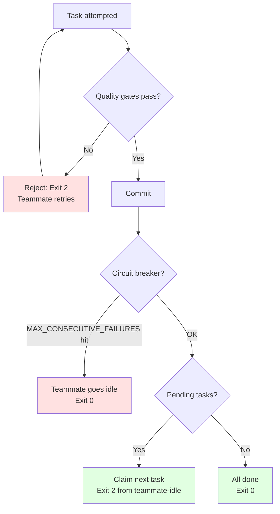

# Backpressure Reference

## Overview

This reference defines the quality gates that reject incomplete work in Ralph. Backpressure ensures work meets quality standards before proceeding.

---

## Standard Gates

**Constraints:**
- You MUST pass all gates before commit because partial passes indicate incomplete work
- You MUST NOT skip gates because quality is mandatory
- You SHOULD configure gates for your stack because defaults may not match your tooling

```bash
npm test          # Tests must pass
npm run typecheck # Types must check
npm run lint      # Lint must pass
npm run build     # Build must succeed
```

**All gates must pass before commit. No exceptions.**

---

## Safety-Based Backpressure

Safety limits provide execution-level backpressure by stopping teammates when failures accumulate.

**Constraints:**
- You MUST configure safety limits before execution because defaults may not match your risk tolerance
- You MUST diagnose root cause before restarting after circuit breaker because same failures will repeat
- You SHOULD monitor .ralph/failures.json during execution for early warning signs

### Configuration

In `.ralph/config.sh`:

```bash
# Circuit breaker: stop teammate after N consecutive gate failures
MAX_CONSECUTIVE_FAILURES=3
```

### Safety Mechanisms

#### Circuit Breaker (Consecutive Failures)

**Behavior:**
- Tracks consecutive gate failures per teammate in `.ralph/failures.json`
- When a teammate hits `MAX_CONSECUTIVE_FAILURES`, it goes idle (exit 0 via teammate-idle hook)
- Counter resets on any successful task completion
- Review `.ralph/failures.json` to diagnose the pattern

**Use when adjusting:**
- Lower (2) for high-risk tasks where early stopping matters
- Default (3) for standard work
- Higher (5) for exploratory tasks where some failures are expected

---

## Backpressure Stack

**Constraints:**
- You MUST understand all backpressure levels because each serves different purpose
- You MUST NOT override circuit breaker without diagnosis because repeated failures indicate issues
- You SHOULD trust quality gates because they enforce standards

Ralph implements backpressure at multiple levels:



### Backpressure Levels

| Level | Mechanism | Trigger | Action |
|-------|-----------|---------|--------|
| **Task** | Quality gates | Gate fails | Reject task completion (exit 2), teammate retries |
| **Circuit breaker** | MAX_CONSECUTIVE_FAILURES | N consecutive failures | Teammate goes idle (exit 0) |

---

## Task Sizing

**Constraints:**
- You MUST ensure one task fits one context window because exceeding context degrades quality
- You MUST split tasks that require >2000 lines to understand because complexity limits comprehension
- You MUST NOT batch unrelated work into single task because focused tasks are more reliable

One task = one context window.

### Right-sized

- Add database column + migration
- Add UI component to existing page
- Fix bug in login flow

### Too Large

- Build entire auth system
- Implement complete dashboard

**Test:** If >2000 lines to understand or >5 files -> split.

---

## Context Philosophy

Ralph does NOT enforce context percentages. The 40-60% sweet spot emerges naturally from atomic task design.

**Fresh 200K per teammate**: Each teammate is ephemeral — spawned for exactly 1 task with a clean 200K context window. No compaction needed, no progressive degradation.
**No OUTPUT measurement**: We don't track or exit based on context percentage.

---

## Gutter Detection

**Constraints:**
- You MUST add memory to guardrails.md and exit if stuck because continued attempts waste resources
- You MUST NOT retry same failed command more than 3 times because systematic issues need different approach
- You SHOULD recognize file modification cycles because oscillation indicates confusion

**You're stuck if:**
- Same command fails 3 times
- Same file modified 5+ times
- No progress in 30 minutes

**Recovery:** Add memory to guardrails.md -> Exit -> Fresh approach next task cycle.

---

## Circuit Breaker

**Constraints:**
- You MUST check .ralph/failures.json after circuit breaker because root cause needs identification
- You MUST fix underlying issue before restart because same failures will repeat
- You MUST NOT disable circuit breaker because it protects against runaway failures

After 3 consecutive failures, Agent Teams cockpit stops:

1. Check `.ralph/failures.json` for per-teammate failure counts
2. Check `.ralph/metrics.json` for task success/failure history
3. Fix underlying issue or adjust specs
4. Run `bash .ralph/launch-build.sh` again

---

## Plan Format

**Constraints:**
- You MUST keep plan under 100 lines because verbose plans confuse teammates
- You MUST limit each task to 3-5 lines because detail belongs in specs
- You MUST NOT include implementation details because tasks define what, not how

**The plan is disposable.** Regeneration costs one planning task cycle.

### Constraints

| Element | Limit |
|---------|-------|
| Entire plan | <100 lines |
| Each task | 3-5 lines |
| Implementation details | None |

### Task Format

```markdown
- [ ] Task title | Size: S/M | Files: N
  Acceptance: [single sentence]
```

### Anti-patterns

- 400-line plans
- Research summaries in plan (move to .ralph/specs/)
- Step-by-step implementation notes
- Keeping completed tasks forever

**Recovery:** If plan exceeds 100 lines -> re-run planning via Agent Teams cockpit (`bash .ralph/launch-build.sh`)

---

## Troubleshooting

### Gates Keep Failing

If quality gates fail repeatedly:
- You SHOULD check if task is too large
- You SHOULD verify gate commands are correct
- You MUST review gate output for specific errors

### Circuit Breaker Trips Too Often

If circuit breaker triggers frequently:
- You SHOULD check task clarity in plan
- You SHOULD lower MAX_CONSECUTIVE_FAILURES to catch issues earlier
- You MUST diagnose root cause before continuing

### Tasks Taking Too Long

If tasks consistently fail to complete in one task cycle:
- You SHOULD split task into smaller atomic parts
- You SHOULD reduce exploration scope in teammate prompts (`PROMPT_implementer.md`, `PROMPT_reviewer.md`)
- You SHOULD use auto-compaction (`CLAUDE_AUTOCOMPACT_PCT_OVERRIDE`) to reduce context size

---

*Version: 2.0.0 | Updated: 2026-02-10*
*Compliant with strands-agents SOP format (RFC 2119)*
