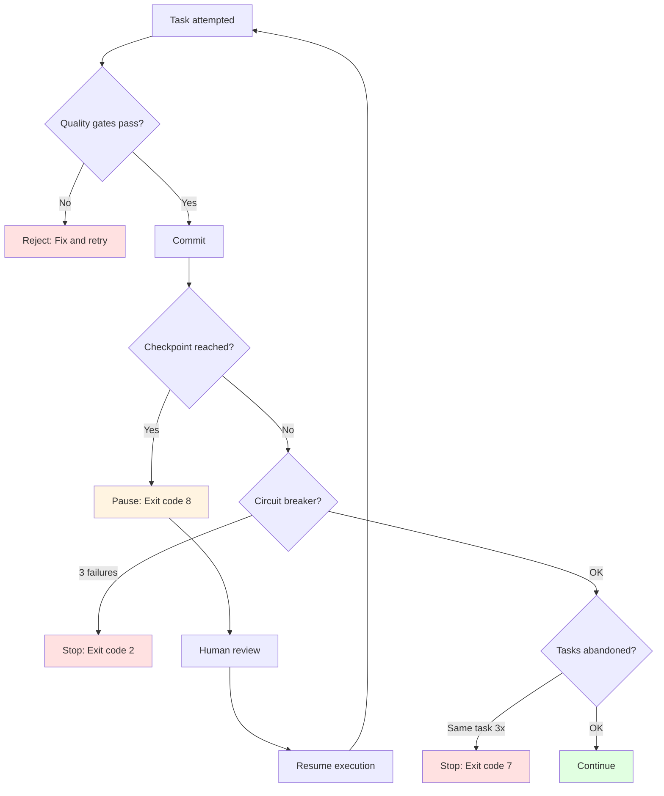

# Backpressure Reference

## Overview

This reference defines the quality gates that reject incomplete work in Ralph. Backpressure ensures work meets quality standards before proceeding.

---

## Standard Gates

**Constraints:**
- You MUST pass all gates before commit because partial passes indicate incomplete work
- You MUST NOT skip gates in production/library mode because quality is mandatory
- You SHOULD configure gates for your stack because defaults may not match your tooling

```bash
npm test          # Tests must pass
npm run typecheck # Types must check
npm run lint      # Lint must pass
npm run build     # Build must succeed
```

**All gates must pass before commit. No exceptions.**

---

## Checkpoint-Based Backpressure

Checkpoints provide execution-level backpressure by pausing for human review.

**Constraints:**
- You MUST configure checkpoint mode before execution because mid-run changes cause inconsistency
- You MUST resume with same command after checkpoint because state persists
- You SHOULD use milestones for multi-module features because natural breakpoints aid review

### Configuration

In `.ralph/config.sh`:

```bash
# Mode: none, iterations (milestones not implemented)
CHECKPOINT_MODE="iterations"

# For iterations mode: pause every N iterations
CHECKPOINT_INTERVAL=5

# NOT IMPLEMENTED - milestones mode planned for future
# CHECKPOINT_ON_MODULE=true
```

### Checkpoint Modes

#### 1. None (Pure AFK)

```bash
CHECKPOINT_MODE="none"
```

**Behavior:**
- No interruptions
- Runs until complete or circuit breaker trips
- Trust quality gates completely
- Review results at end

**Use when:**
- High confidence in gates
- Low-risk tasks
- Well-tested patterns
- Overnight execution

#### 2. Iterations (Regular Intervals)

```bash
CHECKPOINT_MODE="iterations"
CHECKPOINT_INTERVAL=5  # Every 5 iterations
```

**Behavior:**
- Pauses after N iterations
- Exit code: `8` (CHECKPOINT_PAUSE)
- Resume with same command: `bash .ralph/launch-build.sh`
- Review progress between checkpoints

**Use when:**
- Learning Ralph patterns
- Medium-risk tasks
- Want frequent review points
- Testing new quality gates

**Example:**
```bash
# Configure checkpoint
echo 'CHECKPOINT_MODE="iterations"' >> .ralph/config.sh
echo 'CHECKPOINT_INTERVAL=5' >> .ralph/config.sh

# Launch build via Agent Teams cockpit
bash .ralph/launch-build.sh

# After 5 task cycles, exits with code 8
# Review commits, logs, test results

# Resume from where it left off
bash .ralph/launch-build.sh

# Repeat until complete
```

#### 3. Milestones (Module Boundaries) - NOT IMPLEMENTED

> **NOT IMPLEMENTED**: This mode is documented but not yet implemented in Agent Teams cockpit.
> Planned for a future release.

```bash
# NOT IMPLEMENTED
CHECKPOINT_MODE="milestones"
CHECKPOINT_ON_MODULE=true
```

**Planned behavior (when implemented):**
- Pauses when module/component completes
- Detected via plan.md section markers
- Natural breakpoints in implementation
- Allows architectural review

---

## Backpressure Stack

**Constraints:**
- You MUST understand all backpressure levels because each serves different purpose
- You MUST NOT override circuit breaker without diagnosis because repeated failures indicate issues
- You SHOULD trust quality gates in production mode because they enforce standards

Ralph implements backpressure at multiple levels:



### Backpressure Levels

| Level | Mechanism | Trigger | Action |
|-------|-----------|---------|--------|
| **Task** | Quality gates | Gate fails | Reject task cycle |
| **Checkpoint** | Iteration/Milestone | N iterations OR module done | Pause for review |
| **Circuit breaker** | Consecutive failures | 3 failures | Stop execution |
| **Abandonment** | Task repetition | Same task 3x | Stop execution |

---

## Quality Levels

**Constraints:**
- You MUST set quality level before execution because it determines gate behavior
- You MUST NOT use prototype in production code because shortcuts accumulate debt
- You SHOULD use library level for reusable code because polish matters for shared code

Define expectations in `.ralph/agents.md`:

| Level | Shortcuts OK | Tests Required | Polish Required |
|-------|--------------|----------------|-----------------|
| **Prototype** | Yes | No | No |
| **Production** | No | Yes | Some |
| **Library** | No | Yes | Yes |

### Behavior by Level

- **Prototype** - Fast iteration, skip backpressure gates
- **Production** - SDD mandatory, all gates must pass
- **Library** - Full coverage, documentation, edge cases

**Set in:** `.ralph/agents.md` -> Quality Level section

---

## Task Sizing

**Constraints:**
- You MUST ensure one task fits one context window because exceeding context degrades quality
- You MUST split tasks that require >2000 lines to understand because complexity limits comprehension
- You MUST NOT batch unrelated work into single task because focused tasks are more reliable

One task = one context window.

### Right-sized

- Add database column + migration
- Add UI component to existing page
- Fix bug in login flow

### Too Large

- Build entire auth system
- Implement complete dashboard

**Test:** If >2000 lines to understand or >5 files -> split.

---

## Context Philosophy

Ralph does NOT enforce context percentages. The 40-60% sweet spot emerges naturally from atomic task design.

**INPUT-based control**: auto-compaction (`CLAUDE_AUTOCOMPACT_PCT_OVERRIDE`) manages context size between task cycles
**No OUTPUT measurement**: We don't track or exit based on context percentage

---

## Gutter Detection

**Constraints:**
- You MUST add Sign and exit if stuck because continued attempts waste resources
- You MUST NOT retry same failed command more than 3 times because systematic issues need different approach
- You SHOULD recognize file modification cycles because oscillation indicates confusion

**You're stuck if:**
- Same command fails 3 times
- Same file modified 5+ times
- No progress in 30 minutes

**Recovery:** Add Sign -> Exit -> Fresh approach next task cycle.

---

## Circuit Breaker

**Constraints:**
- You MUST check errors.log after circuit breaker because root cause needs identification
- You MUST fix underlying issue before restart because same failures will repeat
- You MUST NOT disable circuit breaker because it protects against runaway failures

After 3 consecutive failures, Agent Teams cockpit stops:

1. Check errors.log for details
2. Review last Claude output
3. Fix manually or adjust specs
4. Run `bash .ralph/launch-build.sh` again

---

## Plan Format

**Constraints:**
- You MUST keep plan under 100 lines because verbose plans confuse teammates
- You MUST limit each task to 3-5 lines because detail belongs in specs
- You MUST NOT include implementation details because tasks define what, not how

**The plan is disposable.** Regeneration costs one planning task cycle.

### Constraints

| Element | Limit |
|---------|-------|
| Entire plan | <100 lines |
| Each task | 3-5 lines |
| Implementation details | None |

### Task Format

```markdown
- [ ] Task title | Size: S/M | Files: N
  Acceptance: [single sentence]
```

### Anti-patterns

- 400-line plans
- Research summaries in plan (move to .ralph/specs/)
- Step-by-step implementation notes
- Keeping completed tasks forever

**Recovery:** If plan exceeds 100 lines -> re-run planning via Agent Teams cockpit (`bash .ralph/launch-build.sh`)

---

## Troubleshooting

### Gates Keep Failing

If quality gates fail repeatedly:
- You SHOULD check if task is too large
- You SHOULD verify gate commands are correct
- You MUST review gate output for specific errors

### Circuit Breaker Trips Too Often

If circuit breaker triggers frequently:
- You SHOULD check task clarity in plan
- You SHOULD use more frequent checkpoints
- You MUST diagnose root cause before continuing

### Tasks Taking Too Long

If tasks consistently fail to complete in one task cycle:
- You SHOULD split task into smaller atomic parts
- You SHOULD reduce exploration in `PROMPT_teammate.md`
- You SHOULD use auto-compaction (`CLAUDE_AUTOCOMPACT_PCT_OVERRIDE`) to reduce context size

---

*Version: 1.1.0 | Updated: 2026-01-27*
*Compliant with strands-agents SOP format (RFC 2119)*
