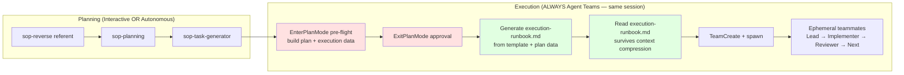

# Execution Paths Reference

## Overview

Ralph-orchestrator supports two execution paths. **Interactive** (sop-code-assist) for user-present sessions. **Autonomous** (Agent Teams teammates) for parallel, hooks-gated execution.

---

## Execution Path Comparison

| Aspect | Interactive (sop-code-assist) | Autonomous (Agent Teams) |
|--------|-------------------------------|--------------------------|
| **When used** | User present, learning, complex decisions | Batch processing, overnight, parallel tasks |
| **Invoker** | User manually or orchestrator in interactive mode | Same session proceeds to Step 8 (Agent Teams) |
| **Context** | Single session, full context retained | Fresh 200K context per task (ephemeral teammates) |
| **User interaction** | Confirms at each step | None after Agent Teams launch |
| **Parallelism** | Sequential (single session) | Parallel (up to MAX_TEAMMATES) |
| **Blocker handling** | AskUserQuestion | Document in blockers.md, mark task BLOCKED, move to next |
| **Quality gates** | Inline (teammate runs gates) | TaskCompleted hook validates automatically |
| **Communication** | Direct tool output | SendMessage (teammate ↔ lead), guardrails.md (shared memory) |

---

## Interactive Path: sop-code-assist

**Trigger**: Manual invocation or ralph-orchestrator in interactive mode.

```bash
/sop-code-assist task=".ralph/specs/user-auth/implementation/step01/task-01.code-task.md" mode="interactive"
```

**Characteristics:**
- User present throughout execution
- Step-by-step confirmation
- Can ask clarifying questions via AskUserQuestion
- Educational context provided
- Single session, context persists

**Blocker handling:**
1. Ask user via AskUserQuestion
2. Wait for response
3. Continue with user guidance

**Artifacts created:**
```
.ralph/specs/{goal}/implementation/{task_name}/
├── blockers.md     # Blockers (if any)
└── logs/           # Build outputs
```

---

## Autonomous Path: Agent Teams Teammates

**Trigger**: Same session proceeds to Step 8. Plan mode pre-flight builds plan with execution data → user approval → generates `execution-runbook.md` from template → orchestrator reads runbook → TeamCreate + spawn teammates.

**Characteristics:**
- Fresh 200K context per teammate (each teammate handles exactly 1 task, then shuts down)
- Parallel execution with up to MAX_TEAMMATES concurrent teammates
- Quality gates enforced via TaskCompleted hook (not inline)
- TeammateIdle hook provides safety (circuit breaker + abort). Lead drives the implementer→reviewer→next cycle.

**Implementer lifecycle:**
1. Spawn with task context (guardrails.md + agents.md + task description)
2. Implement with SDD (SCENARIO → SATISFY → REFACTOR)
3. Run quality gates (triggered by TaskCompleted hook on completion)
4. If gates pass: task accepted, failure counter reset, metrics updated
5. If gates fail: task rejected with feedback, teammate fixes and retries
6. Commit completed work
7. Idle → lead sends shutdown_request

**Reviewer lifecycle (after implementer completes + gates pass):**
1. Spawn with review context (task file path + agents.md)
2. Validate SDD compliance via /sop-reviewer
3. Write review to `.ralph/reviews/task-{id}-review.md`
4. Send 8-word summary to lead via SendMessage
5. Idle → lead sends shutdown_request

**Communication mechanisms:**

| Channel | Direction | Purpose |
|---------|-----------|---------|
| `SendMessage` | Teammate ↔ Lead | Direct instructions, status updates |
| `.ralph/guardrails.md` | All teammates (shared) | Accumulated error lessons, patterns |
| `TaskList` | Lead reads | Progress tracking across all tasks |
| `.ralph/metrics.json` | Hook writes, lead reads | Success/failure counts |
| `.ralph/failures.json` | Hook writes, lead reads | Per-teammate failure tracking |

---

## Blocker Handling

### Interactive: Ask and Wait

```text
When blocked:
1. Present issue to user via AskUserQuestion
2. Wait for user response
3. Apply user's guidance
4. Continue execution
```

### Autonomous: Document and Move On

```text
When blocked:
1. Document blocker in blockers.md:
   - Timestamp (ISO 8601)
   - Type (missing_dependency, test_failure, environment_issue)
   - Full details
   - Suggested resolution
2. Add memory to .ralph/guardrails.md if applicable
3. Mark task as BLOCKED via TaskUpdate
4. Claim next available task (teammates never stop on one blocker)
```

**Critical**: Autonomous teammates NEVER use AskUserQuestion. The lead detects issues via TaskList and can SendMessage to teammates or alert the user.

---

## State Files by Path

Both paths use the same state files, but access patterns differ:

| File | Interactive | Autonomous (Agent Teams) |
|------|-------------|--------------------------|
| `.ralph/guardrails.md` | Updated on errors | Concurrent access (flock for writes) |
| `.code-task.md` | Status header updated | Status: PENDING → IN_PROGRESS → IN_REVIEW → COMPLETED / BLOCKED |
| `blockers.md` | N/A | Created when blocked |
| `.ralph/failures.json` | N/A | Per-teammate failure tracking |
| `.ralph/metrics.json` | N/A | Task success/failure counts |
| `.ralph/agents.md` | N/A | Read by all teammates at spawn |
| `execution-runbook.md` | N/A | Generated and read by orchestrator after plan approval (survives compression) |

---

## Choosing the Right Path

```
Is this ralph-orchestrator execution?
│
├── Yes → Autonomous path (Agent Teams) — default
│   ├── Parallel, independent tasks
│   └── Quality gates via hooks
│
└── No → Interactive path (sop-code-assist)
    ├── Single task, user present
    ├── Learning new patterns
    └── Complex decisions requiring user input
```

**Default**: ralph-orchestrator ALWAYS uses Agent Teams for execution (Step 8). Interactive path is for standalone sop-code-assist usage.

---

## Integration with ralph-orchestrator

**Planning phase** (Steps 0-6):
- Uses planning_mode selection (interactive/autonomous)
- SOP skills operate according to selected mode
- User approves plan at checkpoint (Step 6)

**Execution phase** (Steps 7-8):
- ALWAYS uses Agent Teams in the same session
- Lead enters delegate mode (monitor only, no implementation)



---

## Troubleshooting

### Teammate Not Claiming Tasks

**Check task list:**
- Use `TaskList` to verify tasks exist with status PENDING
- Verify `.code-task.md` files have `Status: PENDING` header
- Check `.ralph/failures.json` for circuit breaker state

### Blockers Not Communicated

**For interactive path:**
- Verify AskUserQuestion is being called
- Check if mode is correctly set to "interactive"

**For autonomous path:**
- Check blockers.md in spec directory
- Use `TaskList` to find BLOCKED tasks
- Review .ralph/guardrails.md for decision history
- Use `SendMessage` to query specific teammate

### State Inconsistency

If paths produce conflicting state:
- Agent Teams teammates are authoritative during autonomous execution
- Interactive path is authoritative during manual execution
- Never run both simultaneously on same goal

---

*Version: 2.0.0 | Updated: 2026-02-15*
*Agent Teams execution model*
