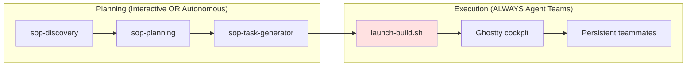

# Execution Paths Reference

## Overview

Ralph-orchestrator supports two execution paths. **Interactive** (sop-code-assist) for user-present sessions. **Autonomous** (Agent Teams teammates) for parallel, hooks-gated execution via the Ghostty cockpit.

---

## Execution Path Comparison

| Aspect | Interactive (sop-code-assist) | Autonomous (Agent Teams) |
|--------|-------------------------------|--------------------------|
| **When used** | User present, learning, complex decisions | Batch processing, overnight, parallel tasks |
| **Invoker** | User manually or orchestrator in interactive mode | launch-build.sh launched by ralph-orchestrator |
| **Context** | Single session, full context retained | Persistent per teammate, compacted by Claude Code |
| **User interaction** | Confirms at each step | None after cockpit launch |
| **Parallelism** | Sequential (single session) | Parallel (up to MAX_TEAMMATES) |
| **Blocker handling** | AskUserQuestion | Document in blockers.md, mark task BLOCKED, move to next |
| **Quality gates** | Inline (teammate runs gates) | TaskCompleted hook validates automatically |
| **Communication** | Direct tool output | SendMessage (teammate ↔ lead), guardrails.md (shared memory) |

---

## Interactive Path: sop-code-assist

**Trigger**: Manual invocation or ralph-orchestrator in interactive mode.

```bash
/sop-code-assist task="specs/user-auth/implementation/step01/task-01.code-task.md" mode="interactive"
```

**Characteristics:**
- User present throughout execution
- Step-by-step confirmation
- Can ask clarifying questions via AskUserQuestion
- Educational context provided
- Single session, context persists

**Blocker handling:**
1. Ask user via AskUserQuestion
2. Wait for response
3. Continue with user guidance

**Artifacts created:**
```
specs/{goal}/implementation/{task_name}/
├── blockers.md     # Blockers (if any)
└── logs/           # Build outputs
```

---

## Autonomous Path: Agent Teams Teammates

**Trigger**: `launch-build.sh` launched by ralph-orchestrator (Step 8).

```bash
bash .ralph/launch-build.sh
```

**Characteristics:**
- Persistent context per teammate (compacted by Claude Code, not fresh each task)
- Parallel execution with up to MAX_TEAMMATES concurrent coordinators
- Quality gates enforced via TaskCompleted hook (not inline)
- TeammateIdle hook drives continuity (exit 2 = keep working)
- Cockpit provides live visibility via tmux windows

**Teammate lifecycle:**
1. Read `guardrails.md` (accumulated lessons from all teammates)
2. Claim next PENDING task from Agent Teams task list
3. Implement with SDD (SCENARIO → SATISFY → REFACTOR)
4. Run quality gates (triggered by TaskCompleted hook on completion)
5. If gates pass: task accepted, failure counter reset, metrics updated
6. If gates fail: task rejected with feedback, teammate fixes and retries
7. Commit completed work
8. TeammateIdle hook fires → claim next task (or idle if all done)

**Communication mechanisms:**

| Channel | Direction | Purpose |
|---------|-----------|---------|
| `SendMessage` | Teammate ↔ Lead | Direct instructions, status updates |
| `guardrails.md` | All teammates (shared) | Accumulated error lessons, patterns |
| `TaskList` | Lead reads | Progress tracking across all tasks |
| `.ralph/metrics.json` | Hook writes, lead reads | Success/failure counts |
| `.ralph/failures.json` | Hook writes, lead reads | Per-teammate failure tracking |

---

## Blocker Handling

### Interactive: Ask and Wait

```text
When blocked:
1. Present issue to user via AskUserQuestion
2. Wait for user response
3. Apply user's guidance
4. Continue execution
```

### Autonomous: Document and Move On

```text
When blocked:
1. Document blocker in blockers.md:
   - Timestamp (ISO 8601)
   - Type (missing_dependency, test_failure, environment_issue)
   - Full details
   - Suggested resolution
2. Add Sign to guardrails.md if applicable
3. Mark task as BLOCKED via TaskUpdate
4. Claim next available task (teammates never stop on one blocker)
```

**Critical**: Autonomous teammates NEVER use AskUserQuestion. The lead detects issues via TaskList and can SendMessage to teammates or alert the user.

---

## State Files by Path

Both paths use the same state files, but access patterns differ:

| File | Interactive | Autonomous (Agent Teams) |
|------|-------------|--------------------------|
| `guardrails.md` | Updated on errors | Concurrent access (flock for writes) |
| `.code-task.md` | Status header updated | Status header updated via TaskUpdate |
| `blockers.md` | N/A | Created when blocked |
| `.ralph/failures.json` | N/A | Per-teammate failure tracking |
| `.ralph/metrics.json` | N/A | Task success/failure counts |
| `AGENTS.md` | N/A | Read by all teammates at spawn |

---

## Choosing the Right Path

```
Is this ralph-orchestrator execution?
│
├── Yes → Autonomous path (Agent Teams) — default
│   ├── Parallel, independent tasks
│   ├── Quality gates via hooks
│   └── Cockpit monitoring
│
└── No → Interactive path (sop-code-assist)
    ├── Single task, user present
    ├── Learning new patterns
    └── Complex decisions requiring user input
```

**Default**: ralph-orchestrator ALWAYS uses Agent Teams for execution (Step 8). Interactive path is for standalone sop-code-assist usage.

---

## Integration with ralph-orchestrator

**Planning phase** (Steps 0-6):
- Uses planning_mode selection (interactive/autonomous)
- SOP skills operate according to selected mode
- User approves plan at checkpoint (Step 6)

**Execution phase** (Steps 7-8):
- ALWAYS uses Agent Teams via launch-build.sh
- Cockpit provides tmux windows for monitoring
- Lead enters delegate mode (monitor only, no implementation)



---

## Troubleshooting

### Teammate Not Claiming Tasks

**Check task list:**
- Use `TaskList` to verify tasks exist with status PENDING
- Verify `.code-task.md` files have `Status: PENDING` header
- Check `.ralph/failures.json` for circuit breaker state

### Blockers Not Communicated

**For interactive path:**
- Verify AskUserQuestion is being called
- Check if mode is correctly set to "interactive"

**For autonomous path:**
- Check blockers.md in spec directory
- Use `TaskList` to find BLOCKED tasks
- Review guardrails.md for decision history
- Use `SendMessage` to query specific teammate

### State Inconsistency

If paths produce conflicting state:
- Agent Teams teammates are authoritative during cockpit execution
- Interactive path is authoritative during manual execution
- Never run both simultaneously on same goal

---

*Version: 2.0.0 | Updated: 2026-02-10*
*Agent Teams execution model*
