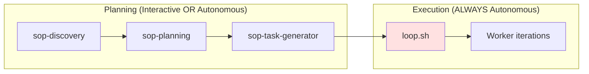

# Execution Paths Reference

## Overview

Ralph-orchestrator supports two execution paths for implementing tasks. This reference clarifies when each is used and how they communicate with the orchestrator.

---

## Execution Path Comparison

| Aspect | Interactive (sop-code-assist) | Autonomous (loop.sh workers) |
|--------|-------------------------------|------------------------------|
| **When used** | User present, learning, complex decisions | User away, batch processing |
| **Invoker** | User manually or orchestrator in HITL mode | loop.sh in AFK mode |
| **Context** | Single session, full context retained | Fresh context each iteration |
| **User interaction** | Confirms at each step | None after launch |
| **Blocker handling** | AskUserQuestion | Document in blockers.md, exit cleanly |
| **Communication** | Direct tool output | stdout signals + exit codes |
| **Artifacts location** | `specs/{goal}/implementation/{task_name}/` | `specs/{goal}/implementation/{task_name}/` |

---

## Interactive Path: sop-code-assist

**Trigger**: Manual invocation or ralph-orchestrator with HITL mode.

```bash
/sop-code-assist task="specs/user-auth/implementation/step01/task-01.code-task.md" mode="interactive"
```

**Characteristics:**
- User present throughout execution
- Step-by-step confirmation
- Can ask clarifying questions via AskUserQuestion
- Educational context provided
- Single session, context persists

**Blocker handling:**
1. Ask user via AskUserQuestion
2. Wait for response
3. Continue with user guidance

**Artifacts created:**
```
specs/{goal}/implementation/{task_name}/
├── context.md      # Requirements, patterns, dependencies
├── plan.md         # Test strategy, implementation approach
├── progress.md     # TDD cycles, decisions, blockers
└── logs/           # Build outputs
```

---

## Autonomous Path: loop.sh Workers

**Trigger**: `./loop.sh specs/{goal}/` launched by ralph-orchestrator.

```bash
./loop.sh specs/user-auth/
```

**Characteristics:**
- User away (AFK mode)
- No user interaction during execution
- Fresh 200K context each iteration
- Worker reads PROMPT_build.md instructions
- State persisted via files

**Worker lifecycle:**
1. Read guardrails.md (Signs from previous iterations)
2. Read scratchpad.md (session state)
3. Select next incomplete task from plan.md
4. Implement with TDD (RED → GREEN → REFACTOR)
5. Run quality gates
6. Update state files
7. Emit confession + task_completed signals
8. Commit and exit

---

## Communication Mechanisms

### Interactive Path

Direct tool output and AskUserQuestion. No special signals needed.

### Autonomous Path

**stdout signals** (parsed by loop.sh):

| Signal | Purpose | Format |
|--------|---------|--------|
| `> confession:` | Task completion status | `> confession: objective=[name], met=[Yes/No], confidence=[N], evidence=[proof]` |
| `> task_completed:` | Mark task done | `> task_completed: [Task name from plan.md]` |
| `> tdd:red` | TDD tracking | `> tdd:red {test_name}` |
| `> tdd:green` | TDD tracking | `> tdd:green {test_name}` |
| `<promise>COMPLETE</promise>` | All tasks done | Requires TWO consecutive signals for termination |

**Exit codes** (from loop.sh):

| Code | Name | Meaning |
|------|------|---------|
| 0 | SUCCESS | All tasks completed with double verification |
| 1 | ERROR | Validation or setup failure |
| 2 | CIRCUIT_BREAKER | Max consecutive failures reached |
| 3 | MAX_ITERATIONS | Iteration limit reached |
| 4 | MAX_RUNTIME | Runtime limit exceeded |
| 6 | LOOP_THRASHING | Oscillating task pattern detected |
| 7 | TASKS_ABANDONED | Same task failed repeatedly |
| 8 | CHECKPOINT_PAUSE | Checkpoint reached, awaiting resume |
| 130 | INTERRUPTED | User interrupt (Ctrl+C) |

---

## Blocker Handling by Path

### Interactive: Ask and Wait

```text
When blocked:
1. Present issue to user via AskUserQuestion
2. Wait for user response
3. Apply user's guidance
4. Continue execution
```

### Autonomous: Document and Exit

```text
When blocked:
1. Document blocker in progress.md or blockers.md:
   - Timestamp (ISO 8601)
   - Type (missing_dependency, test_failure, environment_issue)
   - Full details
   - Suggested resolution
2. Add Sign to guardrails.md if applicable
3. Update scratchpad.md with blocker status
4. Exit cleanly (let orchestrator handle recovery)
```

**Critical**: Autonomous mode NEVER uses AskUserQuestion. The orchestrator detects issues via exit codes and can alert the user or attempt recovery.

---

## State Files by Path

Both paths use the same state files, but update frequency differs:

| File | Interactive | Autonomous |
|------|-------------|------------|
| `scratchpad.md` | Updated on significant progress | Updated every iteration |
| `guardrails.md` | Updated on errors | Updated on errors (Signs) |
| `progress.md` | TDD cycles, blockers | TDD cycles, blockers |
| `plan.md` | Task completion | Task completion |
| `.code-task.md` | Status header added | Status header added |

---

## Choosing the Right Path

```
Is user present?
│
├── Yes → Interactive path (sop-code-assist)
│   ├── Learning new patterns?
│   ├── Complex decisions needed?
│   └── Uncertain requirements?
│
└── No → Autonomous path (loop.sh)
    ├── Clear requirements?
    ├── Well-defined tasks?
    └── Overnight/AFK execution?
```

**Default**: ralph-orchestrator launches autonomous path after planning phase completes.

---

## Integration with ralph-orchestrator

**Planning phase** (Steps 0-5):
- Uses planning_mode selection (interactive/autonomous)
- SOP skills operate according to selected mode
- Human approves plan before execution

**Execution phase** (Steps 6-7):
- ALWAYS uses autonomous path via loop.sh
- Optional checkpoints for user review
- User monitors via status.json and logs



---

## Troubleshooting

### Worker Not Completing Tasks

**Check stdout signals:**
```bash
grep "> confession:" logs/iteration.log
grep "> task_completed:" logs/iteration.log
```

**Check exit codes:**
```bash
echo $?  # After loop.sh exits
```

### Blockers Not Communicated

**For interactive path:**
- Verify AskUserQuestion is being called
- Check if mode is correctly set to "interactive"

**For autonomous path:**
- Review progress.md for documented blockers
- Check blockers.md in spec directory
- Review scratchpad.md for blocker notes

### State Inconsistency

If paths produce conflicting state:
- Autonomous path is authoritative during loop execution
- Interactive path is authoritative during manual execution
- Never run both simultaneously on same goal

---

*Version: 1.0.0 | Created: 2026-01-30*
*Compliant with strands-agents SOP format (RFC 2119)*
