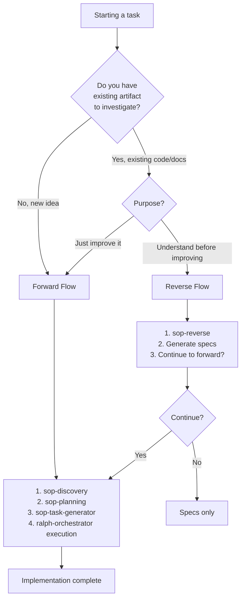
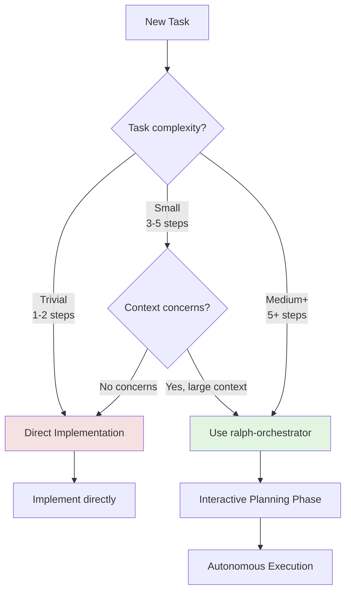
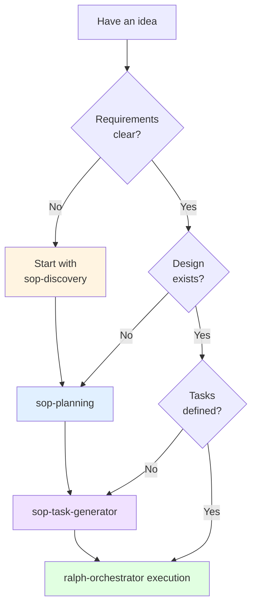
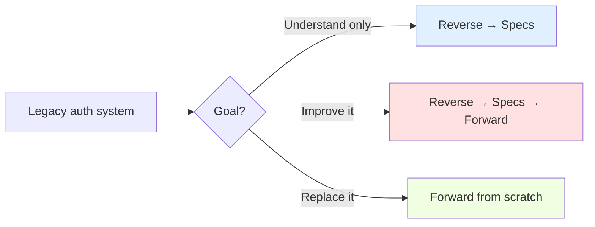
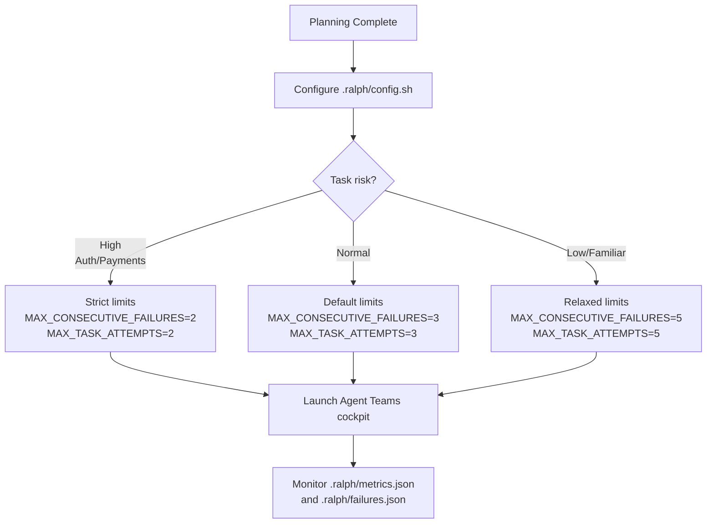

# Mode Selection Reference

## Overview

This reference provides decision flowcharts for choosing the right workflow approach in Ralph. Proper mode selection ensures optimal resource usage and quality outcomes.

---

## Flow Selection: Forward vs Reverse

**Constraints:**
- You MUST use Forward Flow for new ideas because there's no existing artifact to investigate
- You MUST use Reverse Flow when understanding existing code before improving because blind changes break assumptions
- You SHOULD continue to Forward after Reverse if planning improvements because Reverse generates specs that feed planning



---

## When to Use Ralph Agent Teams vs Direct Implementation

**Constraints:**
- You MUST NOT use ralph-orchestrator for trivial tasks (1-2 steps) because overhead exceeds benefit
- You MUST use ralph-orchestrator for complex tasks (5+ steps) because fresh context improves quality
- You SHOULD use ralph-orchestrator when context exceeds 100K tokens because compaction loses information



### Decision Criteria Table

| Factor | Direct | Ralph Agent Teams |
|--------|--------|------------|
| **Steps** | ≤ 3 | ≥ 3 |
| **Files** | ≤ 2 | ≥ 3 |
| **Duration** | < 30 min | > 1 hour |
| **Context** | < 50K tokens | > 100K tokens |
| **Scenarios** | None or simple | SDD required |
| **Overnight** | No | Possible |
| **Quality gates** | Not needed | Critical |

---

## Forward Flow Decision Points

**Constraints:**
- You MUST NOT skip discovery if requirements are unclear because vague requirements cause rework
- You MUST NOT skip planning if design doesn't exist because ad-hoc design leads to poor architecture
- You MUST complete task generation before execution because coordinators and sub-agents need structured tasks



---

## Reverse Flow Use Cases

**Constraints:**
- You MUST use Reverse Flow for legacy code before refactoring because understanding prevents breaking changes
- You SHOULD use Reverse Flow for third-party library integration because patterns must be understood first
- You MAY skip Reverse Flow for well-documented systems with clear architecture

**Use Reverse Flow when investigating:**

### Code Artifacts
- Legacy codebase to understand before refactoring
- Third-party library integration patterns
- Existing API implementation
- Authentication/authorization flows

### Documentation
- API specifications to implement
- Architecture decision records
- Requirements documents
- Technical design documents

### Processes
- Deployment workflows
- CI/CD pipelines
- Development workflows
- Testing strategies

### Concepts
- Design patterns in use
- Architectural patterns (event sourcing, CQRS, etc.)
- Technical approaches
- Integration patterns

### Example Decision Flow



---

## Task Sizing for Ralph Agent Teams

**Constraints:**
- You MUST decompose XL tasks into multiple team runs because a single team run cannot handle weeks of work
- You MUST NOT use ralph-orchestrator for trivial tasks (< 3 steps) because overhead exceeds value
- You SHOULD target M-L size tasks for optimal Agent Teams efficiency

### Perfect for Ralph Agent Teams (M-L size)

```
✓ Add authentication system with JWT
  - Multiple files (controllers, middleware, tests)
  - SDD approach required
  - Clear acceptance criteria
  - 3-8 hours estimated

✓ Implement caching layer with Redis
  - Database abstraction
  - Cache invalidation strategy
  - Performance tests
  - 4-6 hours estimated
```

### Too Small for Ralph Agent Teams (S size)

```
✗ Fix typo in error message
  - Single file change
  - No tests needed
  - 5 minutes

✗ Update dependency version
  - Edit package.json
  - Run npm install
  - 10 minutes
```

### Too Large (XL size) - Needs Decomposition

```
✗ Build entire e-commerce platform
  - Too many unknowns
  - Unclear boundaries
  - Weeks of work
  → Split into: Auth, Products, Cart, Checkout, etc.

✗ Complete microservices migration
  - Architectural change
  - Multiple systems
  - Risk assessment needed
  → Split by service: User Service, Order Service, etc.
```

---

## Safety Configuration

**Constraints:**
- You MUST configure safety limits before execution because defaults may not match your risk tolerance
- You MUST review `.ralph/config.sh` for high-risk tasks because auth/payments need tighter limits
- You MAY adjust MAX_CONSECUTIVE_FAILURES and MAX_TASK_ATTEMPTS based on task complexity

After planning, configure safety limits in `.ralph/config.sh`:

> **Key insight**: Execution is ALWAYS autonomous via Agent Teams cockpit (`bash .ralph/launch-build.sh`). Safety is enforced by circuit breakers and retry limits, not by human pauses.



---

## Common Scenarios

### Scenario 1: New Feature from Scratch

```
Situation: Build user profile page
Complexity: Medium (4-6 files, tests, styling)
Experience: Familiar with stack

Decision: Forward Flow → production quality
Steps:
1. /ralph-orchestrator → Forward
2. sop-discovery (15 min)
3. sop-planning (30 min)
4. sop-task-generator (10 min)
5. Configure: QUALITY_LEVEL="production" in .ralph/config.sh
6. Launch and monitor
```

### Scenario 2: Understanding Legacy Code

```
Situation: Old payment processing module
Complexity: High (unfamiliar code)
Goal: Understand before migrating

Decision: Reverse Flow → Specs only
Steps:
1. /ralph-orchestrator → Reverse
2. sop-reverse → /path/to/payment-module
3. Generate specs (automatic)
4. Review findings
5. Stop (no implementation yet)
```

### Scenario 3: Quick Bug Fix

```
Situation: Button click not working
Complexity: Trivial (1 file, 1 function)
Duration: 5-10 minutes

Decision: Direct Implementation
Reason: Ralph Agent Teams overhead > task complexity
```

### Scenario 4: Large Refactoring

```
Situation: Extract shared utilities into library
Complexity: Large (15+ files)
Risk: Breaking changes

Decision: Forward Flow → strict safety limits
Steps:
1. /ralph-orchestrator → Forward
2. Planning phase (interactive)
3. Configure: MAX_CONSECUTIVE_FAILURES=2, MAX_TASK_ATTEMPTS=2 in .ralph/config.sh
4. Monitor .ralph/metrics.json for progress
5. Review .ralph/failures.json if issues arise
```

---

## Anti-Patterns to Avoid

**Constraints:**
- You MUST NOT use ralph-orchestrator for 1-line fixes because 10x overhead wastes resources
- You MUST NOT skip planning phase because confused sub-agents produce poor output
- You MUST NOT use Forward Flow on legacy code without understanding because changes break existing assumptions
- You MUST NOT run a single team for XL tasks because unclear progress leads to stalled execution

### ❌ Using Ralph Agent Teams for Everything

```
Problem: "I'll use ralph-orchestrator for this 1-line fix"
Reality: 10x overhead for trivial task
Solution: Direct implementation for tasks < 3 steps
```

### ❌ Skipping Planning Phase

```
Problem: "I'll just start the cockpit, I know what I want"
Reality: Sub-agents confused, poor quality output
Solution: Always complete planning first
```

### ❌ Wrong Flow Direction

```
Problem: "Forward flow to improve legacy code without understanding it"
Reality: Changes break existing assumptions
Solution: Reverse → understand → Forward → improve
```

### ❌ Task Too Large

```
Problem: "Build entire CRM system with ralph-orchestrator"
Reality: Team runs forever, unclear progress
Solution: Decompose into features, run multiple team sessions
```

---

## Quick Reference

| If you... | Then use... |
|-----------|-------------|
| Have a new idea | Forward Flow |
| Need to understand existing code | Reverse Flow |
| Want to improve after understanding | Reverse → Forward |
| Task is trivial (< 3 steps) | Direct implementation |
| Task is complex (> 5 steps) | Ralph Agent Teams |
| First time using ralph-orchestrator | Strict safety limits (low MAX_CONSECUTIVE_FAILURES) |
| High-risk task (auth, payments) | Strict safety limits + high MIN_TEST_COVERAGE |
| Overnight development needed | Default safety limits + MAX_RUNTIME set |
| Learning codebase patterns | Start strict, relax limits as confidence grows |

---

## Troubleshooting

### Unsure Which Flow to Use

If flow direction is unclear:
- You SHOULD ask: "Do I need to understand something first?"
- You SHOULD default to Reverse if existing artifact is involved
- You MUST NOT proceed with Forward if requirements are vague

### Task Size Ambiguous

If task sizing is unclear:
- You SHOULD estimate number of files to modify
- You SHOULD estimate hours of work
- You MUST decompose if estimate exceeds 1 week

### Safety Configuration Unclear

If safety configuration is unclear:
- You SHOULD start with strict limits (MAX_CONSECUTIVE_FAILURES=2) for safety
- You SHOULD relax limits after 5-10 successful runs with confidence
- You MUST NOT set MAX_CONSECUTIVE_FAILURES above 5 for high-risk tasks

---

*Version: 2.0.0 | Updated: 2026-02-10*
*Compliant with strands-agents SOP format (RFC 2119)*
