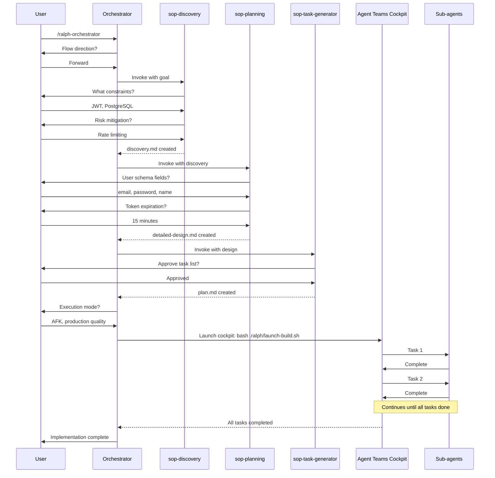

# SOP Integration Reference

## Overview

This reference defines how ralph-orchestrator integrates with the SOP (Standard Operating Procedure) skills framework. Understanding this integration is essential for proper workflow orchestration and phase transitions.

---

## Workflow Structure

**Constraints:**
- You MUST follow the two-phase structure because mixing planning and execution degrades both
- You MUST complete planning phase before execution because teammates need clear specifications
- You MUST NOT skip any planning step because incomplete specs cause implementation failures

Ralph orchestrates SOP skills to transform ideas into implementations through a two-phase workflow:

1. **Planning Phase (Interactive)**: Interactive session using SOP skills
2. **Execution Phase**: Agent Teams cockpit executing the plan

```mermaid
graph TD
    subgraph "Planning Phase - Interactive"
        A[/ralph-orchestrator invoked] --> B{Flow?}
        B -->|Forward| C[sop-discovery]
        B -->|Reverse| D[sop-reverse]

        D --> E[Generate specs]
        E --> F{Continue?}
        F -->|No| G[Done - Specs only]
        F -->|Yes| C

        C --> H[sop-planning]
        H --> I[sop-task-generator]
        I --> J[Configure execution]
    end

    subgraph "Execution Phase - Agent Teams"
        J --> K[Launch cockpit via bash .ralph/launch-build.sh]
        K --> L[Teammate task cycles]
        L --> M{Complete?}
        M -->|No| L
        M -->|Yes| N[Done]
    end

    style A fill:#e1f0ff
    style C fill:#fff4e1
    style D fill:#ffe1f0
    style H fill:#f0e1ff
    style I fill:#e1ffe1
    style K fill:#ffe1e1
```

---

## SOP Skills in the Workflow

### 1. sop-discovery

**Constraints:**
- You MUST ask one question at a time because batched questions produce shallow answers
- You MUST NOT proceed without answers to critical questions because vague requirements cause rework
- You SHOULD capture all decisions in discovery.md because this creates an audit trail

**Purpose**: Brainstorm constraints, risks, and prior art before planning

**When invoked**: First step of Forward flow

**Input**: Rough idea or goal description

**Output**: `.ralph/specs/{goal}/discovery.md`

**What it contains**:
- Problem statement
- Constraints (technical, resource, time)
- Risks and mitigation strategies
- Prior art and existing patterns
- Success criteria
- Open questions resolved

**Duration**: 10-20 minutes

**Interaction style**: Q&A, one question at a time

**Example**:
```bash
User: "Build user authentication system"

sop-discovery asks:
- What authentication methods? (OAuth, JWT, session-based?)
- What user data needs protection?
- Integration with existing user table?
- Password policy requirements?
- Multi-factor authentication needed?
- Session management approach?

Output: .ralph/specs/user-auth/discovery.md
```

---

### 2. sop-reverse (Alternative Entry Point)

**Constraints:**
- You MUST use sop-reverse when investigating existing artifacts because understanding prevents breaking changes
- You MUST complete batch analysis before refinement questions because context informs follow-up
- You SHOULD continue to forward flow when planning improvements because reverse generates specs that feed planning

**Purpose**: Investigate existing artifacts before improving them

**When invoked**: First step of Reverse flow

**Input**: Path to artifact, URL, or description

**Artifacts supported**:
- Codebase: `/path/to/repo`
- API documentation: `https://api.example.com/docs`
- Design documents: `/path/to/docs/`
- Processes: "Our deployment workflow"
- Concepts: "Event sourcing pattern"

**Output**: `.ralph/specs/{investigation}/specs-generated/`

**What it contains**:
- Artifact analysis
- Architecture patterns found
- Dependencies discovered
- Issues and improvements identified
- Generated specifications

**Duration**: 20-40 minutes (varies by artifact size)

**Interaction style**:
- Batch analysis (automatic)
- Interactive refinement (one question at a time)

**Example**:
```bash
User: "Investigate legacy payment processing module"

sop-reverse:
1. Analyzes /src/payments/ (automatic)
2. Discovers: Stripe integration, manual retry logic, no tests
3. Asks refinement questions:
   - Focus on error handling or integration?
   - Migrating to new payment provider?
   - Adding new payment methods?

Output: .ralph/specs/payment-investigation/specs-generated/
├── architecture.md
├── integration-patterns.md
├── issues-found.md
└── improvement-opportunities.md

User: "Continue to forward flow to add PayPal support"
→ Proceeds to sop-planning with existing context
```

---

### 3. sop-planning

**Constraints:**
- You MUST validate discovery completeness before proceeding because incomplete discovery causes flawed designs
- You MUST research technology choices before design decisions because uninformed decisions create technical debt
- You SHOULD document all research findings because this prevents repeated investigation

**Purpose**: Create detailed requirements, research, and design

**When invoked**: After discovery (or after reverse if continuing)

**Input**:
- `.ralph/specs/{goal}/discovery.md` (from sop-discovery)
- OR `.ralph/specs/{investigation}/specs-generated/` (from sop-reverse)
- OR rough idea description

**Output**:
- `.ralph/specs/{goal}/rough-idea.md`
- `.ralph/specs/{goal}/idea-honing.md` (Q&A log)
- `.ralph/specs/{goal}/research/*.md`
- `.ralph/specs/{goal}/design/detailed-design.md`

**What it contains**:

**rough-idea.md**:
- Initial concept
- High-level goals
- Success criteria

**idea-honing.md**:
- Clarification questions asked
- User responses
- Decisions made
- Scope refinements

**research/**.md:
- Technical research findings
- Library comparisons
- Pattern investigations
- Best practices

**design/detailed-design.md**:
- System architecture
- Component design
- Data models
- API contracts
- Security considerations
- Performance requirements
- Testing strategy

**Duration**: 20-40 minutes

**Interaction style**: Interactive loops
- Clarification questions (requirements)
- Research questions (investigation)
- Design validation (review)

**Example**:
```bash
Input: .ralph/specs/user-auth/discovery.md

sop-planning phases:

1. Clarification (requirements):
   - User schema fields needed?
   - Token expiration policy?
   - Password reset flow?

2. Research:
   - JWT libraries: jsonwebtoken vs jose
   - Bcrypt vs Argon2 for hashing
   - Rate limiting approaches

3. Design:
   - Routes: POST /auth/login, POST /auth/refresh
   - Middleware: authenticateToken
   - Database: users table with hashed passwords
   - Security: bcrypt rounds=10, JWT expiry=15m

Output: .ralph/specs/user-auth/design/detailed-design.md
```

---

### 4. sop-task-generator

**Constraints:**
- You MUST include acceptance criteria for each task because sub-agents need clear completion criteria
- You MUST size tasks appropriately (M-size optimal) because oversized tasks exhaust context
- You MUST NOT create tasks without file lists because sub-agents need to know scope

**Purpose**: Generate structured implementation tasks from design

---

### 5. sop-code-assist

**Constraints:**
- You MUST implement scenarios BEFORE implementation code because SDD ensures testability
- You MUST NOT place code in documentation directories because separation of concerns matters
- You SHOULD use autonomous mode for batch processing because it reduces interruptions
- You SHOULD use interactive mode for learning because it provides educational context

**Purpose**: Execute code tasks using SDD workflow (Explore → Plan → Code → Commit)

**When invoked**: After sop-task-generator creates .code-task.md files

**Input**: `.code-task.md` file path, task description, or direct text

**Output**:
- Implementation code in repo_root
- Test code in appropriate test directories
- Artifacts in `.ralph/specs/{goal}/implementation/{task_name}/`

**Artifacts created**:
- `blockers.md` - Blockers encountered (autonomous mode, if blocked)
- `logs/` - Build outputs

**Modes**:
- **interactive**: User confirmation at each step (learning, uncertain requirements)
- **autonomous**: Autonomous execution (batch processing, ralph-orchestrator integration)

**Duration**: 10-60 minutes per task (varies by complexity)

**Example**:
```bash
# Interactive mode for learning
/sop-code-assist task_description=".ralph/specs/user-auth/implementation/step01/task-01-jwt-utils.code-task.md" mode="interactive"

# Auto mode for batch execution
/sop-code-assist task_description=".ralph/specs/user-auth/implementation/step01/task-01-jwt-utils.code-task.md" mode="autonomous"
```

**SDD Workflow**:
```
1. Setup: Create artifacts, discover project context
2. Explore: Analyze requirements, research patterns
3. Plan: Design test strategy, plan implementation
4. Code: SCENARIO → SATISFY → REFACTOR cycle
5. Commit: Conventional commit with all changes
```

---

### 6. sop-task-generator (continued)

**When invoked**: After planning completes

**Input**: `.ralph/specs/{goal}/implementation/plan.md` (created by sop-planning)

**Output**: `.ralph/specs/{goal}/implementation/step*/task-*.code-task.md` files

**What it contains**:
- `.code-task.md` files for each task
- Each task file with:
  - Clear description
  - File list
  - Size estimate (S/M/L)
  - Acceptance criteria
  - Dependencies (if any)

**Task format**:
```markdown
- [ ] Implement JWT token generation | Size: M | Files: 2
  Create utils/jwt.ts with sign() and verify() functions.
  Tests must validate token structure and expiration.
```

**Duration**: 5-15 minutes

**Interaction style**: Mostly automatic with approval checkpoints

**Example**:
```bash
Input: .ralph/specs/user-auth/implementation/plan.md

sop-task-generator creates:

## Implementation Plan

### Setup
- [ ] Install dependencies: jsonwebtoken, bcrypt | Size: S
- [ ] Create database migration for users table | Size: S

### Authentication
- [ ] Implement password hashing utilities | Size: M
- [ ] Create login endpoint with JWT generation | Size: M
- [ ] Add token validation middleware | Size: M
- [ ] Implement token refresh endpoint | Size: S

### Testing
- [ ] Unit tests for JWT utilities | Size: M
- [ ] Integration tests for auth endpoints | Size: L
- [ ] Security tests for token validation | Size: M

Output: .ralph/specs/user-auth/implementation/plan.md
```

---

## The Complete Forward Flow

**Constraints:**
- You MUST complete each phase before proceeding because phases depend on prior outputs
- You MUST wait for user approval at phase transitions because human judgment guides direction
- You SHOULD present options at decision points because user choice determines outcome



---

## The Complete Reverse Flow

**Constraints:**
- You MUST complete batch analysis before refinement because context informs questions
- You MUST ask user about continuing to forward flow because direction choice matters
- You SHOULD preserve specs even without implementation because analysis has value

```mermaid
sequenceDiagram
    participant U as User
    participant O as Orchestrator
    participant R as sop-reverse
    participant P as sop-planning
    participant T as sop-task-generator
    participant C as Agent Teams Cockpit

    U->>O: /ralph-orchestrator
    O->>U: Flow direction?
    U->>O: Reverse

    O->>R: Invoke
    R->>U: What to investigate?
    U->>R: /src/payments/

    Note over R: Batch analysis (automatic)

    R->>U: Focus on integration or error handling?
    U->>R: Error handling
    R->>U: Migrating providers?
    U->>R: No, improving existing

    R-->>O: specs-generated/ created

    O->>U: Continue to forward flow?

    alt User says Yes
        U->>O: Yes, add retry mechanism
        O->>P: Invoke with specs-generated
        Note over P,T,C: Same as forward flow
    else User says No
        U->>O: No, just needed analysis
        O->>U: Specs available for review
    end
```

---

## Directory Structure After Full Flow

**Constraints:**
- You MUST maintain directory structure because teammates and sub-agents expect standard paths
- You MUST NOT modify specs structure during execution because sub-agents read from fixed locations
- You SHOULD commit specs before execution because this creates recovery point

```
project-root/
├── .ralph/                           # Created by install.sh
│   ├── config.sh
│   ├── agents.md                     # Project context
│   ├── guardrails.md                 # Shared memory (error lessons, constraints, signs)
│   ├── metrics.json                  # Created during execution
│   └── specs/
│       └── user-auth/                # Goal name
│           ├── discovery.md          # From sop-discovery
│           ├── rough-idea.md         # From sop-planning
│           ├── idea-honing.md        # From sop-planning
│           ├── research/             # From sop-planning
│           │   ├── jwt-libraries.md
│           │   └── password-hashing.md
│           ├── design/               # From sop-planning
│           │   └── detailed-design.md
│           └── implementation/       # From sop-task-generator
│               └── plan.md
│
└── src/                              # Implementation output
    ├── routes/
    │   └── auth.ts
    ├── middleware/
    │   └── authenticate.ts
    └── utils/
        └── jwt.ts
```

---

## Handoff Between Skills

**Constraints:**
- You MUST use file paths for handoff because this maintains separation of concerns
- You MUST verify handoff files exist before proceeding because missing files cause failures
- You SHOULD include prior investigation context because this informs planning

### Discovery → Planning

**Handoff mechanism**: File path + goal context

```javascript
// sop-discovery outputs:
.ralph/specs/user-auth/discovery.md

// Orchestrator invokes sop-planning with:
{
  rough_idea: "user-auth",  // The goal name serves as rough idea
  discovery_path: ".ralph/specs/user-auth/discovery.md",
  project_dir: ".ralph/specs/user-auth"
}

// sop-planning reads discovery context and proceeds
```

### Reverse → Planning (if continuing)

**Handoff mechanism**: Directory path + context

```javascript
// sop-reverse outputs:
.ralph/specs/payment-investigation/specs-generated/

// Orchestrator invokes sop-planning with:
{
  rough_idea: "Add retry mechanism to payment processing",
  project_dir: ".ralph/specs/payment-retry",
  discovery_path: ".ralph/specs/payment-investigation/specs-generated/"
}

// sop-planning incorporates investigation findings
```

### Planning → Task Generation

**Handoff mechanism**: Design document

```javascript
// sop-planning outputs:
.ralph/specs/user-auth/design/detailed-design.md

// Orchestrator invokes sop-task-generator with:
{
  input: ".ralph/specs/user-auth/implementation/plan.md",
  output_dir: ".ralph/specs/user-auth/implementation"
}

// sop-task-generator reads design and generates tasks
```

### Task Generation → sop-code-assist (Interactive)

**Handoff mechanism**: .code-task.md files

```bash
# sop-task-generator outputs:
.ralph/specs/user-auth/implementation/
├── plan.md
└── step01/
    ├── task-01-jwt-utils.code-task.md
    ├── task-02-login-endpoint.code-task.md
    └── task-03-middleware.code-task.md

# For INTERACTIVE execution, use sop-code-assist skill:
/sop-code-assist task_description=".ralph/specs/user-auth/implementation/step01/task-01-jwt-utils.code-task.md" mode="interactive"

# sop-code-assist reads:
# - The .code-task.md file (requirements)
# - .ralph/specs/user-auth/design/detailed-design.md (context)
# - Creates .ralph/specs/{goal}/implementation/{task_name}/ artifacts
```

### Task Generation → Execution (Agent Teams Cockpit)

**Handoff mechanism**: Specs directory path

```bash
# sop-task-generator outputs:
.ralph/specs/user-auth/implementation/plan.md

# Orchestrator launches the Agent Teams cockpit with:
bash .ralph/launch-build.sh

# Teammates and sub-agents read:
# - .ralph/specs/user-auth/implementation/plan.md (tasks)
# - .ralph/specs/user-auth/implementation/step*/task-*.code-task.md (if exist)
# - .ralph/specs/user-auth/design/detailed-design.md (context)
# - .ralph/specs/user-auth/discovery.md (background)
# - .ralph/guardrails.md (shared memory across all agents)
```

**Note:** The cockpit operates in **SOP mode only**:
- Reads `.ralph/specs/{goal}/implementation/plan.md` (generated by sop-task-generator)
- Reads `.code-task.md` files for detailed task execution
- Quality gates run via TaskCompleted hook (test → typecheck → lint → build)

> **DEPRECATED**: Legacy `IMPLEMENTATION_PLAN.md` in project root is no longer supported.
> All planning goes through the SOP structure: `.ralph/specs/{goal}/implementation/plan.md`

---

## Error Handling Across Skills

**Constraints:**
- You MUST validate phase outputs before proceeding because incomplete outputs cause downstream failures
- You MUST NOT proceed with vague requirements because this causes implementation confusion
- You SHOULD trigger research when knowledge is missing because informed decisions require investigation

### Discovery Incomplete

**Symptom**: User skips questions or provides vague answers

**Detection**: sop-discovery validation

**Action**: Ask follow-up questions, refuse to proceed without clarity

**Example**:
```
User: "Authentication, you know"
Discovery: "I need specifics. OAuth, JWT, session-based, or other?"
```

### Planning Without Sufficient Research

**Symptom**: Design decisions made without investigation

**Detection**: sop-planning validation

**Action**: Trigger research loop before design

**Example**:
```
Planning: "Need to choose JWT library. Researching options..."
→ Creates research/jwt-libraries.md
→ Returns to design phase with findings
```

### Task Plan Too Vague

**Symptom**: Tasks without clear acceptance criteria

**Detection**: sop-task-generator validation

**Action**: Reject plan, ask for clarification

**Example**:
```
Bad task: "- [ ] Add authentication"

Rejection: "Too vague. What specific auth component?"

Good task: "- [ ] Implement JWT token generation | Size: M
  Create utils/jwt.ts with sign() and verify() functions"
```

### Execution Failure

**Symptom**: Sub-agent cannot complete task

**Detection**: Quality gates fail repeatedly (TaskCompleted hook)

**Action**: Circuit breaker stops task cycle, update plan, restart cockpit

**Example**:
```
Task cycle 5: Tests fail (authentication logic incomplete)
Task cycle 6: Tests fail (same issue)
Task cycle 7: Tests fail (same issue)
→ Circuit breaker triggers (EXIT_CIRCUIT_BREAKER)

Human reviews logs, updates plan.md with clarification:
"- [ ] Implement JWT generation - use RS256 algorithm, not HS256"

Resume: bash .ralph/launch-build.sh
```

---

## Quality Gates Across Phases

**Constraints:**
- You MUST pass phase validation before proceeding because skipping gates causes downstream failures
- You MUST reject incomplete outputs because quality compounds through phases
- You SHOULD document rejection reasons because this guides correction

Each phase has validation:

| Phase | Validation | Rejection Criteria |
|-------|------------|-------------------|
| **Discovery** | Completeness check | Missing constraints, risks not addressed |
| **Planning** | Design review | Vague requirements, insufficient research |
| **Task Generation** | Task structure | Missing acceptance criteria, size unclear |
| **Execution** | Backpressure gates | Tests fail, types fail, lint fails, build fails |

---

## Cost Model

**Constraints:**
- You SHOULD estimate costs before starting because this sets expectations
- You SHOULD compare with manual implementation because this justifies approach
- You MAY adjust quality level based on ROI because prototype mode reduces cost

Typical cost breakdown for medium-sized feature:

| Phase | Duration | Tokens | Cost |
|-------|----------|--------|------|
| sop-discovery | 15 min | ~20K | $0.10 |
| sop-planning | 30 min | ~40K | $0.20 |
| sop-task-generator | 10 min | ~15K | $0.08 |
| Configuration | 5 min | ~5K | $0.02 |
| **Planning Total** | **60 min** | **~80K** | **$0.40** |
| | | | |
| Execution (10 tasks) | 3 hours | ~500K | $2.50 |
| **Total** | **~4 hours** | **~580K** | **~$2.90** |

**ROI Comparison**:
- Manual implementation: ~8 hours developer time
- Agent Teams cockpit: ~1 hour human time + ~3 hours autonomous
- Cost: $2.90 vs $400+ developer cost
- Quality: SDD enforced, all gates passed

---

## Advanced Patterns

**Constraints:**
- You MUST complete one goal before starting dependent goal because context from prior work informs later work
- You SHOULD reference prior specs when building dependent features because this maintains consistency
- You MAY use reverse flow for research without implementation because analysis has standalone value

### Pattern 1: Multi-Goal Projects

```bash
# Goal 1: Authentication
/ralph-orchestrator → Forward → .ralph/specs/user-auth/
bash .ralph/launch-build.sh

# Goal 2: User Profile (depends on auth)
/ralph-orchestrator → Forward → .ralph/specs/user-profile/
# In planning, reference .ralph/specs/user-auth/ for context
bash .ralph/launch-build.sh
```

### Pattern 2: Iterative Improvement

```bash
# Round 1: Basic auth
/ralph-orchestrator → Forward → .ralph/specs/auth-v1/
bash .ralph/launch-build.sh

# Round 2: Add MFA
/ralph-orchestrator → Reverse → .ralph/specs/auth-v1-investigation/
→ Continue to Forward → .ralph/specs/auth-mfa/
bash .ralph/launch-build.sh
```

### Pattern 3: Research Then Build

```bash
# Research phase
/ralph-orchestrator → Reverse → "Best practices for rate limiting"
→ Creates .ralph/specs/rate-limiting-research/

# Stop at specs (no implementation)

# Later, use findings
/ralph-orchestrator → Forward → .ralph/specs/api-rate-limiter/
# In planning, reference .ralph/specs/rate-limiting-research/
bash .ralph/launch-build.sh
```

---

## Troubleshooting

### Discovery Takes Too Long

If discovery exceeds 20 minutes:
- You SHOULD time-box discovery to 20 minutes
- You SHOULD capture remaining questions in "Future Considerations"
- You MUST NOT skip critical constraints regardless of time pressure

### Planning Generates Too Much Research

If research loop doesn't converge:
- You SHOULD limit research files to 3-5 per goal
- You SHOULD prioritize implementation-critical topics
- You MUST stop research when sufficient for design decisions

### Task List Too Granular

If task list has many S-size tasks:
- You SHOULD combine related micro-tasks into M-size
- You SHOULD aim for 40-60% context usage per task
- You MUST NOT create tasks smaller than single function implementation

### Sub-agents Can't Find Context in Specs

If sub-agents report missing information:
- You SHOULD verify detailed-design.md has all implementation details
- You SHOULD add cross-references from plan.md to design files
- You MUST update specs and restart the cockpit if information is truly missing

---

## Related Documentation

- [mode-selection.md](mode-selection.md) - Choosing Forward vs Reverse
- [supervision-modes.md](supervision-modes.md) - Autonomous vs Checkpoint execution
- [observability.md](observability.md) - Monitoring during execution
- [backpressure.md](backpressure.md) - Quality gates and checkpoints

---

*Version: 1.1.0 | Updated: 2026-01-27*
*Compliant with strands-agents SOP format (RFC 2119)*
