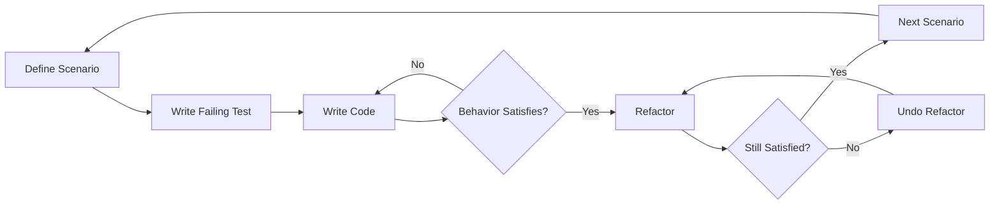

# Scenario-Driven Development

## Overview

Code written without scenarios confirms what you built. Scenarios defined before code define what should satisfy the user.

**Core principle:** Define the scenario first as an end-to-end user story, converge until behavior satisfies intent, refactor. Every time. No exceptions.

**SDD extends test-first development.** Scenarios ground tests in user intent; satisfaction replaces boolean pass/fail with probabilistic convergence. Hierarchy: Scenario (defines intent) → Test (encodes scenario) → Code (satisfies test).

## The Iron Law

```
NO PRODUCTION CODE WITHOUT A DEFINED SCENARIO FIRST
```

A scenario is an end-to-end description of observable behavior from the user's perspective. Not an assertion. Not a unit test. A user story with concrete, verifiable expectations.

If you write production code without a defined scenario, delete it. Define the scenario first.

## Key Concepts

### Scenario ≠ Test

| | Scenario | Test |
|---|---|---|
| **Lives** | In the spec or external to codebase | In the codebase |
| **Written as** | User story with observable behavior | Code assertion |
| **Evaluates** | "Does this satisfy the user?" | "Does this pass?" |
| **Vulnerable to** | Nothing (external holdout) | Reward hacking (agent rewrites test to match code) |
| **Judges** | LLM + execution + human intuition | Boolean assertion |
| **Example** | "4 friends split $100 + 20% tip → each pays $30" | `assert split(100,20,4) == 30.0` |

Tests are implementation details of scenarios. A scenario may be validated by one test, many tests, LLM-as-judge, behavioral verification, or a combination.

### Satisfaction ≠ Pass/Fail

Traditional: "All tests pass" → Done (boolean)
SDD: "Of all observed trajectories through all scenarios, what fraction satisfies the user?" → Convergence (probabilistic)

Satisfaction considers:
- Does the behavior serve the user's actual intent?
- Would this work across many realistic uses, not just the tested ones?
- Are error messages genuinely helpful, not just present?
- Is the rounding fair, not just technically correct?
- Would a human reviewing this say "yes, this is right"?

### Code as Opaque Weights

Code is treated analogously to ML model weights: internal structure is opaque. Correctness is inferred exclusively from externally observable behavior. You never validate by reading source code — you validate by observing what the code does.

## When to Use

**Always.** SDD applies to all implementation:
- New features
- Bug fixes
- Refactoring (existing scenarios still satisfied, then modify)
- API changes
- Configuration changes that affect behavior

**Exceptions (discuss with your human partner first):**
- Pure UI layout with no logic
- One-line config changes with no behavioral impact
- Exploratory spikes (but spike code gets deleted, then rebuilt with SDD)

## Scenario→Satisfy→Refactor



### SCENARIO — Define Observable Behavior

Articulate one end-to-end user story before writing any code.

**You MUST:**
1. Write the scenario BEFORE any production code
2. Express it as observable behavior from the user's perspective
3. Include concrete values (inputs and expected outputs)
4. Consider what would genuinely satisfy the user, not just what passes

**Convergence Gate — Verify SCENARIO:**
```
□ Scenario is defined as a user story with observable behavior
□ Scenario uses concrete values (not abstract placeholders)
□ Scenario describes EXTERNAL behavior (not internal implementation)
□ Scenario resists reward hacking (can't be trivially satisfied by `return True`)
□ Scenario considers user satisfaction, not just technical correctness
```

If ANY gate fails, you cannot proceed to SATISFY.

<Good>
- "A group of 4 friends splits a $100 bill with 20% tip — each person pays $30.00"
- "A solo diner with a $47.50 bill and 18% tip pays $56.05 total"
- "Splitting among 0 people tells the user 'At least one person required'"
- "When 3 people split $115 total, each pays $38.34 (rounded up so nobody underpays)"
</Good>

<Bad>
- "Test that split_bill returns correct values" — too vague, no concrete behavior
- "assert split_bill(100, 20, 4) == 30.0" — this is an assertion, not a scenario
- "The function should work correctly" — no observable behavior defined
- "Error handling works" — what does the user experience?
</Bad>

### SATISFY — Converge Until Behavior Satisfies Intent

Encode the scenario as a failing test, then write code and iterate until the scenario's observable behavior genuinely satisfies the user's intent.

**You MUST:**
1. Encode the scenario as a failing test before writing implementation code
2. Write code that addresses the scenario's observable behavior
3. Validate through execution (run tests, scripts, or behavioral checks)
4. Ask: "Would this genuinely satisfy a user?" — not just "Does this pass?"
5. Consider edge cases that the scenario implies but doesn't explicitly state
6. Handle floating-point, rounding, and display concerns proactively

**Convergence Gate — Verify SATISFY:**
```
□ Scenario was encoded as a failing test before implementation code
□ Code was written AFTER the scenario was defined
□ Behavior was validated through execution (not just reading code)
□ Validation output was observed (not assumed)
□ All previous scenarios remain satisfied
□ User would find this behavior genuinely satisfactory (not just technically passing)
```

If ANY gate fails, you cannot proceed to REFACTOR.

<Good>
- Running the test and observing the scenario's expected values match
- Noticing that tip_amount=8.549999999999999 doesn't satisfy "pays $8.55" and fixing proactively
- Adding `round()` because a user expects clean dollar amounts, even if no test demands it
- Considering "what if they tip 200%?" because generous tippers exist
</Good>

<Bad>
- Writing `return True` to pass an assertion — reward hacking
- Writing code that passes the test but produces 8.549999999999999 for a monetary value
- Ignoring floating-point because "the test passes with these specific values"
- Implementing only the happy path when the scenario implies error handling
</Bad>

### REFACTOR — Improve Without Changing Observable Behavior

Improve the code without changing any scenario's observable behavior. All scenarios must remain satisfied throughout.

**You MUST:**
1. Run validation BEFORE refactoring (establish baseline)
2. Make one small change at a time
3. Run validation AFTER each change
4. If any scenario breaks, undo the last change immediately

**Refactoring targets:**
- Remove duplication (DRY)
- Improve naming (clarity)
- Simplify conditionals (readability)
- Extract methods (single responsibility)
- Align with codebase conventions
- Add type annotations for clarity

**You MUST NOT:**
- Add new functionality (that requires a new SCENARIO)
- Change external behavior
- Skip validation between changes

### Repeat

Define the next scenario. Return to SCENARIO.

## Good Scenarios

| Quality | Good | Bad |
|---------|------|-----|
| **Describes user experience** | "User deposits $100, balance shows $100" | "deposit calls setter with 100" |
| **Concrete values** | "$47.50 bill, 18% tip, 1 person → $56.05" | "bill with tip split among people" |
| **End-to-end** | "Submit form → see confirmation page" | "validator returns true" |
| **Resistant to gaming** | "Nobody underpays when splitting" | "assert per_person > 0" |
| **Considers satisfaction** | "Error message tells user WHAT went wrong" | "raises ValueError" |
| **Independent** | Each scenario has its own context | Scenarios share state |
| **Covers edges** | "Empty cart → 'Add items first'" | Only happy path |

## Why Scenarios Before Code

**Why not write scenarios after?**

1. **Scenarios after code describe what you built, not what should satisfy.** You unconsciously write scenarios that match your implementation, missing what the user actually needs.

2. **Scenarios after code miss semantic edge cases.** When you define the scenario first, you think about what the user EXPERIENCES. After code, you think about what the code DOES.

3. **Scenarios before code prevent reward hacking.** The agent can't rewrite a pre-defined scenario to match broken code. The scenario is the holdout set.

**Anti-reward-hacking principle:** Modifying scenarios to pass = reward hacking. Weakening a test to match a bug = reward hacking. Assumed ≠ observed. Code must converge toward scenarios and tests, never the reverse.

4. **Scenarios before code drive holistic design.** SDD forces you to think about the complete user experience (rounding, error messages, display) before the first line of code.

## Scenarios and Tests: The Relationship

Scenarios are specifications. Tests are one mechanism for validating them.

```
Scenario: "4 friends split $100 + 20% tip → each pays $30.00"
    ↓ validated by
Test: def test_group_split():
         result = split_bill(100.0, 20.0, 4)
         assert result["per_person"] == 30.0
    ↓ but satisfaction goes beyond
Plus: floating-point correctness, round(), display, what if 3 people?
```

Tests implement scenarios. But satisfaction goes beyond what tests check:
- A test might pass while the code produces 8.549999999999999 for a monetary value
- A test might pass with `return True` (reward hacking)
- A test might check the happy path but miss edge cases the scenario implies

**The scenario is the authority. The test is a tool.**

## Common Rationalizations

| Rationalization | Reality |
|----------------|---------|
| "I'll define the scenario after coding" | You'll describe what you built, not what satisfies. |
| "This is too simple for a scenario" | Simple features have edge cases. Simple scenarios are fast to write. |
| "I need to see the shape first" | That's a spike. Delete the spike, then SDD. |
| "Scenarios slow me down" | Scenarios save time by preventing semantic bugs that tests miss. |
| "The framework makes scenarios hard" | Scenario = user story. If you can't describe what the user experiences, you don't understand the feature. |
| "I'm just refactoring" | Refactoring requires existing scenarios. If none exist, define them first. |
| "I know this satisfies" | You know NOW. Scenarios prove it satisfies TOMORROW. |
| "The assertion would be trivial" | Trivial assertions miss semantic bugs (floating-point, rounding, display). |
| "I need to prototype first" | Prototype ≠ production. Delete prototype, SDD the real thing. |

## Red Flags — STOP and Start Over

If you catch yourself:
- Writing production code without a defined scenario
- Writing implementation code without a failing test encoding the scenario
- Defining scenarios that describe implementation instead of user experience
- Satisfying a scenario by gaming the assertion instead of implementing real behavior
- Weakening, deleting, or loosening a test to make code pass
- Writing "just a little more" code beyond what the scenario requires
- Skipping validation ("I know it satisfies")
- Defining scenarios so narrow they can't catch semantic bugs
- Rationalizing why THIS case is an exception
- Ignoring floating-point, rounding, or display concerns in monetary/numeric scenarios

**ALL mean: Delete. Start over with SDD.**

## Your Human Partner's Signals

**Watch for these redirections:**
- "Does this satisfy the user?" — You're optimizing for assertion-passing, not satisfaction
- "What's the scenario?" — You wrote code without defining the user story
- "That's not minimal" — Your SATISFY phase has too much code
- "Scenario first" — You're implementing before defining behavior
- "Delete it" — Your spike should not become production code
- "Would a user accept that?" — Your code passes tests but produces unsatisfying behavior

**When you see these:** STOP. Return to SCENARIO.

## Example: Bug Fix

**Bug:** `calculate_discount(100, 0.5)` returns `150` instead of `50`.

**SCENARIO:**
"A customer buys a $100 item with 50% discount — they pay $50."

**SATISFY:**
```python
def test_customer_gets_half_price():
    result = calculate_discount(100, 0.5)
    assert result == 50  # Customer pays $50 for 50% discount
```
Run → FAILS: `AssertionError: 150 != 50`
Gate: Behavior doesn't satisfy scenario (customer would pay $150 instead of $50). ✓

```python
def calculate_discount(price, discount_rate):
    return price * (1 - discount_rate)  # Was: price * (1 + discount_rate)
```
Run → PASSES ✓
Gate: Customer now pays $50 for 50% discount — satisfies intent. ✓

**REFACTOR:**
```python
def calculate_discount(price: float, discount_rate: float) -> float:
    """Apply discount rate to price. Rate is 0-1 where 0.5 = 50% off."""
    return round(price * (1 - discount_rate), 2)
```
Run → PASSES ✓
Gate: Added type hints, docstring, and round() for monetary precision — behavior unchanged but more robust for real use. ✓

## Example: New Feature

**Feature:** Split a restaurant bill among friends.

**SCENARIO 1:** "4 friends split a $100 bill with 20% tip — each pays $30.00"
**SCENARIO 2:** "Solo diner with $47.50 bill and 18% tip pays $56.05"
**SCENARIO 3:** "3 people split $115 total — each pays $38.34 (rounded up, nobody underpays)"
**SCENARIO 4:** "Splitting among 0 people → 'At least one person required'"

**SATISFY (iterating through scenarios):**
1. Define SCENARIO 1 as test → write minimal split_bill → passes
2. Define SCENARIO 2 as test → requires tip rounding for monetary precision → add `round()` → passes
3. Define SCENARIO 3 as test → requires ceiling for "nobody underpays" → add `math.ceil` → passes
4. Define SCENARIO 4 as test → requires validation → add ValueError → passes

**Notice:** Scenario 2 naturally drove the `round()` addition because "pays $56.05" is a statement about what the user sees, not what the assertion checks. A bare assertion like `assert tip == 8.549999999999999` would never be written — the scenario demands human-readable monetary values.

## Verification Checklist

Before claiming implementation is complete:

```
□ Every production function is covered by at least one scenario
□ Every scenario was defined BEFORE its corresponding production code
□ Every scenario was encoded as a failing test BEFORE implementation code
□ Every scenario was validated through execution (not assumed)
□ No test was weakened, deleted, or loosened to make code pass
□ All scenarios satisfy simultaneously (no order dependency)
□ Satisfaction goes beyond assertion-passing (floating-point, display, UX considered)
□ Edge cases from scenarios are covered (null, empty, boundary, error)
□ Refactoring was done with all scenarios satisfied throughout
□ No scenario can be trivially satisfied by reward hacking
```

## When Stuck

| Problem | Solution |
|---------|----------|
| Can't figure out what scenario to define | Reread the requirement. What's the simplest thing a user would experience? |
| Scenario is too complex | Break into smaller user stories. One behavior per scenario. |
| Too many things to mock | Too much coupling. Extract and inject dependencies. |
| Scenario satisfied immediately | Your code already handles this. Define a different scenario or verify it's genuinely satisfying. |
| Can't satisfy without big change | You skipped steps. Define a simpler scenario that requires less code. |
| Validation is slow | Move logic to unit-level scenarios. Integration scenarios for boundaries only. |
| Not sure if behavior satisfies | Ask: "Would the user accept this?" If unsure, define the scenario more concretely. |

## Debugging Integration

When a bug is found:

1. **Define a scenario** that describes the broken user experience (SCENARIO)
2. **Fix the bug** until the scenario is satisfied (SATISFY)
3. **Refactor** if needed (REFACTOR)
4. The scenario's test becomes a regression guard permanently

Never fix a bug without first defining a scenario that describes what the user should experience.

For complex bugs, invoke the systematic-debugging skill first to find root cause, then return here for the SDD fix cycle.

## Quality Integration

After all scenarios are satisfied and refactoring is complete:

1. **Invoke `code-reviewer`** — validates against requirements, checks for bugs, security issues
2. **Invoke `code-simplifier`** — reduces complexity, removes redundancy while preserving function
3. **Invoke verification-before-completion** — the 6-step evidence gate before any completion claim

Address Critical/Important issues from agents before proceeding to the verification gate.

## Validation Anti-Patterns

See `references/validation-anti-patterns.md` for detailed coverage of:
- Reward hacking (satisfying assertions without real behavior)
- Mock-only validation (testing what mocks do, not what code does)
- Narrow assertions that miss semantic bugs
- Structural and process anti-patterns

## Related

- **brainstorming** — The entry point: scenarios defined during brainstorming and crystallized in the approved plan file are the input for SCENARIO phase
- **verification-before-completion** — The terminal gate: invoke after Quality Integration, before any completion claim
- **systematic-debugging** — Root cause analysis; invoke when bugs are complex before SDD fix cycle

## Artifact Handoff

| Receives | Produces |
|---|---|
| Observable scenarios from approved plan file (or defined inline for bug fixes/small changes) | Satisfied code with all scenarios passing |
| | Quality Integration complete (code-reviewer + code-simplifier agents) |

**← From:** brainstorming produces the holdout scenarios, crystallized in the approved plan file.
**→ Next:** verification-before-completion runs the 6-step evidence gate.
