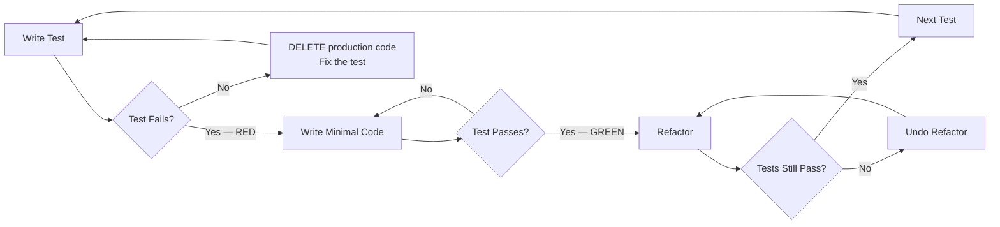

# Test-Driven Development

## Overview

Tests written after code confirm what you built. Tests written before code define what you should build.

**Core principle:** Write the test first, watch it fail, write the minimum code to pass, refactor. Every time. No exceptions.

**Violating the letter of this process is violating the spirit of TDD.**

## The Iron Law

```
NO PRODUCTION CODE WITHOUT A FAILING TEST FIRST
```

If you write production code without a failing test, delete it. Write the test first.

If a test passes immediately, delete your production code. Your test is wrong or your code was already there.

## When to Use

**Always.** TDD applies to all implementation:
- New features
- Bug fixes
- Refactoring (existing tests cover, then modify)
- API changes
- Configuration changes that affect behavior

**Exceptions (discuss with your human partner first):**
- Pure UI layout with no logic
- One-line config changes with no behavioral impact
- Exploratory spikes (but spike code gets deleted, then rebuilt with TDD)

## Red-Green-Refactor



### RED — Write a Failing Test

Write one test. Run it. Watch it fail.

**You MUST:**
1. Write the test BEFORE any production code
2. Run the test
3. Verify it fails
4. Verify it fails for the RIGHT reason

**Gate Function — Verify RED:**
```
□ Test exists and is syntactically valid
□ Test was executed (not just written)
□ Test FAILED (red output observed)
□ Failure reason matches expectation (not import error, not syntax error)
```

If ANY gate fails, you cannot proceed to GREEN.

<Good>
- Test fails with "function not defined" — expected for new function
- Test fails with "expected 5, got undefined" — expected for unimplemented logic
- Test fails with "expected error to be thrown" — expected for missing validation
</Good>

<Bad>
- Test fails with "SyntaxError" — fix your test, this is not a valid RED
- Test fails with "ModuleNotFoundError" — fix imports, this is not a valid RED
- Test passes immediately — delete production code, fix your test
- Test was not executed — you skipped the gate
</Bad>

### GREEN — Write Minimal Code to Pass

Write the LEAST amount of code that makes the test pass. Nothing more.

**You MUST:**
1. Write ONLY enough code to pass the current failing test
2. Not anticipate future tests
3. Not optimize
4. Run the test and verify it passes

**Gate Function — Verify GREEN:**
```
□ Production code was written AFTER the failing test
□ Code is minimal (no extra functionality)
□ Test was re-executed (not assumed to pass)
□ Test PASSED (green output observed)
□ All previous tests still pass
```

If ANY gate fails, you cannot proceed to REFACTOR.

<Good>
- Hardcoding a return value when only one test case exists
- Using the simplest possible algorithm
- Skipping error handling until a test demands it
- Returning early with a constant if that's all the test requires
</Good>

<Bad>
- Implementing the "full" solution in one step
- Adding error handling no test requires yet
- Optimizing before you have a passing test
- Writing code for the next test case
</Bad>

### REFACTOR — Clean Up, Keep Green

Improve the code without changing behavior. Tests must stay green throughout.

**You MUST:**
1. Run tests BEFORE refactoring (establish baseline)
2. Make one small change at a time
3. Run tests AFTER each change
4. If any test fails, undo the last change immediately

**Refactoring targets:**
- Remove duplication (DRY)
- Improve naming (clarity)
- Simplify conditionals (readability)
- Extract methods (single responsibility)
- Align with codebase conventions

**You MUST NOT:**
- Add new functionality (that requires a new RED)
- Change external behavior
- Skip running tests between changes

### Repeat

Pick the next test case. Return to RED.

## Good Tests

| Quality | Good | Bad |
|---------|------|-----|
| **Tests behavior** | `test_deposit_increases_balance` | `test_deposit_calls_setter` |
| **One assertion concept** | Assert balance changed | Assert balance changed AND log written AND event fired |
| **Independent** | Each test creates its own data | Tests share state, order matters |
| **Readable** | Arrange-Act-Assert clearly separated | 50 lines of setup, assertion buried |
| **Fast** | Runs in milliseconds | Hits network, database, filesystem |
| **Deterministic** | Same result every run | Fails on Tuesdays, passes on retry |
| **Tests edge cases** | Empty input, null, boundary values | Only happy path |

## Why Order Matters

**Why not write tests after?**

1. **Tests after code test your implementation, not your requirements.** You unconsciously write tests that match what you built, not what you should have built.

2. **Tests after code miss edge cases.** When you write the test first, you think about what SHOULD happen. After code, you think about what DOES happen.

3. **Tests after code become a chore.** "I'll write them later" becomes "I'll write them never." Tests first are a design tool; tests after are a tax.

4. **Tests after code don't drive design.** TDD forces simple interfaces because you experience the API as a consumer first. Tests after code accept whatever interface emerged.

## Common Rationalizations

| Rationalization | Reality |
|----------------|---------|
| "I'll write the test right after" | You won't. And if you do, it'll confirm your code, not challenge it. |
| "This is too simple to test" | Simple code has edge cases. Simple tests are fast to write. |
| "I need to see the shape first" | That's a spike. Delete the spike, then TDD. |
| "Tests slow me down" | Tests slow you down NOW. Bugs slow you down MORE later. |
| "The framework makes TDD hard" | Test the logic, not the framework. Extract testable units. |
| "I'm just refactoring" | Refactoring requires existing tests. If none exist, write them first. |
| "It's just a config change" | If it changes behavior, it needs a test. If it doesn't, why change it? |
| "I know this works" | You know it works NOW. Tests prove it works TOMORROW. |
| "The test would be trivial" | Trivial tests catch trivial bugs. Trivial bugs cause outages. |
| "I need to prototype first" | Prototype ≠ production. Delete prototype, TDD the real thing. |
| "Mocking is too complex here" | Complex mocking = complex coupling. Simplify the design first. |

## Red Flags — STOP and Start Over

If you catch yourself:
- Writing production code without a failing test
- Writing multiple tests before any production code
- Making a test pass by changing the test instead of writing code
- Writing "just a little more" code beyond what the test requires
- Skipping the test run ("I know it passes")
- Writing tests that test mock behavior instead of real behavior
- Feeling the test is "too hard to write" (design smell — simplify the interface)
- Rationalizing why THIS case is an exception

**ALL mean: Delete. Start over with TDD.**

## Your Human Partner's Signals

**Watch for these redirections:**
- "Did you run the test?" — You skipped the gate function
- "Why did you write that code?" — You wrote code without a failing test
- "That's not minimal" — Your GREEN phase has too much code
- "Test first" — You're implementing before testing
- "Delete it" — Your spike should not become production code
- "What does the test say?" — You're debugging by reading code instead of running tests

**When you see these:** STOP. Return to RED.

## Example: Bug Fix

**Bug:** `calculate_discount(100, 0.5)` returns `150` instead of `50`.

**RED:**
```python
def test_calculate_discount_applies_percentage():
    result = calculate_discount(100, 0.5)
    assert result == 50  # 50% discount on 100
```
Run → FAILS: `AssertionError: 150 != 50`
Gate: Failure is for the right reason (wrong calculation, not import error). ✓

**GREEN:**
```python
def calculate_discount(price, percentage):
    return price * (1 - percentage)  # Was: price * (1 + percentage)
```
Run → PASSES ✓
Gate: Minimal fix, only changed the operator. ✓

**REFACTOR:**
```python
def calculate_discount(price, discount_rate):
    """Apply discount rate to price. Rate is 0-1 where 0.5 = 50% off."""
    return price * (1 - discount_rate)
```
Run → PASSES ✓
Gate: Renamed parameter for clarity, added docstring, behavior unchanged. ✓

## Verification Checklist

Before claiming implementation is complete:

```
□ Every production function has at least one test
□ Every test was written BEFORE its corresponding production code
□ Every test was observed to FAIL before production code was written
□ Every test was observed to PASS after production code was written
□ All tests pass in a single run (no order dependency)
□ No test tests mock behavior instead of real behavior
□ Edge cases are covered (null, empty, boundary, error)
□ Refactoring was done with tests green throughout
```

## When Stuck

| Problem | Solution |
|---------|----------|
| Can't figure out what test to write | Reread the requirement. What's the simplest behavior you need? |
| Test is too complex to write | Interface is too complex. Simplify the design. |
| Too many things to mock | Too much coupling. Extract and inject dependencies. |
| Test passes immediately | Your production code already handles this. Write a different test or delete redundant code. |
| Can't make test pass without big change | You skipped steps. Write a simpler test that requires less code. |
| Tests are slow | Move logic to unit-testable functions. Integration tests for boundaries only. |
| Not sure if RED failure is "right" | Right = tests your logic. Wrong = infrastructure error (imports, syntax, config). |

## Debugging Integration

When a bug is found:

1. **Write a failing test** that reproduces the bug (RED)
2. **Fix the bug** with minimal code change (GREEN)
3. **Refactor** if needed (REFACTOR)
4. The failing test becomes a regression test permanently

Never fix a bug without first writing a test that fails because of that bug.

For complex bugs, invoke the systematic-debugging skill first to find root cause, then return here for the TDD fix cycle.

## Quality Integration

After all tests pass and refactoring is complete:

1. **Invoke `code-reviewer`** — validates against requirements, checks for bugs, security issues
2. **Invoke `code-simplifier`** — reduces complexity, removes redundancy while preserving function

Address Critical/Important issues from review before claiming completion.

## Testing Anti-Patterns

See `references/testing-anti-patterns.md` for detailed coverage of:
- Mock behavior testing (testing what mocks do, not what code does)
- Test-only methods in production code
- Incomplete mocks that hide real failures
- Structural and process anti-patterns

## Related

- **sop-code-assist** — Orchestrates the full implementation workflow; invokes this skill at Step 4
- **verification-before-completion** — Evidence-based completion gate; use before claiming done
- **systematic-debugging** — Root cause analysis; invoke when bugs are complex before TDD fix cycle
