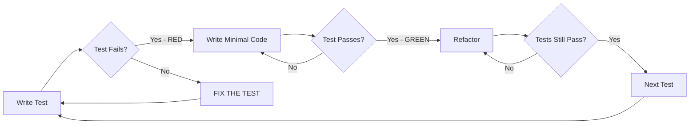

# TDD Workflow Reference

## Overview

Test-Driven Development (TDD) follows a strict cycle: **RED → GREEN → REFACTOR**. This reference documents the exact workflow to follow during the Code phase of sop-code-assist.

## The TDD Cycle



## Phase Details

### RED Phase

**Objective:** Write a test that fails for the right reason.

**You MUST:**
- Write the test BEFORE any implementation code
- Run the test and verify it FAILS
- Verify it fails for the EXPECTED reason (not syntax error, import error, etc.)
- Document the expected failure reason in progress.md

**Critical Rule:** If the test PASSES immediately, the test is WRONG. Fix the test, not the code.

**Example Failure Reasons:**
- ✅ "Function not defined" - Expected for new function
- ✅ "Expected X but got undefined" - Expected for unimplemented logic
- ❌ "Import error" - Fix the import, not a valid RED
- ❌ "Syntax error" - Fix the syntax, not a valid RED

### GREEN Phase

**Objective:** Make the test pass with the MINIMUM code necessary.

**You MUST:**
- Write ONLY enough code to make the current test pass
- Not implement features for future tests
- Not optimize or refactor during this phase
- Run the test and verify it PASSES

**You MUST NOT:**
- Add extra functionality "while you're there"
- Refactor existing code
- Write additional tests

**Minimum Code Examples:**
- Hardcode return value if only one test case
- Use simplest algorithm, even if inefficient
- Skip error handling until you have a test for it

### REFACTOR Phase

**Objective:** Improve code quality while keeping tests green.

**You MUST:**
- Run tests BEFORE refactoring to establish baseline
- Make small, incremental changes
- Run tests AFTER each change
- Stop if any test fails

**Refactoring Checklist:**
- [ ] Remove duplication (DRY)
- [ ] Improve naming (clarity)
- [ ] Simplify logic (KISS)
- [ ] Extract methods/functions (SRP)
- [ ] Align with codebase conventions

**You MUST NOT:**
- Add new functionality
- Change behavior (tests must still pass with same inputs/outputs)
- Skip running tests between changes

## Test Organization

### Test File Structure

```text
tests/
├── unit/
│   └── {component}_test.{ext}
├── integration/
│   └── {feature}_integration_test.{ext}
└── fixtures/
    └── {fixture_name}.{ext}
```

### Test Naming Convention

```text
test_{scenario}_{expected_behavior}

Examples:
- test_validate_email_returns_true_for_valid_format
- test_validate_email_returns_false_when_missing_at_symbol
- test_validate_email_raises_error_on_empty_input
```

### Test Structure (AAA Pattern)

```python
def test_something():
    # Arrange - Set up test data
    input_data = create_test_data()
    expected = expected_result()

    # Act - Execute the code under test
    result = function_under_test(input_data)

    # Assert - Verify the result
    assert result == expected
```

## Common TDD Mistakes

| Mistake | Problem | Fix |
|---------|---------|-----|
| Writing code before test | Violates TDD cycle | Always RED first |
| Test passes immediately | Test isn't testing what you think | Fix the test |
| Too much code in GREEN | Over-engineering | Write MINIMUM code |
| Skipping REFACTOR | Technical debt | Always refactor |
| Not running tests often | Confidence lost | Run after every change |
| Testing implementation, not behavior | Brittle tests | Test public interfaces |

## Test Doubles

### When to Use

| Type | Use When |
|------|----------|
| **Stub** | Need to control indirect inputs |
| **Mock** | Need to verify indirect outputs |
| **Fake** | Need a working implementation without side effects |
| **Spy** | Need to record calls for later verification |

### Example

```python
# Stub - Returns canned response
email_service = Mock()
email_service.send.return_value = True

# Mock - Verifies interaction
email_service = Mock()
# ... run code ...
email_service.send.assert_called_once_with("test@example.com")
```

## TDD and Acceptance Criteria

Map each acceptance criterion to one or more tests:

```markdown
## Acceptance Criterion: Valid email acceptance
- UT-01: test_returns_true_for_standard_email_format
- UT-02: test_returns_true_for_email_with_subdomain
- UT-03: test_returns_true_for_email_with_plus_addressing
```

Complete the criterion when ALL mapped tests pass.

## Documenting TDD Cycles

In progress.md, document each cycle:

```markdown
### Cycle 3: Invalid Email Detection

**RED:**
- Test: test_returns_false_when_missing_at_symbol
- Expected Failure: "Expected False, got True" or "Function not defined"
- Actual: "Expected False, got True" ✓
- Timestamp: 2026-01-28T10:30:00

**GREEN:**
- Added check for '@' in email string
- Minimal implementation: `return '@' in email`
- Test Result: PASS
- Timestamp: 2026-01-28T10:32:00

**REFACTOR:**
- Extracted validation logic to separate method
- Added type hints
- All tests: PASS
- Timestamp: 2026-01-28T10:35:00
```

## References

- Kent Beck's "Test-Driven Development: By Example"
- Martin Fowler's Refactoring patterns
- xUnit Test Patterns by Gerard Meszaros
