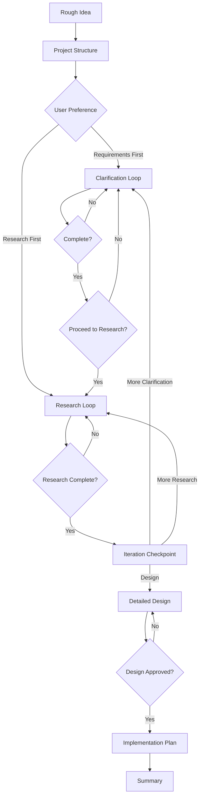

# SOP Planning - Prompt-Driven Development

This skill implements PDD (Prompt-Driven Development) methodology, transforming rough ideas into detailed, implementation-ready designs through structured clarification, research, and design phases.

## When to Use

- Starting a new feature with only a rough concept
- Converting discovery.md output into detailed requirements
- Need structured approach to move from idea to implementation
- Want to ensure thorough requirements and research before coding

**Keywords for Claude Search Optimization (CSO)**:
- Error messages/symptoms: "rough idea", "need design document", "unclear architecture", "how to structure requirements", "need technical design", "idea not ready for coding"
- Synonyms: "PDD", "Prompt-Driven Development", "design document", "requirements specification", "technical planning", "detailed design", "architecture planning"
- Use cases: "idea to implementation", "design before coding", "requirements clarification", "research phase", "architecture design", "implementation planning"
- Alternative terminology: "problem definition document", "technical spec", "design spec", "feature planning", "requirements doc"

## Parameters

- **rough_idea** (required): The concept to develop
  - Can be: text description, file path to discovery.md, or URL
  - Example: "Build a caching layer for API requests"
  - Example: `/path/to/discovery.md`

- **project_dir** (optional): Base directory for artifacts
  - Default: `specs/{sanitized-goal-name}`
  - Example: `specs/api-caching-layer`
  - All artifacts will be created under this directory

- **discovery_path** (optional): Path to existing discovery.md
  - If provided, use as starting point for rough-idea.md
  - Preserves context from earlier discovery phase

## Process Overview



## Step-by-Step Instructions

### Step 1: Create Project Structure

**Objective**: Establish organized workspace for all artifacts.

**Actions**:

1. You MUST create the following directory structure:
   ```
   {project_dir}/
   ├── rough-idea.md
   ├── idea-honing.md
   ├── research/
   ├── design/
   └── implementation/
   ```

2. You MUST populate `rough-idea.md`:
   - If `rough_idea` is a file path: copy its content
   - If `rough_idea` is text: use it directly
   - If `rough_idea` is a URL: fetch and summarize
   - Include: goal, context, known constraints

3. You MUST create `idea-honing.md` using the template at `templates/idea-honing.md.template`

**Verification**: All directories exist and rough-idea.md is populated.

---

### Step 2: Initial Process Planning

**Objective**: Determine starting approach with user input.

**Actions**:

1. You MUST present both options to the user:
   - **Option A**: Start with requirements clarification (recommended for unclear requirements)
   - **Option B**: Start with preliminary research (recommended when domain knowledge needed first)

2. You MUST explain the difference:
   - Clarification: Ask questions about what to build, edge cases, UX expectations
   - Research: Investigate existing solutions, technical options, best practices

3. You MUST wait for explicit user selection before proceeding

4. You MAY suggest an option based on the rough idea, but user decides

**Verification**: User has explicitly chosen Option A or B.

---

### Step 3: Requirements Clarification

**Objective**: Transform rough idea into detailed requirements through iterative questioning.

**Critical Constraints**:
- You MUST ask ONLY ONE question at a time
- You MUST NOT pre-populate answers or assume user intent
- You MUST NOT proceed to next question until current one is answered
- You MUST append each Q&A pair to `idea-honing.md` immediately

**Question Categories** (cover all that apply):

1. **Core Functionality**
   - What exactly should this do?
   - What are the primary use cases?
   - What is out of scope?

2. **Edge Cases & Constraints**
   - What happens when [edge case]?
   - Are there performance requirements?
   - Are there security considerations?
   - What are acceptable failure modes?

3. **User Experience**
   - Who will use this?
   - How should errors be communicated?
   - What is the expected workflow?

4. **Technical Context**
   - What existing systems does this integrate with?
   - Are there technology preferences/constraints?
   - What is the deployment environment?

5. **Success Criteria**
   - How will we know this is working correctly?
   - What metrics matter?
   - What is the minimum viable version?

**Process**:

1. You MUST start with the most fundamental question about core functionality

2. After each answer:
   - Append to `idea-honing.md` in this format:
     ```markdown
     **Q: [Your question]**

     A: [User's answer]

     ---
     ```

3. You MUST determine next question based on previous answers

4. You SHOULD aim for 5-15 questions total (fewer for simple ideas, more for complex)

5. After every 3-5 questions, you MUST ask user: "Do you want to continue clarification or move to [research/design]?"

6. You MUST explicitly ask: "Are the requirements sufficiently detailed to proceed?" before moving to Step 4

**Verification**: User has explicitly confirmed requirements are complete.

---

### Step 4: Research Relevant Information

**Objective**: Gather technical context, evaluate options, and inform design decisions.

**Actions**:

1. You MUST propose a research plan to the user:
   - List 3-5 research topics based on requirements
   - Example topics: existing solutions, architectural patterns, technology options, integration approaches
   - Explain why each topic is relevant

2. You MUST ask user: "Are there additional topics I should research?"

3. You MUST wait for user input before starting research

4. For each research topic, you MUST:
   - Create a separate file: `{project_dir}/research/{topic-name}.md`
   - Use the template at `templates/research-template.md`
   - Include findings, comparisons, recommendations
   - Include mermaid diagrams where helpful (architectures, flows, comparisons)

5. You SHOULD check with user after every 2-3 research files: "Should I continue with remaining topics or adjust focus?"

6. You MUST ask user: "Is the research sufficient to proceed to design?" before moving to Step 5

**Research Quality Standards**:
- Each research file MUST be standalone (no cross-references without context)
- You MUST include specific examples, not just generic descriptions
- You SHOULD compare 2-3 options when multiple approaches exist
- You MUST make a recommendation with justification

**Verification**: User has explicitly confirmed research is sufficient.

---

### Step 5: Iteration Checkpoint

**Objective**: Ensure alignment before committing to detailed design.

**Actions**:

1. You MUST create a summary of current state:
   ```markdown
   ## Current State

   **Requirements Captured**: [Count] questions answered in idea-honing.md
   **Research Completed**: [Count] research documents created

   **Key Decisions Made**:
   - [List 3-5 major decisions from clarification and research]

   **Open Questions**:
   - [List any remaining uncertainties]
   ```

2. You MUST present three options to user:
   - **Option A**: Proceed to detailed design
   - **Option B**: Return to requirements clarification (if gaps found)
   - **Option C**: Conduct additional research (if technical questions remain)

3. You MUST NOT proceed to Step 6 without explicit user selection of Option A

4. If user selects Option B: return to Step 3
5. If user selects Option C: return to Step 4

**Verification**: User has explicitly chosen Option A (proceed to design).

---

### Step 6: Create Detailed Design

**Objective**: Transform requirements and research into comprehensive technical design.

**Actions**:

1. You MUST create `{project_dir}/design/detailed-design.md` using the template at `templates/detailed-design.md.template`

2. You MUST populate ALL sections of the template:
   - Overview (problem, solution, goals, non-goals)
   - Requirements (functional, non-functional)
   - Architecture (system context, components, data flow)
   - Components (detailed specifications)
   - Data Models (schemas, relationships)
   - Error Handling (failure modes, recovery)
   - Testing Strategy (unit, integration, E2E)
   - Appendices (alternatives considered, future work)

3. You MUST include mermaid diagrams for:
   - System architecture (C4 context or component diagram)
   - Data flow (sequence or flow diagram)
   - State transitions (if applicable)

4. You MUST reference research files when making design decisions:
   - Format: "Based on research in `research/technology-options.md`, we choose X because Y"

5. After completing the design, you MUST ask user:
   - "Please review the detailed design. Are there any sections that need clarification or revision?"

6. You MUST iterate on the design based on user feedback

7. You MUST explicitly ask: "Is the design ready for implementation planning?" before moving to Step 7

**Design Quality Standards**:
- Each component MUST have clear responsibilities
- You MUST identify failure modes and mitigation strategies
- You MUST specify testability approach
- You SHOULD include complexity estimates (S/M/L/XL per CLAUDE.md)

**Verification**: User has explicitly approved the design for implementation.

---

### Step 7: Develop Implementation Plan

**Objective**: Break design into actionable, incremental implementation steps.

**Actions**:

1. You MUST create `{project_dir}/implementation/plan.md`

2. The plan MUST start with a checklist:
   ```markdown
   ## Implementation Checklist

   - [ ] Step 1: [Description]
   - [ ] Step 2: [Description]
   - [ ] Step 3: [Description]
   ...
   ```

3. Each step MUST:
   - Be independently testable
   - Result in a demoable increment
   - Build on previous steps (no dependencies on future steps)
   - Include acceptance criteria
   - Estimate complexity (S/M/L/XL)

4. You MUST follow TDD approach:
   - For each step: "Write test → See it fail → Implement → Refactor"
   - Include specific test cases in plan

5. You MUST organize steps by logical phases:
   - Phase 1: Foundation (data models, core abstractions)
   - Phase 2: Core Functionality (main features)
   - Phase 3: Integration (connect components)
   - Phase 4: Polish (error handling, edge cases, UX)

6. You SHOULD include these sections:
   ```markdown
   ## Prerequisites
   - Dependencies to install
   - Environment setup
   - Access requirements

   ## Implementation Steps
   [Numbered steps with sub-tasks]

   ## Testing Strategy
   - Unit test approach
   - Integration test plan
   - Manual verification steps

   ## Rollout Plan
   - Deployment steps
   - Monitoring plan
   - Rollback procedure
   ```

7. You MUST ask user: "Does this implementation plan make sense? Any steps to add/modify/reorder?"

**Plan Quality Standards**:
- You MUST ensure each step is ≤ M complexity (per CLAUDE.md budget)
- You MUST specify verification command for each step
- You SHOULD aim for 5-15 steps total
- Each step MUST be completable in ≤ 2 hours

**Verification**: User has reviewed and approved the implementation plan.

---

### Step 8: Summarize Results

**Objective**: Provide clear overview of all artifacts and next steps.

**Actions**:

1. You MUST create `{project_dir}/summary.md` with the following structure:

   ```markdown
   # Planning Summary: [Project Name]

   **Date**: [Current date]
   **Goal**: [One-sentence description from rough-idea.md]

   ## Artifacts Created

   ### Requirements
   - `rough-idea.md` - Initial concept
   - `idea-honing.md` - [N] Q&A pairs refining requirements

   ### Research
   - `research/[topic-1].md` - [Brief description]
   - `research/[topic-2].md` - [Brief description]
   ...

   ### Design
   - `design/detailed-design.md` - Comprehensive technical design

   ### Implementation
   - `implementation/plan.md` - [N]-step implementation plan

   ## Key Decisions

   1. [Major decision 1 and rationale]
   2. [Major decision 2 and rationale]
   3. [Major decision 3 and rationale]

   ## Complexity Estimate

   - **Overall**: [S/M/L/XL]
   - **Duration**: [Time estimate]
   - **Risk Level**: [Low/Medium/High]

   ## Recommended Next Steps

   1. Review all artifacts with stakeholders
   2. Begin implementation with Step 1 of plan.md
   3. Set up monitoring/logging infrastructure (if needed)
   4. Schedule design review checkpoint after Phase 1

   ## Open Questions

   [Any remaining uncertainties or decisions deferred to implementation]
   ```

2. You MUST provide a file tree showing the complete structure:
   ```
   {project_dir}/
   ├── rough-idea.md
   ├── idea-honing.md
   ├── summary.md
   ├── research/
   │   ├── [topic-1].md
   │   └── [topic-2].md
   ├── design/
   │   └── detailed-design.md
   └── implementation/
       └── plan.md
   ```

3. You SHOULD suggest relevant skills for next phase:
   - If ready to implement: "Use `/speckit.implement` or `/executing-plans` to begin"
   - If needs review: "Use `/requesting-code-review` for design review"
   - If prototype needed: "Consider `/brainstorming` for quick proof-of-concept"

**Verification**: Summary created with all artifacts documented.

---

## Quality Standards

### Documentation Requirements

All artifacts MUST be:
- **Standalone**: Readable without referencing other documents (include necessary context)
- **Specific**: Concrete examples, not generic descriptions
- **Actionable**: Clear next steps and decisions
- **Versioned**: Include creation date and last updated timestamp

### User Interaction Requirements

You MUST:
- Ask ONE question at a time during clarification
- Wait for explicit user confirmation before phase transitions
- Present options (not assumptions) when multiple paths exist
- Periodically check: "Should I continue or adjust direction?"

You MUST NOT:
- Proceed to next phase without explicit user approval
- Pre-populate answers or assume user intent
- Create implementation plan before design is approved
- Skip any of the 8 steps (unless user explicitly requests)

### Artifact Organization

```
{project_dir}/
├── rough-idea.md          # Initial concept (immutable)
├── idea-honing.md         # Q&A refinement log
├── summary.md             # Final overview
├── research/              # One file per research topic
│   ├── topic-1.md
│   └── topic-2.md
├── design/                # Design artifacts
│   └── detailed-design.md
└── implementation/        # Implementation artifacts
    └── plan.md
```

## Example Invocation

```
User: I want to build a caching layer for our API to reduce database load