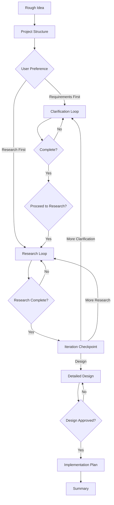

# SOP Planning - Prompt-Driven Development

## Overview

This skill implements PDD (Prompt-Driven Development) methodology, transforming rough ideas into detailed, implementation-ready designs through structured clarification, research, and design phases.

## When to Use

- Starting a new feature with only a rough concept
- Converting discovery.md output into detailed requirements
- Need structured approach to move from idea to implementation
- Want to ensure thorough requirements and research before coding

## When NOT to Use

| Situation | Why Not | Use Instead |
|-----------|---------|-------------|
| Already have detailed design | Planning already done | `sop-task-generator` |
| Simple feature (<5 requirements) | Overhead exceeds benefit | Direct implementation |
| Exploring existing code | Not for analysis | `sop-reverse` |
| Need constraints/risks first | Discovery comes first | `sop-discovery` |

## Parameters

- **rough_idea** (required): Initial concept to develop. Accepts text, file path, or URL.
- **project_dir** (optional, default: specs/{name}): Directory for planning artifacts
- **discovery_path** (optional): Path to existing discovery.md to continue from

### Existing Data Protection

**You MUST NOT:**
- Overwrite an existing project directory without explicit user confirmation
- Proceed if the default project directory contains files

**You MUST:**
- Check if `{project_dir}` exists before creating it
- If exists and contains files, ask user: "Directory already contains files. Options: (1) Use different name, (2) Archive existing, (3) Overwrite (destructive)"
- Only proceed after explicit user choice

## Output Structure
```text
{project_dir}/
├── rough-idea.md
├── idea-honing.md
├── research/
├── design/
│   └── detailed-design.md
└── implementation/
    └── plan.md
```

## Process Overview



## Step-by-Step Instructions

### Step 1: Create Project Structure

Create directory structure and populate initial artifacts:

```text
{project_dir}/
├── rough-idea.md      # From rough_idea parameter
├── idea-honing.md     # Use templates/idea-honing.md.template
├── research/
├── design/
└── implementation/
```

**Constraints:**
- You MUST create all directories in the structure
- You MUST populate rough-idea.md with the input parameter content
- You MUST use templates when available

**Verification**: All directories exist and rough-idea.md is populated.

---

### Step 2: Initial Process Planning

Present options to user:
- **Option A**: Start with requirements clarification (unclear requirements)
- **Option B**: Start with preliminary research (domain knowledge needed)

**Constraints:**
- You MUST present both options clearly
- You MUST NOT assume user preference
- You MUST wait for explicit user choice before proceeding

**Verification**: User has explicitly chosen Option A or B.

---

### Step 3: Requirements Clarification

**Question Categories**:
1. **Core Functionality**: What should it do? Primary use cases? Out of scope?
2. **Edge Cases & Constraints**: Performance? Security? Failure modes?
3. **User Experience**: Who uses it? Error communication? Expected workflow?
4. **Technical Context**: Integration points? Technology constraints? Deployment?
5. **Success Criteria**: How do we know it works? What metrics? MVP scope?

**Process**:
1. Start with fundamental core functionality question
2. After each answer, append to `idea-honing.md`:
   ```markdown
   **Q: [Your question]**
   A: [User's answer]
   ---
   ```
3. Aim for 5-15 questions (fewer for simple, more for complex)
4. Every 3-5 questions: "Continue clarification or move to [research/design]?"
5. Before proceeding: "Are requirements sufficiently detailed?"

**Constraints:**
- You MUST ask ONLY ONE question at a time
- You MUST NOT pre-populate answers or assume user intent
- You MUST append each Q&A pair to `idea-honing.md` immediately
- You MUST wait for user response before next question
- You SHOULD adapt follow-up questions based on previous answers
- You MAY suggest options when user is unsure

**Verification**: User has explicitly confirmed requirements are complete.

---

### Step 4: Research Relevant Information

1. Propose research plan (3-5 topics) based on requirements
2. Ask: "Are there additional topics I should research?"
3. For each topic, create `{project_dir}/research/{topic-name}.md` using `templates/research-template.md`
4. After 2-3 research files: "Continue remaining topics or adjust focus?"
5. Before proceeding: "Is research sufficient for design?"

**Constraints:**
- You MUST make each research file standalone
- You MUST include specific examples, not generic descriptions
- You MUST compare 2-3 options when multiple approaches exist
- You MUST make recommendation with justification
- You SHOULD ask user to confirm research direction after 2-3 files

**Verification**: User has explicitly confirmed research is sufficient.

---

### Step 5: Iteration Checkpoint

Create summary of current state:
```markdown
## Current State
**Requirements Captured**: [Count] questions answered
**Research Completed**: [Count] research documents
**Key Decisions Made**: [List 3-5 major decisions]
**Open Questions**: [List remaining uncertainties]
```

Present options:
- **Option A**: Proceed to detailed design
- **Option B**: Return to requirements clarification
- **Option C**: Conduct additional research

**Constraints:**
- You MUST create a summary of current state
- You MUST present all three options clearly
- You MUST NOT proceed to design without user explicitly choosing Option A

**Verification**: User has explicitly chosen Option A.

---

### Step 6: Create Detailed Design

Create `{project_dir}/design/detailed-design.md` using `templates/detailed-design.md.template`.

**Required Sections**:
- Overview (problem, solution, goals, non-goals)
- Requirements (functional, non-functional)
- Architecture (system context, components, data flow)
- Components (detailed specifications)
- Data Models (schemas, relationships)
- Error Handling (failure modes, recovery)
- Testing Strategy (unit, integration, E2E)
- Appendices (alternatives considered, future work)

**Required Diagrams** (mermaid):
- System architecture (C4 context or component)
- Data flow (sequence or flow)
- State transitions (if applicable)

**Process**:
1. Reference research files: "Based on `research/X.md`, we choose Y because Z"
2. Ask: "Please review. Any sections needing clarification or revision?"
3. Iterate based on feedback
4. Before proceeding: "Is design ready for implementation planning?"

**Constraints:**
- You MUST include all required sections in the design document
- You MUST include at least 2 mermaid diagrams
- You MUST reference research findings when making design decisions
- You MUST NOT proceed to implementation planning without explicit design approval

**Verification**: User has explicitly approved the design.

---

### Step 7: Develop Implementation Plan

Create `{project_dir}/implementation/plan.md`:

```markdown
## Implementation Checklist
- [ ] Step 1: [Description]
- [ ] Step 2: [Description]
...

## Prerequisites
- Dependencies to install
- Environment setup
- Access requirements

## Implementation Steps
[Numbered steps with sub-tasks]

## Testing Strategy
- Unit test approach
- Integration test plan
- Manual verification steps

## Rollout Plan
- Deployment steps
- Monitoring plan
- Rollback procedure
```

**Step Requirements**:
- Independently testable
- Results in demoable increment
- Builds on previous steps only
- Includes acceptance criteria
- Complexity estimate (S/M/L/XL)
- TDD approach: Write test -> See fail -> Implement -> Refactor

**Phases**:
1. Foundation (data models, core abstractions)
2. Core Functionality (main features)
3. Integration (connect components)
4. Polish (error handling, edge cases, UX)

**Constraints:**
- You MUST make each step independently testable
- You MUST ensure each step results in demoable increment
- You MUST include complexity estimate (S/M/L/XL) for each step
- You MUST keep each step <= M complexity, completable in <= 2 hours
- You MUST generate 5-15 steps total
- You MUST NOT include steps that depend on future steps

**Verification**: User has reviewed and approved implementation plan.

---

### Step 8: Summarize Results

Create `{project_dir}/summary.md`:

```markdown
# Planning Summary: [Project Name]

**Date**: [Current date]
**Goal**: [One-sentence description]

## Artifacts Created
- `rough-idea.md` - Initial concept
- `idea-honing.md` - [N] Q&A pairs
- `research/*.md` - Research documents
- `design/detailed-design.md` - Technical design
- `implementation/plan.md` - [N]-step plan

## Key Decisions
1. [Decision and rationale]
2. [Decision and rationale]
3. [Decision and rationale]

## Complexity Estimate
- **Overall**: [S/M/L/XL]
- **Duration**: [Time estimate]
- **Risk Level**: [Low/Medium/High]

## Recommended Next Steps
1. Review artifacts with stakeholders
2. Begin implementation with Step 1
3. Set up monitoring/logging (if needed)
4. Schedule design review after Phase 1

## Open Questions
[Remaining uncertainties or deferred decisions]
```

**Suggest next skills**:
- Ready to implement: `sop-task-generator`
- Need to explore code: `sop-reverse`
- Prototype needed: `brainstorming`

**Constraints:**
- You MUST list all artifacts created with their purposes
- You MUST include complexity estimate and risk level
- You MUST provide recommended next steps
- You SHOULD suggest relevant skills for next phase

**Verification**: Summary created with all artifacts documented.

---

## Common Mistakes

| Mistake | Impact | Fix |
|---------|--------|-----|
| Skipping discovery phase | Missing constraints surface late | Start with `sop-discovery` |
| Asking multiple questions | Shallow clarification | ONE question at a time |
| Generating code in design | Premature implementation | Design is architecture, not code |
| Skipping research phase | Uninformed design decisions | Complete research before design |
| No iteration checkpoint | Design without alignment | Always checkpoint before design |

## Troubleshooting

### Problem: Requirements clarification stalls
**Cause**: User unsure about decisions, or questions too abstract
**Solution**: Suggest conducting research first, or provide concrete options: "Would you prefer A or B?"

### Problem: Research uncovers conflicting information
**Cause**: Multiple valid approaches exist, or sources outdated
**Solution**: Document all options in research file, present trade-offs to user, let user decide.

### Problem: Design document too abstract
**Cause**: Skipped research phase or requirements incomplete
**Solution**: Return to iteration checkpoint. Identify gaps and conduct targeted research.

## Quality Standards

### Documentation Requirements

All artifacts MUST be:
- **Standalone**: Readable without referencing other documents
- **Specific**: Concrete examples, not generic descriptions
- **Actionable**: Clear next steps and decisions
- **Versioned**: Include creation date and last updated timestamp

### User Interaction Requirements

**MUST**:
- Ask ONE question at a time during clarification
- Wait for explicit user confirmation before phase transitions
- Present options (not assumptions) when multiple paths exist
- Periodically check: "Should I continue or adjust direction?"

**MUST NOT**:
- Proceed to next phase without explicit user approval
- Pre-populate answers or assume user intent
- Create implementation plan before design is approved
- Skip any of the 8 steps (unless user explicitly requests)

## Example Invocation

```text
User: I want to build a caching layer for our API to reduce database load

Claude: [Creates project structure in specs/api-caching-layer/]
        [Asks: "Would you prefer to start with requirements clarification or research?"]

User: Requirements first

Claude: [Q1] "What types of API responses should be cached - all endpoints or specific ones?"

User: Only GET requests for user profiles and product listings

Claude: [Appends to idea-honing.md]
        [Q2] "What cache invalidation strategy do you envision - time-based, event-based, or manual?"
...continues through all 8 steps...
```