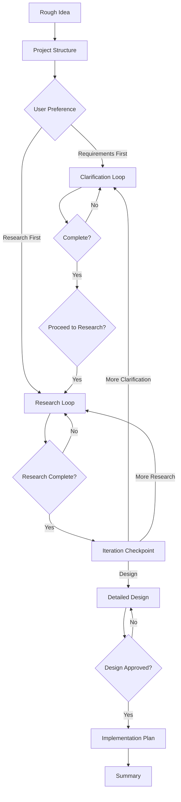

# SOP Planning - Prompt-Driven Development

## Table of Contents

- [Overview](#overview)
- [When to Use](#when-to-use)
- [When NOT to Use](#when-not-to-use)
- [Quick Reference](#quick-reference)
- [Process Overview](#process-overview)
- [Step-by-Step Instructions](#step-by-step-instructions)
- [Common Mistakes](#common-mistakes)
- [Quality Standards](#quality-standards)
- [Example Invocation](#example-invocation)

## Overview

This skill implements PDD (Prompt-Driven Development) methodology, transforming rough ideas into detailed, implementation-ready designs through structured clarification, research, and design phases.

## When to Use

- Starting a new feature with only a rough concept
- Converting discovery.md output into detailed requirements
- Need structured approach to move from idea to implementation
- Want to ensure thorough requirements and research before coding

## When NOT to Use

| Situation | Why Not | Use Instead |
|-----------|---------|-------------|
| Already have detailed design | Planning already done | `sop-task-generator` |
| Simple feature (<5 requirements) | Overhead exceeds benefit | Direct implementation |
| Exploring existing code | Not for analysis | `sop-reverse` |
| Need constraints/risks first | Discovery comes first | `sop-discovery` |

## Quick Reference

| Parameter | Required | Description |
|-----------|----------|-------------|
| `rough_idea` | Yes | Text, file path, or URL |
| `project_dir` | No | Artifacts directory (default: specs/{name}) |
| `discovery_path` | No | Existing discovery.md to continue from |

**Output Structure**:
```
{project_dir}/
├── rough-idea.md
├── idea-honing.md
├── research/
├── design/
│   └── detailed-design.md
└── implementation/
    └── plan.md
```

## Process Overview



## Step-by-Step Instructions

### Step 1: Create Project Structure

Create directory structure and populate initial artifacts:

```
{project_dir}/
├── rough-idea.md      # From rough_idea parameter
├── idea-honing.md     # Use templates/idea-honing.md.template
├── research/
├── design/
└── implementation/
```

**Verification**: All directories exist and rough-idea.md is populated.

---

### Step 2: Initial Process Planning

Present options to user:
- **Option A**: Start with requirements clarification (unclear requirements)
- **Option B**: Start with preliminary research (domain knowledge needed)

**Verification**: User has explicitly chosen Option A or B.

---

### Step 3: Requirements Clarification

**Critical Constraints**:
- Ask ONLY ONE question at a time
- Do NOT pre-populate answers or assume user intent
- Append each Q&A pair to `idea-honing.md` immediately

**Question Categories**:
1. **Core Functionality**: What should it do? Primary use cases? Out of scope?
2. **Edge Cases & Constraints**: Performance? Security? Failure modes?
3. **User Experience**: Who uses it? Error communication? Expected workflow?
4. **Technical Context**: Integration points? Technology constraints? Deployment?
5. **Success Criteria**: How do we know it works? What metrics? MVP scope?

**Process**:
1. Start with fundamental core functionality question
2. After each answer, append to `idea-honing.md`:
   ```markdown
   **Q: [Your question]**
   A: [User's answer]
   ---
   ```
3. Aim for 5-15 questions (fewer for simple, more for complex)
4. Every 3-5 questions: "Continue clarification or move to [research/design]?"
5. Before proceeding: "Are requirements sufficiently detailed?"

**Verification**: User has explicitly confirmed requirements are complete.

---

### Step 4: Research Relevant Information

1. Propose research plan (3-5 topics) based on requirements
2. Ask: "Are there additional topics I should research?"
3. For each topic, create `{project_dir}/research/{topic-name}.md` using `templates/research-template.md`
4. After 2-3 research files: "Continue remaining topics or adjust focus?"
5. Before proceeding: "Is research sufficient for design?"

**Research Quality**:
- Each file MUST be standalone
- Include specific examples, not generic descriptions
- Compare 2-3 options when multiple approaches exist
- Make recommendation with justification

**Verification**: User has explicitly confirmed research is sufficient.

---

### Step 5: Iteration Checkpoint

Create summary of current state:
```markdown
## Current State
**Requirements Captured**: [Count] questions answered
**Research Completed**: [Count] research documents
**Key Decisions Made**: [List 3-5 major decisions]
**Open Questions**: [List remaining uncertainties]
```

Present options:
- **Option A**: Proceed to detailed design
- **Option B**: Return to requirements clarification
- **Option C**: Conduct additional research

**Verification**: User has explicitly chosen Option A.

---

### Step 6: Create Detailed Design

Create `{project_dir}/design/detailed-design.md` using `templates/detailed-design.md.template`.

**Required Sections**:
- Overview (problem, solution, goals, non-goals)
- Requirements (functional, non-functional)
- Architecture (system context, components, data flow)
- Components (detailed specifications)
- Data Models (schemas, relationships)
- Error Handling (failure modes, recovery)
- Testing Strategy (unit, integration, E2E)
- Appendices (alternatives considered, future work)

**Required Diagrams** (mermaid):
- System architecture (C4 context or component)
- Data flow (sequence or flow)
- State transitions (if applicable)

**Process**:
1. Reference research files: "Based on `research/X.md`, we choose Y because Z"
2. Ask: "Please review. Any sections needing clarification or revision?"
3. Iterate based on feedback
4. Before proceeding: "Is design ready for implementation planning?"

**Verification**: User has explicitly approved the design.

---

### Step 7: Develop Implementation Plan

Create `{project_dir}/implementation/plan.md`:

```markdown
## Implementation Checklist
- [ ] Step 1: [Description]
- [ ] Step 2: [Description]
...

## Prerequisites
- Dependencies to install
- Environment setup
- Access requirements

## Implementation Steps
[Numbered steps with sub-tasks]

## Testing Strategy
- Unit test approach
- Integration test plan
- Manual verification steps

## Rollout Plan
- Deployment steps
- Monitoring plan
- Rollback procedure
```

**Step Requirements**:
- Independently testable
- Results in demoable increment
- Builds on previous steps only
- Includes acceptance criteria
- Complexity estimate (S/M/L/XL)
- TDD approach: Write test -> See fail -> Implement -> Refactor

**Phases**:
1. Foundation (data models, core abstractions)
2. Core Functionality (main features)
3. Integration (connect components)
4. Polish (error handling, edge cases, UX)

**Quality**: Each step <= M complexity, completable in <= 2 hours, 5-15 steps total

**Verification**: User has reviewed and approved implementation plan.

---

### Step 8: Summarize Results

Create `{project_dir}/summary.md`:

```markdown
# Planning Summary: [Project Name]

**Date**: [Current date]
**Goal**: [One-sentence description]

## Artifacts Created
- `rough-idea.md` - Initial concept
- `idea-honing.md` - [N] Q&A pairs
- `research/*.md` - Research documents
- `design/detailed-design.md` - Technical design
- `implementation/plan.md` - [N]-step plan

## Key Decisions
1. [Decision and rationale]
2. [Decision and rationale]
3. [Decision and rationale]

## Complexity Estimate
- **Overall**: [S/M/L/XL]
- **Duration**: [Time estimate]
- **Risk Level**: [Low/Medium/High]

## Recommended Next Steps
1. Review artifacts with stakeholders
2. Begin implementation with Step 1
3. Set up monitoring/logging (if needed)
4. Schedule design review after Phase 1

## Open Questions
[Remaining uncertainties or deferred decisions]
```

**Suggest next skills**:
- Ready to implement: `/speckit.implement` or `/executing-plans`
- Needs review: `/requesting-code-review`
- Prototype needed: `/brainstorming`

**Verification**: Summary created with all artifacts documented.

---

## Common Mistakes

| Mistake | Impact | Fix |
|---------|--------|-----|
| Skipping discovery phase | Missing constraints surface late | Start with `sop-discovery` |
| Asking multiple questions | Shallow clarification | ONE question at a time |
| Generating code in design | Premature implementation | Design is architecture, not code |
| Skipping research phase | Uninformed design decisions | Complete research before design |
| No iteration checkpoint | Design without alignment | Always checkpoint before design |

## Quality Standards

### Documentation Requirements

All artifacts MUST be:
- **Standalone**: Readable without referencing other documents
- **Specific**: Concrete examples, not generic descriptions
- **Actionable**: Clear next steps and decisions
- **Versioned**: Include creation date and last updated timestamp

### User Interaction Requirements

**MUST**:
- Ask ONE question at a time during clarification
- Wait for explicit user confirmation before phase transitions
- Present options (not assumptions) when multiple paths exist
- Periodically check: "Should I continue or adjust direction?"

**MUST NOT**:
- Proceed to next phase without explicit user approval
- Pre-populate answers or assume user intent
- Create implementation plan before design is approved
- Skip any of the 8 steps (unless user explicitly requests)

## Example Invocation

```
User: I want to build a caching layer for our API to reduce database load

Claude: [Creates project structure in specs/api-caching-layer/]
        [Asks: "Would you prefer to start with requirements clarification or research?"]

User: Requirements first

Claude: [Q1] "What types of API responses should be cached - all endpoints or specific ones?"

User: Only GET requests for user profiles and product listings

Claude: [Appends to idea-honing.md]
        [Q2] "What cache invalidation strategy do you envision - time-based, event-based, or manual?"
...continues through all 8 steps...
```