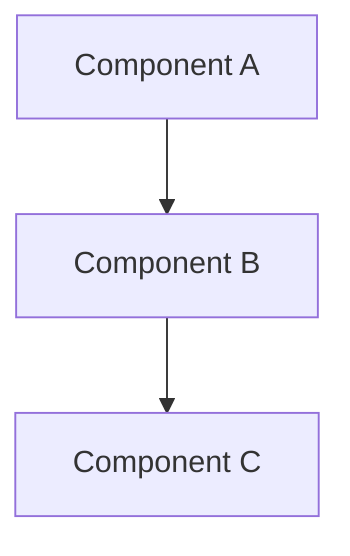

# Research: [Topic Name]

**Created**: [Date]
**Last Updated**: [Date]
**Research Question**: [What are we trying to learn?]

---

## Executive Summary

[2-3 sentence summary of findings and recommendation]

**Recommendation**: [Clear statement of recommended approach]

---

## Background

**Why This Research Matters**: [Explain relevance to the project]

**Scope**: [What is covered and what is out of scope]

---

## Findings

### Option 1: [Name]

**Description**: [What is this approach/technology/solution?]

**Pros**:
- [Advantage 1]
- [Advantage 2]
- [Advantage 3]

**Cons**:
- [Disadvantage 1]
- [Disadvantage 2]
- [Disadvantage 3]

**Use Cases**: [When is this the best choice?]

**Example**:
```
[Code snippet, configuration, or concrete example]
```

**References**:
- [Link to documentation]
- [Link to example implementation]

---

### Option 2: [Name]

**Description**: [What is this approach/technology/solution?]

**Pros**:
- [Advantage 1]
- [Advantage 2]
- [Advantage 3]

**Cons**:
- [Disadvantage 1]
- [Disadvantage 2]
- [Disadvantage 3]

**Use Cases**: [When is this the best choice?]

**Example**:
```
[Code snippet, configuration, or concrete example]
```

**References**:
- [Link to documentation]
- [Link to example implementation]

---

### Option 3: [Name]

[Repeat structure from Option 1/2]

---

## Comparison

| Criterion | Option 1 | Option 2 | Option 3 |
|-----------|----------|----------|----------|
| Complexity | [S/M/L/XL] | [S/M/L/XL] | [S/M/L/XL] |
| Performance | [Assessment] | [Assessment] | [Assessment] |
| Maintainability | [Assessment] | [Assessment] | [Assessment] |
| Learning Curve | [Assessment] | [Assessment] | [Assessment] |
| Community Support | [Assessment] | [Assessment] | [Assessment] |
| Cost | [Assessment] | [Assessment] | [Assessment] |

**Legend**: S=Simple, M=Medium, L=Large, XL=Very Large

---

## Architecture Implications

[If applicable, include mermaid diagram showing how this fits into the system]



**Integration Points**: [What needs to connect to this?]

**Dependencies**: [What does this require?]

**Impact on Existing System**: [What changes are needed?]

---

## Recommendation

**Chosen Option**: [Option Name]

**Rationale**:
1. [Primary reason aligned with project requirements]
2. [Secondary reason - performance, maintainability, etc.]
3. [Additional justification]

**Trade-offs Accepted**:
- [What we're giving up by choosing this option]
- [Risks we're accepting]

**Mitigation Strategies**:
- [How to address the main cons of chosen option]

---

## Implementation Considerations

**Setup Requirements**:
- [Dependencies to install]
- [Configuration needed]
- [Access/permissions required]

**Estimated Complexity**: [S/M/L/XL based on CLAUDE.md budget]

**Estimated Duration**: [Time estimate for implementation]

**Risks**:
- [Risk 1] - **Mitigation**: [How to address]
- [Risk 2] - **Mitigation**: [How to address]

---

## Further Research Needed

[Any questions that remain unanswered]

- [ ] [Open question 1]
- [ ] [Open question 2]

---

## References

1. [Title] - [URL]
2. [Title] - [URL]
3. [Title] - [URL]

---

*This research document supports the PDD (Prompt-Driven Development) planning process.*
