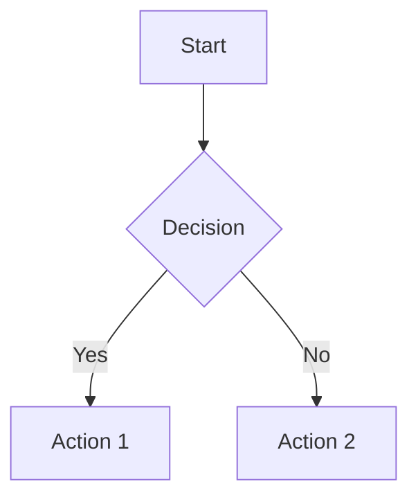
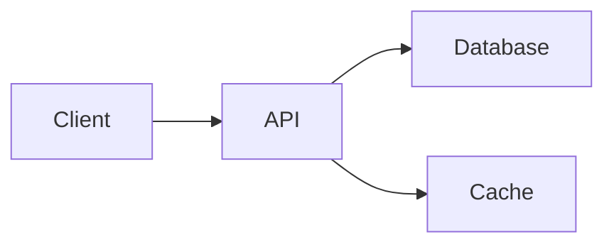
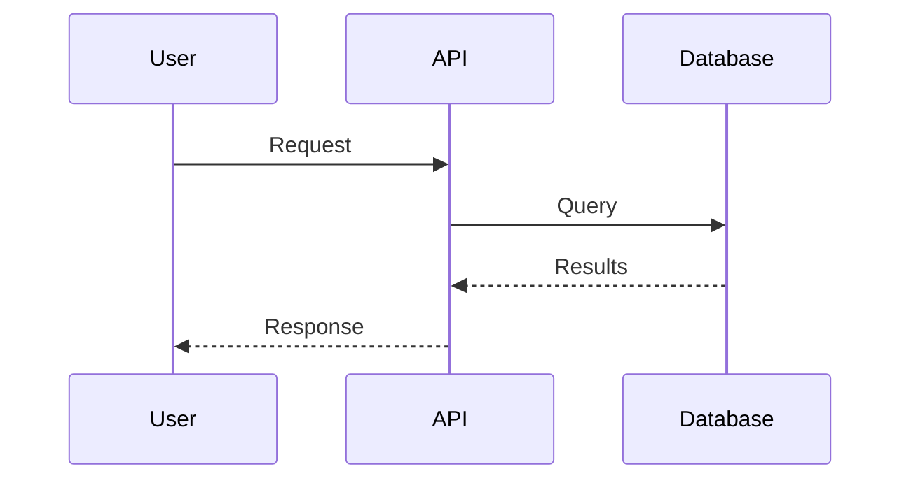
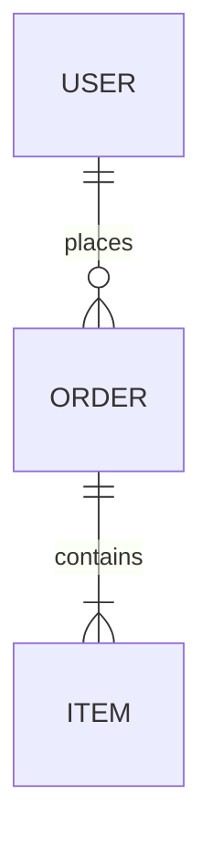

# SOP Reverse Engineering

## Overview

Systematically investigate existing artifacts and generate structured specifications from them. This is the "reverse" flow: understanding what exists and documenting it for future development.

**Critical**: This is NOT just for code. It works with ANY artifact: codebases, APIs, documentation, processes, or abstract concepts.

## When to Use

- Inheriting a codebase without documentation
- Integrating with third-party APIs
- Understanding existing processes before improving them
- Documenting legacy systems
- Creating specs from existing implementations
- Preparing for migration or modernization
- Understanding abstract concepts before building

**Keywords for Claude Search Optimization (CSO)**:
- Error messages/symptoms: "legacy code", "undocumented codebase", "need to understand existing", "no documentation", "inherit project", "what does this API do", "how does this work"
- Synonyms: "reverse engineering", "code investigation", "code analysis", "system analysis", "documentation generation", "API documentation", "process mapping", "code archaeology"
- Use cases: "inherit codebase", "document legacy system", "understand third-party API", "map existing process", "analyze architecture", "generate specs from code"
- Alternative terminology: "code discovery", "system investigation", "artifact analysis", "specification generation", "codebase exploration", "API reverse engineering"

## Parameters

### Required
- `target`: Path, URL, or description of what to investigate
  - Codebase: `/path/to/repo`
  - API: `https://api.example.com/docs`
  - Documentation: `/path/to/docs` or URL
  - Process: Description of the process
  - Concept: Name or description of the concept

### Optional
- `target_type`: `codebase | api | documentation | process | concept`
  - Auto-detected if not provided
  - Specify if auto-detection is ambiguous

- `output_dir`: Where to store investigation output
  - Default: `specs/{investigation-name}-{timestamp}`
  - Creates subdirectory structure automatically

- `focus_areas`: Specific aspects to prioritize
  - Examples: "authentication flow", "data model", "error handling"
  - Helps narrow scope for large artifacts

## The Investigation Process

### Step 1: Identify Target Type

**Goal**: Confirm what type of artifact you're investigating.

**Actions**:
1. If `target_type` not provided, analyze `target` to determine type:
   - Path exists? Check if codebase, docs, or config
   - URL pattern? Check if API docs, wiki, repository
   - Description only? Likely process or concept

2. Present determination to user with evidence:
   ```
   Based on analysis:
   - Target: /path/to/project
   - Detected type: codebase
   - Evidence: Contains package.json, src/, tests/

   Proceed with codebase investigation?
   ```

3. **MUST confirm type with user before proceeding**
   - Ask ONE yes/no question
   - Wait for explicit confirmation
   - If type is wrong, ask user to specify correct type

**Outputs**:
- Confirmed `target_type`
- Created output directory structure

**Key Constraint**: You MUST confirm target type before proceeding. Never assume.

---

### Step 2: Initial Batch Analysis

**Goal**: Perform comprehensive first-pass analysis without user interaction.

**Actions by Type**:

#### Codebase
- Directory structure and file organization
- Entry points and main modules
- Dependencies (package.json, requirements.txt, etc.)
- Architecture patterns (MVC, microservices, etc.)
- Technology stack identification
- Test coverage and quality gates
- Build and deployment processes
- API surface (public interfaces)
- Data flow and state management

#### API
- Authentication mechanisms (OAuth, API keys, JWT)
- Base URL and versioning scheme
- Endpoint inventory (method, path, purpose)
- Request/response schemas
- Rate limiting and quotas
- Error response formats
- Pagination patterns
- Webhook capabilities
- SDK availability

#### Documentation
- Document hierarchy and organization
- Main topics and sections
- Cross-references and dependencies
- Missing or incomplete sections
- Audience and purpose
- Update frequency and recency
- Code examples and tutorials
- API reference completeness

#### Process
- Process steps and sequence
- Actors/roles involved
- Inputs and outputs per step
- Decision points and branches
- Tools and systems used
- Success criteria
- Failure modes and exceptions
- Dependencies on other processes
- Metrics and KPIs

#### Concept
- Core definition and scope
- Key components and relationships
- Common implementations
- Use cases and applications
- Advantages and limitations
- Related concepts and alternatives
- Industry standards and best practices
- Common misconceptions

**Outputs**:
- `{output_dir}/investigation.md` with:
  - Executive summary
  - Detailed findings by category
  - Initial observations
  - Questions for refinement
  - Mermaid diagrams where applicable

**Key Constraint**: Complete this entire analysis BEFORE asking user questions. Be thorough.

---

### Step 3: Interactive Refinement

**Goal**: Clarify ambiguities and focus investigation based on user needs.

**Process**:
1. Present findings summary to user:
   ```
   Initial analysis complete. Found:
   - [Key finding 1]
   - [Key finding 2]
   - [Key finding 3]

   I have questions to refine this investigation.
   ```

2. Ask ONE clarifying question at a time:
   - What aspect is most important?
   - Should I dig deeper into X or Y?
   - Is this pattern intentional or legacy?
   - Are there specific flows to document?

3. Wait for user response

4. Incorporate response into investigation.md

5. Repeat until user is satisfied (ask: "Ready to generate specs?")

**Question Guidelines**:
- **ONE question per message** - never ask multiple
- Prefer multiple choice when possible
- Focus on priorities and scope
- Ask about ambiguities in findings
- Clarify what's important vs. noise

**Outputs**:
- Updated `investigation.md` with refined findings
- Clear understanding of what to include in specs

**Key Constraint**: You MUST ask questions ONE at a time. Never batch questions. Must get explicit "ready" confirmation before proceeding.

---

### Step 4: Generate Specs

**Goal**: Create structured specifications compatible with sop-planning for forward flow.

**Actions by Type**:

#### Codebase → Technical Specs
```
specs-generated/
├── architecture.md          # System design, layers, boundaries
├── components.md            # Major components, responsibilities
├── data-model.md            # Entities, relationships, schemas
├── api-surface.md           # Public interfaces, contracts
├── patterns.md              # Design patterns, conventions
├── dependencies.md          # External libs, services
├── build-deployment.md      # Build process, deployment
└── testing-strategy.md      # Test approach, coverage
```

#### API → API Specs
```
specs-generated/
├── overview.md              # Purpose, versioning, base URL
├── authentication.md        # Auth methods, token management
├── endpoints.md             # Complete endpoint catalog
├── schemas.md               # Request/response models
├── error-handling.md        # Error codes, formats
├── rate-limits.md           # Quotas, throttling
├── webhooks.md              # Webhook events, payloads
└── sdk-integration.md       # Client libraries, examples
```

#### Documentation → Documentation Map
```
specs-generated/
├── summary.md               # Overview, purpose, audience
├── structure.md             # Hierarchy, organization
├── key-concepts.md          # Main topics, definitions
├── coverage-gaps.md         # Missing or incomplete areas
├── cross-references.md      # Dependencies, links
└── examples-inventory.md    # Code samples, tutorials
```

#### Process → Process Specs
```
specs-generated/
├── workflow.md              # Steps, sequence, branches
├── actors.md                # Roles, responsibilities
├── artifacts.md             # Inputs, outputs, formats
├── decision-points.md       # Criteria, alternatives
├── tools-systems.md         # Technology, integrations
├── metrics.md               # KPIs, success criteria
└── exceptions.md            # Error handling, edge cases
```

#### Concept → Concept Specs
```
specs-generated/
├── definition.md            # Core meaning, scope
├── components.md            # Key parts, structure
├── relationships.md         # How parts connect
├── implementations.md       # Common realizations
├── use-cases.md             # Applications, examples
├── trade-offs.md            # Pros, cons, limitations
└── alternatives.md          # Related concepts, comparisons
```

**Spec Format Requirements**:
- Clear, structured markdown
- Mermaid diagrams for flows, architectures, relationships
- Code examples where applicable
- Cross-references between specs
- Versioning information if applicable
- Date generated and source artifact

**Key Constraint**: Generated specs MUST be compatible with sop-planning. Use structured format, clear sections, actionable detail.

---

### Step 5: Recommendations

**Goal**: Provide actionable suggestions for improvement or next steps.

**Generate `recommendations.md`**:

```markdown
# Recommendations for [Artifact Name]

## Executive Summary
[High-level assessment and top 3 recommendations]

## Improvements
[Specific suggestions for enhancement]
- Modernization opportunities
- Technical debt to address
- Missing capabilities
- Performance optimizations

## Risks & Technical Debt
[Issues that should be addressed]
- Security vulnerabilities
- Deprecated dependencies
- Scalability concerns
- Maintainability issues

## Migration Paths
[If applicable]
- Upgrade strategies
- Refactoring approaches
- Migration to new stack
- Deprecation plans

## Next Steps
[Immediate actions]
1. Priority 1: [Action with rationale]
2. Priority 2: [Action with rationale]
3. Priority 3: [Action with rationale]

## Forward Flow Option
[Link to sop-planning]
Ready to plan improvements? Use sop-planning with these specs as input.
```

**Final Interaction**:
```
Investigation complete!

Generated specs:
- [List spec files created]

Key recommendations:
- [Top 3 recommendations]

Would you like to:
1. Continue to sop-planning (forward flow)?
2. Deep dive into specific area?
3. Export for external use?
```

**Outputs**:
- `recommendations.md` with actionable suggestions
- `summary.md` with overview and next steps
- All generated specs in `specs-generated/`

**Key Constraint**: Must ask user if they want to continue to forward flow. Never auto-invoke sop-planning.

---

## Output Directory Structure

Complete output structure:

```
{output_dir}/
├── investigation.md           # Raw findings and analysis
├── specs-generated/          # Structured specs by category
│   ├── [type-specific specs as detailed above]
│   └── ...
├── recommendations.md        # Improvement suggestions
├── summary.md                # Overview and next steps
└── artifacts/                # Supporting materials
    ├── diagrams/             # Generated mermaid diagrams
    ├── examples/             # Code samples, configs
    └── references/           # External docs, links
```

## Mermaid Diagram Guidelines

Use mermaid for visual documentation:

**Flowcharts**: Process flows, decision trees


**Architecture**: System components, layers


**Sequence**: API interactions, process steps


**Relationships**: Concepts, data models


## Key Principles

### Universal Support
- **You MUST support ALL artifact types**: codebase, API, documentation, process, concept
- Never assume only code - ask if unclear
- Adapt analysis depth to artifact complexity

### Batch Then Refine
- **You MUST perform complete batch analysis BEFORE asking questions**
- Users prefer seeing findings first, then refining
- Questions come from gaps in understanding, not laziness

### One Question at a Time
- **You MUST present findings and ask ONE question at a time**
- Never overwhelm with multiple questions
- Wait for response before next question
- Use multiple choice when possible

### Spec Compatibility
- **You MUST generate specs compatible with sop-planning**
- Use structured markdown format
- Include mermaid diagrams
- Cross-reference between specs
- Actionable detail, not just description

### User Control
- **You MUST confirm type before starting**
- **You MUST ask if refinement is complete before generating specs**
- **You MUST ask if user wants to continue to forward flow**
- Never assume or auto-invoke next steps

### Transparency
- Show evidence for determinations
- List files/endpoints/sections analyzed
- Cite specific examples in findings
- Acknowledge unknowns and limitations

### Incremental Validation
- Present findings before refinement
- Validate understanding before spec generation
- Check if recommendations are helpful
- Offer options for next steps

## Error Handling

### Target Not Found
```
Target not found: {target}

Please verify:
- Path exists and is readable
- URL is accessible
- Description is clear

Would you like to:
1. Specify different target
2. Provide more context
3. Cancel investigation
```

### Ambiguous Type
```
Cannot determine target type from: {target}

Could be:
- [Option 1 with evidence]
- [Option 2 with evidence]

Which type should I investigate?
```

### Insufficient Access
```
Cannot fully analyze target due to:
- [Access issue 1]
- [Access issue 2]

I can proceed with partial analysis of:
- [What's accessible]

Continue with limited analysis? (yes/no)
```

### Large Scope
```
This is a large artifact ({size} files / {endpoints} endpoints).

Recommend focusing on:
- [Priority area 1]
- [Priority area 2]

Or proceed with full analysis? (This may take longer)
```

## Quality Gates

Before completing, verify:
- [ ] Target type confirmed with user
- [ ] Batch analysis completed and documented
- [ ] Questions asked ONE at a time
- [ ] User confirmed refinement complete
- [ ] Specs generated in correct format
- [ ] Mermaid diagrams included where appropriate
- [ ] Recommendations are actionable
- [ ] Summary clearly states next steps
- [ ] All files written to output_dir
- [ ] User asked about forward flow

## Examples

### Example 1: Codebase Investigation
```
User: Investigate /path/to/legacy-api
You: Based on analysis:
     - Target: /path/to/legacy-api
     - Detected type: codebase
     - Evidence: Contains package.json, Express app in src/

     Proceed with codebase investigation?
User: Yes
You: [Performs batch analysis]

     Initial analysis complete. Found:
     - Express.js REST API (v4.x)
     - PostgreSQL database with 15 tables
     - No tests, basic error handling
     - Authentication via JWT

     What aspect is most important for your needs?
     a) API endpoints and data model
     b) Authentication and security
     c) Database schema and migrations
     d) Overall architecture
User: a
You: [Updates investigation.md with focus on API/data]

     Updated analysis focuses on API surface and data model.
     Ready to generate specs?
User: Yes
You: [Generates specs]

     Investigation complete!

     Generated specs:
     - architecture.md (API design, layers)
     - endpoints.md (15 REST endpoints)
     - data-model.md (PostgreSQL schema)
     - authentication.md (JWT implementation)

     Key recommendations:
     - Add input validation (security risk)
     - Implement rate limiting
     - Add automated tests

     Continue to sop-planning? (yes/no)
```

### Example 2: Process Investigation
```
User: Investigate our deployment process
You: Target: "deployment process"
     Detected type: process

     Proceed with process investigation?
User: Yes
You: Please describe the deployment process or point me to documentation.
User: We push to main, CircleCI runs tests, then deploys to AWS
You: [Performs batch analysis based on description and any accessible docs]

     Initial analysis complete. Found:
     - Git-based trigger (push to main)
     - CircleCI pipeline (build, test, deploy)
     - AWS deployment target
     - No staging environment mentioned

     Is there a staging environment in this process?
     a) Yes, forgot to mention
     b) No, we deploy directly to production
User: b
You: [Updates investigation.md]

     Ready to generate specs?
User: Yes
You: [Generates process specs]

     Generated specs:
     - workflow.md (5 steps: push → build → test → deploy)
     - actors.md (Developer, CircleCI, AWS)
     - tools-systems.md (Git, CircleCI, AWS ECS)
     - metrics.md (Deployment frequency, success rate)

     Recommendations:
     - HIGH: Add staging environment (risk: untested production deploys)
     - MED: Implement rollback procedure
     - LOW: Add deployment notifications

     Continue to sop-planning to design improvements? (yes/no)
```

## Integration with Forward Flow

When investigation completes, specs in `specs-generated/` can be used as input to sop-planning:

```bash
# After sop-reverse generates specs
sop-planning --specs-input={output_dir}/specs-generated/ \
             --goal="Modernize based on findings"
```

This creates a complete loop:
1. **sop-reverse**: Understand what exists
2. **sop-planning**: Plan improvements (PDD format)
3. **sop-task-generator**: Generate implementation plan
4. **ralph-loop**: Execute plan

## Anti-Patterns

### ❌ Don't
- Assume artifact type without confirmation
- Ask multiple questions in one message
- Generate specs before user confirms refinement complete
- Auto-invoke sop-planning without asking
- Skip batch analysis to ask questions first
- Limit investigation to just code
- Provide vague recommendations

### ✅ Do
- Confirm target type with evidence
- Ask ONE question at a time
- Complete batch analysis before questions
- Wait for explicit user approval at each gate
- Support ALL artifact types equally
- Generate actionable, specific recommendations
- Use mermaid diagrams to visualize findings

## Success Criteria

A successful investigation produces:
1. Clear, accurate understanding of artifact
2. Structured specs ready for forward flow
3. Actionable recommendations
4. User feels confident in findings
5. Specs are detailed enough to build from
6. Diagrams clarify complex relationships
7. Next steps are obvious

---

*This skill is part of the SOP framework: sop-reverse → sop-planning → sop-task-generator → ralph-loop*
