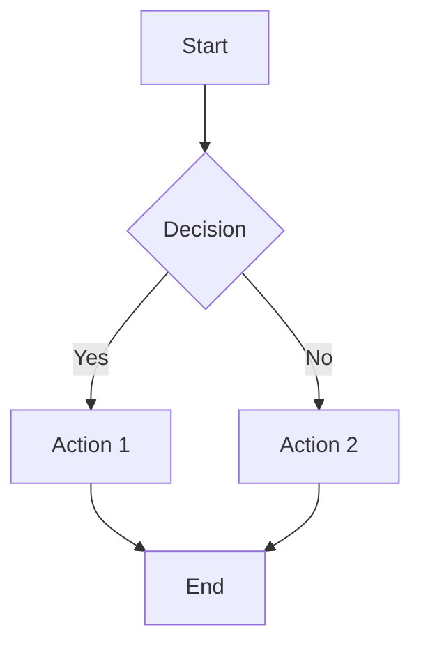
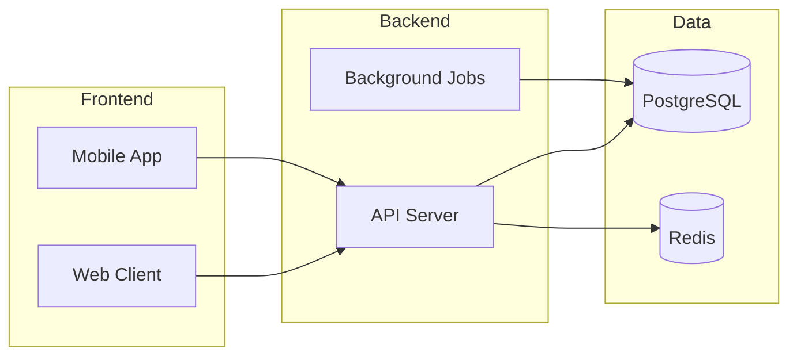
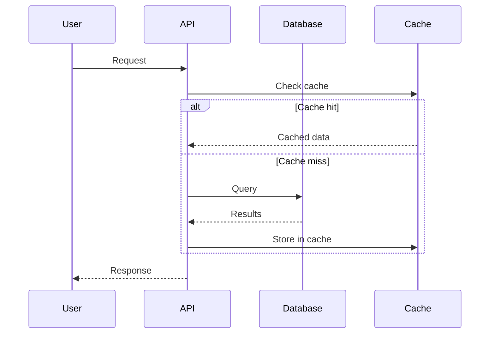
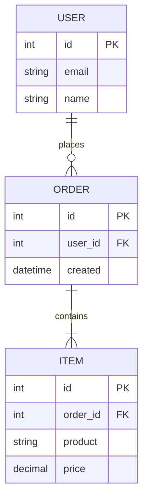
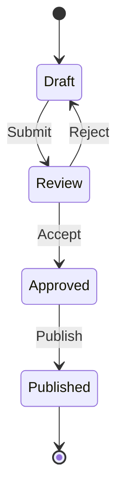
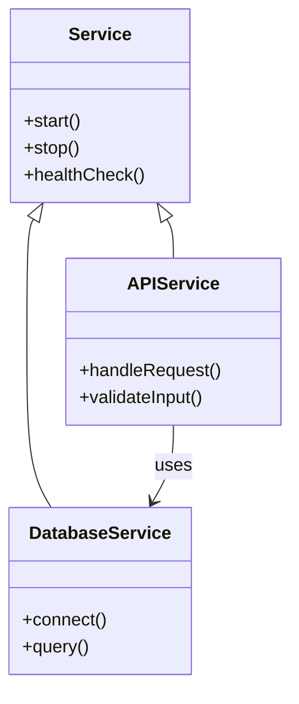

# Mermaid Diagram Examples

Use mermaid for visual documentation throughout the investigation.

## Flowcharts

For process flows and decision trees:

## Architecture Diagrams

For system components and layers:

## Sequence Diagrams

For API interactions and process steps:

## Entity Relationship Diagrams

For data models and relationships:

## State Diagrams

For process states and transitions:

## Class Diagrams

For component relationships:

## When to Use Each Type

| Diagram | Use Case |
|---------|----------|
| Flowchart | Process flows, decision trees, workflows |
| Architecture | System components, service topology, layers |
| Sequence | API calls, interaction flows, step-by-step processes |
| ER | Data models, database schemas, entity relationships |
| State | Lifecycle states, status transitions |
| Class | Component structure, inheritance, dependencies |
