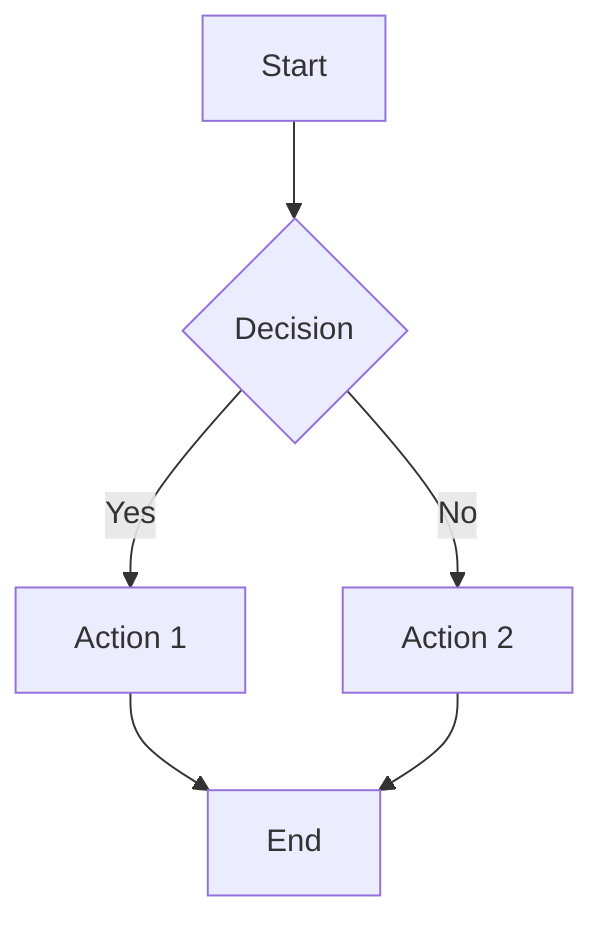
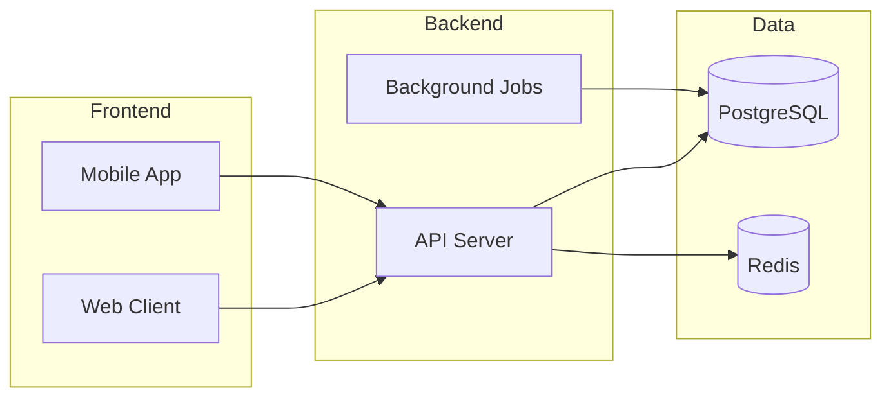
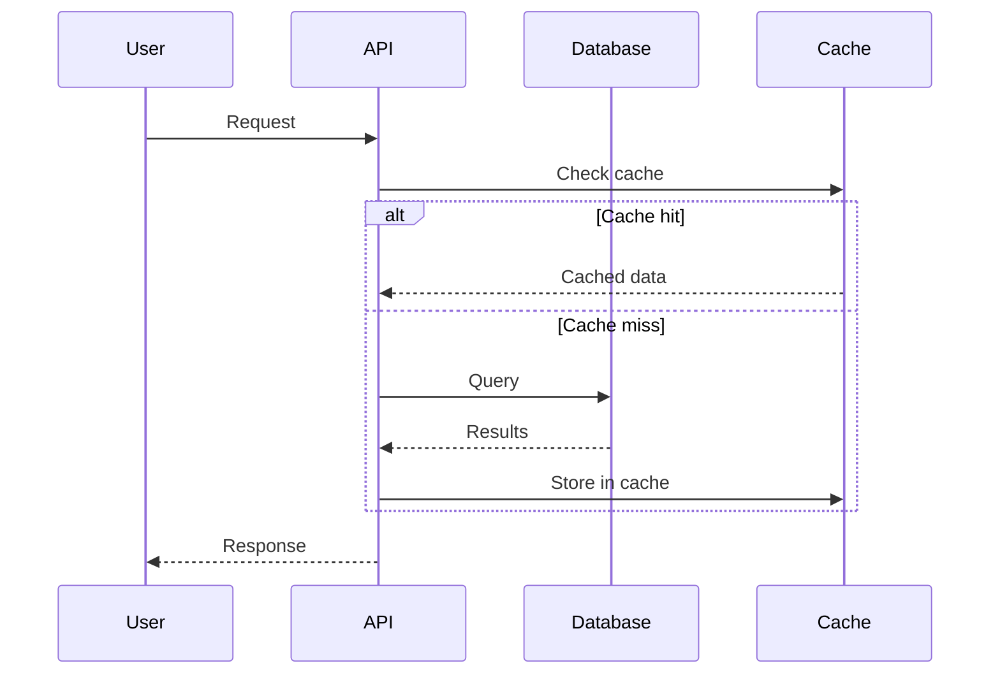
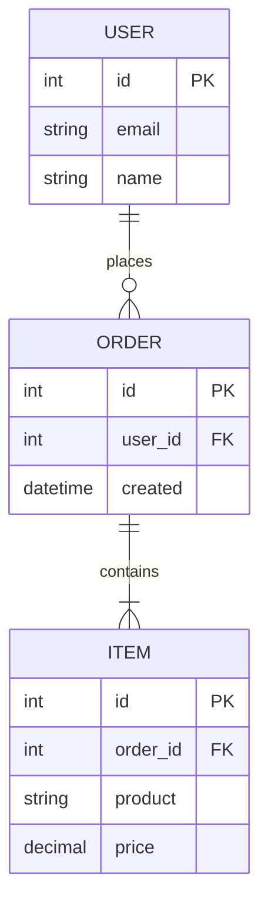
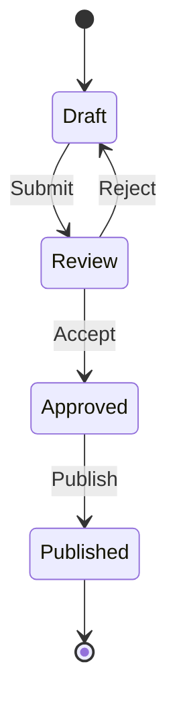
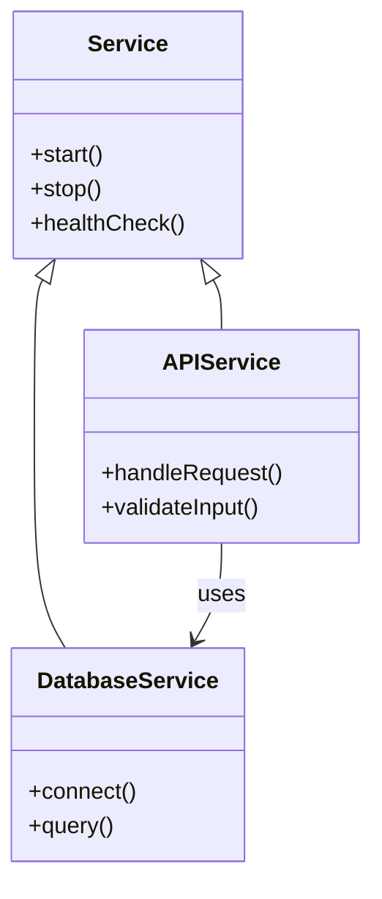

# Mermaid Diagram Examples Reference

## Overview

This reference provides mermaid diagram examples for visual documentation throughout sop-reverse investigations. Understanding diagram types is essential for effective artifact documentation.

---

## Diagram Type Selection

**Constraints:**
- You MUST choose appropriate diagram type because wrong type obscures rather than clarifies
- You MUST use consistent styling within investigation because inconsistency confuses readers
- You SHOULD include diagrams for complex relationships because visual representation aids comprehension

---

## Flowcharts

**Constraints:**
- You MUST use flowcharts for process flows because they show sequence clearly
- You SHOULD use decision diamonds for branch points because this is standard notation
- You MAY use subgraphs for grouping related steps because this adds structure

For process flows and decision trees:

---

## Architecture Diagrams

**Constraints:**
- You MUST use architecture diagrams for system components because they show topology
- You MUST use subgraphs for logical groupings because this shows boundaries
- You SHOULD show data flow directions because this reveals dependencies

For system components and layers:

---

## Sequence Diagrams

**Constraints:**
- You MUST use sequence diagrams for API interactions because they show message flow
- You MUST include all participants because incomplete diagrams mislead
- You SHOULD use alt/opt blocks for conditional flows because this shows branching

For API interactions and process steps:

---

## Entity Relationship Diagrams

**Constraints:**
- You MUST use ER diagrams for data models because they show schema structure
- You MUST show cardinality because this defines relationships
- You SHOULD include key fields because this provides context

For data models and relationships:

---

## State Diagrams

**Constraints:**
- You MUST use state diagrams for lifecycle states because they show transitions
- You MUST include start and end states because boundaries matter
- You SHOULD label transitions with triggers because this shows causes

For process states and transitions:

---

## Class Diagrams

**Constraints:**
- You MUST use class diagrams for component relationships because they show structure
- You MUST show key methods because interface matters
- You SHOULD show inheritance and composition because this reveals design patterns

For component relationships:

---

## When to Use Each Type

**Constraints:**
- You MUST match diagram type to content because mismatched types confuse
- You SHOULD prefer simpler diagrams when possible because clarity trumps complexity
- You MAY combine multiple diagram types because complex systems need multiple views

| Diagram | Use Case |
|---------|----------|
| Flowchart | Process flows, decision trees, workflows |
| Architecture | System components, service topology, layers |
| Sequence | API calls, interaction flows, step-by-step processes |
| ER | Data models, database schemas, entity relationships |
| State | Lifecycle states, status transitions |
| Class | Component structure, inheritance, dependencies |

---

## Troubleshooting

### Diagram Not Rendering

If mermaid diagram fails to render:
- You SHOULD check syntax for typos because small errors break parsing
- You SHOULD verify diagram type is supported because not all types work everywhere
- You MUST escape special characters because unescaped chars cause failures

### Diagram Too Complex

If diagram is hard to read:
- You SHOULD break into multiple diagrams because simpler is clearer
- You SHOULD use subgraphs for grouping because this adds structure
- You MUST prioritize clarity over completeness because unusable diagrams add no value

### Diagram Missing Key Information

If diagram lacks important details:
- You SHOULD add labels to all edges because unlabeled connections are ambiguous
- You SHOULD include participant names because anonymous actors confuse
- You MUST cross-reference with text because diagrams complement, not replace, prose

---

*Version: 1.1.0 | Updated: 2026-01-27*
*Compliant with strands-agents SOP format (RFC 2119)*
