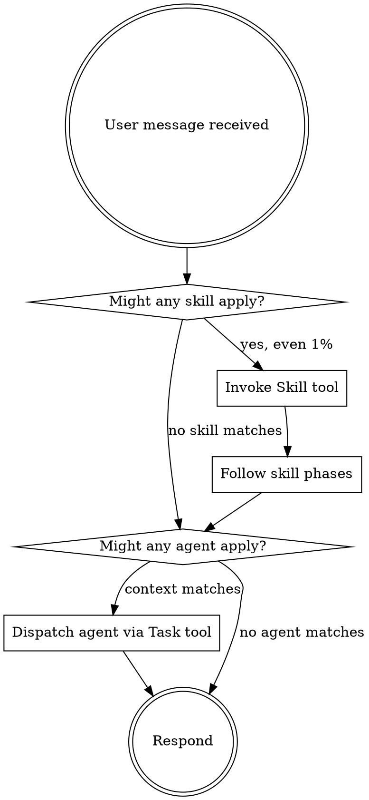

If you think there is even a 1% chance a skill or agent applies, you ABSOLUTELY MUST invoke it.

IF A SKILL OR AGENT APPLIES TO YOUR TASK, YOU DO NOT HAVE A CHOICE. YOU MUST USE IT.

This is not negotiable. This is not optional. You cannot rationalize your way out of this.

## The Rule

Invoke relevant skills and agents BEFORE any response or action — including clarifying questions. Even a 1% chance means invoke. If an invoked skill turns out wrong for the situation, you don't need to follow it.

- **Skills**: Use the `Skill` tool. Content loads on invocation — follow it directly.
- **Agents**: Dispatch via `Task` tool with matching `subagent_type` when context matches.

## Red Flags

These thoughts mean STOP — you're rationalizing:

| Thought | Reality |
|---------|---------|
| "This is just a simple question" | Questions are tasks. Check for skills. |
| "I need more context first" | Skill check comes BEFORE exploration. |
| "Let me explore the codebase first" | Skills tell you HOW to explore. Check first. |
| "I can handle this with my training" | Pre-training is stale. Skills have current methodology. |
| "Let me gather information first" | Skills tell you HOW to gather information. |
| "This doesn't need a formal skill" | If a skill exists for this context, use it. |
| "I remember what this skill does" | Skills evolve. Load the current version. |
| "The skill is overkill for this" | Simple things become complex. Use it. |
| "I'll just do this one thing first" | Check BEFORE doing anything. |
| "I already know how to do this" | Knowing the concept ≠ using the skill. Invoke it. |
| "This feels productive without a skill" | Undisciplined action wastes time. Skills prevent this. |
| "The user just wants a quick answer" | User instructions say WHAT, not HOW. Skills define HOW. |

## Priority

When multiple skills could apply:

1. **Process skills first** (brainstorming, debugging, discovery) — determine HOW to approach
2. **Implementation skills second** (scenario-driven-development, frontend-design) — guide execution

"Build X" → brainstorming first, then implementation skills.
"Fix this bug" → systematic-debugging first, then domain-specific skills.

## Agents

Auto-delegated reasoning modules — dispatch via Task tool when context matches:

- code-reviewer: after implementation step → SDD compliance + reward hacking detection
- code-simplifier: after code written → reduce complexity preserving function
- edge-case-detector: after implementation → boundary violations, concurrency, resource leaks
- security-reviewer: branch changes for review → exploitable vulnerabilities in diff
- systematic-debugger: bug or unexpected behavior → 4-phase root cause before any fix
- performance-engineer: bottleneck or scalability → profiling, optimization
